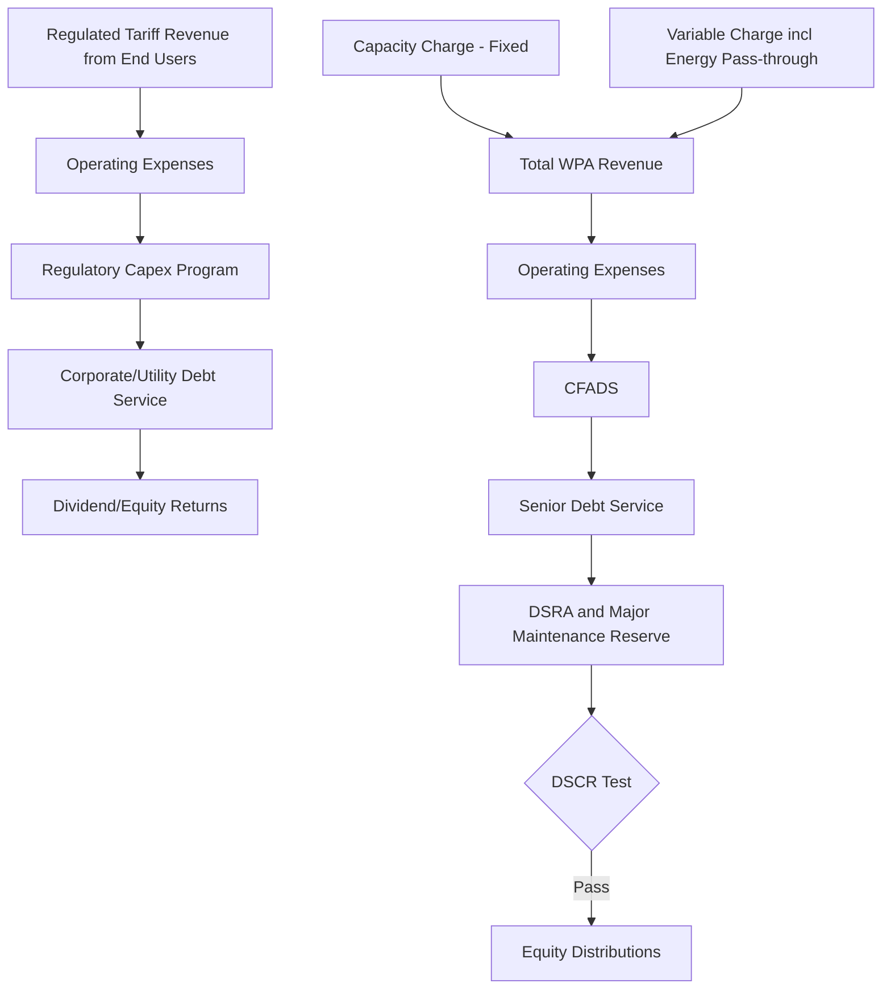

## Water and Wastewater Project Finance

### Overview

Water and wastewater project finance covers a distinct segment of infrastructure finance encompassing potable water treatment and distribution, wastewater collection and treatment, desalination, and water reuse/recycling facilities. Unlike most other infrastructure asset classes, water is a regulated essential service with near-universal, highly inelastic demand and (in most mature markets) a long history of either full public utility ownership or tightly regulated private concession, making the sector's financing structures deeply shaped by tariff-setting regulation and public health/environmental compliance obligations. The sector spans a wide structural range: fully regulated private water utilities (rate-of-return or price-cap regulated), concession-based Build-Operate-Transfer (BOT) treatment plants, and availability-payment PPPs for specific facilities within a broader publicly-owned network.

**Key Points**

- Water demand is generally the most inelastic and stable of all infrastructure demand categories, but tariff-setting is frequently the most politically sensitive constraint on revenue
- Desalination and large treatment plants are commonly financed as standalone BOT/BOOT concessions with take-or-pay offtake agreements to the public water authority, resembling power project finance more than a demand-risk toll concession
- Regulatory frameworks (rate-of-return vs. price-cap/RPI-X regulation) for fully regulated private water utilities materially shape achievable returns and capital structure
- Environmental compliance (discharge standards, water quality regulation) is a first-order, continuously evolving risk category distinct from most other infrastructure sectors

### Sector Structure and Ownership Models

| Model | Description | Typical Context |
| --- | --- | --- |
| Fully Regulated Private Utility | Private company owns and operates the entire water/wastewater network under economic regulation (rate-of-return or price-cap) | England & Wales (fully privatized model), some US investor-owned utilities |
| Public Utility with Private O&M Contract | Public ownership retained; private operator manages day-to-day operations under a fee-based management contract, no financing/demand risk transferred | Common globally where full privatization is not pursued |
| BOT/BOOT Concession (Treatment Plant) | Private consortium designs, builds, (sometimes owns), operates, and transfers a specific treatment facility (desalination, wastewater treatment) under a long-term concession with take-or-pay offtake from the public water authority | Desalination plants (Middle East, Australia, California), large wastewater treatment plants globally |
| Availability Payment PPP | Private party designs, builds, finances, and maintains a specific facility, paid via availability payment from the public water authority, similar in structure to social infrastructure PPPs | Increasingly used for treatment plant upgrades and specific network components in various markets |

### Fully Regulated Private Water Utilities

**Regulatory Frameworks**

- **Rate-of-Return (Cost-of-Service) Regulation**: The regulator sets tariffs to allow the utility to recover prudently incurred operating costs plus a specified rate of return on its regulatory asset base (RAB) — common in much of the US
- **Price-Cap (RPI-X / CPI-X) Regulation**: The regulator sets a maximum allowable tariff or tariff path (typically over a 5-year regulatory period), with the utility retaining the benefit (or bearing the cost) of outperforming or underperforming the assumed cost/efficiency trajectory — the model used in England & Wales
- **Regulatory Asset Base (RAB) Mechanism**: The core financing concept underlying both models — the value of the utility's regulated asset base grows with new capital investment and depreciates over time, with allowed revenue calculated to provide a return on and of this asset base

$$AllowedRevenue_{t} = (RAB_{t} \times WACC_{regulatory}) + Depreciation_{t} + OperatingCosts_{t}$$

Where $RAB_t$ is the regulatory asset base value in period $t$ and $WACC_{regulatory}$ is the regulator-determined weighted average cost of capital used to set allowed returns.

**Financeability Implications**

- **Regulatory reset risk**: Tariffs/allowed returns are reset periodically (e.g., every 5 years); the outcome of each reset (particularly the allowed WACC and efficiency/cost assumptions) is a material source of medium-term revenue uncertainty even though the underlying regulatory framework is stable
- **Totex/Capex incentive mechanisms**: Modern regulatory frameworks increasingly use "totex" (total expenditure) incentive mechanisms encouraging efficient capex/opex trade-offs, rather than the historical bias toward capex-heavy solutions under pure rate-of-return regulation (the so-called "Averch-Johnson effect")
- **Typical capital structure**: Regulated water utilities often operate with substantial leverage (60-70%+ gearing against RAB) supported by highly stable, regulator-underpinned cash flows, financed extensively through investment-grade corporate/utility bonds rather than classic project finance structures at the parent entity level

### BOT/BOOT Desalination and Treatment Plant Concessions

**Structure**

Large-scale desalination and treatment plants are frequently financed as standalone project-financed concessions, structurally closer to power generation project finance than to a demand-risk water utility model, because the offtaker (typically a national or municipal water authority) enters into a long-term take-or-pay purchase agreement analogous to a power purchase agreement.

**Water Purchase Agreement (WPA) / Bulk Supply Agreement**

- Analogous in structure to a PPA: the water authority commits to purchase a specified minimum volume of treated/desalinated water (take-or-pay) at a contracted tariff over a long-term period (typically 20-25 years), largely insulating the project company from demand risk
- Tariff structure often includes a **capacity charge** (fixed payment covering debt service and fixed costs, paid regardless of offtake volume) and a **variable/output charge** (covering variable costs such as energy and chemicals, tied to actual water produced) — mirroring the capacity/energy payment structure common in power purchase agreements

$$Revenue_{t} = CapacityCharge_{t} + (VariableCharge_{t} \times Volume_{produced,t})$$

**Energy Intensity as a Central Risk Factor (Desalination)**

Desalination, particularly reverse osmosis (the dominant modern technology) and older thermal (multi-stage flash/multi-effect distillation) processes, is highly energy-intensive, making energy price risk a first-order consideration distinct from most other water infrastructure.

- **Energy cost pass-through**: Well-structured WPAs typically include an energy cost pass-through or indexation mechanism in the variable charge, insulating the project company from energy price volatility (mirroring fuel cost pass-through in thermal power PPAs)
- **Energy price risk allocation**: Where pass-through is incomplete or capped, the project company (and its lenders) must underwrite energy price exposure directly, a material risk given the technology's energy intensity

**Example**

A 500,000 m³/day seawater reverse osmosis desalination plant is financed on a BOOT (Build-Own-Operate-Transfer) basis with a 25-year Water Purchase Agreement with the national water authority, structured with a capacity charge covering ~70% of expected revenue (sized to cover debt service and fixed O&M regardless of actual offtake) and a variable charge with full energy cost pass-through, closely mirroring the capacity/energy payment and fuel pass-through structure common in independent power producer (IPP) financing.

### Wastewater Treatment Project Finance

**Structural Similarities to Desalination BOTs**

Standalone wastewater treatment plant concessions (as opposed to full network ownership) typically follow a similar BOT/BOOT structure with a take-or-pay or availability-based offtake arrangement with the municipal/public wastewater authority, given the plant's role as a discrete piece of infrastructure serving a broader public network it does not itself own.

**Environmental Compliance as a Distinctive Risk Category**

- **Discharge/effluent standards**: Treatment plants must meet regulator-specified discharge quality standards (biochemical oxygen demand, suspended solids, nutrient levels, etc.), with non-compliance carrying regulatory penalties, reputational risk, and potential concession default triggers
- **Evolving regulatory standards**: Environmental discharge standards frequently tighten over the life of a long-term concession (25-30+ years), requiring the financial model to anticipate potential future capex for compliance upgrades, or contractual mechanisms allocating the cost of regulatory-driven capex changes between the concessionaire and the public authority
- **Sludge/biosolids management**: An often-underappreciated cost and revenue consideration — sludge disposal costs, or in some structures, biosolids revenue (e.g., from anaerobic digestion/biogas generation), affecting the overall project economics

### Capital Structure Comparison

| Metric | Fully Regulated Utility | BOT/BOOT Desalination/Treatment Concession |
| --- | --- | --- |
| Typical gearing | 60-70%+ against RAB, often at the corporate/utility level rather than a discrete SPV | 70-80%, reflecting strong take-or-pay revenue certainty |
| Typical debt tenor | Long-dated corporate/utility bonds, staggered maturities | 15-20 years, often matched to WPA/offtake agreement term |
| Minimum DSCR | Utility-level financial ratios (gearing, interest cover) rather than classic project finance DSCR | 1.20x-1.40x typical for well-structured take-or-pay concessions [Unverified — deal-specific] |
| Primary revenue certainty driver | Regulatory framework stability and RAB mechanism | Take-or-pay Water Purchase Agreement and offtaker creditworthiness |

### Risk Allocation Matrix

| Risk | Regulated Utility Mitigation | BOT/BOOT Concession Mitigation |
| --- | --- | --- |
| Tariff/regulatory reset risk | Regulatory precedent and RAB mechanism providing revenue stability across resets; regulatory relationship management | Not directly applicable — tariff is contractually fixed in the WPA rather than regulator-reset |
| Demand/volume risk | Generally low given inelastic demand, though conservation trends and demographic shifts modeled over long term | Minimal, given take-or-pay capacity charge structure |
| Energy price risk (desalination) | N/A | Energy cost pass-through in variable charge; residual exposure where pass-through incomplete |
| Construction cost overrun/delay | N/A (typically brownfield/ongoing capital program rather than discrete construction financing) | Fixed-price D-B/EPC contract with LDs; contingency; DSU insurance |
| Environmental/discharge compliance | Ongoing regulatory capex programs incorporated into RAB investment plans | Contractual allocation of regulatory-change capex risk; compliance monitoring |
| Water quality/public health risk | Regulatory oversight and utility operational standards | Performance guarantees on treated water quality specifications |
| Offtaker/public authority credit risk | N/A (utility bills end-users directly) | Water authority credit analysis; sovereign/municipal support where applicable |
| Climate/drought risk (source water availability) | Long-term water resource planning incorporated into regulatory investment programs | Relevant primarily for non-desalination source water plants; less relevant for seawater desalination |

### Cash Flow Structures Compared

### Illustrative Water Purchase Agreement Structure (svg_diagram)

<svg xmlns="http://www.w3.org/2000/svg" viewBox="0 0 640 300">
<text x="320" y="26" text-anchor="middle" font-size="16" font-weight="bold" fill="#1a1a1a">Water Purchase Agreement Revenue Structure (svg_diagram)</text>
<rect x="150" y="70" width="200" height="140" fill="#3d6ea5" />
<text x="250" y="130" text-anchor="middle" font-size="13" fill="#ffffff" font-weight="bold">Capacity Charge</text>
<text x="250" y="150" text-anchor="middle" font-size="11" fill="#e0e8f2">Fixed, take-or-pay</text>
<text x="250" y="170" text-anchor="middle" font-size="11" fill="#e0e8f2">Covers debt service</text>
<text x="250" y="190" text-anchor="middle" font-size="11" fill="#e0e8f2">+ fixed costs</text>
<rect x="350" y="150" width="140" height="60" fill="#c9603f" />
<text x="420" y="175" text-anchor="middle" font-size="12" fill="#ffffff" font-weight="bold">Variable Charge</text>
<text x="420" y="195" text-anchor="middle" font-size="10" fill="#fbe4dc">Energy pass-through</text>

<text x="250" y="235" text-anchor="middle" font-size="11" fill="#333">Paid regardless of offtake volume</text>

<text x="420" y="235" text-anchor="middle" font-size="11" fill="#333">Tied to actual production</text>

<text x="320" y="275" text-anchor="middle" font-size="11" fill="#555" font-style="italic">Mirrors capacity/energy payment structure common in power PPAs</text>

</svg>

### Due Diligence Workstreams

- **Regulatory**: Regulatory framework and reset history review (regulated utilities), tariff-setting mechanism and WPA enforceability (BOT/BOOT), environmental discharge standard trajectory review
- **Technical**: Independent Engineer review of treatment technology and process design, energy consumption benchmarking (desalination), water/effluent quality guarantee verification
- **Legal**: WPA/offtake agreement review, concession termination/compensation provisions, water rights and abstraction license review (source water plants)
- **Environmental**: Discharge permit compliance history and trajectory, environmental impact assessment (particularly for desalination brine discharge and marine impact)
- **Model Audit**: Verification of capacity/variable charge revenue split, energy pass-through mechanics, regulatory reset assumptions (regulated utilities), major maintenance reserve sizing

### Sensitivities Typically Stress-Tested

- Regulatory reset outcomes below base-case assumptions (regulated utilities) — allowed WACC, efficiency targets, RAB additions
- Energy price volatility where pass-through mechanisms are incomplete (desalination)
- Environmental compliance capex requirements from tightening discharge standards
- Offtaker/public water authority credit and payment risk (BOT/BOOT concessions)
- Construction cost overrun/delay for treatment plant construction
- Source water availability/drought risk (non-desalination source plants)
- Brine discharge/marine environmental impact mitigation cost (desalination)

**Conclusion**

Water and wastewater project finance bridges two distinct financing traditions: fully regulated private utilities financed against a Regulatory Asset Base under stable but periodically-reset tariff regulation, and standalone BOT/BOOT treatment or desalination concessions financed much like power project finance against take-or-pay Water Purchase Agreements with capacity/variable charge structures. Both models benefit from water's structurally inelastic demand, but each carries distinct risk emphases — regulatory reset risk and RAB mechanics for utilities, energy price and offtaker credit risk for BOT/BOOT concessions — while environmental discharge compliance represents a continuously evolving risk category common to both, given the long concession/asset lives typical of the sector and the trajectory of tightening water quality regulation globally.

**Related Topics**

- Toll Road and Availability-Based Road Financing — comparative availability-payment infrastructure model
- Solar Photovoltaic Project Finance — comparative take-or-pay offtake structure to Water Purchase Agreements
- Social Infrastructure and PPP Structures — comparative availability-payment public asset framework
- Regulatory Asset Base (RAB) Methodologies and Price-Cap vs. Rate-of-Return Regulation
- Desalination Technology Economics: Reverse Osmosis vs. Thermal Processes
- Water Purchase Agreement (WPA) Structuring and Capacity/Variable Charge Mechanics
- Environmental Compliance and Evolving Discharge Standards in Long-Term Concessions
- Independent Power Producer (IPP) Financing — structural parallels in take-or-pay offtake design
- Climate Resilience and Water Resource Planning in Long-Life Infrastructure Assets
- Biosolids and Sludge Management Economics in Wastewater Treatment Concessions