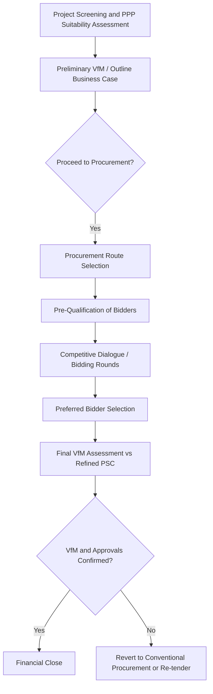

## PPP Procurement, Value for Money, and the Public Sector Comparator

### Overview

Before any Public-Private Partnership project reaches financial close, it must pass through a procurement and appraisal process designed to establish whether private finance delivery is justified relative to conventional public procurement. This process — spanning project screening, business case development, competitive procurement, and formal Value for Money (VfM) assessment against a Public Sector Comparator (PSC) — is the analytical and governance backbone underpinning the entire PPP market. Unlike the asset-specific financing mechanics covered elsewhere in this chapter, this topic addresses the cross-cutting appraisal methodology, procurement process design, and persistent policy debates that apply across toll roads, social infrastructure, water, and every other PPP sector.

**Key Points**

- VfM assessment compares the whole-life, risk-adjusted cost of PPP delivery against a hypothetical conventionally-financed and delivered alternative (the PSC)
- The choice of discount rate and the valuation of transferred risk are the most consequential — and most contested — technical inputs into any VfM analysis
- Competitive procurement processes (typically multi-stage: pre-qualification, competitive dialogue/negotiation, best and final offer) are designed to preserve genuine private-sector competition and price discovery
- VfM methodology has faced sustained academic and policy criticism regarding circularity, optimism bias correction, and the treatment of the cost-of-capital differential between public and private finance

### The PPP Project Lifecycle: Where VfM Fits

| Stage | Activity |
| --- | --- |
| Project Identification/Screening | Public authority identifies infrastructure need; initial screening for PPP suitability (scale, risk transfer potential, revenue/payment mechanism feasibility) |
| Outline/Preliminary Business Case | Initial options appraisal, including a preliminary VfM comparison, to secure approval to proceed to procurement |
| Procurement Process Design | Selection of procurement route (competitive dialogue, restricted procedure, negotiated procedure) and evaluation criteria |
| Competitive Procurement | Multi-stage bidding process among pre-qualified private consortia |
| Full Business Case / Final VfM Assessment | Detailed VfM comparison using the preferred bidder's actual bid pricing against the refined PSC, forming the basis for final government approval |
| Financial Close | Contracts and financing documents executed; the PPP structure(s) covered elsewhere in this chapter take effect |
| Contract Management | Ongoing monitoring of availability/performance deductions, contract variations, and (in mature programs) refinancing gain-share events |

### The Public Sector Comparator (PSC)

**Definition and Purpose**

The PSC is a hypothetical, risk-adjusted financial model estimating what it would cost the public sector to deliver the same project output specification using conventional procurement (traditional public capital budgeting, direct public borrowing, and public-sector operation), used as the quantitative benchmark against which PPP bids are compared.

**PSC Components**

- **Raw PSC**: The base cost of design, construction, and operation under conventional procurement, using public-sector cost data and public borrowing rates
- **Competitive Neutrality Adjustment**: Adjusts for any inherent cost advantages or disadvantages the public sector has that would not apply to a private bidder (e.g., tax treatment differences, access to certain insurance/self-insurance arrangements)
- **Retained Risk**: The value of risks that would remain with the public sector even under conventional procurement (i.e., risks not transferable regardless of delivery model)
- **Transferable Risk**: The value of risks that could be transferred to a private party under a PPP structure but would otherwise sit with the public sector under conventional procurement — this risk valuation is typically the largest and most contested component of the PSC

$$PSC_{adjusted} = RawPSC + CompetitiveNeutralityAdjustment + RetainedRisk + TransferableRisk$$

**Risk Valuation Methodology**

- **Risk identification and allocation matrix**: A structured exercise identifying each material project risk (construction cost overrun, demand shortfall, latent defects, etc.) and determining, for each, whether conventional procurement or PPP delivery better positions the party bearing it to manage/mitigate that risk
- **Monte Carlo / probabilistic modeling**: Many PSC methodologies use probabilistic simulation across identified risk factors (e.g., ranges for construction cost overrun probability and magnitude) to derive an expected-value risk cost, rather than a single deterministic estimate
- **Optimism bias adjustment**: Public sector capital project cost and schedule estimates have a well-documented tendency toward optimism bias (systematic underestimation of costs and overestimation of benefits); many VfM frameworks apply explicit optimism bias uplift percentages to the PSC's raw cost estimate to correct for this pattern, calibrated against historical outturn data from comparable public projects [Unverified — the specific optimism bias adjustment methodology and calibration reference class vary by jurisdiction's VfM guidance]

### Value for Money (VfM) Assessment

**Quantitative VfM Test**

$$VfM = PSC_{adjusted} - PPP_{bid,NPV}$$

The PPP bid's net present cost (typically the NPV of the unitary charge or availability payment stream, plus any residual public-sector risk retained under the PPP structure) is compared against the risk-adjusted PSC; a positive result (PSC cost exceeds PPP cost) is generally interpreted as VfM being achieved, though most frameworks emphasize this quantitative comparison should not be treated as decisive in isolation.

**Discount Rate Selection**

This is one of the single most consequential — and contested — technical choices in VfM methodology:

- **Public sector discount rate (social time preference rate)**: Often used to discount the PSC, reflecting the government's own cost of capital or a standardized social discount rate set by treasury/finance ministry guidance
- **Risk-adjusted discount rate debate**: A long-standing methodological debate concerns whether the PSC's cash flows should be discounted at the (lower) public borrowing rate or at a rate reflecting the actual risk profile of those cash flows — using the public borrowing rate for risk-bearing cash flows has been argued by some economists to systematically understate the PSC's true economic cost, since government's lower cost of capital reflects its risk-pooling and taxation power rather than the actual risk of the specific cash flows being discounted [Unverified — this reflects a genuine and long-running academic/policy debate in public finance economics rather than a settled methodological consensus, addressed differently across VfM guidance in different jurisdictions]
- **Practical convergence**: Many contemporary frameworks now use a single discount rate (often close to the public cost of borrowing) applied consistently to both the PSC and PPP cash flows, with risk explicitly valued and added as a separate PSC line item, partly in response to this debate

**Qualitative VfM Considerations**

Most mature VfM frameworks explicitly caution against relying solely on the quantitative PSC comparison, incorporating qualitative factors such as:

- Innovation and design quality incentives from private-sector whole-life responsibility
- Genuine competitive market depth and price discovery achieved through the procurement process itself
- Budget certainty and predictability of the PPP payment stream for public financial planning
- Public acceptability and political economy considerations specific to the sector and project

### Competitive Procurement Process Design

**Common Procurement Routes**

| Route | Description | Typical Use |
| --- | --- | --- |
| Competitive Dialogue | Iterative dialogue between the procuring authority and multiple bidders to refine solutions before final tender, used where the technical/financial solution is not fully specifiable in advance | Common for complex social infrastructure, transportation megaprojects |
| Restricted Procedure | Single-stage tender following pre-qualification, with a fixed specification | Simpler, more standardized projects with well-defined technical requirements |
| Negotiated Procedure | Direct negotiation with one or more bidders, typically used where competitive processes are impractical or have failed | Less common for major PPPs given VfM concerns about reduced competitive tension |
| Two-Stage Design-Build-Finance Competition | Initial competition on qualifications/concept, followed by detailed technical/financial bid competition among a shortlist | Widely used for major infrastructure PPPs balancing thoroughness with manageable bidder costs |

**Bid Cost and Bidder Attrition**

- Complex PPP bids require substantial private-sector bid costs (technical design work, financial modeling, legal fees) often reaching tens of millions of dollars/currency-units for major projects, creating a structural tension: too few qualified bidders undermines genuine price competition, while an overly long/costly process deters participation
- **Bid cost reimbursement**: Some procuring authorities partially reimburse unsuccessful bidders' costs for reaching specific procurement milestones, intended to sustain competitive participation
- **Preferred bidder and "final offer" stages**: Most processes narrow to a preferred bidder for final commercial and financial close negotiations, though maintaining a reserve/second-place bidder as negotiating leverage is a common (though not universal) practice

**Example**

A government procuring a new hospital PPP conducts a competitive dialogue process, shortlisting three consortia after initial pre-qualification. Following two rounds of dialogue refining the technical specification and risk allocation, two consortia submit final tenders. The winning bid's unitary charge is compared against the risk-adjusted PSC in the Full Business Case submitted for final government approval — with the VfM assessment also documenting that competitive tension between the two final bidders itself evidences a degree of market-tested pricing independent of the PSC comparison.

### Persistent Criticisms and Debates

VfM/PSC methodology has faced sustained scrutiny across academic and policy literature, centering on several recurring themes [Unverified — these represent genuine, ongoing debates in public finance and infrastructure policy literature rather than settled conclusions, and positions vary by jurisdiction, political perspective, and specific program track record]:

- **Circularity concern**: Critics argue that because risk valuation inputs are themselves estimated (often by the same advisors structuring the PPP transaction), the PSC can be constructed in a manner that predetermines a favorable VfM outcome for the PPP option
- **Off-balance-sheet accounting incentives**: Historically, PPP/PFI structures in some jurisdictions offered public accounting treatment benefits (keeping the associated debt off the government's balance sheet), which critics argue created an incentive to favor PPP delivery independent of genuine VfM, a concern that has been substantially addressed in many jurisdictions through updated public-sector accounting standards (e.g., IPSAS, GASB) that now generally require on-balance-sheet treatment for most PPP arrangements meeting certain risk-transfer criteria
- **Cost of capital differential**: The private sector's cost of capital for a PPP is generally higher than the government's direct borrowing cost, raising the question of whether the risk transfer and performance incentives achieved genuinely offset this financing cost premium — a question the VfM/PSC framework is specifically designed to test, but whose answer remains contested in specific cases and across program-wide reviews
- **Long-term fiscal commitment concerns**: Availability payment and unitary charge obligations represent long-term (often 25-30 year) fiscal commitments that some public finance scholars and auditors argue can constrain future budgetary flexibility in ways not always fully captured in point-in-time VfM assessments

### Illustrative VfM Comparison Framework (svg_diagram)

<svg xmlns="http://www.w3.org/2000/svg" viewBox="0 0 640 320">
<text x="320" y="26" text-anchor="middle" font-size="16" font-weight="bold" fill="#1a1a1a">Value for Money Comparison Framework (svg_diagram)</text>

<text x="160" y="60" text-anchor="middle" font-size="13" font-weight="bold" fill="`#1a1a1a`">Public Sector Comparator</text>

<rect x="70" y="80" width="180" height="50" fill="`#3d6ea5`" />

<text x="160" y="110" text-anchor="middle" font-size="11" fill="`#ffffff`">Raw Public Delivery Cost</text>

<rect x="70" y="130" width="180" height="40" fill="`#4a9d5f`" />

<text x="160" y="155" text-anchor="middle" font-size="10" fill="`#ffffff`">Competitive Neutrality Adj.</text>

<rect x="70" y="170" width="180" height="40" fill="`#c98a3f`" />

<text x="160" y="195" text-anchor="middle" font-size="10" fill="`#ffffff`">Retained Risk</text>

<rect x="70" y="210" width="180" height="50" fill="`#c9603f`" />

<text x="160" y="240" text-anchor="middle" font-size="10" fill="`#ffffff`">Transferable Risk Value</text>

<text x="460" y="60" text-anchor="middle" font-size="13" font-weight="bold" fill="`#1a1a1a`">PPP Bid (NPV)</text>

<rect x="370" y="80" width="180" height="150" fill="`#8a6fbf`" />

<text x="460" y="150" text-anchor="middle" font-size="12" fill="`#ffffff`" font-weight="bold">NPV of Unitary Charge /</text>

<text x="460" y="170" text-anchor="middle" font-size="12" fill="`#ffffff`" font-weight="bold">Availability Payment Stream</text>

<rect x="370" y="230" width="180" height="30" fill="`#5a5a5a`" />

<text x="460" y="250" text-anchor="middle" font-size="10" fill="`#ffffff`">Retained Public Risk under PPP</text>

<line x1="260" y1="150" x2="360" y2="150" stroke="#333" stroke-width="1.5" stroke-dasharray="5,3" />
<text x="310" y="140" text-anchor="middle" font-size="10" fill="#333">Compare</text>

<text x="320" y="295" text-anchor="middle" font-size="11" fill="#555" font-style="italic">VfM achieved if adjusted PSC cost exceeds PPP bid NPV cost</text>

</svg>

### PPP Procurement Governance Flow

### Due Diligence and Advisory Workstreams

- **Financial Advisory**: PSC model construction and risk valuation methodology, discount rate selection consistent with jurisdictional VfM guidance, bid evaluation and NPV comparison
- **Legal**: Procurement process compliance (public procurement law, competitive dialogue rules), bidder evaluation criteria documentation, challenge/appeal risk management
- **Technical**: Output specification development, risk allocation matrix construction, optimism bias benchmarking against comparable project outturn data
- **Accounting/Fiscal**: On/off-balance-sheet accounting treatment analysis, long-term fiscal commitment/affordability assessment, budgetary approval pathway

### Sensitivities and Scrutiny Points Typically Raised in Review

- Discount rate sensitivity — how much the VfM conclusion shifts under alternative discount rate assumptions
- Risk valuation sensitivity — how much of the PPP's apparent VfM advantage derives from the transferable risk valuation specifically, versus the raw cost comparison
- Optimism bias adjustment magnitude and its calibration basis
- Competitive tension achieved in the actual procurement (number of bidders reaching final stages) as a cross-check on price discovery quality
- Long-term affordability of the resulting payment obligation against projected public budgets over the full concession term

**Conclusion**

PPP procurement and VfM assessment provide the analytical gateway through which every PPP project — regardless of sector — must pass before proceeding to the financing structures covered elsewhere in this chapter. The Public Sector Comparator methodology, while conceptually straightforward (compare the risk-adjusted cost of PPP delivery against conventional procurement), rests on genuinely contested technical judgments — discount rate selection and risk valuation chief among them — that have made VfM assessment a persistent subject of academic and policy debate even as it remains the standard governance requirement across most mature PPP programs globally. Understanding this appraisal layer is essential context for any of the sector-specific financing structures in this chapter, since the procurement and VfM outcome fundamentally determines whether a given piece of infrastructure is delivered via PPP at all.

**Related Topics**

- Social Infrastructure and PPP Structures — the availability-payment model most closely associated with VfM/PSC methodology
- Toll Road and Availability-Based Road Financing — demand-risk PPP procurement considerations
- Optimism Bias and Reference Class Forecasting in Public Capital Project Appraisal
- On-Balance-Sheet vs. Off-Balance-Sheet Accounting Treatment for PPPs (IPSAS/GASB)
- Competitive Dialogue and Public Procurement Law Frameworks
- Refinancing Gain-Sharing Mechanisms in Mature PPP Programs
- Fiscal Risk and Contingent Liability Management for Government PPP Portfolios
- Risk Allocation Matrix Design Across PPP Sectors
- Social Discount Rate Methodology in Public Investment Appraisal
- Comparative International PPP Program Design (UK PFI/PF2, Canadian P3, Australian PPP Frameworks)