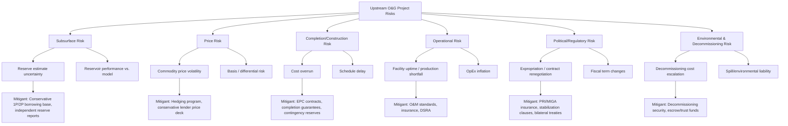
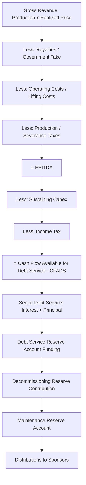

## Upstream Oil and Gas Project Finance

### Overview and Sector Context

Upstream oil and gas project finance funds the exploration, appraisal, development, and production phases of hydrocarbon extraction projects — as distinct from midstream (transportation, storage) and downstream (refining, distribution) activities. Upstream projects are financed on a non-recourse or limited-recourse basis, where lenders look primarily to the cash flows generated by the reserves themselves, and to the project's assets, rights, and contracts, rather than to the sponsor's general balance sheet.

The defining characteristic of upstream finance is **reserve-based lending (RBL)**, a structure unique to the extractives sector where the borrowing base is periodically redetermined against the value of proved (and sometimes probable) hydrocarbon reserves. This differentiates upstream finance from the more static debt-sizing approaches used in power or infrastructure project finance, where contracted cash flows (e.g., PPAs) provide more certainty.

Upstream projects sit at the intersection of geology, commodity markets, and contract law. Financing structures must therefore accommodate:

- Subsurface uncertainty (reserves and production estimates change over time)
- Commodity price volatility (oil and gas prices are not contracted, unlike power offtake)
- Long lead times and high upfront capital intensity
- Host government fiscal and regulatory regimes (concessions, PSCs, royalty/tax systems)
- Environmental, decommissioning, and ESG liabilities

### Project Lifecycle and Financing Stages

Upstream projects move through distinct phases, each with different risk profiles and financing needs:

**1. Exploration Phase**

- Highest risk, lowest financeability via traditional debt
- Typically funded with equity, farm-in/farm-out arrangements, or exploration-specific vehicles
- Dry hole risk is generally uninsurable and unfinanceable by conventional lenders
- May involve carried interests, where a partner funds another's share of costs in exchange for future production rights

**2. Appraisal Phase**

- Confirms commercial viability of a discovery (flow testing, delineation wells)
- Reserves move from "contingent resources" toward "reserves" classifications (per SPE-PRMS or SEC definitions)
- Financing remains largely equity-funded; project debt is rarely available until reserves are proved

**3. Development / Construction (Pre-Production) Phase**

- Capital-intensive phase: drilling development wells, building surface facilities, pipelines, FPSOs (Floating Production Storage and Offloading units)
- This is where **project finance debt** becomes viable, once reserves are sufficiently proved and a Final Investment Decision (FID) is taken
- Debt structured as a **development/construction facility**, often converting to a term facility at first oil/gas

**4. Production (Operating) Phase**

- Cash flow generation begins; debt is serviced from net revenues
- RBL facilities are used predominantly in this phase, especially for producing assets (acquisition finance, refinancing, or funding infill drilling)
- Borrowing base redeterminations occur semi-annually or annually

**5. Decommissioning Phase**

- End-of-life obligations to plug wells and remove infrastructure
- Increasingly a focus of lender due diligence and financial security requirements (decommissioning security agreements, trust funds, or letters of credit)

### Reserve-Based Lending (RBL) — Core Structure

RBL is the dominant financing instrument for producing upstream assets. Key mechanics:

**Borrowing Base**

- The maximum loan amount lenders will extend, calculated as a function of the net present value (NPV) of future cash flows from proved (1P) and often proved-plus-probable (2P) reserves
- Lenders apply a **discount rate** (often above the project's own cost of capital, reflecting lender risk aversion) and conservative **price decks** (below forward curves) to calculate this NPV
- A **borrowing base coverage ratio** or advance rate (e.g., 60–70% of 1P NPV, or a blended 1P/2P weighting) is applied

**Redetermination**

- Semi-annual or annual reassessment of the borrowing base using updated reserve reports, production data, and price decks
- If the redetermined borrowing base falls below outstanding debt (a "borrowing base deficiency"), the borrower must cure via cash sweep, partial prepayment, or posting additional collateral, typically over a cure period (e.g., 3–6 months)

**Price Deck**

- Lenders use their own conservative forward price assumptions (often derived from a syndicate consensus or a published strip discounted further), rather than the sponsor's price forecast, to insulate the borrowing base from commodity price optimism

**Reserve Tail / Loan Life Coverage**

- RBL facilities typically require reserves to extend meaningfully beyond loan maturity (a "tail") so that repayment is not dependent on the very last years of production, which carry the highest uncertainty

**Key covenants in RBL:**

- Loan Life Coverage Ratio (LLCR) and Reserve Tail requirements
- Hedging requirements (see below)
- Restrictions on additional debt, distributions, and asset sales
- Technical and operational covenants (minimum working interest, operatorship requirements)

### Key Financial Metrics and Ratios

| Metric | Formula / Definition | Purpose |
| --- | --- | --- |
| **Loan Life Coverage Ratio (LLCR)** | $LLCR = \dfrac{NPV(\text{CFADS over loan life})+\text{Reserve Account Balance}}{\text{Outstanding Debt}}$ | Measures debt coverage across remaining loan tenor discounted at the cost of debt |
| **Reserve Life Coverage Ratio / Reserve Tail Ratio** | Remaining reserves (post loan maturity) / Reserves required to repay debt | Ensures a buffer of unpledged reserves beyond the loan term |
| **Debt Service Coverage Ratio (DSCR)** | $DSCR = \dfrac{CFADS}{\text{Debt Service (Principal + Interest)}}$ | Period-by-period ability to service debt |
| **Project Life Coverage Ratio (PLCR)** | NPV of cash flows over full field life / Outstanding debt | Broader coverage measure using full reserve life, not just loan tenor |
| **Advance Rate / Borrowing Base Utilization** | Outstanding debt / Borrowing base | Headroom against redetermination risk |
| **Finding & Development (F&D) Cost** | Capex incurred / Reserves added ($/boe) | Capital efficiency of reserve replacement, used in credit assessment |
| **Lifting Cost (Opex per boe)** | Operating costs / Production volume | Operational efficiency benchmark, drives breakeven price |
| **Breakeven Oil Price** | Price at which project NPV = 0 or DSCR = 1.0x | Stress-testing metric against commodity downside |

CFADS (Cash Flow Available for Debt Service) in upstream models is typically calculated as: Revenue (Production × Realized Price) − Royalties − Production/Severance Taxes − Operating Costs − Sustaining/Development Capex − Income Taxes − Changes in Working Capital − Decommissioning Reserve Contributions.

### Fiscal and Contractual Regimes

The host government's fiscal framework fundamentally shapes project cash flows and financeability. Four broad regime types:

**1. Concession / Royalty-Tax Systems**

- Company holds title to produced hydrocarbons
- Pays royalties (often sliding-scale based on price or production rate) plus corporate income tax
- Common in the US, UK, Canada, Australia
- Simplest for financial modeling; cash flows are relatively direct

**2. Production Sharing Contracts (PSCs)**

- Host government (via NOC) retains title to hydrocarbons; contractor recovers costs via "cost oil/gas" and shares "profit oil/gas" per a sharing formula
- Common in Indonesia, Nigeria, Angola, Malaysia, many African and Southeast Asian jurisdictions
- Modeling complexity is significantly higher: cost recovery ceilings (e.g., 60–90% of revenue), sliding-scale profit splits (often tied to R-factor or production rate), ring-fencing rules
- **R-Factor** (Cumulative Revenue / Cumulative Costs) is a common mechanism determining the government's profit share tier — as the contractor recovers more relative to investment, the government's share increases

**3. Service Contracts**

- Contractor is paid a fee (per barrel or fixed) for services rendered; does not take title to production
- Common in Iraq, Mexico (historically), parts of the Middle East
- Lowest commodity price exposure for the contractor, but also lowest upside

**4. Risk Service Agreements / Hybrid Models**

- Blend features of concessions and service contracts; contractor bears exploration risk but is compensated via a fee or reimbursement mechanism tied to production

[Inference] The choice of regime materially affects debt capacity: PSC structures with high cost-recovery ceilings can improve early-year cash flow to the contractor (front-loaded cost recovery), which may support debt service in early years, though this depends heavily on contract-specific terms and negotiated sharing formulas.

### Financing Structures

**1. Reserve-Based Lending (RBL) Facilities**

- Revolving or term facilities secured against reserves; described in detail above
- Predominant structure for producing/near-producing assets

**2. Corporate/Hybrid Facilities**

- Used by larger IOCs/independents with diversified asset bases; recourse to a broader balance sheet rather than a single field

**3. Project Finance (Limited Recourse) for Development**

- Used for large greenfield developments (e.g., deepwater, LNG-linked upstream), often with completion guarantees from sponsors during construction that fall away at defined completion tests
- Typically structured with:
  - **Cash flow waterfall**: Revenue → Opex → Debt Service → Reserve Accounts (DSRA, MRA) → Distributions
  - **Debt Service Reserve Account (DSRA)**: typically 6–12 months of debt service
  - **Maintenance Reserve Account (MRA)**: funds major workovers/maintenance capex

**4. Farm-in / Farm-out Arrangements**

- A partner ("farminee") earns an interest in a license by funding some or all of the farmor's exploration/appraisal costs
- Used to spread exploration risk and bring in technical/financial capacity without traditional debt

**5. Volumetric Production Payments (VPPs)**

- Sale of a specified volume of future production for upfront cash, functioning economically like debt but often structured as a production interest sale
- Used for monetizing proved reserves without adding balance-sheet leverage in some accounting treatments [Unverified: accounting treatment varies by jurisdiction and standard (IFRS vs. US GAAP) and specific VPP structuring — consult accounting guidance for the applicable regime]

**6. Prepayment / Offtake-Linked Financing**

- Buyer or trader prepays for future production, effectively financing development in exchange for supply rights, common where traditional bank debt is constrained

**7. Streaming and Royalty Financing**

- More common in mining but appearing in some oil/gas contexts; investor provides upfront capital for a right to a royalty or discounted purchase stream

**8. Mezzanine / Second-Lien and High-Yield Bonds**

- Used to fill the gap between senior RBL capacity and total capital needs, particularly for higher-risk or sub-investment-grade issuers

### Risk Allocation Framework

### Hedging Strategies

Because upstream cash flows are directly exposed to commodity prices, lenders typically mandate hedging as a condition precedent and ongoing covenant:

- **Mandatory hedge minimums**: e.g., 50–75% of forecast production hedged for years 1–3 post-financing, tapering in later years
- **Instruments**: swaps, costless collars (put/call combinations), puts (floors) purchased outright
- **Basis/differential hedging**: separately manages the spread between benchmark prices (WTI, Brent, Henry Hub) and the actual realized (wellhead) price, which can vary significantly by region and quality
- **Hedge counterparty risk**: often addressed via secured hedging agreements ranking pari passu with senior debt

[Inference] Lenders generally prefer puts/collars over full swaps in upstream RBL structures because they preserve some upside participation for the borrower while still providing a floor for debt service — the exact instrument mix is negotiated per deal and varies by lender group risk appetite.

### Reserve Reporting and Technical Due Diligence

- **Independent Reserve Reports**: Prepared by Competent Persons/independent engineers (e.g., under SPE-PRMS, SEC, or CIM standards) forming the technical basis for the borrowing base
- **Reserve categories**: Proved (1P), Proved+Probable (2P), Proved+Probable+Possible (3P) — lenders typically size debt off 1P or a risk-weighted blend, with 2P used for sensitivity
- **Independent Technical Advisor (ITA)**: Engaged by lenders to review reserve reports, development plans, and operational assumptions throughout the loan life
- **Decline curve analysis**: Statistical modeling (exponential, hyperbolic, harmonic decline) used to forecast production profiles from existing wells, feeding directly into the cash flow model

### Illustrative Cash Flow Waterfall

### Worked Example: Simplified Borrowing Base Calculation

Assume a producing field with the following independent reserve report data:

- 1P Reserves: 40 million boe
- Forecast production decline: hyperbolic, 15% initial annual decline
- Lender price deck: $65/bbl flat (versus a market forward curve of $75/bbl)
- Opex: $18/bbl
- Royalty: 12.5% of gross revenue
- Corporate tax: 30%
- Lender discount rate: 9%
- Advance rate applied to 1P NPV: 65%

**Step 1 — Net revenue per barrel:**

$$\text{Net Revenue/bbl} = 65 \times (1 - 0.125) = 56.875$$

**Step 2 — Netback per barrel (before tax):**

$$\text{Netback} = 56.875 - 18 = 38.875$$

**Step 3 — After-tax netback:**

$$\text{After-tax Netback} = 38.875 \times (1 - 0.30) = 27.2125$$

**Step 4 — Approximate undiscounted cash flow:**

$$\text{Undiscounted CF} \approx 40{,}000{,}000 \times 27.2125 = \$1.089\text{ billion}$$

**Step 5 — Apply discounting (illustrative NPV at 9%, given the production decline profile):**

Using the production decline schedule discounted at 9% (requires year-by-year modeling in practice), assume this produces an **NPV of approximately $650 million**.

**Step 6 — Apply advance rate to determine borrowing base:**

$$\text{Borrowing Base} = 650{,}000{,}000 \times 0.65 = \$422.5\text{ million}$$

This $422.5 million becomes the maximum facility size available under the RBL structure, subject to redetermination as production, prices, and reserves evolve. [Inference] Actual borrowing base calculations require full-year discrete cash flow modeling rather than a flat-rate approximation as shown here; this example simplifies for illustrative purposes and real lender models will produce materially different results depending on decline curve shape and timing of costs.

### ESG and Decommissioning Considerations

- **Decommissioning security**: Increasingly required upfront via escrow, trust deeds, or letters of credit, sized against independent decommissioning cost estimates (which themselves carry significant estimation uncertainty)
- **Methane/flaring covenants**: Growing trend of RBL facilities incorporating sustainability-linked pricing grids tied to methane intensity or flaring reduction targets
- **Just transition and stranded asset risk**: Lenders increasingly stress-test upstream portfolios against long-term demand scenarios and carbon pricing, which can affect terminal value assumptions in reserve-life-dependent metrics
- **Equator Principles / IFC Performance Standards**: Applied by many international lenders as environmental and social risk screening frameworks for upstream project finance

### Common Modeling Pitfalls

- Using a single flat price rather than a full forward curve/strip for cash flow projections
- Failing to model royalty and tax sliding scales correctly under PSC/R-factor regimes (a common source of material valuation error)
- Ignoring basis differentials between benchmark and realized wellhead prices
- Under-modeling decommissioning liabilities or assuming unrealistic salvage values
- Circular references between debt sizing, DSRA funding, and cash sweep mechanics — requires iterative/goal-seek or macro-enabled solving in spreadsheet models
- Treating reserve estimates as static rather than incorporating redetermination risk into sensitivity analysis

**Related Topics:**

- Reserve-Based Lending (RBL) — Detailed Mechanics and Documentation
- Production Sharing Contracts (PSC) Modeling and R-Factor Structures
- Midstream Oil & Gas Project Finance (Pipelines, LNG, Storage)
- Commodity Hedging Structures in Project Finance
- Decommissioning Trusts and Abandonment Cost Estimation
- Political Risk Insurance (PRI) and MIGA/ECA Support for Extractive Projects
- FPSO Project Finance and Leasing Structures
- Independent Reserve Reports and SPE-PRMS Reserve Classification
- Sustainability-Linked Loans in the Oil & Gas Sector
- Mining Project Finance — Comparative Structures (Streaming, Royalty Finance)