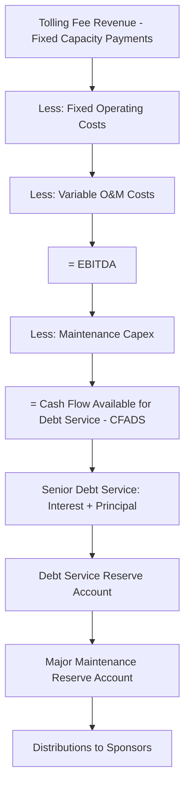
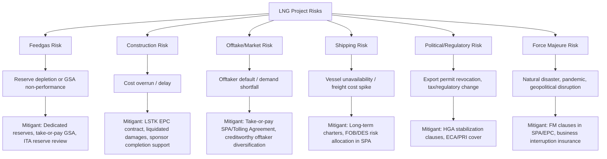

## LNG Project Finance Structures

### Overview and Sector Context

LNG (Liquefied Natural Gas) project finance funds the liquefaction, shipping, and regasification value chain that converts natural gas into a transportable liquid form (cooled to approximately −162°C, reducing volume roughly 600-fold) for transport to markets not connected by pipeline. LNG projects are among the largest and most capital-intensive undertakings in project finance, frequently requiring $10–50 billion in total capital for integrated greenfield developments.

Unlike upstream oil and gas projects — which are exposed directly to volatile spot commodity prices — LNG projects have historically been financeable precisely because they are underpinned by **long-term, take-or-pay offtake contracts**, which convert a commodity project into something resembling a contracted infrastructure asset. This is the central financing logic of traditional LNG project finance and distinguishes it structurally from reserve-based lending used in standalone upstream assets.

### The LNG Value Chain and Financing Segments

Each segment can be financed separately or as part of an **integrated project financing**:

- **Upstream/feedgas**: Dedicated gas fields or third-party gas supply agreements (GSAs) dedicated to feed the LNG plant
- **Liquefaction**: The capital-intensive core asset (the "LNG plant" or "train"), typically the primary project-financed component
- **Shipping**: LNG carriers financed separately (often via sale-and-leaseback, export credit agency-backed ship finance, or shipping-specific facilities) under long-term charters to the project or offtakers
- **Regasification**: Import terminals, increasingly financed as standalone infrastructure assets, especially Floating Storage Regasification Units (FSRUs)

### Traditional LNG Financing Model (Contract-Based)

Historically (pre-2010s, and still common for large greenfield trains), LNG projects were financed on a **fully-contracted basis**:

**Key contractual pillars:**

- **Gas Supply Agreement (GSA)**: Secures feedgas for the life of the project, often from a dedicated reserve or an affiliated upstream JV
- **Sale and Purchase Agreements (SPAs)**: Long-term (typically 15–20 year) take-or-pay contracts with creditworthy offtakers, historically covering 80–100% of nameplate capacity before FID
- **EPC Contract**: Lump-sum turnkey (LSTK) contract with a single point of responsibility, essential for allocating construction risk away from lenders
- **Shipping arrangements**: Either DES (Delivered Ex Ship, seller arranges shipping) or FOB (Free On Board, buyer arranges shipping) terms embedded in the SPA, determining who bears freight and shipping risk

**Pricing mechanisms in traditional SPAs:**

- Oil-indexed pricing (common in Asian long-term contracts, historically linked to JCC — Japan Crude Cocktail)
- Henry Hub-linked pricing (common in US Gulf Coast projects, cost-plus tolling structures)
- Hybrid and increasingly hub-indexed (TTF, JKM) pricing as markets mature

**Take-or-pay mechanics**: The buyer is obligated to pay for contracted volumes whether or not it lifts the cargo, providing the revenue certainty that underpins project debt — economically similar to the "availability" logic in power project finance PPAs.

### The Tolling Model (US LNG Export Facilities)

A structurally distinct model emerged with US Gulf Coast LNG exports (Sabine Pass, Cameron, Freeport, Corpus Christi, etc.), driven by an abundant domestic gas market and different regulatory context (FERC/DOE authorization rather than concession-based upstream rights):

**Structure:**

- The **LNG plant owner** does not take title to the gas or the LNG produced
- **Tolling customers** (often portfolio players, utilities, or trading houses) supply their own feedgas (or purchase it separately) and pay a **fixed liquefaction tolling fee** (capacity reservation fee) to the plant, regardless of whether they actually liquefy gas — a "take-or-pay" fee structurally similar to a power tolling agreement
- The plant owner bears no commodity price risk; the tolling customer bears feedgas procurement risk and captures the arbitrage between US Henry Hub gas prices and international LNG prices

**Financing implications:**

- This structure is highly financeable because the **tolling fee is fixed and contracted**, independent of commodity prices — nearly identical in credit logic to an availability-based power project financing
- Debt sizing is based on the aggregate contracted tolling revenue (capacity fees) under multiple long-term Sale and Purchase Agreements/Tolling Agreements, typically requiring 80%+ of capacity contracted before FID
- Common in brownfield expansions and modular "mid-scale" LNG developments due to lower absolute capital requirements per train

[Inference] The tolling model has generally enabled faster and more flexible project financings than the fully-integrated traditional model, since it decouples the plant financing from feedgas reserve risk and commodity price exposure — though the precise credit spread and terms achieved depend on the specific counterparty credit quality and market conditions at financial close.

### Portfolio and Merchant LNG Models

More recently, integrated energy majors and portfolio players have financed LNG capacity with **less than 100% long-term contract cover**, relying instead on:

- A **contracted base** (e.g., 60–70% of capacity under long-term SPAs) to underpin debt sizing
- **Spot/short-term sales** and **portfolio optimization** (trading across a global fleet of supply sources and markets) to monetize the uncontracted "merchant" tail
- Sponsor balance sheet strength (often from supermajors or large NOCs) substituting for full contract cover, since these sponsors can absorb greater merchant exposure

This model shifts price risk from lenders/contract structure onto sponsors' broader trading and balance sheet capacity, and is generally only viable for well-capitalized sponsors with global portfolio hedging capability.

### Key Contracts and Risk Allocation

| Contract | Purpose | Key Risk Transferred |
| --- | --- | --- |
| **Gas Supply Agreement (GSA)** | Secures feedgas volume/price for plant life | Feedgas availability and price risk |
| **EPC Contract (LSTK)** | Single-point construction responsibility | Construction cost overrun, schedule delay, performance |
| **SPA / Tolling Agreement** | Long-term revenue contract | Offtake/demand risk, revenue certainty |
| **Shipping/Charter Agreements** | LNG carrier availability | Transport risk, freight cost exposure |
| **O&M Agreement** | Plant operation post-completion | Operational performance, availability risk |
| **Government Agreements / Host Government Agreement (HGA)** | Fiscal and regulatory stability | Political, regulatory, fiscal change risk |
| **Joint Venture / Shareholders' Agreement** | Governs sponsor relationships, cash calls, decision rights | Sponsor default, funding shortfall risk |

### Financing Structures for LNG Projects

**1. Limited-Recourse Project Finance (Traditional Model)**

- Senior secured debt (bank syndicates, ECAs, DFIs) sized against contracted cash flows from SPAs/tolling agreements
- Typical tenor: 12–18 years, often extending close to or beyond SPA contract tenors
- Completion guarantees from sponsors during construction, falling away at Commercial Operations Date (COD)/Completion Test

**2. Export Credit Agency (ECA) — Supported Financing**

- ECAs (US EXIM, JBIC/NEXI, UKEF, Euler Hermes, etc.) provide direct loans, guarantees, or political risk cover, often tied to procurement of equipment/services from their home country
- Common for large greenfield LNG projects given the scale of capital required and the involvement of EPC contractors from ECA home countries
- Frequently blended with commercial bank tranches in a "co-financing" structure

**3. Development Finance Institution (DFI) Participation**

- IFC, ADB, multilateral and bilateral DFIs participate for developmental impact and political risk mitigation (their presence can deter host government interference — the "halo effect")

**4. Bond Financing**

- Project bonds (144A/Reg S) used increasingly for refinancing operating LNG assets once construction risk has passed, benefiting from lower operational risk premiums
- Rated by credit rating agencies based on contracted cash flow strength, similar to infrastructure bond ratings

**5. Sponsor Equity and Bridge Financing**

- Equity typically 25–40% of total project cost
- Equity bridge loans sometimes used to defer equity contributions until later construction milestones, backed by sponsor guarantees

**6. Sale-and-Leaseback for LNG Carriers**

- Shipping assets financed separately from the plant, often via sale-and-leaseback with shipping lessors or ECA-backed ship finance, to optimize cost of capital by asset class

### Key Financial Metrics in LNG Project Finance

| Metric | Purpose |
| --- | --- |
| **Debt Service Coverage Ratio (DSCR)** | Sized off contracted tolling/SPA revenue during operations; minimum thresholds typically 1.3–1.5x |
| **Loan Life Coverage Ratio (LLCR)** | NPV of contracted cash flows over loan tenor vs. outstanding debt |
| **Construction/Completion Cost Overrun Coverage** | Contingency and sponsor completion support sized against EPC contract terms |
| **Contract Cover Ratio** | Percentage of nameplate capacity under long-term contracts vs. merchant exposure |
| **Debt-to-Capacity ($/tonne of annual capacity)** | Benchmarking metric for capital intensity across projects |
| **Breakeven Tolling Fee / SPA Price** | Minimum contracted price/fee required to service debt under base case |

### Illustrative Cash Flow Waterfall (Tolling Model)

Note the structural similarity to power project finance waterfalls under availability-based PPAs — a direct consequence of the tolling model's fixed-fee revenue logic.

### Worked Example: Simplified Tolling-Model Debt Sizing

Assume an LNG liquefaction train with the following characteristics:

- Nameplate capacity: 5 million tonnes per annum (mtpa)
- Contracted capacity: 4 mtpa (80%) under 20-year tolling agreements
- Fixed tolling fee: $3.00/MMBtu capacity reservation charge (take-or-pay)
- Approximate annual contracted revenue: 4 mtpa ≈ 194,000,000 MMBtu/year (using ~48.7 MMBtu/tonne LNG energy content)

**Step 1 — Annual contracted tolling revenue:**

$$194{,}000{,}000 \times 3.00 = \$582{,}000{,}000$$

**Step 2 — Deduct fixed operating costs (illustrative, $120 million/year):**

$$582{,}000{,}000 - 120{,}000{,}000 = \$462{,}000{,}000 \text{ (EBITDA)}$$

**Step 3 — Deduct maintenance capex reserve (illustrative, $25 million/year):**

$$462{,}000{,}000 - 25{,}000{,}000 = \$437{,}000{,}000 \text{ (CFADS)}$$

**Step 4 — Apply target minimum DSCR of 1.40x to size annual debt service capacity:**

$$\text{Max Annual Debt Service} = \dfrac{437{,}000{,}000}{1.40} = \$312.1\text{ million}$$

**Step 5 — Size debt using an annuity/sculpted repayment approach over an 18-year tenor at an illustrative 6% cost of debt:**

$$\text{Debt Capacity} \approx 312{,}100{,}000 \times \left(\dfrac{1-(1.06)^{-18}}{0.06}\right) \approx 312{,}100{,}000 \times 10.83 \approx \$3.38\text{ billion}$$

This approximates the maximum senior debt supportable by the contracted tolling revenue stream alone; merchant/uncontracted capacity (the remaining 20% in this example) would typically be excluded from the base-case debt sizing and treated as upside sensitivity. [Inference] This is a simplified illustrative annuity approximation; actual lender models use full sculpted, period-by-period cash flow sizing that accounts for ramp-up periods, seasonality if applicable, and covenant-driven cash sweep mechanics, which will produce different results than a flat-annuity approximation.

### Risk Allocation Diagram

### Emerging Trends

- **Floating LNG (FLNG)**: Liquefaction on floating vessels, reducing onshore infrastructure and permitting complexity, but introducing marine and technology risk premiums into financing terms
- **Small-scale and modular LNG**: Lower absolute capital requirements enabling financing by a broader range of lenders and smaller sponsor groups
- **FSRUs (Floating Storage Regasification Units)**: Increasingly financed as standalone chartered assets separate from onshore regas infrastructure, often via long-term bareboat or time charters
- **Shorter-tenor and more flexible SPAs**: A market shift toward more index-linked pricing (JKM, TTF) and shorter contract tenors (5–10 years) is placing pressure on the traditional 20-year contract-based financeability model, pushing sponsors toward stronger balance sheets or portfolio-based financing to fill the gap
- **Carbon intensity and methane monitoring covenants**: Increasingly embedded into financing documentation, particularly for projects seeking participation from ESG-conscious lenders and DFIs

[Inference] The general market trend toward shorter and more flexible offtake contracts is widely discussed as increasing reliance on sponsor balance sheet strength and portfolio-based financing approaches rather than fully non-recourse contract-based structures; the pace and extent of this shift varies significantly by project, region, and prevailing market conditions at the time of financing.

### Common Modeling Pitfalls

- Confusing tolling-fee (capacity-based) revenue logic with commodity-price-linked SPA revenue logic — they require different modeling architectures
- Under-accounting for shipping costs/freight risk allocation (FOB vs. DES) which materially affects net project revenue
- Failing to model ramp-up periods and cargo lifting schedules accurately, especially around COD
- Ignoring boil-off gas (BOG) losses in LNG storage and shipping, which affect delivered volumes and revenue
- Treating merchant/uncontracted capacity revenue as bankable in base-case debt sizing rather than as upside sensitivity
- Overlooking currency mismatch between feedgas costs (often local currency) and LNG sales revenue (typically USD)

**Related Topics:**

- Reserve-Based Lending vs. Contract-Based Financing — Comparative Analysis
- Power Project Finance and Tolling Agreements (Structural Parallels)
- Export Credit Agency (ECA) Financing Structures
- FLNG and FSRU Project Finance
- Take-or-Pay Contract Structuring and Credit Analysis
- LNG Shipping Finance (Sale-and-Leaseback, Charter Structures)
- Host Government Agreements and Stabilization Clauses
- Midstream Pipeline Project Finance
- Commodity Price Indexation Mechanisms (JCC, Henry Hub, JKM, TTF)
- Political Risk Insurance and DFI Participation in Extractive Megaprojects