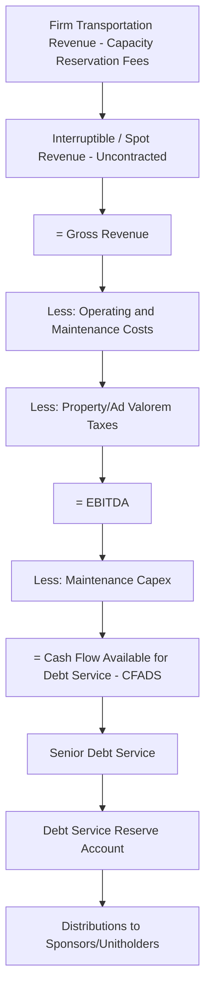
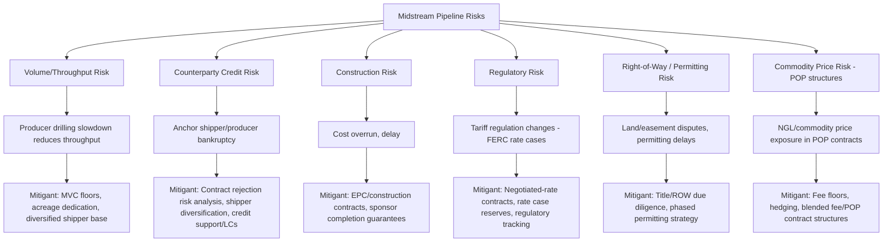

## Midstream Pipeline Financing

### Overview and Sector Context

Midstream pipeline financing funds the transportation, gathering, and (often) storage infrastructure that connects upstream production to downstream markets — natural gas gathering systems, crude oil and gas transmission pipelines, gas processing plants, and associated storage terminals. Midstream assets occupy a structurally favorable position in the natural resource value chain for project finance purposes: they typically do not take direct commodity price risk (unlike upstream) and generate revenue through **contracted capacity or throughput fees**, giving them cash flow characteristics closer to regulated infrastructure than to extractive assets.

This contract-based, fee-for-service logic is the central financing thesis of midstream pipelines, and it drives strong comparability to power and toll-road project finance structures — high leverage capacity, longer tenors, and investment-grade financing outcomes are achievable when contract quality is strong.

### Midstream Asset Categories

| Asset Type | Function | Typical Revenue Model |
| --- | --- | --- |
| **Gathering Systems** | Collect production from wellheads to central points | Gathering fee per unit volume, often acreage-dedication based |
| **Transmission/Trunk Pipelines** | Long-haul transport between regions/markets | Capacity reservation fees, tariffs (regulated or negotiated) |
| **Gas Processing Plants** | Strip NGLs, remove impurities from raw gas | Processing fee, often percent-of-proceeds or fee-based |
| **Storage Facilities** | Underground gas storage, crude/product terminals | Capacity/injection-withdrawal fees |
| **Liquids Pipelines (Crude/NGL/Refined Products)** | Transport of liquid hydrocarbons | Tariffs per barrel, often regulated (FERC/state) |
| **Export Terminals / Marine Facilities** | Loading for waterborne export | Throughput or capacity fees |

### Revenue and Contract Structures

**1. Regulated Tariff (Cost-of-Service) Model**

- Common for interstate pipelines subject to regulatory oversight (e.g., FERC in the US)
- Tariffs set to recover a rate base (invested capital) plus an allowed rate of return, similar in logic to regulated utility ratemaking
- Provides highly predictable, regulator-sanctioned cash flow, generally the most financeable midstream structure

**2. Negotiated Rate / Contracted Capacity Model**

- Common for greenfield pipelines built to serve specific shippers
- **Firm transportation (FT) agreements**: shipper pays a reservation charge regardless of actual usage (take-or-pay-like fixed capacity fee), functionally similar to a tolling agreement
- **Interruptible transportation (IT) agreements**: lower priority, variable usage-based revenue, generally not bankable as base-case cash flow
- Long-term FT agreements (often 10–20 years) with creditworthy shippers are the primary underpinning for project debt on greenfield midstream assets

**3. Acreage Dedication / Minimum Volume Commitment (MVC) Structures**

- Common in gathering and processing agreements tied to a specific upstream producer's development area
- Producer dedicates all production from a defined acreage to the midstream operator
- **MVCs** guarantee a minimum throughput fee regardless of actual volumes delivered, providing a revenue floor even if upstream drilling activity slows
- Key credit risk: MVC structures are only as strong as the underlying producer's creditworthiness and its acreage's actual production potential — a producer bankruptcy can lead to contract rejection in Chapter 11 proceedings (a widely discussed risk in the sector following several producer restructurings)

**4. Percent-of-Proceeds (POP) / Percent-of-Index (POI) Structures**

- Common in gas processing; processor retains a percentage of the value of NGLs extracted (or an index-linked equivalent) as compensation
- Introduces direct commodity price exposure into midstream cash flows, reducing financeability relative to pure fee-based structures unless supplemented by fee floors

### Key Financing Structures

**1. Project Finance (Limited Recourse)**

- Used for greenfield pipeline and processing developments backed by long-term FT/MVC agreements
- Senior secured debt sized against contracted cash flow (analogous to power/toll-road project finance)
- Completion support from sponsors during construction (EPC risk, right-of-way/permitting risk)

**2. Master Limited Partnerships (MLPs) — US Market**

- Historically the dominant corporate structure for US midstream assets, offering pass-through tax treatment
- MLPs typically raise capital via a blend of:
  - Revolving credit facilities (corporate-level, secured or unsecured)
  - Senior unsecured notes (investment-grade or high-yield, depending on the issuer)
  - Equity issuance (common and preferred units)
- Financing is generally **corporate-style** rather than strictly asset-level project finance once an MLP has a diversified portfolio, though individual large greenfield projects may still be ring-fenced with project-level debt (e.g., joint venture project financings for large pipeline systems)

**3. Joint Venture Project Financing**

- Large interstate pipelines are frequently developed as JVs among multiple sponsors (producers, midstream companies, sometimes financial investors)
- Project-level non-recourse or limited-recourse debt raised at the JV entity, secured by the pipeline asset and its FT contracts
- Cash flow waterfall and distribution mechanics governed by a joint venture/LLC agreement in addition to standard financing documents

**4. Master Limited Partnership Dropdowns and Yieldcos**

- Sponsor (often an E&P or refiner) develops midstream assets, then "drops down" completed, cash-flowing assets into an affiliated MLP or yieldco vehicle in exchange for cash and/or units
- The dropdown structure allows the parent to recycle capital while the MLP acquires de-risked, already-contracted operating assets — attractive to MLP investors seeking stable distributions

**5. Infrastructure Fund and Private Capital Ownership**

- Increasingly, midstream assets (particularly non-core dropped-down or divested assets) are acquired by infrastructure funds, pension funds, and private equity, financed with a mix of:
  - Portfolio-level acquisition debt
  - Asset-level project finance for specific contracted pipelines
- Attractive due to long-duration, inflation-linked (in some tariff structures), infrastructure-like cash flows

**6. Project Bonds**

- Rated project bonds (144A or public) used for operating midstream assets with strong contract cover, especially post-construction refinancings once completion risk has passed
- Credit ratings driven heavily by shipper/counterparty credit quality, contract tenor, and revenue structure (regulated vs. negotiated vs. commodity-linked)

### Key Financial Metrics

| Metric | Purpose |
| --- | --- |
| **Debt Service Coverage Ratio (DSCR)** | Core sizing metric; minimum covenants typically 1.20–1.50x depending on contract quality |
| **Contract Cover Ratio** | Percentage of capacity/throughput under long-term FT or MVC agreements vs. spot/interruptible exposure |
| **Weighted Average Contract Life (WACL)** | Remaining tenor of contracted revenue relative to debt tenor — a longer WACL supports higher leverage |
| **Minimum Volume Commitment (MVC) Coverage** | Portion of debt service covered by MVC floors alone, independent of actual throughput |
| **Loan Life Coverage Ratio (LLCR)** | NPV of contracted cash flows over loan life vs. outstanding debt |
| **Distributable Cash Flow (DCF) / Distribution Coverage Ratio** | Common MLP metric: DCF ÷ Distributions paid, indicating sustainability of unit distributions |
| **Rate Base / Regulated Asset Base (RAB)** | Underpins tariff-setting in cost-of-service models |

### Illustrative Cash Flow Waterfall (Contracted FT Model)

### Worked Example: Simplified Debt Sizing for a Greenfield Gathering System

Assume a gas gathering system with the following terms:

- 15-year Minimum Volume Commitment (MVC) agreement with a single anchor producer
- Contracted MVC fee revenue: $45 million/year (fixed floor, regardless of actual throughput)
- Additional expected excess-throughput revenue (uncontracted upside): $8 million/year (excluded from base-case debt sizing per conservative lender practice)
- Fixed O&M costs: $9 million/year
- Maintenance capex reserve: $2 million/year
- Target minimum DSCR: 1.35x
- Assumed cost of debt: 6.5%
- Debt tenor: 12 years (shorter than the 15-year MVC to preserve a contract tail)

**Step 1 — Base-case CFADS (MVC revenue only):**

$$45{,}000{,}000 - 9{,}000{,}000 - 2{,}000{,}000 = \$34{,}000{,}000$$

**Step 2 — Maximum annual debt service at target DSCR:**

$$\dfrac{34{,}000{,}000}{1.35} = \$25.19\text{ million}$$

**Step 3 — Size debt using an annuity approximation over 12 years at 6.5%:**

$$\text{Debt Capacity} \approx 25{,}190{,}000 \times \left(\dfrac{1-(1.065)^{-12}}{0.065}\right) \approx 25{,}190{,}000 \times 8.19 \approx \$206.3\text{ million}$$

This represents the approximate senior debt capacity supportable purely by the contracted MVC floor, with the uncontracted throughput upside excluded as a conservative buffer and preserved contract tail (debt maturing 3 years before MVC expiry) providing additional lender comfort. [Inference] This is a simplified flat-annuity approximation for illustration; actual lender models size debt using period-specific sculpted cash flows that account for ramp-up, seasonal demand patterns where relevant, and specific covenant/cash sweep mechanics, and will differ from this simplified calculation.

### Risk Allocation Diagram

### Contract Counterparty Credit Considerations

Because midstream revenue certainty depends on shipper/producer performance rather than a diversified market, counterparty credit analysis is central to financeability:

- **Contract rejection risk**: In US Chapter 11 proceedings, a debtor-producer may seek to reject "burdensome" gathering/MVC agreements; this has been litigated and debated extensively in the midstream sector following several high-profile producer bankruptcies, with outcomes turning on whether the agreement is found to constitute a "covenant running with the land" versus an executory contract subject to rejection [Unverified: legal treatment is jurisdiction- and case-specific; parties should rely on current legal counsel rather than general market commentary for any specific transaction]
- **Shipper diversification**: Pipelines serving multiple unaffiliated shippers are generally more resilient than single-shipper dedicated systems
- **Credit support mechanisms**: Letters of credit, parent guarantees, or cash collateral posted by lower-rated shippers to mitigate counterparty risk

### Common Modeling Pitfalls

- Including interruptible/spot revenue in base-case debt sizing rather than treating it as upside sensitivity only
- Failing to model the "contract tail" — ensuring debt maturity precedes contract expiry with a reasonable buffer
- Ignoring contract rejection risk in bankruptcy scenarios when assessing MVC-backed revenue durability
- Conflating regulated cost-of-service tariff revenue (relatively low risk) with negotiated-rate or POP revenue (higher risk) within the same coverage ratio without appropriate risk-weighting
- Under-modeling maintenance capex requirements for long-lived linear assets (pipeline integrity management, cathodic protection, recertification costs)
- Overlooking basis differential and pipeline routing competition risk when assessing long-term throughput sustainability

**Related Topics:**

- Upstream Oil and Gas Project Finance (Reserve-Based Lending Comparison)
- LNG Project Finance Structures (Tolling Model Parallels)
- Master Limited Partnership (MLP) Capital Structures
- Minimum Volume Commitments and Producer Bankruptcy Risk
- FERC Rate Regulation and Cost-of-Service Ratemaking
- Power Project Finance — Availability-Based PPA Structures (Comparative Analysis)
- Infrastructure Fund Acquisition Financing
- Project Bond Structuring for Operating Infrastructure Assets
- Gas Processing Economics and Percent-of-Proceeds Contracts
- Right-of-Way Acquisition and Linear Infrastructure Permitting