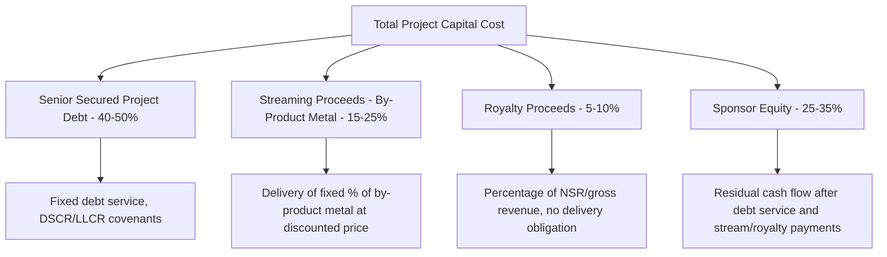
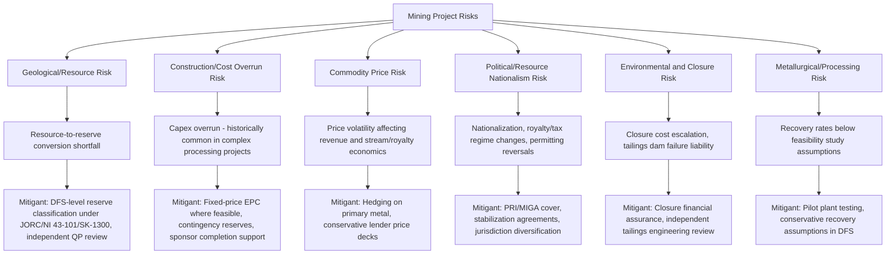

## Mining Project Finance and Streaming or Royalty Structures

### Overview and Sector Context

Mining project finance funds the exploration, development, construction, and operation of mineral extraction projects — base metals (copper, zinc, nickel), precious metals (gold, silver), bulk commodities (iron ore, coal), and battery/critical minerals (lithium, cobalt, rare earths). Like upstream oil and gas, mining projects are exposed to subsurface/geological uncertainty and commodity price volatility, but mining introduces distinct financing instruments not typically seen in the hydrocarbon sector — most notably **streaming and royalty finance**, which have become a dominant non-dilutive capital source, particularly for mid-cap and junior miners.

Mining projects are also distinguished by generally **longer development timelines** (often 10+ years from discovery to production, driven by permitting and feasibility study cycles), **higher capital intensity per unit of eventual output** in many hard-rock contexts, and **jurisdiction-specific resource nationalism risk** that varies significantly by country.

### Project Lifecycle and Financing Stages

**1. Exploration**

- Funded almost exclusively by equity (junior mining company share issuances), flow-through shares (in tax-advantaged jurisdictions like Canada), or exploration joint ventures
- Not financeable by traditional project debt due to binary geological risk

**2. Resource Definition / Feasibility Studies**

- Progression through **Scoping Study → Preliminary Economic Assessment (PEA) → Pre-Feasibility Study (PFS) → Definitive/Bankable Feasibility Study (DFS/BFS)**
- The **Bankable Feasibility Study** is the key technical/economic document lenders rely upon for project debt decisions — it must demonstrate reserves (not just resources), a defined mine plan, capital and operating cost estimates, and project economics to an investment-grade standard
- Resource classification under codes such as **JORC (Australia)**, **NI 43-101 (Canada)**, or **SK-1300 (US)** governs how geological confidence is reported and is central to lender technical due diligence

**3. Construction / Development**

- Highest capital intensity phase; financed via a blend of equity, project debt, streaming/royalty proceeds, and sometimes offtake prepayments
- Sponsor completion support is standard until defined completion tests are met (similar to other extractive project finance)

**4. Production/Operations**

- Cash flow generation; debt service, stream/royalty deliveries, and reinvestment in sustaining/expansion capital begin
- Refinancing opportunities emerge once operational track record is established (lower risk premium)

**5. Closure and Reclamation**

- Mine closure, rehabilitation, and long-term environmental monitoring obligations
- Increasingly requires upfront financial assurance (bonds, trusts, or letters of credit) mandated by regulators

### Traditional Project Finance Debt Structures

**1. Senior Secured Project Finance Debt**

- Non-recourse or limited-recourse loans secured against the mine's assets, offtake contracts, and equity pledges
- Sized against a base-case cash flow model built on the DFS, typically using **proved and probable (P&P) reserves only** (not resources), consistent with the conservative reserve-based logic seen in upstream oil and gas
- Debt tenor generally shorter than total mine life, preserving a "reserve tail" analogous to upstream RBL structures

**2. Completion Guarantees**

- Sponsors typically provide full or partial completion guarantees during construction (cost overrun support, cash deficiency support) that fall away once independent technical completion tests are satisfied (e.g., sustained production at a specified percentage of design capacity for a specified period)

**3. Cost Overrun and Contingent Equity Facilities**

- Given mining's historical tendency toward capital cost overruns (well-documented across the sector for complex processing/metallurgical projects), lenders frequently require standby equity or cost overrun facilities beyond the base construction budget

**4. Multilateral and Export Credit Agency Support**

- IFC, MIGA, and various ECAs participate in mining project finance, particularly in emerging markets, both for direct lending and political risk insurance
- ECA involvement often tied to procurement of processing equipment, mining fleet, or EPC services from the ECA's home country

**5. Offtake-Linked Prepayment Financing**

- Commodity trading houses or end-users (smelters, refiners) provide upfront prepayment in exchange for a contracted supply of future concentrate/metal production, functioning economically similar to debt but structured as a sales contract

### Streaming Finance

**Structure:**

- A streaming company (e.g., Wheaton Precious Metals, Royal Gold, Franco-Nevada) provides an **upfront cash payment** to the mining company in exchange for the right to purchase a fixed percentage of a specific metal's future production (typically a **by-product metal** like silver or gold from a base-metal mine) at a **fixed, deeply discounted price** (e.g., $400–450/oz for gold regardless of prevailing spot price, subject to periodic escalation)
- The streaming company takes on **price upside exposure** on the streamed metal, while the miner receives non-dilutive upfront capital plus the discounted "cash cost" it will continue to receive on each ounce delivered

**Key characteristics:**

- Streams are typically structured as **purchase agreements**, not debt — this means they generally do not appear as debt on the miner's balance sheet under most accounting frameworks (though specific accounting treatment depends on applicable standards and deal terms) [Unverified: exact accounting classification depends on the specific accounting standard applied — IFRS vs. US GAAP — and the precise contractual terms; consult applicable accounting guidance]
- Because streams are typically attached to by-product metals (e.g., a silver stream on a copper mine), they do not dilute the miner's exposure to its primary commodity
- Common in the gold/silver space, where major streaming companies have built large portfolios diversified across many mines and operators, reducing single-asset risk

**Illustrative economics:**

- Upfront deposit: e.g., $150 million for the right to purchase 20% of gold production
- Ongoing payment: $450/oz (fixed) per ounce delivered under the stream, versus a market price that may be $2,000+/oz
- The streaming company's return derives from: (a) recovering the upfront deposit through delivered ounces at the discounted price over time, and (b) the spread between the fixed delivery price and spot price on all ounces delivered after deposit recovery

### Royalty Finance

**Structure:**

- A royalty company provides upfront capital in exchange for a **percentage of revenue or profit** from a mine's production, without any obligation to purchase or take delivery of physical metal
- Common royalty types:
  - **Gross Revenue Royalty (GRR)**: percentage of gross revenue, regardless of costs
  - **Net Smelter Return (NSR)**: percentage of revenue after smelting/refining/transport deductions — the most common royalty structure in mining
  - **Net Profits Interest (NPI)**: percentage of profit after operating costs are deducted — rarer, as it exposes the royalty holder to operating cost risk

**Key characteristics:**

- Royalties are simpler instruments than streams (no requirement to market/sell physical metal), and are purely a claim on a percentage of revenue/profit
- Often originate from historical transactions (e.g., a prior landowner or exploration company retaining a royalty when selling a claim) rather than being purpose-built financing instruments, though purpose-built royalty financings for development capital are also common
- NSR royalties in the 1–3% range are typical for a single transaction, though rates vary significantly by negotiation, jurisdiction, and asset quality

### Streaming vs. Royalty vs. Traditional Debt — Comparative Framework

| Feature | Traditional Project Debt | Streaming | Royalty |
| --- | --- | --- | --- |
| **Balance sheet treatment** | Debt (increases leverage) | Often off-balance-sheet as a purchase obligation [Unverified: standard/deal dependent] | Typically not treated as debt |
| **Repayment obligation** | Fixed principal + interest schedule | Delivery of physical metal at fixed price | Percentage of revenue/profit, no fixed repayment |
| **Commodity price exposure to financier** | None (fixed debt service) | Yes — financier benefits from price upside on streamed metal | Yes — financier's return scales with revenue |
| **Dilution to sponsor equity** | None | None | None |
| **Covenants** | Extensive (DSCR, LLCR, negative pledges) | Generally lighter; production/completion covenants | Generally lightest; minimal operational covenants |
| **Typical use case** | Base capital structure layer | Supplement to debt, especially for by-product metals | Supplement to debt or acquisition of legacy interests |
| **Cost of capital (approximate, illustrative)** | Lowest (senior secured) | Mid-to-high (reflects commodity price participation) | Mid-to-high (reflects revenue participation) |

[Inference] Streaming and royalty finance are frequently used as a **complement to, rather than a substitute for**, senior project debt in a layered capital structure — combining senior debt, streaming/royalty proceeds, and equity allows sponsors to reduce dilution while maintaining a manageable fixed debt service burden, though the optimal mix depends on the specific project's commodity composition, jurisdiction, and sponsor credit profile.

### Layered Capital Structure — Illustrative Diagram

### Key Financial Metrics

| Metric | Formula / Definition | Purpose |
| --- | --- | --- |
| **Debt Service Coverage Ratio (DSCR)** | CFADS / Debt Service | Period-by-period debt service capacity |
| **Loan Life Coverage Ratio (LLCR)** | NPV(CFADS over loan life) / Outstanding Debt | Coverage across remaining loan tenor |
| **Reserve Tail Ratio** | Reserves remaining post-loan-maturity / Total reserves | Buffer beyond debt repayment, analogous to upstream RBL |
| **All-In Sustaining Cost (AISC)** | Cash costs + sustaining capex + G&A (per oz or per tonne) | Standard mining cost benchmark, drives breakeven price |
| **NSR Royalty Burden** | Sum of all NSR percentages encumbering the asset | Cumulative revenue claims against the project prior to operating costs |
| **Payback Period on Stream/Royalty Deposit** | Upfront deposit / Annual net cash benefit to streaming company | Financier's return timeline |
| **Net Asset Value (NAV) per share** | DCF of project cash flows attributable to equity, per share | Core mining equity valuation metric |

### Worked Example: Simplified Streaming Deal Economics

Assume a copper mine with a silver by-product stream:

- Streaming deposit: $120 million upfront
- Stream percentage: 25% of silver production
- Fixed delivery price: $5.00/oz (versus assumed market price of $28/oz)
- Annual silver production (mine-wide): 2,000,000 oz
- Streamed volume: 500,000 oz/year (25%)

**Step 1 — Annual cash received by miner from stream deliveries:**

$$500{,}000 \times 5.00 = \$2.5\text{ million/year (ongoing cash inflow to miner)}$$

**Step 2 — Value delivered to streaming company per year (at spot):**

$$500{,}000 \times 28.00 = \$14.0\text{ million (gross value received by streaming company)}$$

**Step 3 — Streaming company's net margin per year (illustrative, ignoring time value):**

$$14{,}000{,}000 - 2{,}500{,}000 = \$11.5\text{ million/year}$$

**Step 4 — Approximate simple payback period on the $120 million deposit:**

$$\dfrac{120{,}000{,}000}{11{,}500{,}000} \approx 10.4 \text{ years}$$

This illustrates why streaming economics are highly sensitive to the underlying commodity price assumption — a lower silver price materially extends the streaming company's payback period, while a higher price accelerates returns. [Inference] This is a simplified undiscounted illustration; actual streaming deal valuations use full discounted cash flow analysis incorporating price deck assumptions, mine life, escalation clauses in the delivery price, and the time value of the upfront deposit, and would differ materially from this simplified payback calculation.

### Risk Allocation Diagram

### Common Modeling Pitfalls

- Sizing debt off resources rather than reserves (P&P), overstating financeable cash flow
- Failing to layer streaming/royalty obligations correctly into the cash flow waterfall — stream deliveries and royalty payments are typically senior to sponsor distributions but their treatment relative to debt service varies by deal structure
- Ignoring cumulative NSR royalty burden when multiple royalties encumber the same asset (royalty stacking can materially affect project economics)
- Underestimating capital cost contingency for complex metallurgical or processing circuits, a recurring source of overrun in the sector
- Failing to model price escalation clauses embedded in some stream delivery price agreements
- Treating closure/reclamation liabilities as a terminal-year cost rather than progressively accruing them across the mine life

**Related Topics:**

- Upstream Oil and Gas Project Finance (Reserve-Based Lending Comparison)
- JORC / NI 43-101 / SK-1300 Reserve and Resource Classification Standards
- Political Risk Insurance and MIGA Coverage for Extractive Projects
- Offtake Prepayment Financing Structures
- Mine Closure Financial Assurance and Reclamation Trusts
- Tailings Dam Risk and Independent Engineering Review
- Junior Mining Company Equity Financing (Flow-Through Shares)
- Net Smelter Return (NSR) Royalty Structuring and Negotiation
- Critical Minerals and Battery Metals Project Finance
- Cost Overrun and Contingent Equity Support Facilities in Extractive Project Finance