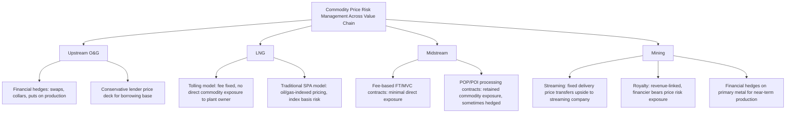

## Commodity Price Risk and Offtake Hedging

### Overview and Context

Commodity price risk is the exposure of a natural resource project's revenue, and therefore its debt-servicing capacity, to fluctuations in the market price of the commodity it produces (oil, gas, metals, coal). Unlike contracted infrastructure or power assets with fixed-price offtake, extractive projects are frequently exposed — partially or fully — to unhedged market pricing, making commodity price risk one of the central credit considerations in oil, gas, and mining project finance.

This topic sits across the entire chapter: it directly determines the bankability of upstream reserve-based lending (borrowing base price decks), shapes which LNG/midstream structures are financeable (contracted tolling vs. merchant exposure), and drives the economics of mining streaming and royalty deals. Lenders manage this risk through a combination of **conservative pricing assumptions in financial models**, **mandatory hedging programs**, and **structural mitigants** embedded in financing documentation.

### Sources of Commodity Price Risk

| Risk Type | Description |
| --- | --- |
| **Outright/Flat Price Risk** | Exposure to the general level of benchmark prices (WTI, Brent, Henry Hub, gold spot, copper LME) |
| **Basis/Differential Risk** | Spread between the benchmark price and the actual realized price at the point of sale (e.g., wellhead netback vs. Henry Hub, or regional crude differentials) |
| **Quality/Grade Risk** | Price adjustments for product quality differing from the benchmark grade (e.g., sulfur content, API gravity, ore grade/purity) |
| **Timing/Curve Risk** | Exposure to contango/backwardation and timing mismatches between production and hedge settlement |
| **Currency Risk (compounding factor)** | Many commodities are priced in USD while costs are incurred in local currency, creating a secondary FX exposure layered on top of price risk |
| **Volume/Price Correlation Risk** | In some contexts, low prices coincide with reduced production economics (e.g., marginal wells shut in), compounding revenue impact beyond the price effect alone |

### Why This Risk Matters for Financeability

Lenders in extractive project finance generally cannot rely on the sponsor's own price forecasts, since sponsors are structurally incentivized toward optimistic assumptions. Instead, financeability hinges on:

1. **Conservative price decks**: Independent or syndicate-consensus price assumptions used to size debt (as seen in upstream RBL borrowing base calculations), typically set below the forward curve or market consensus
2. **Contractual risk transfer**: Structures that shift price risk away from the project entirely (e.g., LNG tolling agreements, fixed-price offtake contracts, streaming agreements with fixed delivery prices)
3. **Hedging programs**: Financial derivatives that lock in or floor prices for a defined portion of forecast production, directly required as a condition precedent or ongoing covenant in many facilities

### Hedging Instruments

**1. Fixed-Price Swaps**

- The producer sells (and the counterparty buys) a fixed price for a defined volume over a defined period, regardless of the prevailing market price
- Fully removes price volatility on the hedged volume in both directions — the producer gives up upside in exchange for certainty
- Common in oil and gas RBL facilities where lenders require certainty for early-year cash flows most critical to debt service

**2. Costless Collars**

- Simultaneous purchase of a put option (price floor) and sale of a call option (price ceiling), structured so premiums offset (net zero upfront cost)
- Producer retains upside between the floor and ceiling but sacrifices upside above the ceiling in exchange for downside protection below the floor
- Popular in upstream RBL because it preserves some price participation while satisfying lender floor requirements

**3. Purchased Puts (Floors)**

- Outright purchase of a put option, providing a price floor with full retained upside above the floor, at the cost of an upfront premium
- More expensive than swaps or collars but preferred by producers wanting to preserve upside exposure, subject to lender acceptance of the premium cost

**4. Three-Way Collars**

- A collar structure combined with a sold put at a lower strike (below the floor), reducing the net premium cost of the floor in exchange for capping downside protection below the second strike
- Introduces residual uncertainty below the second strike, generally requiring careful lender scrutiny before acceptance as a compliant hedge

**5. Basis Swaps**

- Hedge specifically the spread between a benchmark price and the actual realized/delivered price (e.g., regional gas basis, crude quality differentials), addressing basis risk separately from outright price risk

**6. Fixed-Price Physical Offtake Contracts**

- Rather than a financial derivative, the project sells production under a long-term contract at a fixed or formula-based price directly to a buyer — economically achieves similar risk transfer to a swap but is a physical sales contract rather than a financial instrument (relevant in some LNG SPA and mining concentrate offtake structures)

### Typical Lender Hedging Requirements (Illustrative)

| Requirement | Typical Range |
| --- | --- |
| **Minimum hedge coverage, Years 1–2** | 50–75% of forecast production/reserves |
| **Minimum hedge coverage, Years 3–5** | 25–50%, tapering |
| **Hedge counterparty rating requirement** | Investment grade, or secured/collateralized if below |
| **Hedge tenor vs. loan tenor** | Hedges typically required to extend through at least the early amortization period |
| **Hedge security ranking** | Frequently pari passu with senior secured debt, secured under the same collateral package |

[Inference] Specific hedge coverage percentages and tenor requirements vary considerably by facility, lender group risk appetite, commodity type, and prevailing market conditions at the time of financing; the ranges shown are illustrative of typical market practice rather than fixed industry standards.

### Hedging Structures Across the Chapter's Sub-Sectors

### Key Financial and Risk Metrics

| Metric | Purpose |
| --- | --- |
| **Hedge Coverage Ratio** | Percentage of forecast production/revenue hedged in a given period |
| **Mark-to-Market (MTM) Exposure** | Current value of outstanding hedge positions; affects collateral posting requirements |
| **Value-at-Risk (VaR)** | Statistical measure of potential portfolio loss from price movements over a defined horizon and confidence interval |
| **Breakeven Price** | Commodity price at which project cash flow equals zero or DSCR equals 1.0x — central stress-test metric |
| **Price Deck Sensitivity** | DSCR/LLCR outcomes modeled across a range of price scenarios (base, downside, upside) |
| **Basis Differential** | Spread between benchmark and realized price, tracked separately from outright price movements |

### Worked Example: Costless Collar Economics

Assume a producer hedges 60% of forecast annual oil production (600,000 bbl of a 1,000,000 bbl total) using a costless collar:

- Floor (put strike): $60/bbl
- Ceiling (call strike): $78/bbl
- Unhedged volume: 400,000 bbl at market price

**Scenario A — Market price falls to $45/bbl:**

- Hedged volume settles at the floor: $600{,}000 \times 60 = \$36{,}000{,}000$
- Unhedged volume at market: $400{,}000 \times 45 = \$18{,}000{,}000$
- Total revenue: $36{,}000{,}000 + 18{,}000{,}000 = \$54{,}000{,}000$
- Without the hedge, total revenue would have been $1{,}000{,}000 \times 45 = \$45{,}000{,}000$ — the collar added $9 million of protection

**Scenario B — Market price rises to $90/bbl:**

- Hedged volume capped at the ceiling: $600{,}000 \times 78 = \$46{,}800{,}000$
- Unhedged volume at market: $400{,}000 \times 90 = \$36{,}000{,}000$
- Total revenue: $46{,}800{,}000 + 36{,}000{,}000 = \$82{,}800{,}000$
- Without the hedge, total revenue would have been $1{,}000{,}000 \times 90 = \$90{,}000{,}000$ — the collar cost $7.2 million of forgone upside

This illustrates the fundamental trade-off in collar structures: downside protection is purchased at the cost of capped upside, with the net benefit depending on where actual prices land relative to the strikes. [Inference] Real-world collar economics also incorporate any residual premium cost if the structure is not perfectly "costless," transaction costs, and counterparty credit terms, which are omitted from this simplified illustration.

### Structural and Non-Derivative Mitigants

Beyond financial derivatives, projects and lenders use structural mechanisms to manage price risk:

- **Cash sweep mechanisms**: Excess cash flow in high-price periods is used to accelerate debt repayment, building headroom against future downside
- **Debt Service Reserve Accounts (DSRA)**: Cash buffers sized to cover multiple periods of debt service, providing a cushion during price downturns
- **Cash flow waterfalls with price-triggered distribution restrictions**: Distributions to sponsors are restricted or suspended if price/coverage ratios fall below defined thresholds
- **Contract-based risk transfer**: As detailed elsewhere in this chapter, tolling agreements (LNG), fee-based contracts (midstream), and fixed-price streams (mining) structurally remove price risk from project cash flow rather than hedging it financially
- **Price participation/royalty structures on the upside**: Some financing arrangements include sponsor upside-sharing mechanisms (e.g., net profits interests, price-linked royalty step-ups) to balance downside protection given to financiers with some upside participation

### Common Modeling and Risk Management Pitfalls

- Using a single flat price assumption instead of stress-testing across a full price scenario range (base, P10/P90 downside/upside)
- Failing to distinguish basis risk from outright price risk, leading to under-hedged net realized price exposure even when outright price hedges are in place
- Over-hedging relative to actual proved production estimates, creating "naked" short exposure if reserves underperform (a hedge on unproduced volumes becomes a genuine derivative loss exposure, not just an opportunity cost)
- Ignoring hedge counterparty credit risk, particularly in stressed commodity price environments where multiple producers may face simultaneous counterparty stress
- Failing to account for tax and accounting treatment differences between hedge accounting and mark-to-market treatment, which can create earnings volatility even when the economic hedge is effective [Unverified: specific accounting treatment depends on applicable standards (e.g., IFRS 9, ASC 815) and hedge documentation — consult applicable accounting guidance]
- Assuming hedges eliminate all price risk rather than shifting/capping it — collars and basis swaps in particular leave residual exposure that must be separately stress-tested

**Related Topics:**

- Upstream Oil and Gas Project Finance (Borrowing Base Price Decks)
- LNG Project Finance Structures (Tolling vs. Indexed Pricing Models)
- Midstream Pipeline Financing (Percent-of-Proceeds Exposure)
- Mining Project Finance and Streaming or Royalty Structures
- Derivative Accounting and Hedge Effectiveness Treatment (IFRS 9 / ASC 815)
- Value-at-Risk and Commodity Portfolio Risk Management
- Political Risk Insurance and Structural Credit Enhancement in Extractive Finance
- Cash Flow Waterfall Design and Distribution Lock-Up Mechanisms
- Basis Differential Risk in Regional Energy Markets