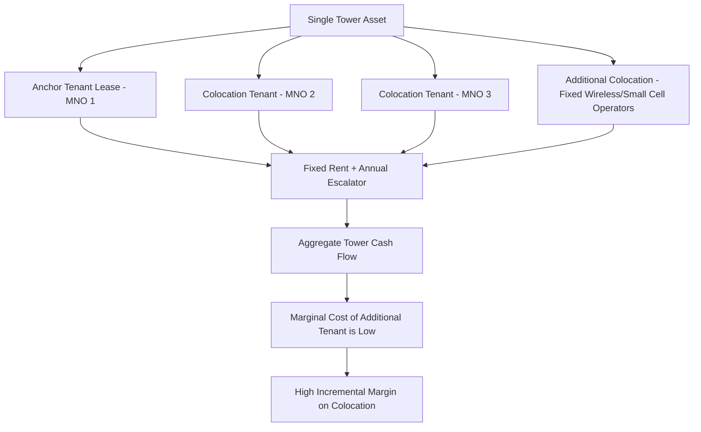
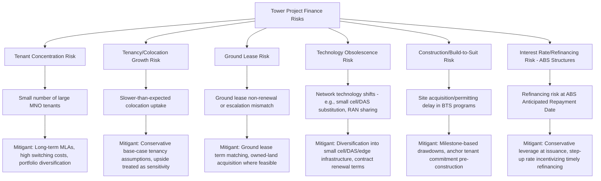
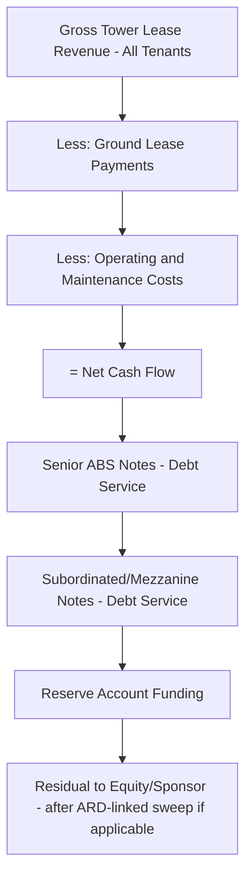

## Telecommunications Tower Project Finance

### Overview and Sector Context

Telecommunications tower project finance funds the acquisition, construction, and operation of passive wireless infrastructure — towers, rooftop sites, and increasingly small cells and distributed antenna systems (DAS) — that mobile network operators (MNOs) lease space on to mount antennas and equipment. Towers are a distinctive asset class within digital infrastructure finance because they generate highly predictable, long-duration, contracted cash flows from **tenant leases**, giving them financing characteristics closer to real estate/infrastructure than to technology assets.

The sector's dominant global structural trend has been the **separation of tower ownership from network operations**: MNOs increasingly sell or lease out their tower portfolios to independent tower companies ("TowerCos") to free up capital and focus on network/service operations, while TowerCos monetize the same physical asset across multiple tenants — a structural dynamic that directly drives the financing economics described below.

### The TowerCo Business Model

**Core revenue driver — Tenancy and Colocation:**

- A tower's economics are driven by the number of tenants sharing the same structure (colocation), since the marginal cost of adding a second or third tenant to an existing tower is low relative to the incremental lease revenue
- **Tenancy ratio** (average number of tenants per tower) is the single most important operating metric in the sector — rising from a single "anchor tenant" toward 2, 3, or more tenants materially improves margins on the same fixed asset base
- Master Lease Agreements (MLAs) with MNOs typically include:
  - Long initial terms (5–10 years) with multiple renewal options extending effective tenor to 20–30 years
  - Fixed annual escalators (e.g., 2–3% per year, or CPI-linked in some markets)
  - Amendment fees and additional charges when tenants add equipment or increase power/space usage

**Revenue Model Diagram:**

### Financing Structures

**1. Corporate/Portfolio-Level Financing (Public TowerCos)**

- Large publicly listed TowerCos (e.g., American Tower, Crown Castle, SBA Communications globally; similar listed and unlisted players in other regions) primarily raise capital via:
  - Investment-grade senior unsecured notes
  - Revolving credit facilities
  - Occasionally structured as REITs (Real Estate Investment Trusts) in jurisdictions where tax treatment favors this structure, requiring high distribution of taxable income to shareholders
- Financing is generally **corporate-style**, leveraging the diversified, granular nature of thousands of individual tower leases rather than financing single assets

**2. Asset-Backed Securitization (ABS)**

- A distinctive and widely used structure in the tower sector: a portfolio of tower sites and their associated lease cash flows is transferred to a special purpose vehicle (SPV), which issues asset-backed notes to capital markets investors
- Tower ABS is attractive because the underlying cash flows (long-term contracted MNO leases across thousands of granular sites) are highly diversified and predictable, supporting investment-grade ratings even for issuers with sub-investment-grade corporate credit
- Typically structured with multiple tranches (senior/subordinated) and an "anticipated repayment date" (ARD) mechanism — similar to CMBS structures — where a step-up in interest rate incentivizes refinancing by a target date, distinct from the notes' legal final maturity

**3. Project Finance for Greenfield Build-to-Suit Programs**

- Where a TowerCo commits to build a defined pipeline of new towers under a Build-to-Suit (BTS) agreement with an anchor MNO, financing may be structured with:
  - Construction facility sized against the contracted anchor tenant lease revenue and a build-out completion schedule
  - Conversion to a term facility upon completion, similar to project finance conversion structures in other infrastructure sectors
  - Draw-down mechanics tied to individual site completion milestones rather than a single completion date, given the multi-site nature of BTS programs

**4. Sale-and-Leaseback / Carve-Out Financing (MNO Tower Monetization)**

- When an MNO sells its tower portfolio to a TowerCo (or a newly formed JV), the transaction is often financed via:
  - Acquisition debt raised by the TowerCo/acquiring entity, secured against the acquired lease cash flows
  - A simultaneous long-term Master Lease Agreement whereby the selling MNO becomes the anchor tenant, ensuring immediate contracted revenue for the new owner
- This structure allows the MNO to monetize a non-core asset (extracting capital for network investment) while the TowerCo/financial sponsor acquires a long-duration, contracted infrastructure cash flow stream

**5. Private Equity and Infrastructure Fund Ownership**

- Independent (non-listed) TowerCos are frequently owned by infrastructure funds, pension funds, and private equity, using leveraged acquisition structures similar to other infrastructure buyouts
- Debt sized against portfolio-level tenancy ratios, lease escalators, and MNO counterparty credit quality

### Key Financial and Operating Metrics

| Metric | Formula / Definition | Purpose |
| --- | --- | --- |
| **Tenancy Ratio** | Total tenant leases / Total towers | Core operating efficiency and margin driver |
| **Same-Tower/Organic Revenue Growth** | Revenue growth from existing towers (escalators + new colocation), excluding acquisitions | Underlying growth quality metric |
| **Adjusted EBITDA Margin** | EBITDA / Revenue | Profitability benchmark; typically high (60%+) for mature tower portfolios due to low incremental colocation costs |
| **Debt Service Coverage Ratio (DSCR)** | CFADS / Debt Service | Applied at both corporate and ABS tranche levels |
| **Weighted Average Lease Term (WALT)** | Revenue-weighted remaining lease term across the portfolio | Indicates cash flow durability, similar in logic to WACL in midstream financing |
| **Net Debt / EBITDA (Leverage Ratio)** | Total net debt / Adjusted EBITDA | Standard leverage benchmark; tower companies often carry higher leverage multiples than typical corporates given cash flow predictability |
| **AFFO (Adjusted Funds From Operations)** | Common REIT-structure metric: cash flow available for distribution after maintenance capex | Distribution capacity metric, analogous to DCF in MLP structures |

### Lease and Counterparty Considerations

- **Anchor tenant credit quality**: Since MNOs are typically large, often investment-grade or quasi-sovereign-backed telecom operators, counterparty credit risk is generally lower than in less consolidated sectors, though this varies significantly by market (emerging market MNO credit quality can differ materially from developed market operators)
- **Lease renewal and churn risk**: While towers benefit from high switching costs (relocating antennas is disruptive and costly for an MNO), technology shifts (e.g., network consolidation, RAN sharing agreements between MNOs) can reduce tenancy over time in some scenarios
- **Ground lease risk**: TowerCos frequently do not own the underlying land outright but hold long-term ground leases; a mismatch between ground lease tenor and tenant lease tenor (or ground lease escalation clauses) introduces a distinct risk layer requiring careful matching in financial models

### Risk Allocation Diagram

### Illustrative Cash Flow Waterfall (ABS Structure)

### Worked Example: Simplified Tower Portfolio Debt Sizing

Assume a portfolio of 5,000 towers to be securitized:

- Average tenancy ratio: 1.8 tenants/tower
- Average annual lease revenue per tenancy: $14,000
- Ground lease cost: 20% of gross revenue
- Operating costs: 15% of gross revenue
- Target minimum DSCR (senior notes): 1.50x
- Assumed senior note coupon: 4.75%, 10-year anticipated repayment date

**Step 1 — Gross annual lease revenue:**

$$5{,}000 \times 1.8 \times 14{,}000 = \$126{,}000{,}000$$

**Step 2 — Less ground lease costs (20%):**

$$126{,}000{,}000 \times (1 - 0.20) = \$100{,}800{,}000$$

**Step 3 — Less operating costs (15% of gross revenue):**

$$100{,}800{,}000 - (126{,}000{,}000 \times 0.15) = 100{,}800{,}000 - 18{,}900{,}000 = \$81{,}900{,}000 \text{ (Net Cash Flow / CFADS)}$$

**Step 4 — Maximum annual debt service at 1.50x DSCR:**

$$\dfrac{81{,}900{,}000}{1.50} = \$54.6\text{ million}$$

**Step 5 — Approximate senior note capacity using an annuity approximation over 10 years at 4.75%:**

$$54{,}600{,}000 \times \left(\dfrac{1-(1.0475)^{-10}}{0.0475}\right) \approx 54{,}600{,}000 \times 7.79 \approx \$425.3\text{ million}$$

This approximates the senior tranche capacity supportable by the portfolio's contracted lease cash flow at issuance, before layering any subordinated/mezzanine tranches. [Inference] This is a simplified single-block annuity approximation; actual tower ABS transactions size debt using granular, tenant-by-tenant amortization schedules, escalator timing, and rating-agency-specific stress assumptions on tenancy churn and colocation growth, which will produce materially different results than this simplified illustration.

### Common Modeling Pitfalls

- Assuming static tenancy ratios rather than modeling gradual colocation growth (or, conversely, over-optimistic colocation growth assumptions not supported by market saturation levels)
- Mismatching ground lease escalation/renewal terms against tenant lease assumptions, understating long-term margin compression risk
- Ignoring anticipated repayment date (ARD) step-up mechanics in ABS structures — legal final maturity is typically much longer than the ARD, and models should reflect refinancing risk at the ARD rather than assuming automatic amortization to the legal maturity
- Failing to differentiate between contracted escalator-driven revenue growth (highly predictable) and new colocation revenue growth (less certain), applying an undifferentiated blended growth rate
- Overlooking counterparty concentration risk when a small number of MNOs represent a large share of portfolio revenue in a given market

**Related Topics:**

- Data Center Project Finance (Comparative Contracted Infrastructure Model)
- Fiber Network and Broadband Infrastructure Financing
- Asset-Backed Securitization (ABS) Structuring Fundamentals
- REIT Structures in Digital Infrastructure Finance
- Small Cell and Distributed Antenna System (DAS) Financing
- Infrastructure Fund and Private Equity Acquisition Financing
- Sale-and-Leaseback Structures Across Infrastructure Sectors
- Midstream Pipeline Financing (Fee-Based Contract Structure Comparison)
- Ground Lease Risk Management in Real Asset Financing
- Emerging Markets Telecom Infrastructure and Political Risk Considerations