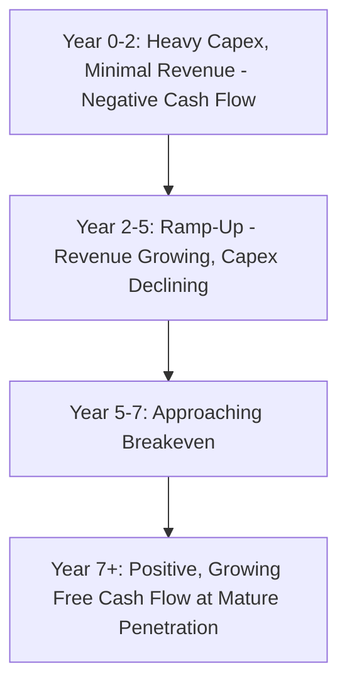
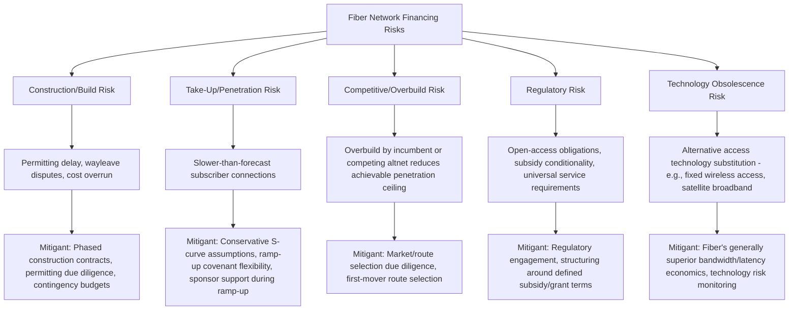

## Fiber and Broadband Network Financing

### Overview and Sector Context

Fiber and broadband network financing funds the deployment of fixed-line telecommunications infrastructure — Fiber-to-the-Home/Premises (FTTH/FTTP), Fiber-to-the-Cabinet/Node (FTTC/FTTN), and associated backhaul/middle-mile networks — that deliver fixed broadband connectivity to residential and business end-users. Unlike towers (which lease space to a small number of large, creditworthy MNO tenants), fiber networks derive revenue from **granular retail or wholesale subscriber take-up**, introducing a materially different and generally higher-risk financing profile centered on **build risk, take-up (penetration) risk, and churn risk**.

Fiber financing has grown into a major digital infrastructure asset class as governments and private capital pursue broadband expansion (rural/underserved area builds, national gigabit targets, and urban overbuild competition), often financed via project finance structures analogous to greenfield infrastructure development.

### Fiber Network Business Models

**1. Retail/Vertically Integrated Model**

- A single operator builds the network and sells broadband/TV/voice services directly to end-users
- Revenue is fully exposed to retail take-up rates, competitive dynamics, and average revenue per user (ARPU) trends
- Most common among incumbent telecom operators and some challenger/altnet builders

**2. Wholesale/Open-Access Model**

- The network owner (NetCo) builds and operates passive/active infrastructure but does not sell retail services directly; instead, it leases capacity to multiple retail service providers (ISPs) on a wholesale basis
- Revenue is typically structured as a fixed **wholesale access fee per connected/activated line**, sometimes with minimum revenue guarantees from anchor wholesale customers
- This model is generally more financeable via project finance because it reduces retail marketing/churn risk exposure for the NetCo and can attract multiple ISPs to drive penetration, though the NetCo still bears the underlying take-up risk if wholesale fees are volume-linked rather than fully guaranteed

**3. Hybrid Models**

- A vertically integrated operator opens its network to third-party wholesale access alongside its own retail service (common in regulated markets with open-access obligations), blending both revenue streams

### Fiber Project Lifecycle and Risk Phases

- **Planning/Permitting**: Wayleave/right-of-way approvals, local authority permits — a frequent source of delay, particularly in urban and regulated environments
- **Construction**: Capital-intensive trenching/ducting or aerial deployment; homes passed (HP) is the key build metric
- **Ramp-Up**: The critical risk phase — actual subscriber connections (homes connected/activated) build toward a target penetration rate over several years post-passing; this phase carries the highest financing risk because revenue lags capital deployment
- **Mature Operations**: Penetration stabilizes, cash flow becomes more predictable, refinancing at lower risk premiums becomes possible

### Key Operating Metrics

| Metric | Definition | Significance |
| --- | --- | --- |
| **Homes Passed (HP)** | Number of premises the network physically reaches (construction completed) | Core build progress metric |
| **Homes Connected / Activated** | Number of premises with an active service | Numerator for penetration |
| **Penetration Rate** | Homes Connected ÷ Homes Passed | Core commercial success metric; directly drives revenue |
| **ARPU (Average Revenue Per User)** | Total service revenue ÷ Average connected subscribers | Revenue-per-subscriber benchmark |
| **Churn Rate** | Percentage of subscribers disconnecting per period | Retention/revenue durability metric |
| **Cost per Home Passed ($/HP)** | Total build capex ÷ Homes passed | Capital efficiency benchmark, varies significantly by density (urban vs. rural) |
| **Cost per Home Connected ($/HC)** | Total capex + connection costs ÷ Homes connected | All-in unit economics once take-up is achieved |
| **Payback per Subscriber** | Time for cumulative ARPU (net of opex) to recover cost per home connected | Underlying unit economics driver |

[Inference] Penetration rate curves are typically modeled using S-curve assumptions (slow initial uptake, accelerating mid-phase adoption, plateauing at a mature penetration ceiling), reflecting typical broadband adoption patterns observed across many fiber deployments; the specific shape and ceiling assumed vary significantly by market, competitive intensity, and demographic factors, and lenders generally stress-test these curves conservatively.

### Financing Structures

**1. Project Finance (Limited-Recourse Greenfield Build)**

- Predominant structure for large-scale altnet (alternative network operator) and national broadband builds
- Structured in phases: a **construction/ramp-up facility** during the build and initial take-up period, converting to a **term facility** once a defined completion and/or penetration threshold is achieved
- Because revenue lags capex significantly during ramp-up, facilities typically feature:
  - Extended interest-only or capitalizing-interest periods during construction/ramp-up
  - Covenant step-downs or "ramp-up covenants" that are looser in early years and tighten as penetration matures
  - Equity/sponsor support commitments to cover ramp-up cash flow shortfalls before term conversion

**2. Vendor Financing and Equipment-Linked Facilities**

- Network equipment suppliers (fiber, electronics vendors) sometimes provide financing or extended payment terms tied to procurement contracts, supplementing bank debt

**3. Public-Private Partnership (PPP) / Government-Subsidized Models**

- Governments frequently provide grants, subsidies, or minimum revenue guarantees to support fiber deployment in commercially unviable (rural/remote) areas, improving the bankability of otherwise sub-economic builds
- Structures range from capital grants (reducing debt sizing needs) to availability-style payments contingent on network completion and service standards, and gap-funding models where the private operator bids for the minimum subsidy required to make a route viable

**4. Securitization and Structured Bond Financing**

- Once portfolios reach mature, stabilized penetration, cash flows can be securitized or refinanced via project bonds, similar in logic to tower ABS — pooling multiple network areas/regions to diversify take-up risk across a portfolio rather than relying on a single build

**5. Infrastructure Fund and Private Equity Ownership**

- Large-scale fiber rollouts (particularly altnets in competitive fiber overbuild markets) are frequently backed by infrastructure funds and private equity providing both equity and structuring expertise, given the multi-year J-curve of capital deployment before positive cash flow is achieved

**6. Wholesale Anchor Tenant / Minimum Revenue Guarantee Structures**

- In open-access models, a long-term wholesale agreement with an anchor ISP (sometimes including minimum revenue commitments) can substantially de-risk the financing, functioning similarly in credit logic to an anchor tenant lease in tower financing or an MVC in midstream gathering agreements

### Illustrative Cash Flow Profile — The "J-Curve"

This J-curve profile is the central financing challenge in greenfield fiber: debt structuring must accommodate a multi-year period of negative or minimal free cash flow before the asset becomes self-sustaining, requiring either patient capital, subsidized support, or robust sponsor equity commitments through the ramp-up period.

### Key Financial Metrics for Debt Sizing

| Metric | Purpose |
| --- | --- |
| **DSCR (during ramp-up vs. mature phase)** | Often modeled and covenanted separately for each phase, given the different risk/cash flow profile |
| **Loan Life Coverage Ratio (LLCR)** | NPV of projected cash flows over loan life vs. outstanding debt, sensitive to penetration curve assumptions |
| **Cost per Home Passed / Connected** | Capital efficiency benchmarking against comparable builds |
| **Terminal/Mature Penetration Assumption** | Single most sensitive assumption in the financial model; small changes materially affect project NPV and debt capacity |
| **Net Debt / Homes Passed** | Portfolio-level leverage benchmark used by some lenders and rating agencies for fiber/altnet credits |

### Worked Example: Simplified Ramp-Up Sensitivity

Assume a fiber network reaching 500,000 homes passed, with the following assumptions:

- Cost per home passed: $800 (total build capex = $400 million)
- Target mature penetration: 40% (200,000 connections)
- ARPU: $45/month ($540/year)
- Annual opex per connection: $150

**Step 1 — Annual revenue at mature (40%) penetration:**

$$200{,}000 \times 540 = \$108{,}000{,}000$$

**Step 2 — Annual opex at mature penetration:**

$$200{,}000 \times 150 = \$30{,}000{,}000$$

**Step 3 — Approximate mature-state EBITDA:**

$$108{,}000{,}000 - 30{,}000{,}000 = \$78{,}000{,}000$$

**Step 4 — Sensitivity: penetration achieved is only 30% instead of 40% (150,000 connections):**

$$\text{Revenue} = 150{,}000 \times 540 = \$81{,}000{,}000; \quad \text{Opex} = 150{,}000 \times 150 = \$22{,}500{,}000$$

$$\text{EBITDA} = 81{,}000{,}000 - 22{,}500{,}000 = \$58{,}500{,}000$$

A 10-percentage-point penetration shortfall (40% → 30%, a 25% relative reduction in connections) reduces mature-state EBITDA by approximately 25% ($78.0 million → $58.5 million) in this simplified example, illustrating why penetration assumptions are the dominant sensitivity in fiber project economics. [Inference] This simplified example holds ARPU and unit opex constant across penetration scenarios and ignores the timing/ramp-up path to reach mature penetration; actual lender models incorporate year-by-year ramp curves, potential ARPU erosion from competitive response, and the time value of delayed cash flow, which will produce more complex and generally more conservative outcomes than this static illustration.

### Risk Allocation Diagram

### Common Modeling Pitfalls

- Applying overly aggressive penetration curve assumptions not benchmarked against comparable market/demographic precedents
- Treating homes passed as equivalent to revenue-generating connections, rather than explicitly modeling the connection/activation lag
- Underestimating churn in competitive overbuild markets, especially where a second or third fiber network is entering an already-served area
- Failing to differentiate ramp-up-phase covenant structures from mature-phase covenants, leading to technical default risk during an inherently loss-making early build period
- Ignoring competitive overbuild risk in route/market selection, materially reducing achievable mature penetration versus underwriting assumptions
- Underestimating cost-per-home-passed variability across differing terrain, density, and permitting environments, applying a single blended unit cost across heterogeneous build areas

**Related Topics:**

- Telecommunications Tower Project Finance (Comparative Contracted vs. Take-Up Risk Models)
- Data Center Project Finance and Hyperscale Colocation Structures
- Public-Private Partnerships in Broadband and Universal Service Financing
- Asset-Backed Securitization for Mature Digital Infrastructure Portfolios
- Penetration Curve Modeling and S-Curve Adoption Analysis
- Rural Broadband Subsidy and Gap-Funding Mechanisms
- Wholesale Open-Access Network Regulation
- Infrastructure Fund J-Curve Capital Deployment Strategies
- Fixed Wireless Access as a Competing Technology Risk
- Minimum Revenue Guarantee Structures in Greenfield Infrastructure