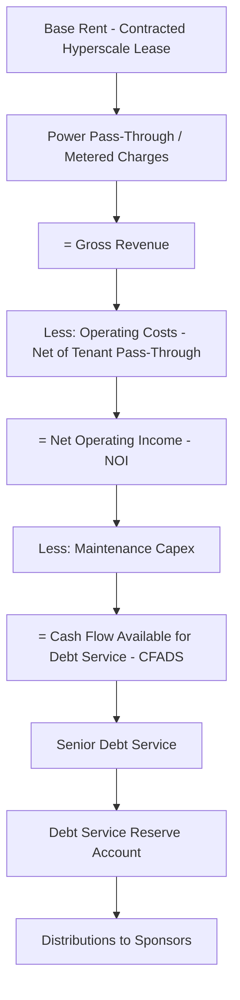
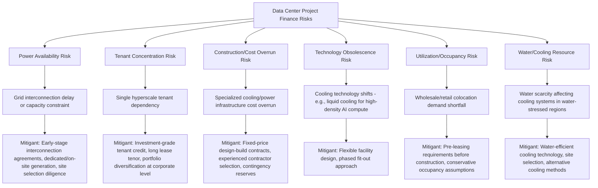

## Data Center Project Finance Fundamentals

### Overview and Sector Context

Data center project finance funds the development and operation of facilities housing servers and IT infrastructure for cloud computing, enterprise colocation, and hyperscale cloud providers. Data centers have become one of the fastest-growing digital infrastructure asset classes, driven by cloud migration, AI/machine learning compute demand, and enterprise IT outsourcing. Structurally, data centers share DNA with both real estate finance (long-life physical structures, land, power infrastructure) and contracted infrastructure finance (long-term lease/service agreements with creditworthy tenants), and increasingly resemble power project finance given the centrality of electricity supply and, in some cases, dedicated generation arrangements to project economics.

The sector's financing logic centers on the **quality and tenor of tenant/customer contracts** — whether hyperscale cloud providers under long-term leases, enterprise colocation customers, or wholesale capacity agreements — combined with growing attention to **power availability and reliability**, which has emerged as a primary constraint and risk factor as compute demand accelerates.

### Data Center Market Segments

| Segment | Description | Typical Tenant/Customer |
| --- | --- | --- |
| **Hyperscale** | Large, often custom-built or build-to-suit facilities dedicated to a single major cloud provider | AWS, Microsoft Azure, Google Cloud, Meta, and similar large-scale operators |
| **Wholesale Colocation** | Large dedicated space/power blocks leased to enterprise or cloud customers, but on a shared campus | Enterprises, mid-size cloud providers |
| **Retail Colocation** | Smaller cabinet/cage space leased to multiple enterprise customers within a shared facility | SMEs, enterprises with lower-scale requirements |
| **Edge Data Centers** | Smaller, distributed facilities located closer to end-users to reduce latency | Content delivery, IoT, localized compute applications |

### Revenue and Contract Structures

**1. Hyperscale Build-to-Suit Leases**

- A hyperscale cloud provider commits to a long-term lease (often 10–15+ years) for a purpose-built facility, sometimes before construction begins
- Structured similarly to a triple-net lease in real estate: tenant typically bears operating costs (or a substantial pass-through), providing highly predictable landlord/developer cash flow
- The single-tenant, investment-grade counterparty nature of hyperscale leases makes this the most financeable segment of the sector, generally supporting the highest leverage and most favorable financing terms

**2. Wholesale Colocation Agreements**

- Customers lease a defined capacity block (measured in megawatts of critical IT load or square footage), typically under 5–10 year agreements with renewal options
- Revenue is often structured with a **base rent for power/space** plus **metered/pass-through charges for actual power consumption**, exposing the operator to some utilization-related revenue variability compared to a pure fixed lease

**3. Retail Colocation**

- Granular, shorter-term agreements (1–3 years) across many smaller customers
- Revenue profile resembles a more operationally intensive, higher-margin-but-higher-churn business, closer to a real estate/hospitality operating model than a pure contracted infrastructure model
- Generally less suited to highly leveraged project finance given greater revenue granularity and churn exposure; more often financed at a corporate/REIT level

**4. Power-Linked and Pass-Through Structures**

- Given the centrality of electricity to data center economics, contracts increasingly specify power cost pass-through mechanisms, and some facilities are financed alongside dedicated power supply arrangements (on-site generation, direct PPAs with renewable generators, or dedicated grid interconnection agreements) — creating structural linkages to power project finance concepts covered elsewhere in project finance practice

### Key Operating and Financial Metrics

| Metric | Definition | Significance |
| --- | --- | --- |
| **Critical IT Load (MW)** | Power capacity available for IT equipment (excluding cooling/overhead losses) | Core capacity/revenue-generating metric |
| **Power Usage Effectiveness (PUE)** | Total facility power ÷ IT equipment power | Efficiency benchmark; lower PUE indicates more efficient cooling/overhead design |
| **Occupancy / Utilization Rate** | Leased or utilized capacity ÷ Total available capacity | Core revenue driver, analogous to occupancy in real estate |
| **Weighted Average Lease Term (WALT)** | Revenue-weighted remaining tenant lease term | Cash flow durability metric, as used in tower/fiber financing |
| **$/kW or $/MW Development Cost** | Total capex ÷ Critical IT load capacity | Capital efficiency benchmark |
| **Net Operating Income (NOI)** | Revenue less direct operating costs (before debt service and corporate overhead) | Core cash flow metric for debt sizing |
| **Cap Rate (for stabilized asset valuation)** | NOI ÷ Asset Value | Valuation benchmark used in acquisition and refinancing contexts |

### Financing Structures

**1. Project Finance for Build-to-Suit Hyperscale Facilities**

- Construction facility sized against the contracted hyperscale lease, converting to a term facility at completion/commencement of the lease term
- Given strong tenant credit quality, these facilities can achieve relatively high leverage and competitive pricing relative to more speculative or multi-tenant colocation developments
- Completion risk (construction cost overrun, delay) remains a key focus during the construction phase, mitigated via fixed-price EPC/design-build contracts and sponsor completion support

**2. Corporate/REIT-Level Financing**

- Large, diversified data center operators (particularly those structured as REITs in applicable jurisdictions) raise capital via:
  - Investment-grade senior unsecured notes
  - Revolving credit facilities
  - Equity issuance (public REIT structures)
- Leverages portfolio diversification across many facilities/tenants rather than single-asset financing, similar in logic to the corporate financing approach used by large listed TowerCos

**3. Sale-and-Leaseback Structures**

- Hyperscale customers or enterprises sometimes sell owned data center facilities to an investor/developer and simultaneously lease them back, monetizing the asset while retaining operational use — directly analogous to sale-and-leaseback structures in tower financing

**4. Joint Ventures and Powered Shell Development**

- Increasingly, developers construct "powered shell" facilities (building and power infrastructure without full IT fit-out) in partnership with hyperscale tenants or specialized fit-out capital providers, splitting the capital-intensive shell/power development from the tenant-specific IT fit-out investment
- This bifurcation allows different capital providers to participate at the risk/return profile matching their mandate (lower-risk powered shell debt vs. higher-return fit-out equity)

**5. Infrastructure Fund and Private Equity Ownership**

- Given the scale of capital required for hyperscale campus development, infrastructure funds and private equity are major capital providers, often via platform-level investments across multiple data center developers/operators

**6. Securitization**

- Stabilized, income-producing data center portfolios with diversified tenant bases can be securitized similarly to tower ABS structures, pooling lease cash flows into asset-backed notes

### Illustrative Cash Flow Waterfall (Hyperscale Build-to-Suit)

### Power as a Central Constraint

Power availability has become a defining risk factor in data center development, distinct from the historical primary risks of tenant demand and construction cost:

- **Grid interconnection risk**: In many high-demand markets, utility grid capacity constraints and lengthy interconnection queues have become a critical development bottleneck, in some cases exceeding construction timelines as the binding constraint on project delivery
- **Dedicated/on-site generation**: Some large facilities are increasingly paired with dedicated generation (gas peaker plants, renewable PPAs with co-located storage, or emerging small modular reactor and other advanced generation partnerships) to secure reliable, scalable power independent of grid queue constraints
- **Power cost pass-through structuring**: Given power's significant share of operating costs, lease/colocation agreements increasingly specify detailed pass-through or index-linked power cost mechanisms to manage this exposure between landlord and tenant

[Inference] The trend toward pairing data center development with dedicated or co-located power generation is widely discussed in industry commentary as a response to grid interconnection constraints in high-demand markets; the specific structuring (direct PPA, on-site generation ownership, or utility-partnership models) and the pace of this shift vary significantly by region, regulatory environment, and available generation technology.

### Risk Allocation Diagram

### Worked Example: Simplified Hyperscale Build-to-Suit Debt Sizing

Assume a 40 MW critical IT load hyperscale facility:

- Development cost: $12 million/MW → Total capex = $480 million
- Contracted lease: 15-year triple-net-style lease at $140,000/MW/month base rent
- Tenant bears power pass-through and most opex directly
- Landlord-retained operating costs (net of pass-through): $3 million/year
- Target minimum DSCR: 1.35x
- Assumed cost of debt: 5.5%, 12-year debt tenor (within the 15-year lease term, preserving a lease tail)

**Step 1 — Annual gross base rent:**

$$40 \times 140{,}000 \times 12 = \$67{,}200{,}000$$

**Step 2 — Net Operating Income (NOI):**

$$67{,}200{,}000 - 3{,}000{,}000 = \$64{,}200{,}000$$

**Step 3 — Maximum annual debt service at 1.35x DSCR:**

$$\dfrac{64{,}200{,}000}{1.35} = \$47.56\text{ million}$$

**Step 4 — Approximate debt capacity using an annuity approximation over 12 years at 5.5%:**

$$47{,}560{,}000 \times \left(\dfrac{1-(1.055)^{-12}}{0.055}\right) \approx 47{,}560{,}000 \times 8.62 \approx \$410.0\text{ million}$$

This approximates debt capacity of roughly 85% of total development cost in this illustrative scenario, reflecting the strong financeability typically associated with a single-tenant, investment-grade, long-term leased hyperscale asset. [Inference] This is a simplified flat-annuity approximation excluding construction-period financing costs, potential lease escalators, and any residual value assumptions at loan maturity; actual project financings use detailed period-by-period sculpted cash flow models and will produce different, generally more conservative, leverage outcomes.

### Common Modeling Pitfalls

- Treating wholesale colocation revenue (partially power-utilization-linked) with the same certainty as a pure hyperscale triple-net lease, overstating cash flow predictability
- Underestimating grid interconnection timeline risk, historically a less prominent construction-phase risk but increasingly a binding constraint on project delivery timelines in constrained markets
- Failing to model PUE and power cost pass-through mechanics accurately, which can materially affect both tenant economics and landlord-retained margin
- Ignoring technology-driven densification trends (e.g., higher power density per rack for AI/ML workloads) that may require different cooling infrastructure assumptions than legacy enterprise colocation designs
- Applying real estate-style stabilized cap rate valuations without adjusting for the shorter effective useful life of certain power/cooling infrastructure components relative to the building shell
- Overlooking water availability and cooling resource constraints in site selection and long-term operating cost assumptions, particularly in water-stressed regions

**Related Topics:**

- Power Project Finance and Dedicated Generation for Data Centers
- Telecommunications Tower Project Finance (Comparative Contracted Lease Models)
- Fiber and Broadband Network Financing
- Grid Interconnection Risk and Queue Management
- REIT Structures in Digital Infrastructure Finance
- Renewable Power Purchase Agreements (PPAs) for Co-Located Generation
- Asset-Backed Securitization for Digital Infrastructure Portfolios
- AI/Machine Learning Compute Demand and High-Density Cooling Infrastructure
- Powered Shell Development and Fit-Out Capital Structuring
- Water Resource Risk in Industrial and Digital Infrastructure Siting