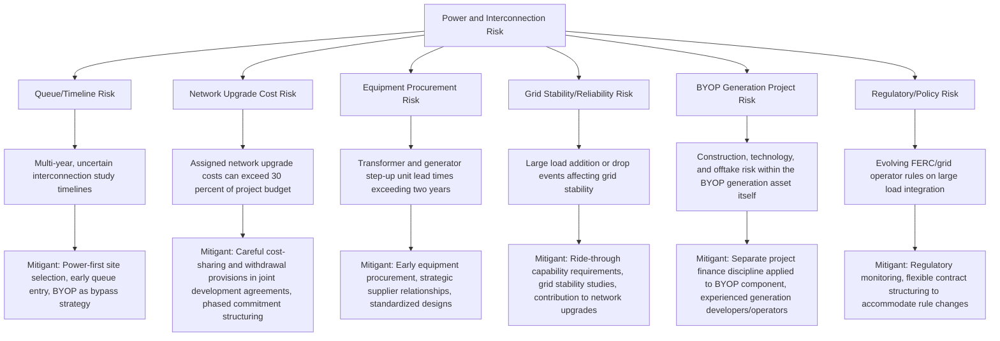

## Power and Interconnection Risk in Data Center Financing

### Overview and Context

Power and interconnection risk has emerged as the dominant constraint in data center project finance, surpassing tenant demand and construction cost as the primary binding factor on project delivery timelines and financeability. Driven by AI/machine learning compute growth and broader cloud demand, electrical grid capacity and the process of connecting new large loads (or new generation) to the grid have become a systemic bottleneck across major markets, fundamentally reshaping how data center developments are structured, sequenced, and financed.

This topic extends the contracted-lease financing logic covered under data center fundamentals by focusing specifically on the upstream constraint — securing reliable, timely, and adequately scaled electrical power — that increasingly determines whether a data center project can be built and financed at all, regardless of tenant demand strength.

### The Interconnection Queue Problem

**Scale of the constraint:**

As of early 2026, U.S. interconnection queues contained approximately 2,600 GW of proposed generation and storage capacity awaiting grid connection studies and approval. The median wait time for a project to reach commercial operation is approaching five years, with some sectors like data centers facing potential delays of up to 12 years. Nearly 80% of new projects withdraw from the queue primarily due to unpredictable, multi-year delays and prohibitively high grid upgrade costs, and for withdrawn projects, interconnection costs can account for 30-37% of total project budgets, undermining financial viability. [AI & Data Center Energy 2026, 2,600 GW Queue & PJM Plan - EnkiAI +3](https://enkiai.com/data-center/ai-data-center-energy-2026-2600-gw-queue-pjm-plan/)

**Regional dynamics:**

Grid operators are experiencing acute pressure from data center-driven load growth. PJM Interconnection, the largest U.S. grid operator covering thirteen states and Washington D.C., reopened its interconnection queue in 2026 after pausing new applications for several years due to backlog pressures. ERCOT's large-load interconnection queue expanded from 63 GW to 226 GW within a single year, and power transformer lead times now average 128 weeks, with generator step-up units requiring 144 weeks — meaning even projects that clear interconnection approval face multi-year equipment procurement delays before connection is physically possible. [Interconnection Risk in 2026: How Grid Congestion, AI Load Growth, and Queue Delays Are Impacting Renewable Energy Development | Eckert Seamans +2](https://www.eckertseamans.com/legal-updates/interconnection-risk-in-2026-how-grid-congestion-ai-load-growth-and-queue-delays-are-impacting-renewable-energy-development)

**Regulatory response:**

In June 2026, FERC was expected to act on an Advance Notice of Proposed Rulemaking initiated by the Secretary of Energy to ensure timely, orderly, and equitable integration of large electrical loads such as data centers into the nation's transmission infrastructure, and FERC has directed PJM to implement transparent rules to accommodate substantial data-center-affiliated loads. [Unverified: the outcome and final form of this FERC rulemaking, and its downstream effect on interconnection timelines, should be confirmed against current FERC dockets and PJM tariff filings, as regulatory proceedings evolve past this reference point.] [Eckert Seamans](https://www.eckertseamans.com/legal-updates/interconnection-risk-in-2026-how-grid-congestion-ai-load-growth-and-queue-delays-are-impacting-renewable-energy-development)

### From "Plug-and-Build" to "Power-First" Development

The scale of interconnection delays has fundamentally inverted the traditional data center development sequence. Historically, developers selected land and secured power later; now, "power-first" development starts with identifying available power, securing utility commitments, and building substations before constructing the facility, transforming data centers from primarily real estate developments into what industry participants describe as "energy-first" ventures where the building is designed around the power supply rather than the reverse. [Oil & Energy](https://oilandenergyonline.com/articles/all/data-centers-bring-your-own-power/)[Oil & Energy](https://oilandenergyonline.com/articles/all/data-centers-bring-your-own-power/)

This shift has direct financing implications: power availability due diligence now precedes, and can override, traditional site/tenant underwriting as the primary go/no-go gate for a project.

### Bring Your Own Power (BYOP) Structures

**Definition and rationale:**

Bring Your Own Power (BYOP), sometimes called Bring Your Own Generation (BYOG), refers to organizations securing dedicated generation and storage assets to power their facilities directly, reducing dependence on constrained grids. Under these models, data center operators develop or contract for generation capacity, often co-located with their facilities, offering greater control over timing, insulation from rate volatility, and reduced exposure to interconnection delays. [Shoals](https://shoals.com/en/insights/grid-constraints-bring-your-own-power-byop/)[Morgan Lewis](https://www.morganlewis.com/pubs/2026/03/powering-data-centers-energy-strategy-and-structuring-for-a-constrained-grid)

**Structural components:**

BYOP is not a single technology but an architecture combining multiple elements: an integrated approach combining multiple generation and storage resources to meet reliability, cost, sustainability, and deployment objectives, potentially including reciprocating engines, gas turbines, fuel cells, battery storage, and renewable generation, while keeping the option for eventual utility grid connection open in the long term. [Shoals](https://shoals.com/en/insights/grid-constraints-bring-your-own-power-byop/)[Data Center Dynamics](https://www.datacenterdynamics.com/en/news/vertiv-generate-capital-team-up-on-bring-your-own-power-cooling-offering-for-data-centers/)

**Financing structuring trend — separating BYOP from the data center itself:**

A notable and directly relevant development for project finance practitioners: some market participants are separating the financing of BYOP solutions from the data center components, tapping both the project finance capital market for BYOP and the commercial real estate capital market for the data center itself, while other participants seek integrated capital solutions. This bifurcation allows capital providers to match risk/return profiles to the distinct asset classes — power generation project finance discipline for the BYOP component, real estate/lease-based underwriting for the building and tenant lease. [Ropes & Gray](https://www.ropesgray.com/en/insights/viewpoints/102mvfl/data-center-investment-in-2026-ai-demand-power-constraints-and-private-equity)

**Trade-offs:**

Self-supply introduces complexities: developers must navigate high upfront capital costs, project risks associated with power generation, and regulatory requirements that vary by jurisdiction. [Inference] These project risks are broadly similar in character to standalone power project finance risks (construction, fuel supply, technology performance) layered on top of the data center's existing risk profile, effectively requiring data center financiers to underwrite power generation project risk in addition to traditional real estate/lease risk — though the specific risk allocation depends on how the BYOP financing is structured relative to the data center financing. [Morgan Lewis](https://www.morganlewis.com/pubs/2026/03/powering-data-centers-energy-strategy-and-structuring-for-a-constrained-grid)

### Emerging and Hybrid Power Procurement Models

| Model | Description |
| --- | --- |
| **Direct PPA with co-located generation** | Long-term power purchase agreement with a renewable or gas generator built adjacent to or dedicated to the facility |
| **Behind-the-meter generation** | On-site generation (gas reciprocating engines, turbines, fuel cells, solar-plus-storage) directly serving the facility, bypassing grid transmission constraints |
| **Utility partnership / dedicated circuit programs** | Utilities co-designing dedicated circuit programs alongside large developers, treating them as infrastructure partners |
| **Bring Your Own Capacity (BYOC) / Virtual Power Plant participation** | An arrangement such as the June 2026 Google-Voltus agreement aggregating up to 100 MW of distributed energy resources — batteries, smart thermostats, and other flexible assets — into a company-funded virtual power plant within a grid operator's territory, contributing grid flexibility in exchange for capacity or interconnection benefits |
| **Direct generation asset acquisition** | Hyperscalers acquiring gigawatt-scale power generation projects outright rather than relying on utility delivery timelines |

### Risk Allocation Diagram

### Financing Implications and Structuring Considerations

**1. Power availability as a condition precedent**

Financing documentation increasingly requires evidence of a bankable power solution — whether a firm interconnection agreement with a defined in-service date, or a fully contracted BYOP arrangement — as a condition precedent to financial close, rather than relying on a general expectation of grid connectivity.

**2. Offtake and PPA adaptation to delay risk**

Power purchase agreements and other offtake structures are adapting to reflect interconnection uncertainty, which may include mechanisms such as delay-contingent pricing adjustments, flexible commercial operation date definitions, or termination rights tied to interconnection milestones rather than fixed calendar dates. [Eckert Seamans](https://www.eckertseamans.com/legal-updates/interconnection-risk-in-2026-how-grid-congestion-ai-load-growth-and-queue-delays-are-impacting-renewable-energy-development)

**3. Evolving capital stack sequencing**

Outside capital increasingly arrives earlier in the data center life cycle through mechanisms such as GPU financings and land-cost facilities, and structured preferred equity, joint ventures, and forward sale constructs remain popular structuring approaches to free up sponsor capital sooner given the extended, capital-intensive pre-construction power procurement phase. [Ropes & Gray](https://www.ropesgray.com/en/insights/viewpoints/102mvfl/data-center-investment-in-2026-ai-demand-power-constraints-and-private-equity)

**4. Site selection as a financial underwriting criterion**

Land near renewable resources and transmission corridors is being repriced accordingly, with power access now ranking above tax incentives and labor costs in most developer site evaluations. For lenders, this means site-level power availability diligence has become as central to underwriting as tenant credit quality or construction cost estimation. [Exponent](https://www.exponent.com/article/bring-your-own-power-your-own-data-center)

**5. Market tightness reinforcing urgency**

Northern Virginia, the world's largest data center market, has a colocation vacancy rate of 0.72 percent, with preleasing claiming 87 percent of all inventory scheduled for delivery in 2025-2026 — illustrating that demand is not the constraint; power delivery timelines are. Of 16 GW of new data center power capacity planned for 2026, only 5 GW had entered active construction, with industry analysts projecting 30 to 50 percent of the remaining capacity slipping to 2027 or beyond. [Mgrid](https://mgrid.org/2026/01/15/data-center-grid-delays-50-percent-2026-ai-capacity-risk/)[Mgrid](https://mgrid.org/2026/01/15/data-center-grid-delays-50-percent-2026-ai-capacity-risk/)

### Stress-Testing Framework for Financial Models

Given the scale of interconnection uncertainty, lenders and sponsors should treat power delivery timing as a primary modeled risk variable rather than a fixed assumption:

- **Base case**: Interconnection/power delivery achieved on the contractually assumed date, supporting the base-case construction and lease commencement schedule
- **Downside case**: Extended delay scenario (e.g., 2–4 years beyond base case), modeling the impact on capitalized interest, extended equity bridge requirements, and potential tenant lease renegotiation or walk-away risk
- **BYOP-dependent case**: Scenario where grid interconnection is deprioritized entirely in favor of a fully self-supplied power solution, requiring the BYOP generation asset's own construction and completion risk to be modeled as a gating item ahead of data center construction completion

[Inference] Given how recently and rapidly this risk category has escalated in market prominence, specific lender underwriting standards, hedge/covenant structures, and BYOP-versus-grid capital structuring conventions are still developing and vary significantly across financiers, jurisdictions, and grid operator regions; practitioners should verify current market practice and regulatory status directly, as this is an unusually fast-moving area even relative to other project finance sectors.

### Common Modeling Pitfalls

- Treating a signed interconnection agreement or queue position as equivalent to a firm, bankable in-service date, when queue timelines have become widely described as "soft targets" rather than financeable milestones
- Failing to model potential network upgrade cost allocation, which can materially exceed original project budget assumptions and, in some cases, render a project uneconomic
- Underestimating long-lead-time equipment procurement (transformers, generator step-up units) as an independent constraint separate from, and potentially longer than, the interconnection approval process itself
- Modeling BYOP generation assets with data-center-style contracted-lease risk assumptions rather than power-project-finance-style construction, technology, and fuel/resource risk assumptions
- Ignoring the capital and timeline implications of dual-track strategies (pursuing both grid interconnection and BYOP simultaneously as a hedge), which carry their own cost and complexity
- Assuming uniform interconnection risk across regions, when queue backlogs, reopening status, and reform timelines vary substantially by grid operator (e.g., PJM vs. ERCOT vs. other regional transmission organizations)

**Related Topics:**

- Data Center Project Finance Fundamentals (Contracted Lease Structures)
- Power Project Finance — Construction and Technology Risk in Generation Assets
- Renewable Power Purchase Agreements and Co-Located Generation Structures
- FERC Regulatory Proceedings on Large Load Integration
- Grid-Scale Battery Storage and Virtual Power Plant Structuring
- Behind-the-Meter Generation Financing and Microgrid Structures
- Telecommunications Tower Project Finance (Comparative Infrastructure Constraint Analysis)
- Equipment Supply Chain Risk in Power Infrastructure Financing
- Joint Development Agreements and Cost-Sharing Provisions in Interconnection
- Gas Turbine and Reciprocating Engine Generation for Dedicated Load Applications