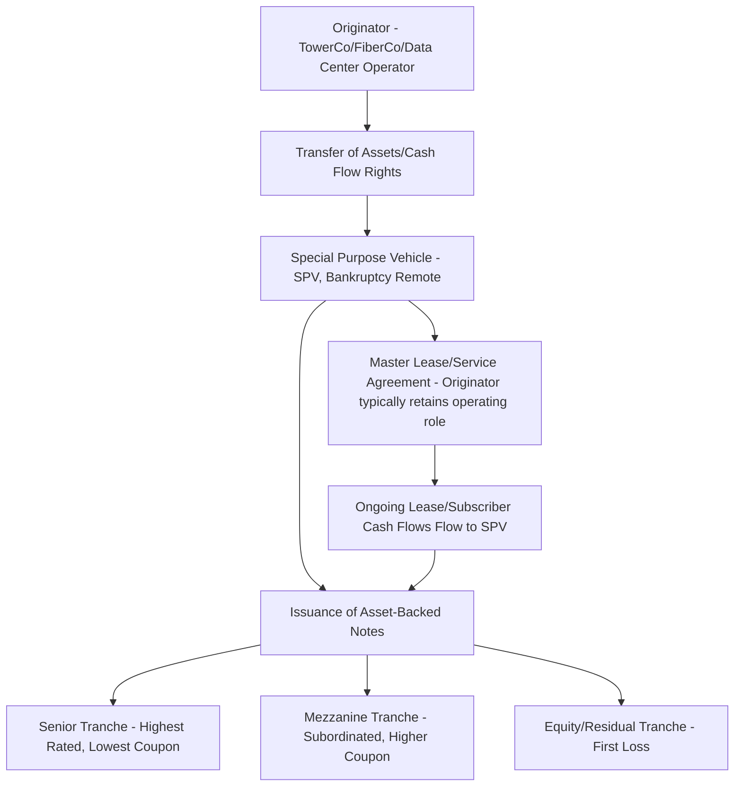
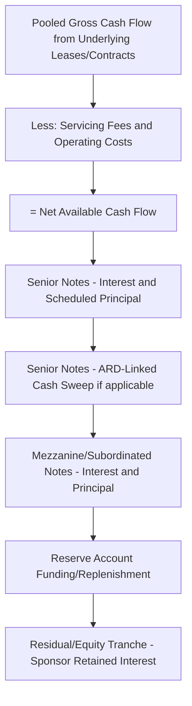
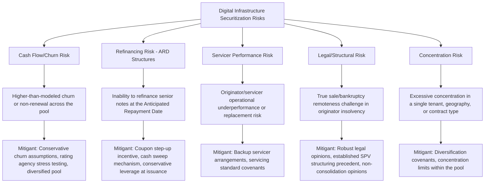

## Securitization and Asset-Backed Structures in Digital Infrastructure

### Overview and Context

Securitization in digital infrastructure involves pooling contracted or granular cash-flow-generating assets — tower leases, fiber subscriber revenue, data center leases, small cell agreements — into a special purpose vehicle (SPV) that issues asset-backed notes to capital markets investors. This financing technique has become a cornerstone funding source across the digital infrastructure sector because these assets share characteristics that securitization structures reward: large numbers of granular, diversified, long-duration contracts with predictable payment patterns, closely paralleling the logic long used in commercial mortgage-backed securities (CMBS) and other structured real asset finance.

Securitization allows digital infrastructure owners — many of which are sub-investment-grade or unrated at the corporate level, or simply seeking to optimize cost of capital — to achieve investment-grade ratings on senior tranches by isolating strong, diversified cash flows from broader corporate credit risk, typically resulting in lower funding costs and longer tenors than would be available through direct corporate borrowing.

### Why Digital Infrastructure Assets Suit Securitization

| Characteristic | Relevance to Securitization |
| --- | --- |
| **Granularity/diversification** | Thousands of individual leases/contracts across a portfolio reduce single-counterparty concentration risk |
| **Long contract duration** | Multi-year lease/service agreements with renewal options support long-dated note structures |
| **Contracted, recurring revenue** | Predictable payment streams resemble the mortgage/lease cash flows underlying traditional ABS/CMBS |
| **Low correlation to sponsor corporate credit** | Bankruptcy-remote SPV structuring isolates the pooled assets from the originator's broader corporate risk |
| **Stable or growing underlying demand** | Secular growth drivers (mobile data, cloud/AI compute, broadband) support cash flow durability assumptions |

### Core Securitization Structure

**Key structural elements:**

- **Bankruptcy remoteness**: The SPV is structured as a legally separate entity from the originator, such that the originator's bankruptcy does not automatically bring the securitized assets into the originator's bankruptcy estate — a foundational requirement for achieving ratings decoupled from originator corporate credit
- **True sale / true contribution**: Assets or cash flow rights must be genuinely transferred to the SPV (not merely pledged as collateral for a loan) to achieve bankruptcy remoteness under most legal frameworks, requiring careful legal opinion support
- **Servicing arrangement**: The originator typically continues to operate/manage the underlying assets (towers, fiber network, data centers) under a servicing or management agreement, receiving a servicing fee, while the SPV retains ownership of the cash flow rights
- **Tranching (subordination)**: Notes are issued in multiple tranches with different priority of payment and loss absorption, allowing senior tranches to achieve higher credit ratings than the underlying pool's blended credit quality would otherwise support
- **Anticipated Repayment Date (ARD) mechanism**: Common in tower and digital infrastructure ABS — notes have a legal final maturity far beyond a nearer-term "anticipated" repayment date; failure to repay by the ARD triggers a coupon step-up (and often a cash sweep), creating a strong economic incentive to refinance by the ARD without creating a hard legal default

### Sector-Specific Securitization Applications

**1. Telecommunications Tower ABS**

- The most mature and established digital infrastructure securitization market, pooling ground leases and multi-tenant MNO leases across thousands of tower sites
- Senior notes frequently achieve high investment-grade ratings given tenant diversification (across multiple large MNOs) and long weighted average lease terms
- Often issued in a "shelf" program structure, allowing repeat issuances secured by the same or an expanding underlying tower portfolio over time

**2. Fiber/Broadband Securitization**

- More recently developed, applied to stabilized (post-ramp-up) fiber network portfolios where penetration has matured and churn patterns are established
- Because fiber take-up risk is inherently higher than tower tenant risk during the ramp-up phase, fiber securitization is generally reserved for **mature, de-risked portfolios** rather than greenfield build assets — greenfield builds are more commonly financed via project finance structures until stabilization is achieved, after which refinancing via securitization becomes viable
- May pool multiple geographically diversified network areas to reduce concentration in any single market's competitive or regulatory dynamics

**3. Data Center Securitization**

- Emerging application, pooling diversified colocation or wholesale lease portfolios (particularly retail/wholesale colocation with many tenants, as opposed to single-tenant hyperscale assets which are more commonly financed via direct project finance given their concentrated but high-quality tenant profile)
- Structuring considerations include power cost pass-through mechanics and potential lease renewal/renegotiation risk given typically shorter colocation lease tenors relative to tower ground leases

**4. Small Cell and DAS Securitization**

- Smaller but growing category, pooling small cell and distributed antenna system agreements, which individually carry smaller revenue per site but similar underlying tenant/carrier credit characteristics to towers

**5. Whole-Business Securitization (WBS)**

- A broader structural variant sometimes applied across digital infrastructure and other cash-flow-generating operating businesses, where substantially all of an operating company's assets and cash flows (not just a discrete pool of contracts) are pledged to secure the notes, with the originator continuing to operate the business under a tightly covenanted structure
- Provides deeper structural subordination and covenant protection than a pure asset-pool ABS, often used where the "asset" is more accurately characterized as an operating business than a discrete pool of static contracts

### Key Structural and Credit Metrics

| Metric | Purpose |
| --- | --- |
| **Debt Service Coverage Ratio (DSCR) — pool level** | Aggregate contracted cash flow relative to note debt service, calculated at the SPV/pool level |
| **Weighted Average Lease Term (WALT) / Weighted Average Contract Life** | Remaining contract duration across the pool, indicating cash flow durability relative to note tenor |
| **Loan-to-Value (LTV) or Advance Rate** | Note principal relative to the appraised/modeled value of the underlying asset pool |
| **Tenant/Customer Concentration** | Percentage of pool revenue attributable to the largest counterparties; lower concentration supports higher ratings |
| **Historical Churn/Renewal Rate** | Track record of contract renewal/non-renewal used to underwrite future cash flow durability assumptions |
| **Rating Agency Stress Multiples** | Rating agencies apply stress scenarios (e.g., reduced tenancy, elevated churn, interest rate stress) to test note resilience across rating categories |
| **Excess Spread** | Difference between pool cash flow yield and weighted average note coupon, available to absorb losses before reaching subordinated noteholders |

### Illustrative Tranching and Waterfall

### Worked Example: Simplified Multi-Tranche Sizing

Assume a fiber network securitization pooling stabilized, mature-penetration network areas:

- Aggregate annual net available cash flow: $95 million
- Target senior tranche DSCR: 1.60x
- Target mezzanine tranche aggregate DSCR (senior + mezzanine): 1.25x
- Senior note coupon: 4.50%, 10-year tenor (ARD structure)
- Mezzanine note coupon: 6.75%, 10-year tenor (ARD structure)

**Step 1 — Maximum senior debt service at 1.60x DSCR:**

$$\dfrac{95{,}000{,}000}{1.60} = \$59.4\text{ million}$$

**Step 2 — Approximate senior note capacity (annuity approximation, 10 years at 4.50%):**

$$59{,}400{,}000 \times \left(\dfrac{1-(1.045)^{-10}}{0.045}\right) \approx 59{,}400{,}000 \times 7.91 \approx \$470.0\text{ million}$$

**Step 3 — Maximum combined (senior + mezzanine) debt service at 1.25x aggregate DSCR:**

$$\dfrac{95{,}000{,}000}{1.25} = \$76.0\text{ million}$$

**Step 4 — Mezzanine-only debt service capacity:**

$$76{,}000{,}000 - 59{,}400{,}000 = \$16.6\text{ million}$$

**Step 5 — Approximate mezzanine note capacity (annuity approximation, 10 years at 6.75%):**

$$16{,}600{,}000 \times \left(\dfrac{1-(1.0675)^{-10}}{0.0675}\right) \approx 16{,}600{,}000 \times 7.06 \approx \$117.2\text{ million}$$

**Step 6 — Total note issuance capacity:**

$$470{,}000{,}000 + 117{,}200{,}000 = \$587.2\text{ million}$$

This illustrates how layered DSCR targets across tranches determine aggregate issuance capacity, with each subordinate layer sized against a progressively less conservative coverage target reflecting its junior position in the payment waterfall. [Inference] This is a simplified flat-annuity approximation applied sequentially; actual securitization sizing uses integrated cash flow models incorporating rating-agency-specific stress scenarios, reserve account sizing, and detailed amortization schedules across all tranches simultaneously, which will produce different, generally more conservative, results.

### Risk Allocation Diagram

### Rating Agency Considerations

Credit rating agencies evaluating digital infrastructure ABS typically focus on:

- **Asset quality and diversification**: Granularity of the underlying pool, tenant/customer credit quality, and geographic/counterparty concentration limits
- **Legal structure**: True sale opinions, SPV bankruptcy remoteness, and non-consolidation risk assessment
- **Cash flow stability**: Historical performance data (tenancy ratios, churn rates, renewal rates) supporting forward-looking cash flow assumptions
- **Structural protections**: Reserve accounts, cash sweep triggers, subordination levels, and servicer replacement provisions
- **Refinancing risk assessment**: For ARD structures, the agencies typically assess the note's resilience to a scenario where refinancing at the ARD is delayed or unavailable, given the extended legal final maturity as a structural backstop

[Inference] The specific stress assumptions, subordination levels, and rating thresholds applied by rating agencies vary by agency methodology, asset class maturity within the digital infrastructure sector, and prevailing market conditions; practitioners should consult current published rating agency criteria for the specific asset class and transaction structure under consideration.

### Common Modeling and Structuring Pitfalls

- Applying tower-market-tested securitization assumptions (tenancy stability, churn rates) directly to less mature asset classes like fiber or data center colocation without adjusting for their distinct risk characteristics
- Underestimating legal and structuring costs/complexity of establishing true sale and bankruptcy remoteness, particularly in jurisdictions with less established securitization legal precedent for digital infrastructure assets
- Treating the ARD as equivalent to legal final maturity in cash flow and risk modeling, understating the refinancing risk that the ARD structure is specifically designed to manage
- Failing to adequately diversify the underlying pool, creating excessive concentration risk in a single tenant, geography, or technology that undermines the diversification benefit securitization structures are meant to capture
- Ignoring backup servicer arrangements and their cost/feasibility, leaving the structure exposed if the primary servicer/originator experiences operational distress
- Overlooking the interaction between reserve account sizing and rating agency stress scenarios, particularly for newer asset classes lacking extensive historical performance data

**Related Topics:**

- Telecommunications Tower Project Finance (Primary Securitization Application)
- Fiber and Broadband Network Financing (Mature Portfolio Refinancing via ABS)
- Data Center Project Finance Fundamentals (Colocation Portfolio Securitization)
- Whole-Business Securitization Structuring Fundamentals
- Rating Agency Methodologies for Digital Infrastructure ABS
- True Sale and Bankruptcy Remoteness Legal Frameworks
- Reserve Account and Cash Sweep Mechanism Design
- Project Bond Structuring for Operating Infrastructure Assets
- CMBS Structural Analogues in Real Asset Securitization
- Small Cell and DAS Portfolio Financing