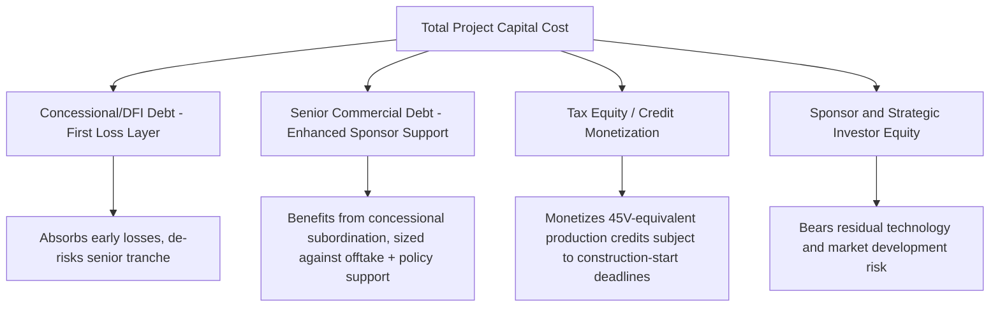
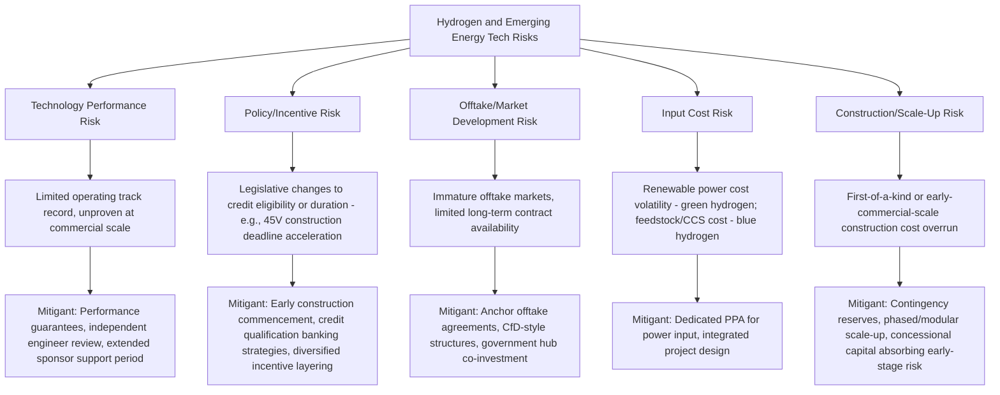

## Hydrogen and Emerging Energy Technology Financing

### Overview and Context

Hydrogen and emerging energy technology financing covers the project finance structures used to fund clean hydrogen production (electrolysis-based "green" hydrogen, reformation-with-carbon-capture "blue" hydrogen, and other low-carbon pathways), along with adjacent emerging technologies such as long-duration energy storage, carbon capture and sequestration, and small modular reactors. These technologies share a common financing challenge distinct from established renewables (solar, wind) or conventional thermal generation: **limited or no operating track record**, meaning lenders cannot rely on the extensive historical performance data that underpins conventional project finance debt sizing, and financeability depends heavily on policy support mechanisms, offtake contract structuring, and technology risk allocation.

This is a fast-moving policy and market area; the discussion below incorporates verified current status of key U.S. federal incentives as of this writing, but practitioners should confirm the latest regulatory and legislative status before relying on specific credit terms in any transaction.

### The Hydrogen Value Chain and Production Pathways

| Pathway | Description | Relative Financeability |
| --- | --- | --- |
| **Green Hydrogen** | Electrolysis powered by renewable electricity | Highest technology maturity risk premium historically, but strong policy support in many jurisdictions; economics highly sensitive to renewable power cost and electrolyzer capital cost |
| **Blue Hydrogen** | Steam methane reforming (SMR) or autothermal reforming with carbon capture and storage (CCS) | Leverages more mature SMR technology; financeability depends on CCS performance and carbon credit/45Q-style incentive stacking |
| **Pink/Nuclear Hydrogen** | Electrolysis powered by nuclear generation | Emerging pathway; combines nuclear generation project risk with electrolysis technology risk |
| **Grey/Brown Hydrogen** | Conventional SMR without carbon capture | Established technology but generally not eligible for clean hydrogen incentives given emissions intensity |

### Key U.S. Policy Support Mechanism — Section 45V Clean Hydrogen Production Credit

**Original structure (Inflation Reduction Act, 2022):**

The Inflation Reduction Act enacted a production tax credit for qualified clean hydrogen, providing a base credit amount of $0.60 per kilogram, multiplied by an applicable percentage based on emissions intensity, and multiplied by five (up to a maximum of $3.00/kg) if the taxpayer meets prevailing wage and apprenticeship requirements during construction. Credit value is tiered based on the lifecycle greenhouse gas emissions rate of the production process (measured using the 45VH2-GREET model), and qualified clean hydrogen cannot exceed 4 kilograms of CO2-equivalent emissions per kilogram of hydrogen produced.

**Legislative modification (One Big Beautiful Bill Act, 2025):**

Section 45V's availability window was significantly shortened by subsequent legislation. The One Big Beautiful Bill Act, signed into law July 4, 2025, terminated the Section 45V credit for facilities that begin construction after December 31, 2027 — substantially earlier than the original 2033 phase-out contemplated under the IRA. The Act also introduced Foreign Entity of Concern (FEOC) ownership and "material assistance" restrictions affecting eligibility for various energy credits, and separately expanded the definition of qualifying income for Master Limited Partnerships to include income from the transportation or storage of liquefied or compressed hydrogen — a change directly relevant to hydrogen midstream infrastructure financing via the MLP structure.

**Financing implications:**

The accelerated 2027 construction-start deadline compresses the window for green hydrogen projects to qualify for the credit and reach financial close, creating urgency in project development timelines and a potential financing "cliff" for projects unable to commence construction in time. [Inference] This compressed timeline is likely to affect project pipeline economics broadly across the sector, though the specific effect on any given project's financeability depends on its individual technology, offtake, and jurisdictional circumstances; practitioners should verify current 45V status and any further legislative or regulatory developments before relying on this credit in a specific transaction, given the pace of policy change in this area.

### Core Financing Challenges for Emerging Energy Technologies

**1. Technology Risk (Limited Operating History)**

- Unlike solar/wind, which have decades of operating data supporting P50/P90 production estimates, hydrogen electrolysis at scale, long-duration storage, and other emerging technologies lack extensive commercial-scale performance track records
- Lenders typically require performance guarantees, warranties, and sometimes technology insurance products to bridge this gap, alongside more conservative technical due diligence and independent engineer review

**2. Offtake and Revenue Certainty**

- Hydrogen offtake markets are less mature and liquid than established commodity or power markets; long-term offtake agreements (e.g., with industrial users, refineries, or emerging hydrogen-fueled transport applications) are essential for financeability but harder to secure at scale than conventional power PPAs
- **Contract-for-difference (CfD)** structures, common in some European hydrogen support schemes, provide a floor/reference price mechanism to bridge the gap between production cost and achievable market price during early market development

**3. Policy and Incentive Stacking**

- Many projects depend on combining multiple incentive layers (production tax credits, investment tax credits, carbon credits such as Section 45Q for captured carbon in blue hydrogen, state-level clean fuel standards, and potentially international carbon border mechanisms)
- This layering introduces **policy risk concentration**: changes to any one incentive layer (as demonstrated by the 45V timeline compression) can materially affect overall project economics, requiring careful sensitivity analysis in financial models

**4. Cost Curve and Scale-Up Risk**

- Emerging technologies typically have capital costs that are expected to decline with scale and manufacturing learning curves; financing an early-stage project often means accepting higher current-generation costs while betting on the broader industry's cost trajectory for future competitiveness, a dynamic that complicates long-term contract pricing negotiations with offtakers

### Financing Structures

**1. Project Finance with Enhanced Sponsor Support**

- Given technology risk, sponsors typically provide more extensive completion and performance support than in mature-technology project finance, potentially including extended sponsor guarantees beyond standard completion tests into an initial operating period ("performance ratification" period)

**2. Blended/Concessional Finance**

- Development finance institutions, green/climate funds, and government-backed green banks frequently provide concessional debt, first-loss capital, or guarantees to de-risk early-stage emerging technology projects and crowd in commercial capital
- This layered structure (concessional capital absorbing first losses, commercial capital taking a senior, better-protected position) is a common blended finance pattern for technology-risk-heavy clean energy projects

**3. Tax Equity and Credit Monetization Structures**

- Where production/investment tax credits are available (subject to current eligibility windows, as discussed above), tax equity partnerships or direct-pay/transferability elections (where available under applicable law) allow project sponsors to monetize credits even without sufficient tax appetite of their own
- [Unverified: the specific transferability and direct-pay mechanics for Section 45V and related credits should be confirmed against current IRS guidance and the specific taxpayer's circumstances, as these provisions and their interaction with other Act provisions are subject to ongoing regulatory interpretation]

**4. Government Grants and Hub-Based Development Programs**

- Regional hydrogen hub programs and similar government-backed initiatives in various jurisdictions provide capital grants, offtake support, or infrastructure co-investment to anchor early-stage hydrogen ecosystems, reducing the standalone project risk any single financing must absorb
- Financing structures for hub-affiliated projects often incorporate the hub's shared infrastructure (pipelines, storage) as a separate, sometimes more conventionally financeable midstream layer distinct from the production facility itself

**5. Strategic/Corporate Investment and Joint Ventures**

- Industrial gas companies, energy majors, and large industrial offtakers frequently take direct equity stakes or enter joint ventures to secure supply and share technology risk, providing a funding source less dependent on traditional project finance debt markets during the technology's early commercial phase

### Illustrative Financing and Risk Layering

### Key Financial and Risk Metrics

| Metric | Purpose |
| --- | --- |
| **Levelized Cost of Hydrogen (LCOH)** | $/kg cost benchmark analogous to LCOE in power; central metric for competitiveness against incumbent (grey) hydrogen and alternative fuels |
| **Credit-Adjusted Breakeven Price** | LCOH net of production tax credit value, indicating market-competitive pricing after policy support |
| **Debt Service Coverage Ratio (DSCR)** | Applied with typically higher minimum thresholds than mature-technology projects, reflecting technology and offtake risk premiums |
| **Capacity Factor / Utilization Assumption** | Electrolyzer or plant utilization rate, sensitive to renewable power availability (for green hydrogen) or feedstock/capture system uptime (for blue hydrogen) |
| **Policy/Incentive Duration Coverage** | Comparison of incentive availability window (e.g., 10-year 45V credit period) against debt tenor, identifying potential cash flow cliff risk post-incentive expiration |

### Risk Allocation Diagram

### Worked Example: Simplified Credit-Adjusted Economics

Assume a green hydrogen electrolysis facility:

- Production capacity: 20,000 kg/day (7.3 million kg/year)
- Unsubsidized production cost (LCOH): $4.50/kg
- Applicable 45V credit (assuming full qualification, prevailing wage/apprenticeship met, lowest emissions tier): $3.00/kg
- Credit-adjusted effective cost: $4.50 − $3.00 = $1.50/kg
- Target market price to offtakers: $2.00/kg

**Step 1 — Annual credit value (illustrative, subject to confirmed qualification and current eligibility window):**

$$7{,}300{,}000 \times 3.00 = \$21.9\text{ million/year in credit value}$$

**Step 2 — Annual margin at target offtake price, credit-adjusted:**

$$(2.00 - 1.50) \times 7{,}300{,}000 = \$3.65\text{ million/year (production margin before credit)}$$

**Step 3 — Total annual value including credit monetization:**

$$3{,}650{,}000 + 21{,}900{,}000 = \$25.55\text{ million/year}$$

This illustrates the central importance of the credit to project economics: absent the $3.00/kg credit, the facility's unsubsidized cost ($4.50/kg) would exceed the target offtake price ($2.00/kg), rendering the project uneconomic on a standalone basis. [Inference] This is a highly simplified illustration; actual project economics require detailed sensitivity analysis across power cost, electrolyzer capital cost, utilization assumptions, and precise credit tier qualification, and the construction-start deadline under current law means the credit's availability is time-limited — any specific project must confirm its qualification pathway and construction timeline against current IRS guidance before this analysis can be relied upon for financing decisions.

### Common Modeling and Structuring Pitfalls

- Assuming credit value based on outdated eligibility windows or sunset dates without confirming current legislative status, given the accelerated termination timeline introduced by subsequent legislation relative to the original IRA framework
- Applying mature-technology debt sizing conventions (leverage ratios, DSCR thresholds) directly to first-of-a-kind or early-commercial-scale projects without adjusting for the absence of an extensive operating track record
- Underestimating the "credit cliff" risk where project economics depend heavily on a time-limited incentive, without adequately stress-testing post-incentive-expiration cash flows against remaining debt tenor
- Failing to model the interaction between multiple stacked incentives (e.g., interaction rules between 45V and other credits, such as the general prohibition on stacking 45V with 45Q carbon capture credits at the same facility)
- Treating offtake agreements in immature hydrogen markets with the same certainty assumptions as mature power PPA or commodity offtake markets
- Ignoring FEOC (Foreign Entity of Concern) and material assistance restrictions that may affect credit eligibility depending on supply chain and ownership structure

**Related Topics:**

- Power Project Finance and Renewable PPA Structuring (Comparative Technology Risk Analysis)
- Carbon Capture and Sequestration Project Finance (Section 45Q)
- Blended and Concessional Finance Structures for Emerging Technology
- Tax Equity Partnership Structuring and Credit Transferability Mechanics
- Long-Duration Energy Storage Project Finance
- Small Modular Reactor (SMR) Nuclear Project Finance
- Data Center Power Procurement and Dedicated Generation (Cross-Sector Policy Linkages)
- Regional Hydrogen Hub Development and Government Co-Investment Models
- U.S. Federal Energy Tax Policy and Legislative Risk in Project Finance
- Master Limited Partnership Qualifying Income Rules for Emerging Energy Infrastructure