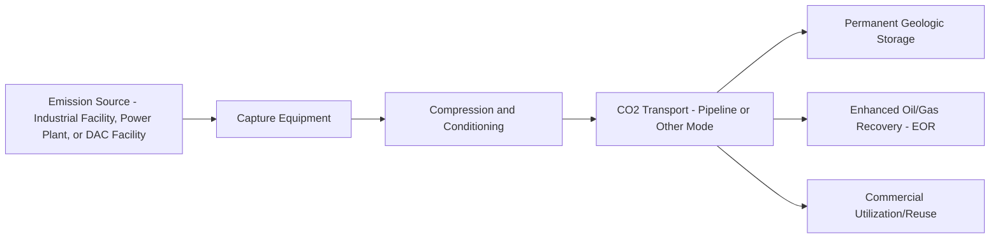
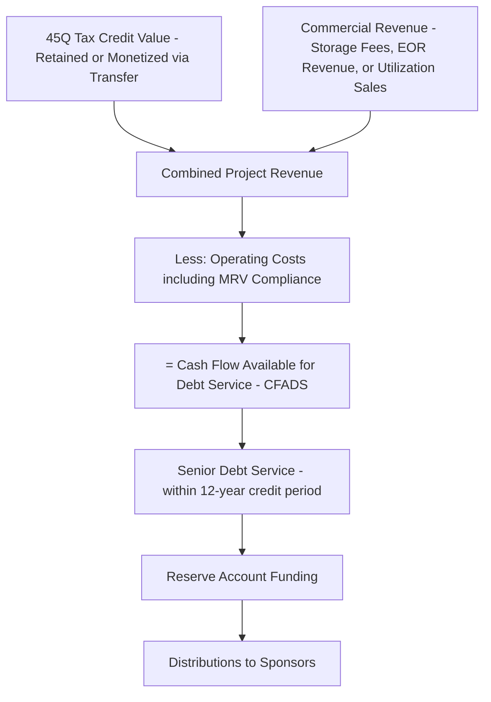
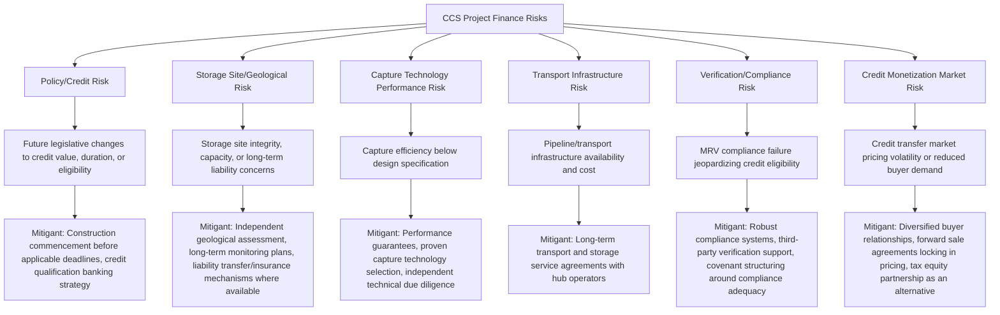

## Carbon Capture and Storage Project Finance

### Overview and Context

Carbon capture and storage (CCS) project finance funds facilities that capture carbon dioxide from industrial or power generation sources (point-source capture) or directly from the atmosphere (direct air capture, DAC), then transport and permanently sequester it in geological formations or utilize it in commercial applications such as enhanced oil recovery (EOR). CCS occupies a distinctive position among emerging energy technologies covered in this chapter: point-source capture technology itself is relatively mature (having been deployed industrially for decades in some applications), but **project-scale integration, transport infrastructure, and storage site development** at the scale required for climate-relevant deployment remain comparatively nascent, and financeability in the U.S. market is currently anchored heavily around the Section 45Q federal tax credit.

### The CCS Value Chain

Each segment can be financed as an integrated project or, increasingly, as separate infrastructure layers (capture facility, dedicated CO2 pipeline network, storage site/sequestration hub), similar in structural logic to the segmented financing seen in the LNG and hydrogen value chains covered elsewhere in this chapter.

### Section 45Q Tax Credit — Core Policy Mechanism

**Credit structure (as modified by the One Big Beautiful Bill Act, signed into law July 4, 2025):**

Section 45Q entitles taxpayers who own carbon capture equipment and physically or contractually sequester or use the captured carbon oxide to a credit for each metric ton captured and sequestered or used, over a 12-year period starting when the equipment is first placed in service. To qualify, the carbon capture equipment must be part of a facility on which construction begins before January 1, 2033 — the Act did not accelerate or change this expiration date, in contrast to the earlier termination imposed on the Section 45V clean hydrogen credit.

**Credit values and the new utilization/storage parity:**

The credit maintains $85 per metric ton for point-source capture with permanent geologic storage and $180 per metric ton for direct air capture with permanent storage, both indexed for inflation beginning in 2027 (with 2025 as the base index year). A significant structural change introduced by the Act is parity between permanent storage and utilization: captured CO2 used in enhanced oil or natural gas recovery, or converted into commercial products, now qualifies for the same $85/ton (point-source) or $180/ton (DAC) credit value as permanent geologic storage — previously, utilization pathways received a lower $60/ton rate for point-source capture. This change removes a prior financial disincentive toward utilization/EOR pathways relative to pure sequestration.

**Transferability preserved:**

The Act preserves the ability for developers with limited tax liability to sell 45Q credits directly to third parties with greater tax appetite for cash, allowing proceeds to be used to pay down capital investment in carbon capture infrastructure — a critical financing mechanism given that CCS project developers (particularly newer entrants) often lack sufficient tax liability to use credits directly.

**Foreign Entity of Concern (FEOC) restrictions:**

The Act introduced new restrictions preventing specified foreign entities (SFEs — entities controlled by or connected to China, Iran, North Korea, and Russia) from claiming or receiving transferred 45Q credits for taxable years beginning after July 4, 2025, and extends similar restrictions to "foreign-influenced entities" (FIEs, defined by specific partial-ownership thresholds) for taxable years beginning after July 4, 2027. [Unverified: the FEOC/FIE ownership and control thresholds are detailed and technical; the specific application to any given ownership or financing structure should be confirmed against current Treasury/IRS guidance, as these rules were still being clarified as of relevant guidance releases.]

**Recent implementation guidance:**

The Treasury Department and IRS released Notice 2026-01, establishing a temporary safe harbor for businesses claiming the Section 45Q credit for carbon dioxide captured and permanently stored during calendar year 2025, aimed at maintaining credit functionality during a period of regulatory transition following the Act's changes. As of March 2026, there were 33 carbon capture facilities operating in the United States, with additional facilities in development, and 45Q credit claims more than tripled between 2019 and 2023 according to IRS data.

**Credit monetization market:**

Section 45Q credits have developed an active transfer market, with observed pricing in the $0.85–0.92 per dollar of credit face value range, depending on project size and sponsor creditworthiness — providing a market-based benchmark for structuring credit monetization into project financings.

### Financing Structures

**1. Project Finance for Integrated Capture Facilities**

- Senior secured project debt sized against a combination of (a) contracted CO2 offtake/storage or EOR revenue and (b) 45Q credit value (whether retained or monetized via transfer)
- Given the credit's 12-year duration from placed-in-service date, debt tenors are frequently structured to align with or sit within this window, since post-credit-period economics depend entirely on underlying commercial revenue (storage fees, EOR revenue, or utilization product sales)

**2. Tax Equity Partnership Structures**

- Where the project sponsor has insufficient tax appetite, tax equity investors (typically financial institutions or corporates with substantial tax liability) partner in the project structure to monetize the credit directly, similar in structural logic to renewable energy tax equity partnerships
- Increasingly supplemented or replaced by direct credit transfer (monetization via sale to a third party), which the Act's preserved transferability provisions facilitate without requiring a full tax equity partnership structure

**3. Credit Transfer / Forward Sale Financing**

- Developers sell 45Q credits forward (before or during construction) to buyers with tax liability, generating near-term cash proceeds usable to fund capital costs — functioning economically similar to a structured receivables sale against a predictable future credit stream
- Given observed market pricing in the $0.85–0.92 per dollar range, financial models can reasonably estimate monetization proceeds, though pricing varies with project and sponsor credit quality

**4. Hub-Based and Shared Infrastructure Financing**

- CO2 transport pipelines and storage sites are increasingly developed as shared "hub" infrastructure serving multiple emission sources, financed separately from individual capture facilities
- This mirrors the midstream/upstream separation seen in oil and gas project finance: the hub (pipeline plus storage) can be financed on a contracted-throughput basis (similar to midstream fee-based structures), while individual capture facility financing depends on its own credit/offtake economics plus its transport/storage service agreement with the hub

**5. EOR-Linked Financing**

- Where captured CO2 is used for enhanced oil recovery, project economics combine 45Q credit value with incremental oil production revenue, requiring integrated modeling of both commodity price exposure (oil) and credit value — introducing a hybrid risk profile combining elements of upstream oil and gas project finance (covered elsewhere in this chapter) with policy-dependent CCS economics

**6. Government Grant and Cost-Share Programs**

- Federal and state grant programs (where available) provide capital cost-share for CCS demonstration and early commercial-scale projects, reducing the debt/equity capital required and de-risking early-stage technology deployment, often layered alongside 45Q credit monetization in a blended capital structure

### Key Financial and Risk Metrics

| Metric | Purpose |
| --- | --- |
| **Cost per Ton Captured ($/tCO2)** | Core capital and operating cost benchmark, compared against the applicable 45Q credit rate to assess project margin |
| **Credit Coverage Ratio** | Portion of total project revenue/margin attributable to 45Q credit value vs. underlying commercial revenue (storage fee, EOR, utilization sales) |
| **Debt Service Coverage Ratio (DSCR)** | Sized against combined credit-plus-commercial cash flow during the 12-year credit period; often modeled with distinct pre- and post-credit-period coverage tests |
| **Storage/Sequestration Verification Compliance Cost** | Ongoing cost of monitoring, reporting, and verification (MRV) required to substantiate credit claims, particularly under the EPA's Subpart RR reporting framework for geologic storage |
| **Credit Transfer Discount Rate** | Effective discount applied when monetizing credits via forward sale/transfer (observed market range provides a benchmarking reference) |
| **Capture Rate / Capture Efficiency** | Percentage of CO2 successfully captured from the source stream; directly determines eligible credit volume and commercial viability |

### Verification and Compliance Framework

A distinctive feature of CCS project finance is the ongoing regulatory verification burden underpinning credit eligibility:

- Taxpayers claiming credit for permanently stored CO2 must verify secure geological storage using the EPA's Subpart RR reporting framework, which requires annual reporting of stored volumes and related monitoring data through the EPA's electronic Greenhouse Gas Reporting Tool
- This creates an ongoing compliance cost and operational risk distinct from most other project finance sectors — failure to maintain adequate monitoring, reporting, and verification (MRV) can jeopardize credit eligibility, directly affecting project cash flow
- Lenders typically require robust MRV compliance covenants and may condition disbursements or covenant compliance on demonstrated verification adequacy

### Illustrative Cash Flow Waterfall

### Worked Example: Simplified Point-Source Capture Project Economics

Assume a point-source capture facility at an industrial emitter, with permanently stored CO2:

- Capture capacity: 1,000,000 metric tons CO2/year
- Applicable 45Q credit: $85/ton (permanent geologic storage)
- Capture and compression operating cost: $45/ton
- Transport and storage service fee paid to a third-party hub: $12/ton
- Credit monetized via transfer at an illustrative $0.88 per dollar of face value

**Step 1 — Gross annual credit value at face value:**

$$1{,}000{,}000 \times 85 = \$85{,}000{,}000$$

**Step 2 — Monetized credit proceeds after transfer discount:**

$$85{,}000{,}000 \times 0.88 = \$74.8\text{ million}$$

**Step 3 — Annual operating and transport/storage costs:**

$$1{,}000{,}000 \times (45 + 12) = \$57{,}000{,}000$$

**Step 4 — Approximate annual net cash flow:**

$$74{,}800{,}000 - 57{,}000{,}000 = \$17.8\text{ million/year}$$

This illustrates the sensitivity of CCS project economics to both the credit transfer discount and underlying capture/transport cost structure — a narrower transfer discount or lower operating cost meaningfully improves project cash flow, while the reverse can quickly erode viability given the relatively thin margin in this illustrative example. [Inference] This is a simplified illustration excluding capital cost recovery, financing costs, and the specific timing/structuring of credit realization (direct retention and use vs. transfer, and associated timing of cash receipt); actual project economics require detailed modeling of these factors alongside site-specific capture and storage cost variability, which differs significantly by industry sector, capture technology, and storage geology.

### Risk Allocation Diagram

### Common Modeling Pitfalls

- Applying outdated pre-2025 credit values or utilization/storage differential rates, given the parity change introduced by the One Big Beautiful Bill Act that equalized utilization and storage credit values
- Failing to model the 12-year credit period boundary explicitly, and assuming credit-supported cash flow continues indefinitely rather than transitioning to commercial-revenue-only economics after the credit period ends
- Underestimating ongoing MRV compliance costs and their potential impact on both operating expenses and credit eligibility risk
- Ignoring FEOC/FIE ownership restrictions when structuring project ownership, credit transfer counterparties, or supply chain relationships, particularly given the phased implementation timeline (SFE restrictions effective July 2025, FIE restrictions effective July 2027)
- Treating credit transfer proceeds as certain at face value rather than applying an appropriate market-based discount reflecting current transfer market pricing
- Conflating EOR-linked project economics (which combine commodity price exposure with credit value) with pure storage-linked project economics (which are largely insulated from oil price risk), applying inappropriate risk assumptions across the two pathways

**Related Topics:**

- Hydrogen and Emerging Energy Technology Financing (Comparative Policy-Dependent Project Economics)
- Upstream Oil and Gas Project Finance (EOR-Linked CCS Economics)
- Midstream Pipeline Financing (CO2 Transport Hub Infrastructure)
- Tax Equity Partnership Structuring and Credit Transferability Mechanics
- U.S. Federal Energy Tax Policy and Legislative Risk in Project Finance
- Direct Air Capture (DAC) Technology and Project Economics
- Geological Storage Site Assessment and Long-Term Liability Frameworks
- Foreign Entity of Concern (FEOC) Restrictions Across Energy Tax Credits
- Blended and Concessional Finance for Emerging Climate Technology
- EPA Subpart RR Monitoring, Reporting, and Verification Compliance