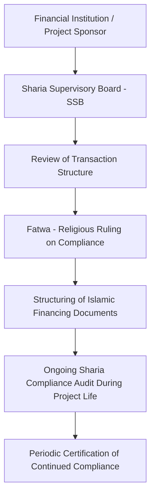
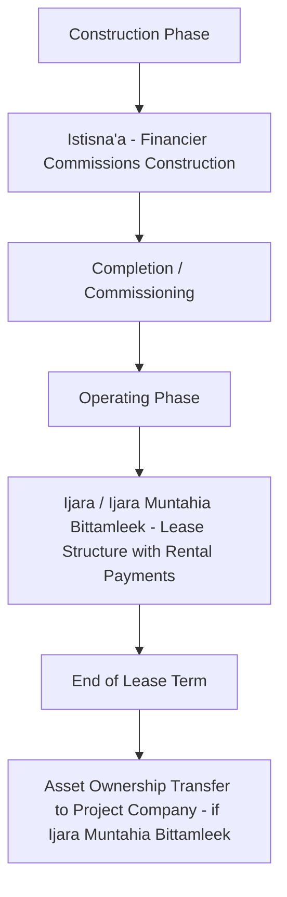
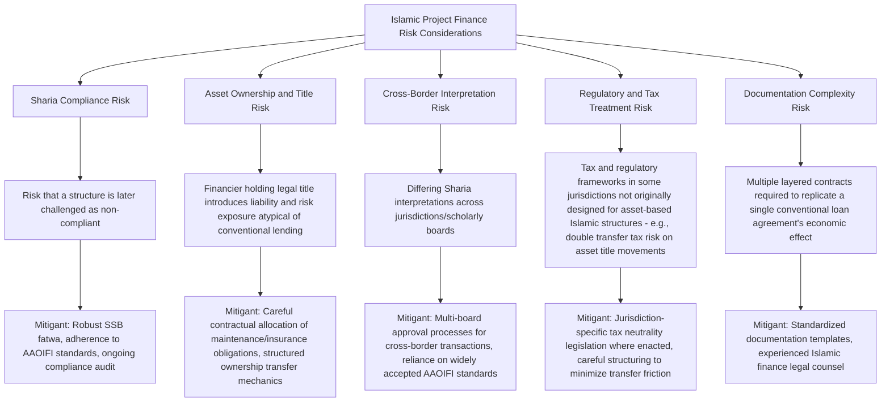

## Principles of Sharia-Compliant Project Financing

### Overview and Context

Sharia-compliant project financing structures large-scale infrastructure and industrial project funding in accordance with Islamic legal principles derived from the Quran, Hadith, and juristic interpretation (fiqh). Rather than constituting a separate asset class, Islamic project finance is better understood as a **parallel structuring methodology** applied to the same underlying projects (power, infrastructure, oil and gas, real estate) covered elsewhere in project finance practice, substituting interest-based debt instruments with contracts built around asset ownership, profit-and-loss sharing, or fee-based service arrangements.

Islamic project finance has grown substantially in significance across the Gulf Cooperation Council (GCC), Southeast Asia (particularly Malaysia and Indonesia), and increasingly in cross-border and hybrid structures involving conventional international lenders alongside Islamic financial institutions, often within the same project financing (a "dual-tranche" or parallel-structure approach).

### Core Sharia Principles Governing Financial Transactions

**1. Prohibition of Riba (Interest)**

- The central prohibition in Islamic finance: charging or paying interest on money lent is prohibited, as money itself is not considered a commodity that can generate a return simply through the passage of time
- This does not prohibit profit generation broadly — it specifically prohibits a predetermined, guaranteed return on a pure loan of money divorced from risk-sharing in a real underlying asset or venture

**2. Prohibition of Gharar (Excessive Uncertainty)**

- Contracts must avoid excessive ambiguity, speculation, or uncertainty regarding subject matter, price, or delivery terms
- This principle affects the permissibility of certain derivative instruments and speculative contracts common in conventional finance (e.g., pure speculative options), requiring Islamic finance to develop alternative risk-management structures

**3. Prohibition of Maysir (Gambling/Speculation)**

- Transactions that resemble gambling — where gain for one party is entirely contingent on chance or the loss of another party without productive underlying economic activity — are prohibited
- This principle intersects with Gharar in constraining purely speculative financial instruments

**4. Asset-Backing Requirement**

- Financial transactions must generally be linked to, and backed by, a tangible, identifiable underlying asset or economic activity, rather than being purely financial transactions divorced from real economic substance
- This is the structural foundation underlying most Islamic financing instruments: the financier typically must own, or have an ownership-like interest in, an asset before earning a return connected to it

**5. Prohibition of Investment in Haram (Prohibited) Activities**

- Financing cannot be directed toward businesses or activities considered impermissible under Sharia — commonly cited categories include alcohol, gambling, pork-related products, conventional (interest-based) financial services, and weapons manufacturing in some interpretations
- Project screening for Sharia compliance therefore includes both the financing structure itself and the underlying business activity being financed

**6. Profit-and-Loss Sharing (as a Preferred, Though Not Universal, Principle)**

- Islamic finance conceptually favors structures where the financier shares in the genuine risk and return of the underlying venture (equity-like participation) rather than earning a fixed, risk-free return
- In practice, many Islamic financing instruments (particularly those used in project finance) are structured around asset-based, fee-generating, or cost-plus-profit mechanisms that achieve debt-like risk/return profiles while satisfying the underlying Sharia requirements — a widely discussed feature of how Islamic project finance has evolved to meet the practical financing needs of large infrastructure projects

### Sharia Governance and Compliance Structure

- **Sharia Supervisory Board (SSB)**: A panel of qualified Islamic scholars (typically with both religious and financial expertise) that reviews and approves the structure of a financing transaction, issuing a **fatwa** (religious ruling) confirming compliance
- **AAOIFI Standards**: The Accounting and Auditing Organization for Islamic Financial Institutions publishes widely referenced (though not universally mandatory) standards for structuring and accounting treatment of Islamic financial instruments, providing a degree of structural consistency across jurisdictions
- **Divergence in interpretation**: Sharia interpretation varies across schools of Islamic jurisprudence and individual scholarly boards, meaning a structure accepted by one SSB may face scrutiny from another — cross-border Islamic financings frequently require alignment across multiple boards or jurisdictions' standards

### Core Islamic Financing Instruments Used in Project Finance

| Instrument | Structure | Project Finance Application |
| --- | --- | --- |
| **Istisna'a** | A contract for manufacture/construction, where the financier commissions an asset to be built to specification, paying the contractor/developer in agreed installments | Construction-phase financing — the financier effectively pre-pays construction costs, structured as a sale-of-future-asset contract rather than a loan |
| **Ijara** | A lease structure — the financier (as lessor) owns the asset and leases it to the project company (lessee) for periodic rental payments | Operational-phase financing — functions economically similar to a finance lease, with rental payments providing the financier's return |
| **Ijara Muntahia Bittamleek** | An Ijara structured with an ownership transfer to the lessee at lease end (via sale, gift, or gradual transfer) | Common structure for infrastructure assets where the project company will ultimately own the asset outright, similar in economic effect to a lease-to-own arrangement |
| **Murabaha** | A cost-plus-profit sale — the financier purchases an asset/commodity and resells it to the project company at a disclosed markup, payable in installments | Procurement/equipment financing within a broader project structure |
| **Musharaka** | A partnership structure where financier and project sponsor jointly contribute capital and share profits (per agreed ratio) and losses (proportional to capital contribution) | Equity-like project financing, particularly in structures emphasizing genuine risk-sharing |
| **Diminishing Musharaka** | A partnership where the financier's ownership share is progressively bought out by the project company over time through periodic payments | Common in real estate and infrastructure financing, blending partnership principles with an amortizing repayment structure |
| **Mudaraba** | A profit-sharing arrangement where one party provides capital (rab-ul-mal) and the other provides management/expertise (mudarib), sharing profits per an agreed ratio while the capital provider bears financial losses (absent mudarib misconduct/negligence) | Investment fund and some equity-financing structures within Islamic project finance |
| **Sukuk** | Often described as an "Islamic bond," though structurally an investment certificate representing an undivided beneficial ownership interest in underlying assets, usufruct rights, or a specific project/venture | Capital markets financing for large projects, functioning as a Sharia-compliant substitute for conventional project bonds |

### Combining Instruments — The "Hybrid" Structuring Approach

In practice, large project financings frequently combine multiple Islamic instruments to match the project's different life-cycle phases and risk profiles:

This "Istisna'a-Ijara" combination is a widely used structural pattern in Islamic project finance: the financier funds construction under an Istisna'a contract (taking on completion/construction risk as the asset's eventual owner), then leases the completed asset to the project company under an Ijara structure once operational, generating a rental-based return stream analogous to a conventional term loan's amortization schedule.

### Structural Comparison — Islamic vs. Conventional Project Finance

| Feature | Conventional Project Finance | Islamic Project Finance |
| --- | --- | --- |
| **Core return mechanism** | Interest on principal (fixed or floating rate) | Rental payments (Ijara), profit markup (Murabaha), or profit-sharing (Musharaka/Mudaraba) |
| **Underlying legal relationship** | Lender-borrower (debt) | Lessor-lessee, buyer-seller, or partner-partner, depending on instrument |
| **Asset ownership during financing** | Borrower typically owns the asset (subject to security/mortgage) | Financier frequently holds legal or beneficial title during the financing period (particularly under Ijara structures) |
| **Risk-sharing philosophy** | Lender's return is generally fixed regardless of project performance (subject to default) | Structures conceptually favor some alignment between financier return and underlying asset performance, though many instruments in practice produce debt-like fixed payment schedules |
| **Prepayment/rebate treatment** | Prepayment penalties or make-whole provisions | Rebate (Ibra) mechanisms are common — voluntary reduction of amounts owed upon early settlement, since charging a penalty resembling additional "interest" for early repayment raises Sharia compliance concerns |
| **Default/late payment** | Default interest or penalty interest accrues | Late payment compensation is structured carefully to avoid resembling interest — often directed to charity rather than retained as financier profit, per many Sharia interpretations |

### Risk Allocation Considerations Distinctive to Islamic Structures

### Dual/Parallel Tranche Structures in Practice

A common approach in large, internationally syndicated project financings is to structure **parallel conventional and Islamic tranches** within the same overall financing:

- Conventional lenders participate via standard interest-bearing loan agreements
- Islamic financial institutions participate via an economically equivalent Islamic instrument (commonly Ijara or a combined Istisna'a-Ijara structure) sized to achieve the same funding contribution and repayment profile
- Both tranches are typically structured with matching security, intercreditor arrangements, and repayment schedules, allowing the two tranches to rank pari passu and be serviced from the same project cash flow waterfall
- This approach allows large projects (particularly in GCC and Southeast Asian markets) to access both conventional international bank liquidity and Islamic financial institution liquidity within a single, coordinated financing structure

[Inference] Dual-tranche structuring has become a widely adopted practical solution for large project financings seeking to maximize available liquidity across both conventional and Islamic capital pools; the precise documentation and intercreditor mechanics vary by transaction and jurisdiction, and the availability of Islamic liquidity at competitive terms depends on market conditions and the specific project's sector and jurisdiction.

### Common Structuring and Modeling Pitfalls

- Assuming a single universally accepted Sharia interpretation exists; structures acceptable to one Sharia Supervisory Board may require modification for acceptance by another, particularly across GCC versus Southeast Asian jurisdictional approaches
- Treating Ijara rental payments as economically identical to conventional loan interest in every respect without accounting for the distinct legal consequences of the financier's asset ownership (e.g., certain maintenance or insurance obligations may fall on the owner/lessor under some interpretations rather than the lessee)
- Overlooking jurisdiction-specific tax and regulatory friction arising from the multiple asset transfers embedded in some Islamic structures (e.g., potential double stamp duty or transfer tax exposure), which some jurisdictions have addressed through specific tax-neutrality legislation and others have not
- Failing to build in appropriate rebate (Ibra) and late-payment compensation mechanics that satisfy Sharia requirements while still providing the financier with commercially necessary incentive structures
- Underestimating the additional documentation complexity and time required to structure and obtain Sharia board approval for multi-instrument, dual-tranche, cross-border financings compared to a single conventional facility agreement

**Related Topics:**

- Sukuk Structuring and Islamic Capital Markets Financing
- Istisna'a-Ijara Combined Structures for Infrastructure Construction
- Musharaka and Diminishing Musharaka in Equity-Style Project Financing
- AAOIFI Standards and Sharia Governance Frameworks
- Dual-Tranche (Conventional/Islamic) Syndicated Project Financing
- Power Project Finance in GCC and Southeast Asian Markets
- Cross-Border Tax Neutrality Legislation for Islamic Finance Structures
- Islamic Trade Finance Instruments (Murabaha, Salam)
- Intercreditor Arrangements in Mixed Conventional/Islamic Financing Structures
- Comparative Risk Allocation: Conventional vs. Islamic Project Finance