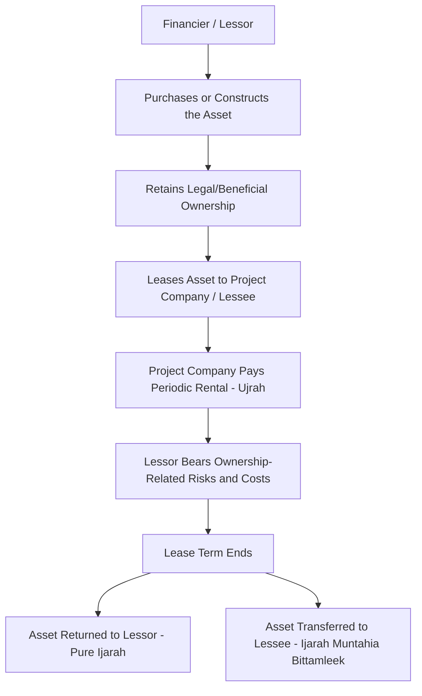
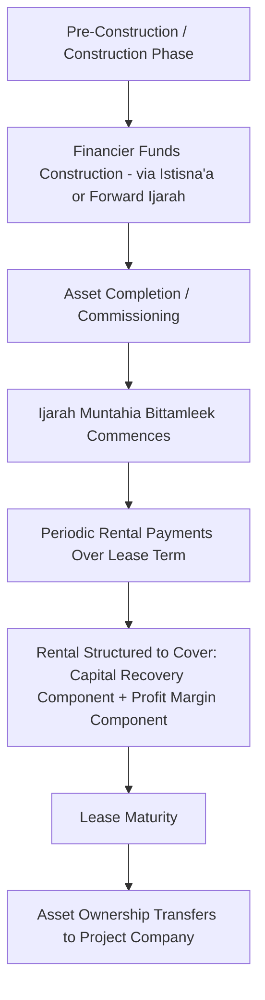

## Ijarah Lease-Based Structures


### Overview and Context

Ijarah is the Islamic finance instrument most widely used in project finance and asset financing generally, structurally equivalent to a lease agreement in which the financier (as lessor/owner) grants the project company (as lessee) the right to use a specific asset in exchange for periodic rental payments. Ijarah satisfies the core Sharia requirement that a financier's return must derive from a genuine ownership interest in a real, identifiable asset rather than from a pure loan of money, since the lessor retains legal (and often beneficial) ownership of the underlying asset throughout the lease term and earns its return as compensation for the use of that asset, not as interest on capital lent.

Because of this structural flexibility — combining an asset-backed, Sharia-compliant legal form with a cash flow profile that can be engineered to closely resemble conventional amortizing debt — Ijarah has become the dominant building block for Islamic project finance facilities, frequently used in combination with Istisna'a (construction-phase financing) as introduced under the broader principles of Sharia-compliant project financing.

### Core Ijarah Structure



### Key Sharia Requirements for a Valid Ijarah

**1. Genuine Ownership by the Lessor**

- The lessor must actually own the asset (or acquire ownership as part of the structuring) before leasing it — a lessor cannot lease an asset it does not own, distinguishing Ijarah fundamentally from a conventional secured loan where the borrower typically retains ownership throughout

**2. Existence of the Asset**

- Unlike some other Islamic contracts that can apply to future or to-be-manufactured assets (such as Istisna'a), a standard Ijarah generally requires the leased asset to exist and be identifiable at the time of the lease, which is why large infrastructure projects commonly combine an Istisna'a contract during construction with an Ijarah taking effect only once the asset is completed and operational

**3. Ownership-Related Risk Allocation**

- As owner, the lessor bears risks and costs associated with ownership of the asset — under many Sharia interpretations, this includes major structural maintenance and insurance/takaful costs necessary to keep the asset fit for its intended use, distinguishing Ijarah from a conventional finance lease where such costs typically fall entirely on the lessee
- This allocation is a genuine point of structural distinction (not merely documentary) from conventional leasing, and financing documentation must carefully specify which maintenance obligations are lessor-borne (ownership-related) versus lessee-borne (operational/usage-related)

**4. Defined Rental and Usage Terms**

- The rental amount, payment schedule, and permitted use of the asset must be clearly specified, avoiding the Gharar (excessive uncertainty) that Sharia principles prohibit
- Rentals may be fixed, or may be structured with periodic adjustment mechanisms (e.g., benchmarked to a reference rate for repricing purposes), provided the adjustment mechanism itself is clearly defined and not left to excessive future uncertainty

**5. Risk of Loss**

- If the asset is destroyed or rendered unusable through no fault of the lessee, the lessor (as owner) generally bears the loss under most Sharia interpretations, since risk follows ownership — this has led to widespread use of Takaful (Islamic insurance) or conventional insurance (where Takaful is unavailable) to manage this exposure

### Ijarah Variants

**1. Operating Ijarah**

- A standard lease without any commitment or expectation that ownership will transfer to the lessee at lease end
- The lessor retains residual value risk (the asset's value at lease end) and may re-lease or sell the asset to another party

**2. Ijarah Muntahia Bittamleek (Ijarah wa Iqtina) — Lease Ending in Ownership**

- Structured so that the asset ultimately transfers to the lessee at the end of the lease term, via one of several permissible mechanisms:
  - A separate, independent sale contract (at a nominal or pre-agreed price) executed at lease maturity
  - A gift (hiba) of the asset to the lessee upon completion of all rental payments
  - A gradual transfer of ownership units to the lessee over the lease term (functionally resembling Diminishing Musharaka mechanics blended with a lease structure)
- Critically, the transfer/sale/gift undertaking must be structured as a **separate, independent contract** from the lease itself under most Sharia interpretations — the lease and the eventual transfer cannot be conditioned on each other in a way that effectively makes the "lease" a disguised sale/loan from inception, which would undermine the Sharia basis for the structure
- This is the dominant variant used in project finance where the ultimate objective is for the project company to own the infrastructure asset outright once financing obligations are satisfied

**3. Forward Ijarah (Ijarah Mawsufa fi al-Dhimma)**

- A lease of an asset described by specification but not yet in existence — used specifically to bridge the construction-phase gap where a standard Ijarah's "existing asset" requirement cannot be met
- Rental payments may begin either upon completion or, in some structures, from an earlier point with adjusted terms — this variant effectively performs a similar economic function to the Istisna'a-Ijara combination discussed in Islamic project finance principles more broadly, and the two approaches (separate Istisna'a-then-Ijarah vs. a single Forward Ijarah) are alternative structuring routes to the same underlying objective

### Application Across the Project Lifecycle



**Rental structuring mechanics:**

Each periodic rental payment is typically structured (internally, for financial modeling purposes) as containing two economic components analogous to a conventional amortizing loan payment:

- A **capital/principal recovery component**, representing return of the lessor's original investment in acquiring/constructing the asset
- A **profit/return component**, representing the lessor's compensation for the use of its capital and assumption of ownership risk over the lease term

While these components are not always explicitly separated in the underlying legal documentation (which frames the payment simply as "rental"), financial models used by both project sponsors and financiers commonly decompose the rental schedule this way to allow direct comparison with, and blending alongside, conventional debt tranches in dual-tranche financings.

### Key Financial and Structuring Metrics

| Metric | Purpose |
| --- | --- |
| **Implicit Rental Rate / Profit Rate** | The effective periodic return embedded in the rental schedule, calculated analogously to an interest rate for comparison with conventional debt pricing |
| **Rental Coverage Ratio** | Project cash flow available relative to scheduled rental payment obligation — functions analogously to DSCR in conventional project finance |
| **Residual Value (Operating Ijarah only)** | Asset value assumption at lease end, relevant to lessor's risk exposure and pricing where ownership transfer is not contemplated |
| **Capital Recovery Schedule** | The internally modeled amortization profile of the capital component within the rental stream, used for financial reporting and comparison with conventional facilities |
| **Takaful/Insurance Cost Allocation** | Ownership-related insurance costs borne by the lessor, factored into overall project cost structure |

### Illustrative Rental Structuring Example

Assume an Ijarah Muntahia Bittamleek structure financing a completed infrastructure asset:

- Asset value at commencement of Ijarah (post-construction): $300 million
- Lease term: 15 years
- Target implicit profit rate: 6.0% per annum (analogous to a conventional cost of debt benchmark)
- Ownership transfer to project company at lease end via nominal sale contract

**Step 1 — Approximate annual rental payment (using an amortizing annuity structure over 15 years at 6.0%, for illustrative modeling purposes):**

$$\text{Annual Rental} = 300{,}000{,}000 \times \left(\dfrac{0.06}{1-(1.06)^{-15}}\right) \approx 300{,}000{,}000 \times 0.1030 \approx \$30.9\text{ million/year}$$

**Step 2 — Illustrative decomposition of Year 1 rental (for internal financial modeling purposes only):**

- Profit/return component (Year 1): $300{,}000{,}000 \times 0.06 = \$18.0\text{ million}$
- Capital recovery component (Year 1): $30{,}900{,}000 - 18{,}000{,}000 = \$12.9\text{ million}$

This decomposition is used for internal financial modeling and comparability purposes; the legal characterization of the payment remains a unified rental amount under the Ijarah contract, not a bifurcated interest-and-principal payment as in conventional debt documentation. [Inference] This is a simplified illustrative annuity structure; actual Ijarah rental schedules in project finance are negotiated instruments that may incorporate step-up/step-down profiles, periodic rate reset mechanisms, or alignment with a broader project cash flow waterfall, and will differ from this simplified flat-annuity approximation.

### Risk Allocation Diagram

```mermaid
flowchart TD
    A[Ijarah Structure Risk Allocation] --> B[Ownership-Related Risk - Lessor]
    A --> C[Usage/Operational Risk - Lessee]
    A --> D[Sharia Compliance Risk]
    A --> E[Residual Value Risk - Operating Ijarah]
    A --> F[Rental Payment/Credit Risk]

    B --> B1[Major structural maintenance, insurance/Takaful, asset destruction not caused by lessee]
    B1 --> B1a[Mitigant: Takaful/insurance arrangements, clear contractual maintenance allocation, reserve mechanisms]

    C --> C1[Day-to-day operational maintenance, misuse, or damage caused by lessee]
    C1 --> C1a[Mitigant: Clear usage covenants, lessee-borne operational maintenance obligations]

    D --> D1[Risk that lease-and-transfer structuring is challenged as a disguised sale/loan from inception]
    D1 --> D1a[Mitigant: Structuring the ownership transfer as a genuinely separate, independent contract, SSB approval]

    E --> E1[Asset value at lease end lower than anticipated - relevant only where no ownership transfer is contemplated]
    E1 --> E1a[Mitigant: Conservative residual value assumptions, structuring toward Ijarah Muntahia Bittamleek to eliminate this risk where full ownership transfer is intended]

    F --> F1[Lessee default or late rental payment]
    F1 --> F1a[Mitigant: Rebate (Ibra) mechanisms for early settlement, carefully structured late payment compensation directed to charity rather than lessor profit under many interpretations]
```

### Common Structuring and Modeling Pitfalls

- Conditioning the ownership transfer mechanism on the lease agreement itself in a way that collapses the transaction into a disguised interest-bearing loan from a Sharia compliance perspective, rather than maintaining genuinely separate, independent contracts
- Applying conventional finance lease accounting and risk allocation assumptions (lessee bears all maintenance/insurance) without adjusting for the ownership-related risk allocation that many Sharia interpretations require the lessor to retain
- Attempting to lease an asset that does not yet exist under a standard Ijarah rather than using the appropriate Forward Ijarah or combined Istisna'a-Ijarah structure for construction-phase financing
- Structuring late payment penalties that are retained as lessor profit, which raises Sharia compliance concerns under many interpretations — appropriate structures typically direct such amounts to charitable purposes rather than lessor revenue
- Failing to align rental payment timing and amounts with the project's actual operating cash flow profile, particularly where the underlying asset has a ramp-up period before generating full operating revenue
- Assuming uniform treatment of maintenance/insurance risk allocation across all jurisdictions and Sharia boards, when interpretations on lessor versus lessee ownership-risk responsibilities can vary

**Related Topics:**

- Principles of Sharia-Compliant Project Financing
- Istisna'a Construction-Phase Financing and the Istisna'a-Ijarah Combination
- Diminishing Musharaka Structures in Real Asset Financing
- Sukuk Structuring Using Ijarah as the Underlying Asset Structure
- Takaful (Islamic Insurance) in Asset-Based Financing Structures
- AAOIFI Standards Governing Ijarah Contracts
- Dual-Tranche Conventional/Islamic Syndicated Financing
- Rebate (Ibra) Mechanisms in Islamic Finance Early Settlement
- Cross-Border Sharia Interpretation Divergence in Structured Finance
- Power and Infrastructure Project Finance in GCC and Southeast Asian Markets