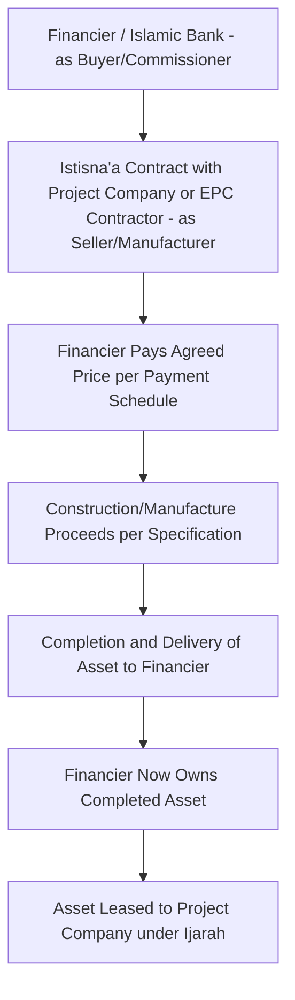
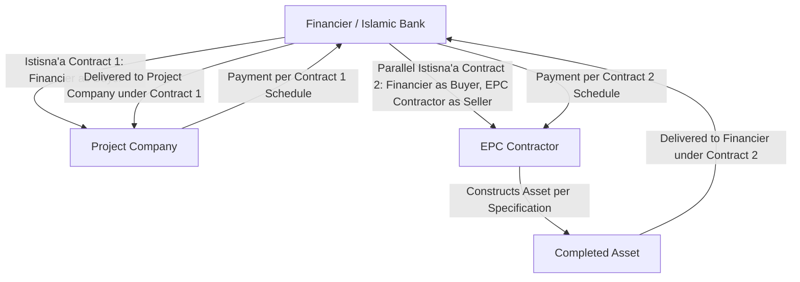
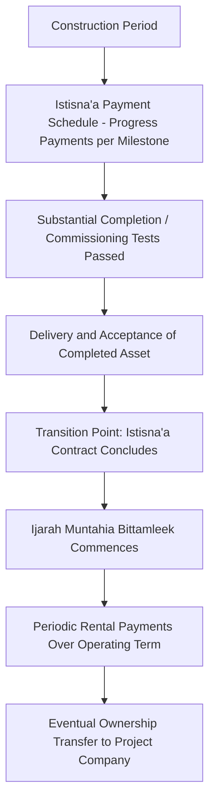
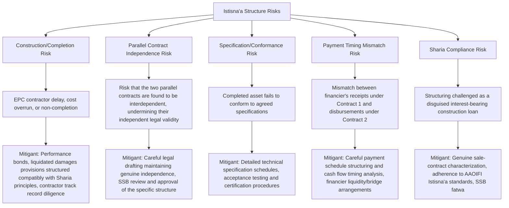

## Istisna Construction-Phase Structures

### Overview and Context

Istisna'a is the Islamic finance contract used specifically to fund the construction or manufacture of an asset that does not yet exist at the time the contract is formed — making it the natural Sharia-compliant instrument for the construction phase of project finance, where a standard Ijarah (lease) cannot apply because Ijarah generally requires the leased asset to already exist and be identifiable. Istisna'a is structured as a contract of sale of a future manufactured or constructed asset, under which the financier (as buyer/commissioner) agrees to pay the manufacturer/contractor (as seller) an agreed price, in a manner and timing agreed between the parties, in exchange for delivery of the completed asset built to specification.

Because most large infrastructure projects require multi-year construction before any asset exists to lease, Istisna'a is most commonly used in combination with Ijarah (as introduced in the principles of Sharia-compliant project financing and detailed further under Ijarah lease-based structures) — Istisna'a covers the construction period, and an Ijarah (typically Ijarah Muntahia Bittamleek) takes over once the asset is completed and operational.

### Core Istisna'a Structure

### Key Sharia Requirements for a Valid Istisna'a

**1. Permissible Departure from the "Existing Asset" Rule**

- Unlike most Islamic sale contracts, which require the subject matter to exist and be owned by the seller at contract formation (to avoid Gharar, or excessive uncertainty), Istisna'a is a recognized exception developed specifically to accommodate manufacturing and construction contracts, reflecting long-standing commercial necessity recognized in classical Islamic jurisprudence
- This exception is narrowly scoped to manufactured or constructed goods (buildings, infrastructure, ships, equipment) rather than extending broadly to all future/uncertain subject matter

**2. Precise Specification Requirement**

- Because the asset does not yet exist, the contract must specify the subject matter with sufficient precision — dimensions, materials, quality standards, technical specifications — to eliminate the Gharar that would otherwise arise from the asset's non-existence at contract formation
- This typically requires detailed technical schedules, engineering specifications, and standards referencing (e.g., specific codes, EPC contract technical annexes) to be incorporated into or referenced by the Istisna'a contract

**3. Flexible Payment Terms**

- Unlike Salam (another Islamic forward-sale contract, generally used for fungible commodities, which requires full price payment upfront), Istisna'a payment terms are flexible — payment can be made in a lump sum, in installments tied to construction milestones, or deferred to completion, at the parties' agreement
- This flexibility is what makes Istisna'a particularly suited to project finance, where payment schedules are naturally structured around progress milestones (foundation, structural completion, mechanical completion, commissioning) mirroring conventional EPC contract payment mechanics

**4. Delivery and Quality Conformance**

- The completed asset must conform to the specifications agreed at contract formation; the buyer (financier) generally has the right to reject non-conforming delivery, similar in commercial effect to acceptance testing and completion certificates under conventional EPC contracts

**5. Risk During Construction**

- Sharia treatment of construction-period risk (e.g., cost overrun, delay, force majeure) depends on the specific contractual allocation agreed between the parties and the structuring approach used — this is an area where Istisna'a project finance structures require careful contractual drafting to align Sharia-compliant risk allocation with the practical risk-transfer mechanisms (liquidated damages, performance bonds, parallel Istisna'a arrangements) used in conventional construction contracts

### The Parallel Istisna'a Structure

A structuring technique frequently used in project finance to bridge the financier's role as "buyer" under one Istisna'a with the practical reality that the financier is not itself a construction company:

**Mechanics:**

- Under **Istisna'a Contract 1**, the financier acts as seller/manufacturer to the project company (as buyer), agreeing to deliver a completed asset built to specification, with the project company paying an agreed price on agreed terms
- Under **Istisna'a Contract 2** (the "parallel" Istisna'a), the same financier acts as buyer, commissioning the actual construction from a genuine EPC contractor (as seller/manufacturer), who undertakes the physical construction work
- The two contracts are legally independent of one another — the financier's obligations under Contract 1 to the project company are not conditional on performance under Contract 2 with the EPC contractor, and vice versa — which is a structural requirement to maintain the validity of both as genuine, distinct Istisna'a sale contracts rather than the financier merely acting as a pass-through conduit or guarantor
- This structure allows the financier to earn a margin (the difference between the price received under Contract 1 and the price paid under Contract 2) while genuinely taking on the intermediary buyer-seller role that Sharia principles require, rather than simply lending money against a construction contract

[Inference] The precise legal independence required between the two parallel contracts, and the extent to which practical risk (e.g., EPC contractor default) can be indirectly managed through contract drafting without undermining that independence, is a nuanced area of Sharia structuring that varies by Sharia Supervisory Board interpretation; specific transaction structuring should be reviewed with qualified Sharia advisors and legal counsel for the applicable jurisdiction and board.

### Istisna'a-to-Ijarah Transition in Project Finance

**Financial modeling implications of the transition:**

- During the Istisna'a (construction) phase, the financier's payments to the contractor (whether direct or via a parallel Istisna'a structure) function economically similar to construction-phase drawdowns under a conventional construction facility
- No "rental" or return is typically earned by the financier during pure Istisna'a-phase financing in the classical structure, though many project financings layer in a **capital contribution or advance payment mechanism** structured so that the project company begins making payments (structured as installments under Istisna'a Contract 1) even during the construction period, providing the financier a return stream from an earlier point — this reflects one of several structuring variations used to align Islamic construction financing with conventional project finance's typical requirement for financier compensation throughout the capital deployment period
- Upon completion, the transition to Ijarah introduces the ongoing periodic rental mechanics detailed under Ijarah lease-based structures, with the rental schedule sized to recover the financier's total construction-phase capital outlay plus an agreed profit margin over the operating term

### Key Financial and Structuring Metrics

| Metric | Purpose |
| --- | --- |
| **Istisna'a Price Schedule** | The agreed payment installments over the construction period, structured to mirror conventional EPC milestone payment schedules |
| **Parallel Istisna'a Margin** | The financier's profit, calculated as the spread between the price received under Contract 1 and the price paid under Contract 2 |
| **Construction-to-Operation Transition Value** | The asset value/cost basis carried forward from the Istisna'a phase into the subsequent Ijarah rental calculation |
| **Milestone Completion Certification Requirements** | Technical acceptance criteria triggering each Istisna'a payment installment, analogous to conventional EPC certified milestone completion |
| **Sharia-Compliant Delay/Penalty Mechanism** | Compensation structure for contractor delay, carefully structured to avoid characterization as interest-like penalty charges |

### Worked Example: Simplified Parallel Istisna'a Economics

Assume a project financing an infrastructure asset via a parallel Istisna'a structure:

- Total construction cost payable to EPC contractor under Istisna'a Contract 2: $400 million, paid across four milestone installments over a 3-year construction period
- Financier's price to project company under Istisna'a Contract 1: $460 million, payable over the same construction period per an agreed installment schedule that begins after the first milestone
- Financier's target margin: the $60 million spread compensates for capital deployment, construction-period risk intermediation, and the financier's structuring role

**Step 1 — Financier's gross margin on the parallel Istisna'a structure:**

$$460{,}000{,}000 - 400{,}000{,}000 = \$60{,}000{,}000$$

**Step 2 — Approximate implied margin as a percentage of construction cost:**

$$\dfrac{60{,}000{,}000}{400{,}000{,}000} = 15\%\text{ (over the construction period, not annualized)}$$

**Step 3 — Illustrative effective annualized return (simplified, assuming the margin accrues roughly evenly across a 3-year construction period):**

$$\text{Approximate annualized return} \approx \dfrac{15\%}{3} = 5\%\text{ per annum (highly simplified approximation)}$$

This illustrates the basic margin mechanics of a parallel Istisna'a structure; the actual effective annualized return depends heavily on the specific timing of payments under both contracts (Contract 1 receipts vs. Contract 2 disbursements), which in practice are carefully structured and modeled using detailed cash flow timing analysis rather than a simple straight-line approximation. [Inference] This simplified example does not account for the specific timing mismatches between payment schedules under the two parallel contracts, which materially affect the financier's actual funding cost and realized return; actual transaction structuring requires detailed period-by-period cash flow modeling of both contracts in parallel.

### Risk Allocation Diagram

### Common Structuring and Modeling Pitfalls

- Attempting to apply a standard Ijarah structure during the construction phase when the underlying asset does not yet exist, rather than using Istisna'a (or Forward Ijarah) as the appropriate construction-phase instrument
- Structuring the two parallel Istisna'a contracts with cross-conditionality that undermines their required legal independence, risking Sharia compliance challenge
- Failing to specify construction technical requirements with sufficient precision within the Istisna'a contract, creating Gharar exposure that could jeopardize the contract's validity
- Treating the transition from Istisna'a to Ijarah as a simple accounting handoff without addressing the legal and documentation requirements for a clean, well-defined transition point (completion certification, asset delivery/acceptance, commencement of the Ijarah)
- Overlooking payment timing mismatches between the financier's two parallel contracts, which can create real liquidity/funding cost exposure for the financier if not carefully modeled and structured
- Applying conventional construction loan default and penalty mechanics directly without adapting them to Sharia-compliant equivalents (e.g., avoiding interest-like late payment penalties retained as financier profit)

**Related Topics:**

- Ijarah Lease-Based Structures (Post-Construction Financing Phase)
- Principles of Sharia-Compliant Project Financing
- Parallel Contract Structuring and Legal Independence Requirements in Islamic Finance
- AAOIFI Standards Governing Istisna'a Contracts
- Sukuk al-Istisna'a for Capital Markets Construction Financing
- EPC Contract Structuring and Milestone Payment Mechanics (Comparative Conventional Approach)
- Dual-Tranche Conventional/Islamic Syndicated Project Financing
- Sharia-Compliant Delay and Penalty Compensation Mechanisms
- Diminishing Musharaka as an Alternative Construction-Phase Structure
- Power and Infrastructure Project Finance in GCC and Southeast Asian Markets