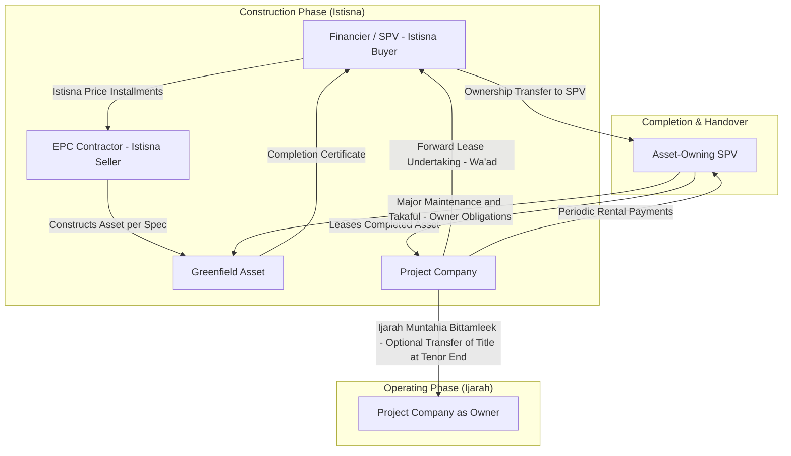

## Hybrid Istisna-Ijarah Structures for Greenfield Projects

### Overview

A hybrid Istisna-Ijarah structure combines two Shariah-compliant contracts to finance the construction and subsequent operation of a greenfield asset (a power plant, toll road, desalination facility, or similar infrastructure). The Istisna contract governs the construction phase, under which the financier (or a special purpose vehicle acting on its behalf) commissions a manufacturer or contractor to build a specified asset for a pre-agreed price, paid in installments during construction. Once the asset is completed and delivered, the structure transitions into an Ijarah (lease) contract, under which the project company leases the completed asset from the financier over an extended tenor, with rental payments structured to amortize the financier's investment plus a profit margin.

This hybrid is the dominant Islamic finance structure for greenfield project finance because a pure Ijarah cannot finance an asset that does not yet exist (Ijarah requires a specified, existing usufruct-bearing asset), while a pure Istisna is a construction-phase-only contract that does not naturally extend into a long-term financing and revenue-generation mechanism. Combining them bridges the construction risk period and the operational cash flow period under two internally consistent contracts rather than forcing a single contract to do both jobs.

### Shariah Foundations

**Istisna (Manufacturing/Construction Contract)**

Istisna is a sale contract for a to-be-manufactured or to-be-constructed asset, where the price, specifications, and delivery timeline are agreed upfront, but the asset does not yet exist at contract signing. Unlike Salam (forward sale), Istisna does not require full upfront payment; the price can be paid in installments tied to construction milestones. The financier (as buyer under a "purchase Istisna") commissions the asset from a contractor/manufacturer (as seller under a "parallel Istisna" or back-to-back construction contract), and simultaneously commits to deliver the completed asset to the ultimate project company (as buyer under a separate Istisna, or via the forward Ijarah undertaking described below).

Key Istisna conditions:

- The subject matter must be something customarily manufactured or constructed (not a generic commodity).
- Specifications (materials, dimensions, capacity, performance standards) must be precisely defined to eliminate *gharar* (excessive uncertainty).
- The price can be fixed at contract inception even though payment is staged.
- Unlike Salam, the delivery date need not be fixed with the same rigidity, though a schedule is standard commercial practice.

**Ijarah (Lease Contract)**

Ijarah is a usufruct-transfer contract where the lessor retains ownership of the asset and transfers only the right to use it, in exchange for rental payments. For it to be Shariah-compliant:

- The leased asset must exist and be specified at the time the lease commences (hence the need for Istisna to complete construction first).
- Ownership risk (major maintenance, insurance/*takaful*, and asset destruction risk) remains with the lessor unless structured otherwise via a separate service agency arrangement.
- Rental amounts can be fixed, floating (benchmarked), or stepped, and are permissible to be structured to fully amortize the asset's cost plus profit over the lease term (as in Ijarah Muntahia Bittamleek — lease ending in ownership transfer).

**The Forward Lease Undertaking (Ijarah Mawsufa fi al-Dhimmah)**

Because Ijarah cannot attach to a non-existent asset, the hybrid structure uses a *forward lease undertaking* (Ijarah Mawsufa fi al-Dhimmah, "lease of a described obligation") during the construction phase. This is a unilateral promise (*wa'ad*) by the project company to lease the asset once completed, at pre-agreed rental terms. Most Shariah boards (including AAOIFI Shariah Standard No. 9 on Ijarah and No. 11 on Istisna) accept this as a binding promise on the promisor, distinguishing it from an actual lease (which cannot yet exist) and from a bilaterally binding forward contract (which would resemble a prohibited forward sale of usufruct with full mutual commitment before the asset exists).

### Structural Diagram

### Cash Flow Mechanics

**Phase 1 — Construction (Istisna Payments)**

The financier disburses funds to the contractor against milestones (e.g., site mobilization, foundation, structural completion, mechanical completion, commissioning). These disbursements constitute the financier's cost basis, which becomes the principal to be recovered during the Ijarah phase.

$$P_{istisna} = \sum_{i=1}^{n} D_i$$

where $D_i$ is the disbursement at milestone $i$, and $P_{istisna}$ is the total Istisna price (financier's cumulative investment at completion).

**Phase 2 — Operation (Ijarah Rentals)**

Post-completion, rentals are typically structured on an annuity or amortizing basis so that the present value of rental payments recovers $P_{istisna}$ plus the financier's target profit rate $r$ over the lease term $T$:

$$P_{istisna} = \sum_{t=1}^{T} \frac{R_t}{(1+r)^t}$$

where $R_t$ is the rental payable in period $t$. In practice, rentals are often benchmarked to a reference rate (e.g., a interbank offered rate or Islamic interbank benchmark) plus a margin, reset periodically — this is permissible under Shariah as long as the *base* rental mechanism is transparent and not itself interest-bearing debt.

### Risk Allocation

| Risk | Construction Phase (Istisna) | Operating Phase (Ijarah) |
| --- | --- | --- |
| Completion/delay risk | Borne by contractor under parallel Istisna (penalty clauses, liquidated damages) | N/A (asset already complete) |
| Cost overrun risk | Contractor bears under fixed-price Istisna, or financier if cost-plus | N/A |
| Asset ownership/major maintenance | N/A | Lessor (SPV/financier) — cannot be shifted to lessee without invalidating Ijarah, though a separate *ji'alah* or service agency agreement can delegate execution while liability remains with the owner |
| Operating/performance risk | N/A | Project company (lessee) as operator |
| Force majeure / total loss | Contractor/insurer during construction | Lessor, via *takaful* (Islamic insurance) |
| Termination for non-payment | Governed by Istisna default clauses | Governed by Ijarah default and step-in rights |

**Key Points**

- Major maintenance and structural insurance obligations legally sit with the lessor (owner) under Ijarah — a structuring point often misunderstood by conventional financiers used to triple-net leases. Many deals delegate day-to-day maintenance execution to the lessee via a service agency agreement, but Shariah risk (liability) does not transfer.
- The forward lease undertaking (wa'ad) is unilateral from the promisor's side; a bilaterally binding forward Ijarah before the asset exists is generally not accepted by mainstream Shariah boards.
- Rental resets tied to floating benchmarks are permissible, but the *structure* of rental (usufruct-for-payment) must be preserved — it cannot be repackaged as a disguised interest-bearing loan.

### Parallel Istisna and Back-to-Back Contract Design

In most bankable structures, the financier does not itself construct the asset. Instead:

1. **Istisna 1 (Purchase Istisna):** Project company (or SPV acting for it) as buyer commissions the asset from the financier (or Islamic bank/SPV) as seller, agreeing a fixed total price payable over the construction period.
2. **Istisna 2 (Parallel/Back-to-back Istisna):** The financier, in turn, commissions the actual EPC (Engineering, Procurement, Construction) contractor to build the same asset to the same specifications, at a cost typically lower than the Istisna 1 price — the margin between the two is the financier's structuring profit.

This "back-to-back" design isolates the financier from direct construction liability while allowing it to earn a permissible profit as a principal (not merely a lender), which is central to the Shariah legitimacy of the arrangement — the financier must take genuine asset risk during the Istisna phase (title, defect liability exposure) rather than acting as a pure capital conduit.

### Example: Greenfield IPP (Independent Power Producer)

**Scenario:** A 300 MW gas-fired power plant, total EPC cost $450 million, 3-year construction period, 20-year Power Purchase Agreement (PPA) with an offtaker.

**Structuring steps:**

1. SPV (Project Company) enters Istisna with an Islamic financial institution (IFI) as seller, agreeing a completed-asset price of $450 million, payable in a lump sum or deferred schedule post-completion (or the IFI advances progress payments and capitalizes profit into the eventual Ijarah rentals).
2. IFI enters a parallel Istisna with the EPC contractor for $430 million (illustrative), disbursed against milestone certificates verified by an independent engineer.
3. SPV issues a forward lease undertaking (wa'ad) committing to lease the plant from the IFI (or an Ijarah SPV holding legal title) upon completion, at rentals calibrated to amortize $450 million plus target profit over the remaining PPA tenor (say 17 years post-completion).
4. Upon Provisional Acceptance Certificate (mechanical completion and performance testing), the Istisna concludes, title vests with the IFI/Ijarah SPV, and the Ijarah commences.
5. Rentals are structured as Ijarah Muntahia Bittamleek, with a nominal-value or *hiba* (gift) transfer of title to the SPV at the end of year 17, aligning debt amortization with the PPA's revenue stream.

**Sukuk overlay (common in capital markets execution):** The IFI's Istisna and Ijarah receivables are frequently securitized via an Ijarah Sukuk or hybrid Sukuk al-Istisna/Ijarah, where sukuk-holders fund the Istisna disbursements through certificate proceeds and receive periodic distributions from Ijarah rentals once operational — this is the dominant format for Islamic project bonds financing greenfield infrastructure (e.g., independent power projects in Gulf Cooperation Council markets, Malaysian infrastructure Sukuk).

### Comparison with Conventional Project Finance Analogues

| Conventional Concept | Islamic Hybrid Equivalent |
| --- | --- |
| Construction loan / drawdown facility | Istisna progress payments |
| Term loan / amortizing facility (post-COD) | Ijarah rental schedule |
| EPC contract with liquidated damages | Parallel Istisna with penalty clauses |
| Finance lease with bargain purchase option | Ijarah Muntahia Bittamleek |
| Step-in rights / lender security package | Ijarah default remedies, assignment of lease receivables, pledge of SPV shares (via *rahn*) |
| Interest rate benchmark (e.g., a reference lending rate) plus margin | Rental benchmark plus margin (structured as usufruct pricing, not interest) |

[Inference] The exact percentage split between Istisna-phase and Ijarah-phase financier profit recognition varies by jurisdiction and Shariah board interpretation, and is not standardized across AAOIFI-adherent and non-AAOIFI markets — deal-specific fatwas should be treated as authoritative over generic templates.

### Documentation Suite

A bankable hybrid Istisna-Ijarah greenfield financing typically comprises:

1. **Master Istisna Agreement** (Purchase Istisna between SPV and IFI)
2. **Parallel Istisna Agreement** (between IFI and EPC contractor)
3. **Forward Lease Undertaking / Wa'ad to Lease** (unilateral promise from SPV)
4. **Ijarah Head Lease Agreement** (executed on completion, specifying rental schedule, maintenance responsibilities, and takaful obligations)
5. **Service Agency Agreement** (delegating day-to-day maintenance execution to lessee, without transferring ownership liability)
6. **Purchase Undertaking / Sale Undertaking** (for Ijarah Muntahia Bittamleek, governing eventual title transfer — typically at nominal value or via a separate sale contract at lease-end, kept structurally distinct from the lease itself to avoid conflating sale and lease into one non-compliant contract)
7. **Shariah Pronouncement/Fatwa** from the deal's Shariah board or Shariah supervisory committee, certifying each contract and the overall structure
8. **Direct Agreements** with the offtaker (PPA), fuel supplier, and O&M contractor, replicating conventional project finance protections within the Islamic contractual wrapper

### Common Structuring Pitfalls

**Key Points**

- **Commingling sale and lease terms:** Combining the purchase undertaking and the lease agreement into a single document risks characterizing the whole arrangement as a conventional interest-bearing loan disguised as a lease — Shariah boards generally require the sale/transfer mechanism (at lease-end) to be documented separately from the Ijarah itself.
- **Two binding promises pre-completion:** If both parties are bilaterally and irrevocably bound to a future Ijarah before the asset exists (rather than one party making a unilateral wa'ad), the arrangement resembles a forward sale of usufruct, which most Shariah boards do not accept.
- **Ownership risk mismatch:** Attempting to fully shift major maintenance and asset-loss risk to the lessee contractually (as in a conventional finance lease) undermines the Ijarah's Shariah basis, since a lessor who bears none of the ownership risk is not meaningfully "leasing" in the Shariah sense — this exposure is often managed instead via a separate *takaful* pool or reserve funded through the rental structure.
- **Istisna price certainty vs. cost-plus ambiguity:** An Istisna price that is not clearly fixed (or fixed via a clear formula) at contract signing can raise *gharar* concerns; open-ended "cost plus to-be-determined margin" pricing is a recurring point of Shariah board objection.

### Related Topics

- AAOIFI Shariah Standards No. 9 (Ijarah) and No. 11 (Istisna)
- Ijarah Muntahia Bittamleek: title transfer mechanisms and *hiba* vs. sale-at-nominal-value
- Wa'ad (unilateral promise) enforceability across jurisdictions (Malaysian vs. GCC case law)
- Sukuk al-Istisna and Sukuk al-Ijarah as capital markets funding wrappers for hybrid structures
- Diminishing Musharaka as an alternative greenfield structure for equity-heavy projects
- Shariah-compliant step-in rights and security packages (rahn, assignment of receivables, share pledges)
- Takaful (Islamic insurance) structuring for project assets during construction and operation
- Comparative Shariah board interpretations: AAOIFI-adherent markets vs. non-AAOIFI markets (e.g., certain GCC vs. Southeast Asian practice)