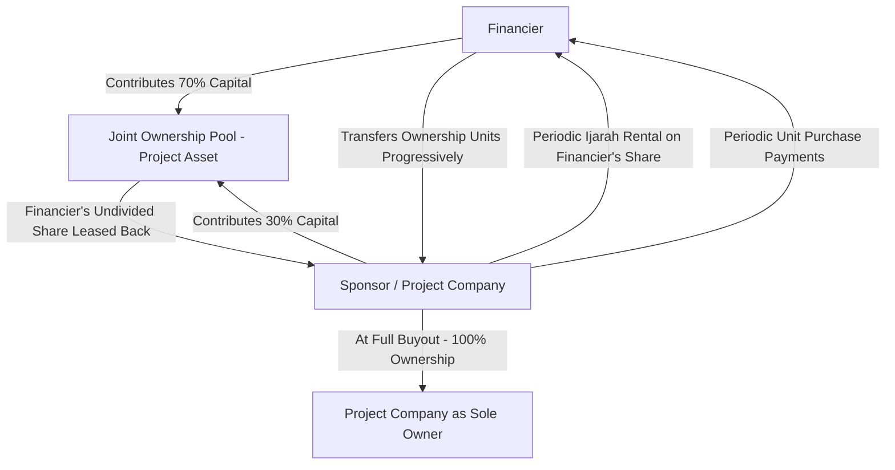

## Musharakah and Profit-Sharing Structures

### Overview

Musharakah is a partnership contract in which two or more parties contribute capital (and, optionally, effort or expertise) to a joint venture, sharing profits according to a pre-agreed ratio and bearing losses strictly in proportion to their respective capital contributions. In project finance, Musharakah is the principal Shariah-compliant equivalent of equity or quasi-equity financing, and — in its "diminishing" form — the principal equivalent of an amortizing term loan that also confers genuine ownership risk on the financier. It is distinguished from debt-based Islamic contracts (Murabaha, Istisna, Ijarah) by the fact that the financier's return is not fixed or predetermined; it is contingent on actual project performance, which is the central Shariah rationale for permitting a profit at all (return is compensation for risk-bearing, not for the mere passage of time).

### Core Shariah Principles

**Profit and Loss Sharing (PLS) Asymmetry**

The foundational rule, drawn from classical fiqh and reaffirmed in AAOIFI Shariah Standard No. 12 (Sharikah/Musharakah), is:

- **Profit-sharing ratio** may be freely negotiated between partners and need not mirror capital contribution ratios (e.g., a managing partner may take a larger profit share in recognition of effort/expertise).
- **Loss-sharing ratio** must strictly follow capital contribution ratios and cannot be varied by agreement. A partner who contributes 30% of capital must bear 30% of any loss — no more, no less — regardless of the profit-sharing arrangement.

This asymmetry is often summarized as "profit by agreement, loss by capital ratio," and any structuring that attempts to guarantee a partner's principal or fix their return irrespective of performance is treated as re-characterizing the arrangement as an interest-bearing loan (riba), which invalidates the Musharakah's Shariah basis.

**Prohibition on Capital Guarantees**

A managing partner cannot contractually guarantee the return of another partner's capital or a minimum profit, since this would shift risk away from the capital-provider in a way inconsistent with genuine partnership. However, jurisprudentially accepted risk-mitigation mechanisms exist and are widely used in practice (see "Permissible Credit Enhancements" below).

**Commingling of Capital**

Classical Musharakah (*Sharikat al-'Inan*, the form used in modern finance) requires that contributed capital be commingled into a joint pool from which the venture operates, as opposed to Mudarabah, where capital comes from one party (rabb al-mal) and expertise/management from the other (mudarib) without the manager contributing capital.

### Musharakah vs. Mudarabah vs. Diminishing Musharakah

| Feature | Musharakah (Sharikat al-'Inan) | Mudarabah | Diminishing Musharakah (Musharakah Mutanaqisah) |
| --- | --- | --- | --- |
| Capital contribution | All partners contribute capital | Only rabb al-mal (capital provider) contributes; mudarib contributes labor/expertise | All partners contribute capital initially |
| Management | Typically all partners may participate, or one is appointed managing partner | Only mudarib manages; rabb al-mal is passive | One partner (often the operating partner) manages and progressively buys out the other |
| Loss allocation | Strictly by capital ratio | Rabb al-mal bears all financial loss; mudarib loses only his labor (unless negligent/in breach) | Strictly by capital ratio, on the *declining* capital base |
| Typical project finance use | Joint venture equity structuring, sponsor/financier co-investment | Fund management structures, some working-capital financings | Long-term asset financing (real estate, infrastructure) functioning as amortizing debt-equivalent |
| Ownership evolution | Static unless renegotiated | N/A (no ownership of underlying assets by rabb al-mal typically) | Financier's ownership share progressively transferred to the operating partner via periodic unit purchases |

### Diminishing Musharakah Mechanics (Musharakah Mutanaqisah)

Diminishing Musharakah is the structure most relevant to greenfield and brownfield project finance because it functions economically like an amortizing loan while preserving genuine partnership risk-sharing. The financier and the project company jointly own an asset or project; the project company progressively purchases the financier's ownership units over time, and pays rent (typically structured as Ijarah) on the financier's still-held share for the use of the whole asset.

**Structural components:**

1. **Joint ownership acquisition:** Financier contributes, say, 70% of project cost; sponsor/project company contributes 30%. Both become co-owners of the underlying asset in that ratio.
2. **Lease-back of financier's share:** The project company leases the financier's undivided share of the asset (via Ijarah), paying periodic rental for the right to use that portion.
3. **Unit purchase schedule:** Concurrently, the project company purchases discrete "units" of the financier's ownership at agreed (often pre-scheduled) prices, progressively increasing its own ownership percentage and reducing the rental base.
4. **Termination:** Once the project company has purchased 100% of the financier's units, sole ownership vests in the project company and the arrangement terminates.

**Formulaic representation:**

Let $C_0$ be the financier's initial capital contribution, $u_t$ the ownership unit purchased in period $t$, and $\rho_t$ the financier's remaining ownership share at the start of period $t$. Then:

$$\rho_{t+1} = \rho_t - \frac{u_t}{C_0}$$

Rental in period $t$ is charged only on the financier's *remaining* ownership share:

$$R_t = \rho_t \times V_t \times r$$

where $V_t$ is the asset's agreed rental value at time $t$ and $r$ is the rental rate (which may be fixed or benchmarked). Because $\rho_t$ declines monotonically as units are purchased, $R_t$ declines over the tenor — mirroring the declining-balance interest calculation of a conventional amortizing loan, but here arising from a shrinking ownership-based rental obligation rather than interest on an outstanding principal.

**Key Points**

- Unit purchases and rental payments are documented as *separate* contracts (a sale/purchase undertaking and an Ijarah), not merged into a single instrument — merging them risks characterizing the arrangement as a disguised interest-bearing loan.
- The purchase price for each unit is typically fixed at inception (based on the asset's original cost basis) rather than fair market value at the time of purchase, which is a debated point among Shariah scholars — some require fair-value-based pricing to preserve genuine risk-sharing, while others accept fixed pre-agreed pricing for structuring certainty. [Inference] Market practice leans toward fixed/pre-agreed pricing for financing certainty, though this remains an area of Shariah board discretion rather than settled consensus.
- Because both parties are co-owners throughout the tenor, both are technically exposed to asset value fluctuations proportional to their respective ownership shares — though in practice the purchase-price mechanism is designed to insulate the financier from this exposure to the extent permissible.

### Structural Diagram — Diminishing Musharakah for Project Finance

### Application to Greenfield vs. Brownfield Projects

**Greenfield challenge:** In a pure Musharakah (non-diminishing) structure applied to a greenfield project, both partners share construction-phase risk directly — including cost overrun and completion delay — as joint owners of the yet-to-be-completed asset, since there is no separate seller/contractor relationship insulating either party (unlike Istisna). This makes pure Musharakah less commonly used as the sole financing structure for large infrastructure greenfield projects, where sponsors prefer to ring-fence construction risk contractually (via EPC contracts with liquidated damages) rather than share it pro-rata with the financier.

**Common hybrid application:** Musharakah (often diminishing) is frequently layered *after* physical completion, or used for the equity/mezzanine layer of a capital structure, while Istisna-Ijarah (see prior module) handles senior debt-equivalent construction and operational financing. In real estate and revenue-generating infrastructure (toll roads, utilities) with an operating track record, diminishing Musharakah is used as the primary long-term financing instrument once cash flows are established, since ownership-based risk-sharing is more palatable to financiers once completion risk has passed.

### Permissible Credit Enhancements (Without Violating PLS Principles)

Financiers seeking greater downside protection within Musharakah structures rely on Shariah-compliant mechanisms rather than capital or profit guarantees:

- **Independent third-party guarantee:** A guarantee of the managing partner's *performance* (not of profit or capital return) from a party independent of the Musharakah relationship (e.g., a parent company guarantee of the sponsor's obligations) is generally accepted, since it does not have the managing partner or the venture itself guaranteeing outcomes to the financier.
- **Purchase undertaking at fixed price:** As discussed above, in diminishing Musharakah, the operating partner's undertaking to purchase units at a pre-agreed schedule/price provides financiers a defined exit path without technically guaranteeing venture profitability.
- **Negligence/breach-based liability:** A managing partner can be held liable for losses caused by proven negligence, misconduct, or breach of the Musharakah agreement's terms — this is compensation for a tort/breach, not a capital guarantee, and is Shariah-permissible.
- **Security over the managing partner's own assets** (distinct from Musharakah assets) to secure performance obligations, structured via *rahn* (pledge), is commonly used.

**Key Points**

- A blanket clause requiring the managing partner to "guarantee against all types of loss" is generally rejected by Shariah boards; enforceable liability must be tied to demonstrable negligence or contractual breach, not to the ordinary commercial risk of the venture underperforming.
- Overly broad indemnities can retroactively be viewed as disguised capital guarantees, so drafting precision in the negligence/breach carve-outs is a recurring Shariah board focus area.

### Example: Musharakah-Financed Toll Road Expansion (Brownfield/Expansion Case)

**Scenario:** An operating toll road with 8 years of traffic history seeks financing for a capacity expansion ($200 million), using diminishing Musharakah for the expansion segment.

1. Financier contributes $140 million (70%); toll road operator (sponsor) contributes $60 million (30%) into a joint ownership vehicle holding the expansion asset.
2. The joint venture leases the financier's 70% undivided share back to the operator via Ijarah, with rental benchmarked to a reference profit rate plus margin, applied to the financier's declining ownership balance.
3. The operator commits, via a unilateral purchase undertaking, to buy back the financier's ownership units in 40 quarterly tranches over 10 years.
4. Toll revenue from the expanded capacity funds both the declining rental payments and the unit purchase installments.
5. Loss-sharing: if the expansion segment underperforms (e.g., lower-than-forecast traffic), any operating loss (as opposed to normal amortization) is shared 70:30 in proportion to the then-current ownership ratio, not simply absorbed by the operator — this genuine downside exposure for the financier is precisely what distinguishes Musharakah from a debt-based structure, and is disclosed to financiers as a structuring feature, not a defect.

**Output (Illustrative rental amortization pattern, first 4 quarters, before precise benchmarking):**

| Quarter | Financier Ownership % | Rental Base ($M) | Illustrative Rental ($M) | Unit Purchase ($M) |
| --- | --- | --- | --- | --- |
| 1 | 70.0% | 140.0 | 2.45 | 3.5 |
| 2 | 68.25% | 136.5 | 2.39 | 3.5 |
| 3 | 66.5% | 133.0 | 2.33 | 3.5 |
| 4 | 64.75% | 129.5 | 2.27 | 3.5 |

[Inference] Figures above use an illustrative flat 1.75% quarterly rental rate for demonstration; actual benchmarked rates, day-count conventions, and rental-reset mechanics vary by deal and are set by the transaction's Shariah-approved rental schedule.

### Governance and Management Structuring

Musharakah agreements in project finance typically specify:

- **Management rights:** Whether all partners have equal management rights (default under Sharikat al-'Inan) or whether management is delegated to one partner (commonly the sponsor/operator) via a Management Agreement, often coupled with a management fee independent of the profit-sharing ratio.
- **Reserved matters:** Financier veto rights over major decisions (capex above a threshold, additional indebtedness, change of business) — permissible as governance rights distinct from guaranteeing outcomes.
- **Profit distribution mechanics:** Whether profit is distributed periodically based on provisional (unaudited) accounts, subject to true-up upon annual audit — a common practical necessity that must be structured carefully to avoid characterizing provisional distributions as a guaranteed fixed return.
- **Exit and dispute resolution:** Buy-sell (Texas shootout) provisions, put/call options at fair value (not fixed value, to preserve Shariah compliance in the exit mechanism for non-diminishing Musharakah), and Shariah-compliant arbitration clauses.

### Common Structuring Pitfalls

**Key Points**

- **Fixed periodic "profit" payments regardless of performance:** The single most common Shariah board objection — any Musharakah cash flow to the financier that does not fluctuate with actual project performance (even nominally) risks recharacterization as interest.
- **Loss-sharing ratio decoupled from capital ratio:** Any side letter or informal understanding that a partner's loss exposure is capped below their capital contribution ratio invalidates the Musharakah's basic structure.
- **Disguised capital guarantee via "purchase at cost plus profit":** In diminishing Musharakah, structuring the unit buy-back price to always guarantee the financier's target return irrespective of asset performance blurs the line between genuine equity risk and a guaranteed debt-like return — a matter of ongoing scholarly debate rather than uniform prohibition.
- **Commingling exit mechanics with the operating lease:** As with Istisna-Ijarah, keeping the purchase undertaking and the Ijarah rental as legally distinct instruments (rather than one composite contract) is standard practice to preserve Shariah integrity.

### Related Topics

- AAOIFI Shariah Standard No. 12 (Sharikah/Musharakah) and No. 13 (Mudarabah)
- Musharakah Sukuk structuring for large-scale project equity syndication
- Wa'ad (unilateral undertaking) enforceability in diminishing Musharakah buy-back schedules
- Hybrid Istisna-Ijarah structures for greenfield construction-phase financing
- Shariah-compliant project governance: reserved matters, veto rights, and management agreements
- Fair value vs. fixed-price unit buy-back debates in Musharakah Mutanaqisah
- Islamic mezzanine and equity capital stack design in blended (conventional/Islamic) project financings
- Takaful-based risk mitigation for co-owned Musharakah assets