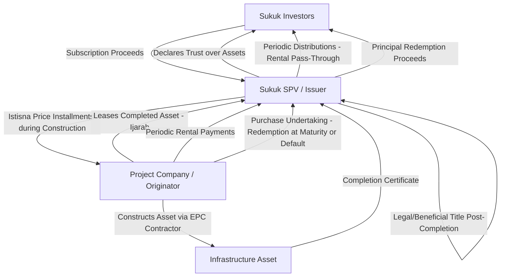

## Infrastructure Sukuk and Capital Markets Issuance

### Overview

Infrastructure Sukuk are Shariah-compliant capital markets instruments used to fund large-scale project finance transactions — power generation, toll roads, airports, water and desalination facilities, and other greenfield or brownfield infrastructure — by pooling investor capital against an underlying Shariah-compliant asset or contractual structure, rather than a pure interest-bearing debt claim. Structurally, a Sukuk represents an undivided beneficial ownership interest in the underlying assets, usufructs, services, or a defined business venture, with periodic distributions to certificate-holders derived from that underlying arrangement (rental income, profit share, or a combination), rather than "interest" in the conventional sense.

Infrastructure Sukuk sit at the intersection of project finance structuring (Istisna, Ijarah, Musharakah — covered in prior modules) and capital markets execution (bookbuilding, rating, listing, trustee/SPV mechanics), and are the dominant vehicle for scaling Islamic project finance beyond bilateral bank financing into syndicated, tradable capital markets instruments.

### Core Structural Components

**The Sukuk SPV (Issuer)**

A bankruptcy-remote special purpose vehicle is established (typically in a jurisdiction with favorable trust or SPV law — the Cayman Islands, Jersey, Labuan, or an onshore SPV regime such as Malaysia's or Saudi Arabia's) to:

- Issue certificates to investors
- Hold legal title to (or a beneficial interest in) the underlying assets/contracts on behalf of certificate-holders (often via a declaration of trust, making certificate-holders beneficial owners)
- Enter into the underlying Shariah contracts (Ijarah, Istisna, Musharakah, or a hybrid) with the originator/obligor (the project company or sponsor raising funds)
- Pass through periodic distributions and, at maturity, redemption proceeds to certificate-holders

**The Originator/Obligor**

The entity actually needing the financing (the project company, sponsor, or government entity), which sells, leases, or enters into a partnership arrangement with the SPV, and undertakes to make periodic payments (rental, installment sale price, or profit distributions) that flow through to investors.

**Trustee/Delegate Structure**

Since the SPV often lacks operational capacity, a trustee (frequently an affiliate of a bank or a dedicated trust company) is appointed to act on behalf of certificate-holders, with day-to-day administrative functions sometimes delegated back to the originator via a Servicing Agency Agreement.

### Sukuk Structures Applicable to Infrastructure

| Sukuk Type | Underlying Contract | Typical Infrastructure Use Case | Return Basis |
| --- | --- | --- | --- |
| Sukuk al-Ijarah | Sale-and-leaseback of existing/completed assets | Operating toll roads, existing power plants, real estate-backed infrastructure | Fixed or benchmarked rental |
| Sukuk al-Istisna | Construction/manufacturing contract | Greenfield construction financing (pre-completion) | Deferred price, often converting to Ijarah post-completion |
| Hybrid Sukuk (Istisna-Ijarah) | Combination — Istisna during construction, Ijarah post-completion | Greenfield IPPs, toll roads, desalination plants | Deferred installments pre-completion; rental post-completion |
| Sukuk al-Musharakah | Joint ownership/partnership | Large syndicated infrastructure equity or expansion financing | Profit-sharing based on actual project performance |
| Sukuk al-Wakala | Investment agency (Wakala) — SPV appoints an agent to invest proceeds in a diversified pool of Shariah-compliant assets | Diversified infrastructure funds, sovereign infrastructure programs | Expected profit rate, subject to agency performance |
| Sukuk al-Mudarabah | Profit-sharing partnership with passive capital-provider | Infrastructure investment funds, less common for single-asset project finance | Profit share per pre-agreed ratio |

**Key Points**

- Hybrid Sukuk (combining more than one underlying contract, e.g., a mixed pool of Ijarah, Istisna, and Murabaha receivables) are permitted by AAOIFI Shariah Standard No. 17 provided tangible/Ijarah-type assets constitute at least 51% of the pool value if the Sukuk is intended to be tradable on the secondary market at other than face value — a critical structuring threshold.
- A Sukuk backed predominantly by debt receivables (Istisna installments, Murabaha receivables) without sufficient tangible asset backing faces tradability restrictions, since trading pure debt at other than par is generally not Shariah-permissible (this is the *bay al-dayn* restriction, more strictly applied in AAOIFI-adherent markets than in some Southeast Asian jurisdictions).

### Structural Diagram — Hybrid Istisna-Ijarah Sukuk for Greenfield Infrastructure

### Cash Flow and Pricing Mechanics

**Periodic Distribution (Coupon-Equivalent)**

Unlike conventional bonds, Sukuk distributions are not legally "interest" but rather rental or profit-share pass-throughs. In practice, for Ijarah-based infrastructure Sukuk, the periodic distribution amount ($R_t$) is calculated similarly to a floating or fixed coupon:

$$R_t = F \times (b_t + m)$$

where $F$ is the face value of the certificates, $b_t$ is a reference benchmark rate at period $t$ (historically often an interbank offered rate; increasingly risk-free rate-based alternatives such as SOFR-linked or Islamic interbank benchmark rates), and $m$ is the agreed margin. This benchmarking is Shariah-permissible because it sets the *level* of rental, not the underlying nature of the payment (which remains rental for the use of an asset), though this practice has drawn ongoing scholarly commentary about its proximity to conventional interest-based pricing.

**Purchase Undertaking (Redemption Mechanism)**

At maturity (or upon a defined default/dissolution event), the originator is obligated under a **Purchase Undertaking** to buy back the underlying assets from the SPV at a pre-agreed "Exercise Price," which is set to equal the outstanding face value of the certificates. This is the primary mechanism providing certificate-holders capital protection equivalent to conventional bond principal repayment, while remaining structurally distinct from a debt claim (it is triggered by the SPV's put right under the Purchase Undertaking, exercisable against the asset, not a direct debt obligation of the originator to investors).

$$\text{Exercise Price} = F_{outstanding} + \text{accrued but unpaid rental}$$

**Sale Undertaking (Complementary Instrument)**

A parallel **Sale Undertaking** from the SPV (as seller) may be included, granting the originator the right (call option) to repurchase the assets at maturity or upon early redemption at its own election — commonly used in tandem with the Purchase Undertaking to give both sides symmetric exit mechanisms.

### Issuance Process and Capital Markets Execution

**Key Points — Typical Execution Timeline**

1. **Structuring and Shariah approval:** Lead arrangers structure the transaction (selecting Ijarah, hybrid Istisna-Ijarah, or Musharakah basis) and obtain a Shariah pronouncement (fatwa) from the deal's Shariah board or the arranger's in-house Shariah committee.
2. **SPV establishment:** Incorporation of the issuing/trustee SPV in the chosen jurisdiction, with declaration of trust documentation.
3. **Legal documentation:** Drafting of the Master Trust Deed, Agency Agreement, Purchase/Sale Undertakings, Ijarah/Istisna agreements, and (if applicable) a Musharakah Agreement.
4. **Credit rating:** Engagement of rating agencies (S&P, Moody's, Fitch, or regional agencies) — infrastructure Sukuk are rated substantially on the same project finance credit fundamentals as conventional project bonds (completion risk, offtake/revenue certainty, leverage, DSCR) with an additional Shariah-structuring risk assessment overlay.
5. **Regulatory approval and prospectus/offering circular:** Filing with the relevant securities regulator (e.g., Securities Commission Malaysia, Capital Market Authority in Saudi Arabia, DFSA in Dubai, or an international offering under Regulation S/144A for cross-border placements).
6. **Bookbuilding and pricing:** Roadshow, investor bookbuilding, and final pricing of the profit rate/margin.
7. **Listing:** Listing on an exchange (Nasdaq Dubai, Bursa Malaysia, London Stock Exchange's international securities market, or Euronext Dublin are common venues for internationally distributed infrastructure Sukuk).
8. **Ongoing administration:** Periodic Shariah compliance certification, distribution processing, and (for rated Sukuk) surveillance reporting to rating agencies.

### Credit Enhancement and Risk Mitigation Features

Infrastructure Sukuk commonly incorporate project finance risk mitigants layered onto the Islamic contractual structure:

- **Debt Service Reserve Account (DSRA):** Funded reserve (structured as a Shariah-compliant deposit or Wakala investment) covering a set number of future rental/distribution periods.
- **Step-in rights:** Direct agreements with offtakers (PPA counterparties), EPC contractors, and O&M operators, replicated within the Sukuk documentation to allow the SPV/trustee (on behalf of investors) to intervene upon originator default.
- **Assignment of receivables:** Assignment (via a Shariah-compliant assignment mechanism) of the originator's revenue receivables (e.g., PPA payments, toll revenues) as security for its obligations under the Ijarah/Purchase Undertaking.
- **Guarantees:** Sponsor or government guarantees of the originator's payment obligations, structured to guarantee *performance obligations* rather than a fixed investment return, to remain within Shariah-compliant guarantee principles (see prior module's discussion of permissible credit enhancements under Musharakah).
- **Tax and takaful considerations:** Structuring to ensure the underlying asset transfers (SPV to originator and back) do not trigger cascading transfer taxes or stamp duties, often requiring specific "Sukuk neutrality" legislation (introduced in jurisdictions such as Malaysia, the UK, Ireland, and Luxembourg) — a jurisdiction lacking such neutrality provisions can materially increase the effective cost of Sukuk issuance relative to conventional bonds.

### Example: Greenfield Toll Road Hybrid Sukuk

**Scenario:** A $600 million toll road project raises financing via a hybrid Istisna-Ijarah Sukuk, listed on an international exchange, with a 15-year tenor (3-year construction, 12-year operating period).

1. SPV issues $600 million of certificates to institutional investors (sovereign wealth funds, Islamic banks, Takaful operators, conventional funds seeking Shariah-compliant assets).
2. Proceeds are disbursed to the project company under a Master Istisna Agreement, in installments against independent engineer-certified construction milestones over the 3-year build period; investors receive a pre-agreed deferred profit rate accruing during construction (often paid periodically as an advance rental or capitalized until operational rentals commence, depending on structure).
3. Upon Provisional Acceptance, the asset transitions to Ijarah; the project company pays periodic rentals benchmarked to a reference rate plus margin, funded by toll revenues.
4. A DSRA equivalent to 6 months of rental obligations is funded from initial drawdown proceeds and maintained throughout the operating period.
5. At the 15-year maturity (or upon an earlier specified dissolution event), the Purchase Undertaking is exercised: the project company buys back full ownership of the toll road at the Exercise Price equal to outstanding certificate face value, and redemption proceeds are distributed to investors.

**Output (Illustrative Sukuk cash flow profile):**

| Period | Phase | Cash Flow to SPV | Distribution to Investors |
| --- | --- | --- | --- |
| Years 1–3 | Construction (Istisna) | Milestone-based Istisna drawdowns | Deferred/capitalized profit accrual |
| Years 4–15 | Operation (Ijarah) | Rental = benchmark + margin, on declining or fixed notional per structure | Periodic rental pass-through |
| Year 15 (maturity) | Redemption | Exercise Price under Purchase Undertaking | Return of face value + final distribution |

[Inference] Whether construction-phase profit is paid periodically (via an advance rental mechanism) or fully deferred and capitalized varies significantly by deal and investor base — Gulf-region issuances and Southeast Asian issuances have historically shown different market conventions on this point, and deal-specific term sheets should be consulted rather than assuming a single standard.

### Comparison with Conventional Project Bonds

| Feature | Conventional Project Bond | Infrastructure Sukuk |
| --- | --- | --- |
| Investor claim | Direct debt claim on issuer | Beneficial ownership interest in underlying assets/contracts via SPV trust |
| Periodic payment | Interest (coupon) | Rental (Ijarah) or profit share (Musharakah), economically similar but contractually distinct |
| Principal protection at maturity | Bullet or amortizing repayment of principal | Purchase Undertaking exercise at Exercise Price equal to outstanding face value |
| Default remedy | Direct enforcement against issuer's assets/guarantees | Enforcement via trustee against underlying assets and Purchase Undertaking; underlying Shariah contract governs remedy mechanics |
| Tradability | Freely tradable at market price | Tradable at market price if ≥51% tangible asset-backed (Ijarah-type); restricted if predominantly debt-receivable-backed (bay al-dayn constraint) |
| Rating approach | Standard project finance credit metrics | Same project finance credit metrics, plus Shariah structural risk review |

### Common Structuring Pitfalls

**Key Points**

- **Insufficient tangible asset backing for tradability:** Structuring a Sukuk primarily around Istisna/Murabaha receivables without at least 51% tangible/usufruct asset value creates secondary market trading restrictions under the *bay al-dayn* principle — a frequent design consideration in blended construction/operational-phase Sukuk.
- **Purchase Undertaking priced to guarantee fixed return regardless of asset value:** As with diminishing Musharakah, setting the Exercise Price purely to guarantee investor capital and profit irrespective of the underlying asset's actual condition or value draws ongoing Shariah scholarly scrutiny, particularly for Musharakah-based Sukuk where genuine risk-sharing is the structure's premise.
- **Jurisdictional tax/stamp duty leakage:** Absent specific Sukuk-neutral tax legislation, the multiple asset transfers inherent in Ijarah/Istisna-based Sukuk (SPV-to-originator and back) can trigger duplicative transfer taxes not present in a conventional bond — a material cost-of-funds consideration in jurisdictions without such legislation.
- **Cross-border Shariah standard divergence:** A structure accepted by a Malaysian Shariah Advisory Council may not automatically be accepted by an AAOIFI-adherent GCC Shariah board (e.g., differing views on bay al-dayn tradability, or on fixed vs. floating rental benchmarking) — international issuances often require dual Shariah board sign-off or structuring compromises.

### Related Topics

- AAOIFI Shariah Standard No. 17 (Investment Sukuk) and its 51% tangible-asset tradability threshold
- Bay al-dayn (debt trading) restrictions and jurisdictional divergence (Malaysia vs. GCC practice)
- Hybrid Istisna-Ijarah structures for greenfield projects (construction-to-operation transition mechanics)
- Musharakah and profit-sharing structures (Sukuk al-Musharakah risk-sharing implications)
- Sukuk default and dissolution events: trustee enforcement mechanics and originator step-in rights
- Sukuk-neutral tax legislation across jurisdictions (Malaysia, UK, Ireland, Luxembourg)
- Credit rating methodologies for project finance Sukuk (S&P, Moody's, Fitch approaches)
- Green and sustainability-linked Sukuk for infrastructure ESG financing