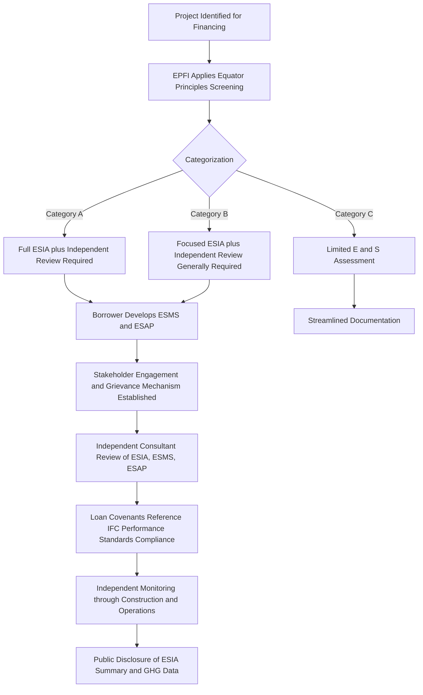

## Equator Principles and IFC Performance Standards

### Overview

The Equator Principles (EP) and the IFC Performance Standards (PS) together form the dominant global framework for assessing and managing environmental and social (E&S) risk in project finance. The Equator Principles are a voluntary risk management framework adopted by financial institutions ("Equator Principles Financial Institutions," or EPFIs) that commits signatories to categorize and evaluate projects based on their environmental and social risk, and to require borrowers to comply with defined standards as a condition of financing. Critically, the Equator Principles do not create their own substantive E&S standards from scratch — for projects in non-"Designated Countries," they incorporate the IFC Performance Standards on Environmental and Social Sustainability, and the World Bank Group's Environmental, Health and Safety (EHS) Guidelines, by reference. Understanding the two frameworks together — one procedural/institutional (EP), one substantive (IFC PS) — is essential to project finance E&S due diligence.

### The Equator Principles Framework

**Origins and Governance**

The Equator Principles were launched in 2003 by a group of private banks working with the IFC, and are now administered by the Equator Principles Association, with periodic revisions (EP1 through the current EP4, adopted in 2020, with subsequent addenda addressing climate change alignment). Adoption is voluntary but has become a de facto market standard: a large majority of international project finance debt globally is now originated by EPFIs.

**Scope of Application**

The current framework (EP4) applies to:

- Project Finance transactions with total capital costs of $10 million or more
- Project-Related Corporate Loans meeting specified criteria (majority of proceeds tied to a single identifiable project, total aggregate loan amount at least $50 million, EPFI's individual commitment at least $10 million, and loan tenor of at least two years)
- Bridge Loans with a tenor of less than two years, intended to be refinanced by project finance or project-related corporate loans
- Project-Related Refinance and Project-Related Acquisition Finance meeting analogous thresholds
- Project Finance Advisory Services

**Key Points**

- The Equator Principles apply regardless of the sector — power, transport, extractives, water, telecommunications — provided the transaction meets the financial thresholds and structural definition of "project finance" or "project-related" lending.
- EP4 introduced explicit climate change assessment requirements, including alignment considerations with the Paris Agreement, and additional human rights due diligence expectations, reflecting the framework's periodic tightening since EP1.

### The Ten Equator Principles

| Principle | Core Requirement |
| --- | --- |
| 1. Review and Categorization | Project is categorized A (high risk), B (medium risk), or C (low/minimal risk), based on IFC's categorization methodology |
| 2. Environmental and Social Assessment | Borrower conducts an Environmental and Social Impact Assessment (ESIA) appropriate to the risk category |
| 3. Applicable Environmental and Social Standards | Assessment must demonstrate compliance with host-country laws, and for non-Designated Countries, the IFC Performance Standards and World Bank Group EHS Guidelines |
| 4. Environmental and Social Management System and Equator Principles Action Plan | Borrower adopts an ESMS and, for Category A/B projects, an Action Plan (ESAP) addressing gaps identified in the assessment |
| 5. Stakeholder Engagement | Borrower conducts meaningful consultation with affected communities, informed by the ESIA and disclosed information |
| 6. Grievance Mechanism | Borrower establishes a grievance mechanism for affected communities to raise concerns |
| 7. Independent Review | An Independent Environmental and Social Consultant reviews the assessment, ESMS, ESAP, and stakeholder engagement process for Category A and (generally) Category B projects |
| 8. Covenants | Loan documentation includes covenants requiring compliance with host-country law and, where relevant, the ESAP, with remediation/cure provisions for non-compliance |
| 9. Independent Monitoring and Reporting | Ongoing independent monitoring (typically via the same or another Independent Consultant) throughout the life of the loan for Category A/B projects |
| 10. Reporting and Transparency | Borrower publicly discloses a summary of the ESIA (Category A, and Category B where applicable) and GHG emissions data for higher-emission projects; EPFIs report annually on Equator Principles implementation |

### Project Categorization (A/B/C)

Categorization follows the IFC's own screening methodology and drives the intensity of due diligence and ongoing monitoring:

- **Category A:** Projects with potential significant adverse environmental or social impacts that are diverse, irreversible, or unprecedented (e.g., large dams, greenfield extractive projects in sensitive areas, projects involving involuntary resettlement of large populations).
- **Category B:** Projects with potential limited adverse impacts that are few in number, generally site-specific, largely reversible, and readily addressed through mitigation measures (the majority of mid-sized greenfield infrastructure — power plants, toll roads, mid-size renewable energy — typically fall here).
- **Category C:** Projects with minimal or no adverse environmental or social impacts (e.g., small-scale renewable energy on already-disturbed sites, certain brownfield efficiency retrofits).

**Key Points**

- Categorization determines whether a full ESIA and Independent Review are required (mandatory for A, generally required for B) versus a more limited environmental and social assessment (typically sufficient for C).
- Category A projects almost always require a full Independent Environmental and Social Consultant engagement from early due diligence through construction and often into early operations monitoring.

### The IFC Performance Standards (2012 Framework)

The IFC Performance Standards, most recently updated in 2012 (with periodic guidance note updates since), comprise eight standards that define the substantive E&S requirements a project must meet. For Equator Principles purposes, these standards apply directly to projects in **non-Designated Countries** (jurisdictions without robust domestic environmental and social governance systems, environmental assessment, and labor/community-engagement laws, as periodically listed by the Equator Principles Association); projects in Designated Countries may instead rely primarily on host-country law, though EPFIs increasingly reference the Performance Standards as good practice regardless.

| Performance Standard | Core Focus |
| --- | --- |
| PS1: Assessment and Management of Environmental and Social Risks and Impacts | Overarching ESMS requirement: risk identification, mitigation hierarchy (avoid, minimize, mitigate, offset/compensate), and ongoing management throughout the project lifecycle |
| PS2: Labor and Working Conditions | Worker rights, non-discrimination, occupational health and safety, grievance mechanisms for the workforce, and supply chain labor risk (including child/forced labor) |
| PS3: Resource Efficiency and Pollution Prevention | Efficient use of resources (energy, water), pollution prevention (air emissions, wastewater, hazardous materials), and — increasingly emphasized — greenhouse gas emissions quantification |
| PS4: Community Health, Safety, and Security | Risks to surrounding communities from project activities, infrastructure safety, and use of security personnel |
| PS5: Land Acquisition and Involuntary Resettlement | Requirements around physical and economic displacement, compensation at replacement cost, and (for large-scale resettlement) livelihood restoration planning |
| PS6: Biodiversity Conservation and Sustainable Management of Living Natural Resources | Protection of natural habitats and critical habitats, the mitigation hierarchy applied to biodiversity, and requirements for projects affecting legally protected or internationally recognized areas |
| PS7: Indigenous Peoples | Free, Prior, and Informed Consent (FPIC) requirements in specified circumstances (e.g., relocation from traditional lands, impacts on critical cultural heritage), and culturally appropriate consultation |
| PS8: Cultural Heritage | Protection of tangible and intangible cultural heritage, chance-find procedures during construction, and restrictions on using cultural heritage for commercial purposes without consent |

**Key Points**

- PS1 functions as the "umbrella" standard, requiring the borrower to establish an ESMS whose scope is calibrated to the nature and scale of the identified risks, and to apply a mitigation hierarchy that prioritizes avoidance over minimization over compensation.
- PS5 and PS7 are frequently the most contentious and highest-liability standards for greenfield infrastructure projects requiring significant land acquisition (transmission lines, dams, large-footprint solar/wind, transport corridors) or intersecting indigenous or traditional lands.
- PS6's "critical habitat" designation triggers heightened requirements, potentially including a presumption against significant conversion or degradation of the habitat, which can materially affect project siting decisions well before financial close.

### Structural Diagram — E&S Due Diligence and Categorization Workflow

### Integration into Project Finance Documentation

**Conditions Precedent (CPs):** Delivery of a satisfactory ESIA, ESMS, and (where applicable) ESAP, along with the Independent Consultant's initial report, is typically a condition precedent to financial close or first drawdown for Category A/B projects.

**Representations and Warranties:** Borrowers represent compliance with applicable host-country environmental/social law and, where relevant, the IFC Performance Standards, as of financial close.

**Covenants:** Ongoing covenants require:

- Continued compliance with the ESAP on the agreed timetable
- Prompt notification of material E&S incidents (e.g., significant accidents, community grievances escalating to disputes, regulatory non-compliance)
- Cooperation with the Independent Consultant's periodic monitoring visits
- Maintenance of the grievance mechanism and stakeholder engagement plan

**Events of Default / Cure Mechanisms:** Material or persistent non-compliance with E&S covenants can constitute an event of default, though facility agreements typically build in cure periods and remediation plan mechanisms before acceleration, reflecting the framework's stated preference for engagement and remediation over immediate enforcement.

### Example: Category A Greenfield Hydropower Project

**Scenario:** A 400 MW greenfield hydropower project in a non-Designated Country, involving a reservoir requiring resettlement of approximately 3,000 people and located near a protected watershed.

1. **Categorization:** Classified Category A due to scale of physical/economic displacement and proximity to a legally protected area (biodiversity considerations under PS6).
2. **ESIA scope:** Full ESIA addressing hydrological impacts, resettlement (PS5), biodiversity/critical habitat screening (PS6), community health and safety from reservoir operations (PS4), and cumulative impact assessment given other hydropower development in the same river basin.
3. **Resettlement Action Plan (RAP):** Developed per PS5, including livelihood restoration programming (not just cash compensation), given the scale of displacement triggers World Bank/IFC-standard expectations for a comprehensive RAP rather than simplified compensation.
4. **Indigenous Peoples Plan:** If affected communities meet PS7's definition of Indigenous Peoples, an Indigenous Peoples Plan (or Indigenous Peoples-inclusive RAP) is required, potentially including FPIC processes for specific triggering circumstances.
5. **Independent Review:** An Independent Environmental and Social Consultant reviews the ESIA and RAP prior to financial close, and conducts semi-annual monitoring visits through construction and the first several years of operation.
6. **Covenant structuring:** Facility agreement includes an ESAP with milestone-based resettlement completion and livelihood restoration verification requirements, with drawdown conditionality tied to specific ESAP milestones (e.g., no drawdown for reservoir filling until resettlement and compensation for the affected area is verified complete).
7. **Disclosure:** ESIA summary and RAP summary are publicly disclosed prior to financial close, per Principle 10, alongside project-level GHG emissions estimates.

**Output (Illustrative categorization decision matrix):**

| Risk Factor | Assessment | Contribution to Categorization |
| --- | --- | --- |
| Physical/economic displacement | ~3,000 persons resettled | High — triggers Category A threshold |
| Biodiversity/habitat | Adjacent to protected watershed | High — potential critical habitat trigger under PS6 |
| Indigenous Peoples presence | Confirmed | High — PS7 applicability, possible FPIC trigger |
| Pollution/emissions profile | Moderate (construction-phase only; hydropower generation itself low-emission) | Moderate |
| Overall categorization | — | **Category A** |

### Relationship to Other ESG Frameworks

**Key Points**

- The IFC Performance Standards are also the substantive basis for the World Bank Group's own Environmental and Social Framework (ESF, for International Bank for Reconstruction and Development/International Development Association-financed projects), meaning multilateral co-financing structures often align naturally on E&S standards even when the IFC itself is not a direct lender.
- Export Credit Agencies (ECAs) participating in project finance syndications frequently reference the Common Approaches (OECD Recommendation on Common Approaches for Officially Supported Export Credits), which itself draws heavily on IFC Performance Standards content, creating substantial (though not perfect) alignment across EPFI, multilateral, and ECA E&S requirements in a single syndicated financing.
- Corporate ESG reporting frameworks (e.g., sustainability-linked loan principles, green bond/Sukuk frameworks discussed elsewhere in this chapter) are increasingly layered on top of, rather than replacing, Equator Principles/IFC PS compliance for project finance transactions — the two operate as complementary but distinct compliance layers (transaction-level E&S risk management vs. broader sustainability performance/reporting).

### Common Structuring and Compliance Pitfalls

**Key Points**

- **Under-scoping the ESIA relative to actual categorization:** A borrower or sponsor economizing on ESIA scope before categorization is finalized risks late-stage discovery of Category A-level impacts, causing costly rework and schedule delay close to financial close.
- **Treating stakeholder engagement as a one-time exercise:** Principle 5 and PS1 expect ongoing, iterative engagement throughout the project lifecycle, not a single pre-financing consultation round; lenders' Independent Consultants routinely flag stale or discontinued engagement programs during construction-phase monitoring.
- **Underestimating cumulative impact assessment:** For projects in basins, corridors, or regions with other concurrent or planned developments (as in the hydropower example), IFC PS and increasingly EP4 expectations extend to cumulative impacts beyond the single project's footprint — a scope frequently under-addressed in early ESIAs.
- **Grievance mechanism without genuine accessibility:** A formally documented grievance mechanism that affected communities cannot practically access (language, literacy, physical distance, fear of reprisal) fails Principle 6's substantive intent even if procedurally present in loan documentation.

### Related Topics

- Green and sustainability-linked Sukuk for infrastructure ESG financing
- Resettlement Action Plans (RAPs) and livelihood restoration planning under PS5
- Free, Prior, and Informed Consent (FPIC) processes under PS7
- OECD Common Approaches and Export Credit Agency E&S alignment
- Climate risk assessment and Paris Agreement alignment under EP4
- Independent Environmental and Social Consultant scope of work and appointment mechanics
- Environmental and Social Management Systems (ESMS) design for project companies
- World Bank Group Environmental and Social Framework (ESF) vs. IFC Performance Standards comparison