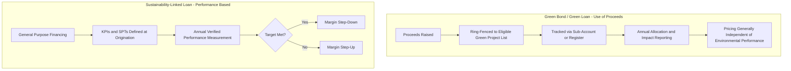

## Green Bonds and Sustainability-Linked Loans

### Overview

Green Bonds and Sustainability-Linked Loans (SLLs) represent two structurally distinct approaches to embedding environmental performance into project finance capital structures. Green Bonds (and their loan-market equivalent, Green Loans) are **use-of-proceeds** instruments: capital raised is contractually earmarked for specific eligible green projects or assets, and reporting focuses on tracking and verifying that allocation. Sustainability-Linked Loans, by contrast, are **general-purpose financing instruments whose pricing (and sometimes other terms) is tied to the borrower's achievement of predefined sustainability performance targets** — proceeds are not ring-fenced to specific green assets at all. Understanding this proceeds-based versus performance-based distinction is the foundation for structuring, documenting, and reporting on either instrument correctly.

### Green Bonds and Green Loans (Use-of-Proceeds Instruments)

**Governing Frameworks**

- **Green Bond Principles (GBP):** Voluntary process guidelines administered by the International Capital Market Association (ICMA), built around four core components.
- **Green Loan Principles (GLP):** Loan Market Association (LMA)/Loan Syndications and Trading Association (LSTA)/Asia Pacific Loan Market Association (APLMA) equivalent, mirroring the GBP structure for syndicated and bilateral loan markets.
- **EU Green Bond Standard (EuGBS):** A more prescriptive, regulation-based standard (effective 2024) requiring alignment with the EU Taxonomy for a defined proportion of proceeds, external review, and specific disclosure templates — materially stricter than the voluntary ICMA/LMA principles.
- **Climate Bonds Standard (Climate Bonds Initiative):** A certification scheme with sector-specific eligibility criteria (e.g., detailed technical screening criteria for solar, wind, low-carbon buildings, water infrastructure) that issuers can use to obtain third-party "Climate Bonds Certified" status.

**The Four Core Components (Green Bond Principles / Green Loan Principles)**

| Component | Requirement |
| --- | --- |
| 1. Use of Proceeds | Proceeds must be allocated exclusively to eligible green projects, described in the bond/loan documentation with reference to defined eligible categories (renewable energy, energy efficiency, clean transportation, sustainable water management, pollution prevention, green buildings, etc.) |
| 2. Process for Project Evaluation and Selection | Issuer/borrower articulates environmental sustainability objectives, the process for determining project eligibility, and how associated environmental risks are identified and managed |
| 3. Management of Proceeds | Proceeds are tracked (via a sub-account, sub-portfolio, or otherwise formally attested) and a stated approach exists for managing any temporarily unallocated proceeds |
| 4. Reporting | Annual reporting (until full allocation) on proceeds allocation, and where feasible, on the expected or achieved environmental impact of funded projects (e.g., tonnes of CO2e avoided, MW of renewable capacity installed) |

**Key Points**

- External review — a Second Party Opinion (SPO), verification, certification (e.g., Climate Bonds Certification), or rating agency Green Bond score — is "recommended" under the voluntary ICMA/LMA framework but is a practical market expectation for institutional-grade issuances, and is mandatory under the EU Green Bond Standard.
- Under the stricter EuGBS, at least a defined minimum share of proceeds (subject to flexibility provisions and phase-in) must be allocated to activities aligned with the EU Taxonomy's technical screening criteria, a materially higher bar than the principles-based ICMA approach, which does not mandate alignment with any single taxonomy.

### Sustainability-Linked Loans and Bonds (Performance-Based Instruments)

**Governing Frameworks**

- **Sustainability-Linked Loan Principles (SLLP):** LMA/LSTA/APLMA framework.
- **Sustainability-Linked Bond Principles (SLBP):** ICMA equivalent for bond-format issuances.

**The Five Core Components**

| Component | Requirement |
| --- | --- |
| 1. Selection of Key Performance Indicators (KPIs) | Borrower selects material, core, and quantifiable/externally verifiable KPIs relevant to its business (e.g., GHG emissions intensity, renewable energy capacity added, water consumption reduction) |
| 2. Calibration of Sustainability Performance Targets (SPTs) | Targets set against a defined baseline/benchmark, with a clear timeline, and calibrated to be ambitious/beyond a "business as usual" trajectory |
| 3. Loan/Bond Characteristics | Pricing mechanism (margin ratchet: step-up if targets missed, step-down if achieved) is defined; some structures include a one-way ratchet (penalty only) or two-way ratchet (reward and penalty) |
| 4. Reporting | At least annual reporting on KPI performance against SPTs |
| 5. Verification | Independent external verification of performance against each SPT at least annually, by a qualified external reviewer |

**Key Structural Distinction from Green Loans**

$$\text{Margin}_t = \text{Base Margin} \pm \Delta_{SPT}$$

where $\Delta_{SPT}$ is a pre-agreed adjustment (typically 2.5 to 25 basis points per KPI in market practice, though this varies considerably by deal) applied based on verified performance against the Sustainability Performance Target for period $t$. Unlike a Green Loan's Use of Proceeds test (binary: was the proceeds allocation compliant?), an SLL's pricing mechanism is a continuous performance incentive applied to general corporate or project purposes financing.

**Key Points**

- Because SLL/SLB proceeds are not restricted to green projects, these instruments are commonly used by borrowers whose overall business (e.g., a diversified project company or a utility with a mixed generation portfolio) does not have a discrete pool of "pure-green" eligible assets sufficient to size a full Green Bond/Loan, but which can still commit to credible, ambitious, externally verified performance improvement.
- SPT calibration is the most scrutinized element in the market: "sustainability-washing" concerns center overwhelmingly on SPTs set at or below a business-as-usual trajectory (i.e., targets the borrower would likely hit regardless of the financing), which undermines the instrument's core premise.

### Structural Diagram — Green Bond vs. Sustainability-Linked Loan Logic

### Application to Project Finance Structures

**Greenfield Renewable Energy — Natural Green Bond/Loan Fit**

A greenfield solar or wind IPP is a paradigmatic Green Loan/Bond candidate: proceeds finance a discrete, unambiguously eligible asset (renewable generation capacity) under the GBP/GLP's "renewable energy" eligible category, use-of-proceeds tracking is straightforward (a single project company, a defined capex schedule), and impact reporting metrics (installed MW, estimated MWh generated, tonnes of CO2e avoided) are readily quantifiable from the same operating data already produced for lender/rating agency reporting.

**Mixed-Portfolio Utilities and Diversified Sponsors — SLL Fit**

A utility or infrastructure sponsor with a mixed generation or asset portfolio (some renewable, some transitional or legacy fossil assets) often cannot credibly ring-fence proceeds to a pure-green pool at the scale of its financing needs, and instead uses an SLL/SLB at the corporate or holding-company level, with KPIs targeting portfolio-wide decarbonization (e.g., reducing overall emissions intensity per unit of output by a defined percentage by a target year) — financing the transition rather than a single green asset.

**Hybrid Application**

Some project financings combine both instruments: a Green Loan tranche financing specific eligible renewable/efficiency components of a larger project, alongside a general corporate facility structured as an SLL with portfolio-level decarbonization KPIs — allowing lenders to size Green-labeled debt against genuinely eligible assets while still incentivizing broader sponsor-level sustainability performance.

### Example: Greenfield Wind Farm Green Bond Issuance

**Scenario:** A 250 MW greenfield wind farm project company issues a $300 million Green Bond to refinance construction debt post-completion.

1. **Framework establishment:** Project company (or sponsor, if issued at holding company level with proceeds allocated to the project) publishes a Green Finance Framework aligned with the Green Bond Principles, specifying "Renewable Energy" as the sole eligible category.
2. **External review:** A Second Party Opinion provider assesses the framework's alignment with GBP and, if seeking a stronger market signal, pursues Climate Bonds Certification against the Climate Bonds Initiative's wind sector criteria.
3. **Use of proceeds:** 100% of net proceeds allocated to refinancing the wind farm's construction costs (permissible under GBP, which explicitly allows refinancing, with disclosure of the expected look-back period for refinanced expenditures).
4. **Management of proceeds:** Proceeds tracked in a dedicated sub-ledger; since full project cost is eligible and readily identifiable, no meaningful "unallocated proceeds" period arises in this case.
5. **Reporting:** Annual report discloses total proceeds allocated (100% from issuance), installed capacity (250 MW), estimated annual generation (MWh), and estimated annual GHG emissions avoided (tCO2e), calculated against a relevant grid emissions factor baseline.

**Output (Illustrative annual impact reporting metrics):**

| Metric | Year 1 (Post-Issuance) |
| --- | --- |
| Proceeds allocated | $300 million (100%) |
| Installed capacity | 250 MW |
| Estimated annual generation | ~730 GWh (illustrative, at ~33% capacity factor) |
| Estimated GHG emissions avoided | [Inference] Dependent on the specific grid emissions factor used for the host country/region; typically calculated using a recognized methodology (e.g., IFI-harmonized approach to GHG accounting for renewable energy projects) rather than a universal constant |
| External verification | Second Party Opinion at issuance; Climate Bonds Certification (if pursued) reverified periodically |

### Example: Sustainability-Linked Loan for a Diversified Power Utility

**Scenario:** A vertically integrated utility with a mixed thermal/renewable generation fleet raises a $500 million SLL for general corporate and capital expenditure purposes.

1. **KPI selection:** Primary KPI — Scope 1 GHG emissions intensity (tCO2e per MWh generated); secondary KPI — percentage of installed capacity from renewable sources.
2. **SPT calibration:** Target of a defined percentage reduction in emissions intensity by a specified year, benchmarked against a science-based or sector decarbonization pathway rather than an internally generated baseline, to mitigate business-as-usual criticism.
3. **Margin ratchet:** Two-way ratchet of ±10 basis points per KPI (illustrative), applied annually based on verified performance, with a cap on total possible adjustment.
4. **Verification:** Independent third-party auditor verifies reported emissions intensity and renewable capacity percentage annually against the utility's own GHG inventory (typically prepared under the GHG Protocol).
5. **Reporting:** Sustainability-linked loan report published annually alongside (or incorporated into) the utility's broader sustainability/ESG report, disclosing KPI performance, target trajectory, and resulting margin adjustment.

**Key Points**

- Because the utility's proceeds are not ring-fenced, lenders and the market rely almost entirely on the credibility of the KPI/SPT calibration (component 2) to assess whether the instrument represents genuine transition finance or a low-friction "sustainability-labeled" general corporate facility — this makes external verification and target ambitiousness (often benchmarked against science-based targets methodologies) central to market credibility.

### Comparative Summary

| Feature | Green Bond / Green Loan | Sustainability-Linked Loan / Bond |
| --- | --- | --- |
| Proceeds restriction | Ring-fenced to eligible green projects | Unrestricted, general purpose |
| Pricing mechanism | Generally independent of environmental performance (though premium/"greenium" pricing dynamics exist in secondary markets) | Directly tied to KPI/SPT performance via margin ratchet |
| Best fit | Discrete, identifiable green/eligible assets (renewable IPPs, green buildings, clean transport) | Diversified portfolios, transition financing, general corporate purposes |
| Core credibility risk | Eligible project list integrity, proceeds tracking rigor | SPT ambitiousness (business-as-usual risk) |
| External review timing | Primarily pre-issuance (framework review) plus ongoing allocation reporting | Primarily ongoing (annual KPI verification) |
| Governing principles | ICMA Green Bond Principles / LMA-LSTA-APLMA Green Loan Principles / EU Green Bond Standard | ICMA Sustainability-Linked Bond Principles / LMA-LSTA-APLMA Sustainability-Linked Loan Principles |

### Common Structuring and Compliance Pitfalls

**Key Points**

- **SPTs set at or below business-as-usual trajectory:** The single most common "sustainability-washing" criticism of SLLs; SPT calibration should be benchmarked against an external decarbonization pathway or sector standard, not solely against the borrower's own historical trend, to withstand market and regulatory scrutiny.
- **Green Loan proceeds allocated to marginally eligible or transitional assets:** Allocating proceeds to assets with contested green eligibility (e.g., certain "transitional" fossil-adjacent infrastructure) without robust, transparent eligibility criteria disclosure invites credibility challenges and potential index/label exclusion.
- **Inadequate consequence for missed SLL targets:** A margin step-up alone (with no other consequence) that is immaterial relative to the borrower's overall cost of funds provides limited genuine incentive; regulators and investor bodies have flagged this as a structural weakness in some early-market SLLs.
- **Conflating the two instrument types in disclosure:** Referring to an SLL as a "Green Loan" (or vice versa) in marketing materials, when the underlying mechanics differ fundamentally (proceeds restriction vs. performance-based pricing), risks regulatory and investor pushback under increasingly formalized sustainable finance disclosure regimes (e.g., EU Sustainable Finance Disclosure Regulation-adjacent expectations, even where the SFDR itself applies primarily to financial market participants rather than issuers directly).
- **Double-counting impact claims:** Where a Green Bond finances a project also claiming carbon credits or other environmental attribute monetization, clear disclosure of how avoided-emissions claims are allocated (to bond investors' impact reporting vs. to a separate carbon credit buyer) is necessary to avoid overstating aggregate environmental benefit.

### Related Topics

- Equator Principles and IFC Performance Standards (complementary transaction-level E&S risk framework)
- EU Taxonomy for Sustainable Activities and EU Green Bond Standard technical screening criteria
- Science Based Targets initiative (SBTi) methodologies for SPT calibration
- GHG Protocol (Scope 1, 2, and 3 emissions accounting) as the measurement basis for KPI reporting
- Green Sukuk structuring (Islamic finance overlay on use-of-proceeds green instruments)
- Second Party Opinion providers and Climate Bonds Initiative certification processes
- Transition finance frameworks for hard-to-abate sectors
- Sustainable finance disclosure regulation and anti-greenwashing regulatory trends