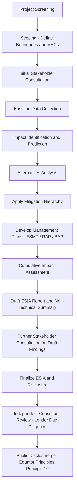

## Environmental and Social Impact Assessment

### Overview

An Environmental and Social Impact Assessment (ESIA) is the systematic process of identifying, predicting, evaluating, and mitigating the biophysical, social, health, and cumulative effects of a proposed project prior to major decisions being taken and commitments made. In project finance, the ESIA is the foundational technical document underpinning the entire E&S risk management framework — it is the primary evidence base referenced by the Equator Principles categorization process, and it is the mechanism through which compliance with the IFC Performance Standards is demonstrated and structured (see prior modules). Where those modules addressed the institutional frameworks (EP) and substantive standards (IFC PS), this module addresses the ESIA as a technical and procedural work product: what it contains, how it is produced, and how it is used in transaction due diligence.

### Purpose and Regulatory Basis

ESIAs serve two parallel functions in project finance:

1. **Host-country regulatory compliance:** Most jurisdictions have domestic environmental impact assessment legislation (often modeled on frameworks such as the U.S. National Environmental Policy Act, the EU Environmental Impact Assessment Directive, or World Bank-influenced national EIA laws) requiring an ESIA (or a jurisdiction-specific equivalent, such as an Environmental Impact Statement or Environmental and Social Management Plan) as a precondition to environmental permitting.
2. **Lender due diligence:** Independent of, and often exceeding, host-country requirements, EPFIs and multilateral lenders require an ESIA meeting IFC Performance Standard 1 (PS1) content and process requirements as a condition of financing, particularly for Category A and B projects.

**Key Points**

- Host-country ESIA requirements and lender-required ESIA scope frequently diverge — a project can be fully compliant with domestic environmental law while still falling short of IFC PS1 expectations (e.g., on cumulative impact assessment, stakeholder engagement depth, or alternatives analysis rigor), which is precisely the gap the Equator Principles framework is designed to close for non-Designated Countries.
- Where domestic law is assessed as broadly equivalent to IFC Performance Standards (as in "Designated Countries" under the Equator Principles framework), lenders may rely more heavily on host-country ESIA processes; elsewhere, a supplementary or gap-filling assessment against PS1 is typically required.

### Core ESIA Process Components

**1. Screening**

Initial determination of whether a full ESIA is required, and at what level of detail, typically based on project type, scale, and location sensitivity. This maps directly onto the Equator Principles A/B/C categorization discussed in the prior module, though host-country screening criteria may use different thresholds or categories.

**2. Scoping**

Definition of the ESIA's boundaries: which impacts will be assessed (air, water, soil, noise, biodiversity, resettlement, cultural heritage, labor, community health and safety, cumulative impacts), the geographic and temporal scope (construction, operations, decommissioning), and the list of "Valued Environmental and Social Components" (VECs) that will be the focus of detailed impact prediction. Scoping typically includes an initial round of stakeholder consultation to identify community-raised concerns that must be incorporated into the assessment's scope.

**3. Baseline Data Collection**

Establishment of pre-project conditions against which impacts will be measured — baseline air and water quality, ambient noise levels, biodiversity surveys (species presence, habitat mapping, seasonal variation), socioeconomic baseline (demographics, livelihoods, land use patterns, vulnerable groups), and cultural heritage surveys (archaeological, tangible, and intangible heritage).

**4. Impact Identification and Prediction**

For each VEC, prediction of the nature, magnitude, geographic extent, duration, frequency, and reversibility of potential impacts across the project lifecycle (construction, operation, decommissioning/closure), typically using a structured impact significance methodology.

**5. Mitigation Hierarchy Application**

Consistent with PS1, impacts are addressed following a strict hierarchy:

$$\text{Avoid} \rightarrow \text{Minimize} \rightarrow \text{Restore/Rehabilitate} \rightarrow \text{Offset/Compensate}$$

Avoidance (e.g., re-routing a transmission line away from a sensitive habitat) is preferred over minimization (e.g., reduced construction footprint), which is preferred over restoration (rehabilitating disturbed areas), with offsetting or compensation reserved as a last resort for residual impacts that cannot otherwise be addressed — and, for certain biodiversity impacts in critical habitats, offsets alone may be insufficient to justify proceeding at all.

**6. Alternatives Analysis**

Assessment of technically and financially feasible alternatives to the proposed project — including site alternatives, technology alternatives, and the "no project" alternative — with documented rationale for why the selected option was chosen over the alternatives, particularly where the selected option has materially different E&S impact profiles than a viable alternative.

**7. Stakeholder Engagement and Consultation**

Structured, iterative engagement with affected communities and other stakeholders throughout the ESIA process (not merely a single disclosure event), including free, prior, and informed consultation, and — for circumstances captured under PS7 — Free, Prior, and Informed Consent (FPIC) for Indigenous Peoples.

**8. Management Plans**

Translation of the mitigation hierarchy's outputs into implementable, typically topic-specific management plans (e.g., a Construction Environmental Management Plan, a Resettlement Action Plan, a Biodiversity Action Plan, a Waste Management Plan), collectively often bundled into an overarching Environmental and Social Management Plan (ESMP) or, at the corporate/project-company level, an Environmental and Social Management System (ESMS).

**9. Cumulative Impact Assessment**

Evaluation of the project's impacts in combination with other past, present, and reasonably foreseeable future developments in the same area (e.g., multiple hydropower projects on the same river system, or multiple wind farms sharing a migratory bird corridor) — an area of assessment that is frequently under-scoped relative to lender expectations, as flagged in the prior module.

**10. Disclosure and Reporting**

Production of the ESIA report (often with a separate, more accessible non-technical summary) and, per Equator Principles Principle 10, public disclosure of the summary for Category A projects (and Category B where applicable) prior to financial close.

### Structural Diagram — ESIA Process Flow

### Impact Significance Methodology (Illustrative)

Most ESIAs quantify or qualitatively rank impact significance using a structured matrix combining magnitude and sensitivity/receptor value:

$$\text{Significance} = f(\text{Magnitude}, \text{Sensitivity})$$

where **Magnitude** typically accounts for extent (spatial scale), duration (short-term/long-term/permanent), and intensity (severity), and **Sensitivity** reflects the value, vulnerability, or resilience of the affected receptor (e.g., a critically endangered species habitat has high sensitivity; a common, resilient species has low sensitivity). The resulting significance rating (e.g., negligible/minor/moderate/major, or a numerical score) drives which impacts require detailed mitigation planning and which can be addressed through standard good-practice measures alone.

**Key Points**

- Significance methodologies vary by ESIA practitioner and jurisdiction, and there is no single universally mandated scoring system — IFC PS1 requires a "systematic" process but does not prescribe a specific matrix, meaning lenders' Independent Consultants review the chosen methodology's adequacy on a case-by-case basis rather than checking it against one standard.
- [Inference] The specific weighting given to magnitude versus sensitivity factors in any given significance matrix is a methodological choice by the ESIA practitioner, and reasonable practitioners can arrive at different significance ratings for the same underlying impact — this is a recognized source of variability that Independent Consultant review is partly designed to catch.

### Example: ESIA Scoping for a Greenfield Transmission Line

**Scenario:** A 150 km, 400 kV transmission line connecting a new wind farm to the national grid, crossing agricultural land, one protected forest reserve buffer zone, and several rural communities.

**Scoping outcomes:**

| VEC | Key Concern | Assessment Approach |
| --- | --- | --- |
| Land use and livelihoods | Right-of-way affecting agricultural land, potential economic displacement | Land use survey, crop/livelihood impact assessment, compensation framework aligned with PS5 |
| Biodiversity | Forest reserve buffer zone crossing; avian collision risk | Habitat mapping, avifauna survey (particularly migratory raptors), routing alternatives analysis |
| Community health and safety | Electromagnetic field (EMF) concerns, construction traffic, electrical safety | EMF baseline against international exposure guidelines, traffic management planning |
| Cultural heritage | Potential unrecorded archaeological sites along the corridor | Chance-find procedure development, pre-construction archaeological survey of high-probability zones |
| Cumulative impacts | Other planned transmission and generation projects in the same corridor | Coordination with grid operator's broader network expansion plans for a corridor-level cumulative assessment |

**Output (Illustrative alternatives analysis summary):**

| Route Option | Length | Key Trade-off |
| --- | --- | --- |
| Route A (direct) | 150 km | Shortest, but crosses forest reserve buffer zone directly |
| Route B (northern deviation) | 172 km | Avoids forest reserve, but affects more agricultural land and two additional communities |
| Route C (southern deviation) | 168 km | Partial avoidance of reserve, moderate additional land take |
| **Selected: Route C** | 168 km | Balances biodiversity avoidance (partial) against proportionate increase in land acquisition footprint; documented rationale required in ESIA per alternatives analysis component |

### Independent Consultant Review in Lender Due Diligence

For EPFI-financed Category A and (generally) Category B projects, an Independent Environmental and Social Consultant (IESC), engaged by or on behalf of the lenders, conducts a due diligence review of the ESIA covering:

- Adequacy of baseline data and impact prediction methodology
- Completeness of alternatives analysis and mitigation hierarchy application
- Adequacy of stakeholder engagement (process and documentation)
- Gap analysis against IFC Performance Standards (identifying any gaps requiring an Environmental and Social Action Plan, or ESAP)
- Assessment of the borrower's institutional capacity to implement the ESMP/ESMS
- Ongoing monitoring role through construction and (often) early operations

**Key Points**

- The IESC's gap analysis, not the ESIA itself, typically determines the specific content of the ESAP referenced in loan covenants — meaning the ESIA quality directly affects the number and complexity of conditions precedent and covenants a borrower must satisfy.
- A well-scoped, PS1-aligned ESIA produced proactively (rather than a minimal host-country-compliant document requiring extensive supplementation) generally reduces the number and severity of ESAP items, and can materially shorten the due diligence timeline to financial close.

### Common Structuring and Compliance Pitfalls

**Key Points**

- **Scoping the ESIA to host-country minimums only:** Producing an ESIA that satisfies domestic permitting requirements but does not anticipate IFC PS1 expectations (particularly on cumulative impacts, alternatives analysis rigor, and stakeholder engagement depth) is the most common source of late-stage due diligence delay in EPFI-financed transactions.
- **Treating baseline data collection as a single-season exercise:** Biodiversity and hydrological baselines that do not capture seasonal variation (e.g., dry-season vs. wet-season water flows, migratory species presence) are a frequent Independent Consultant finding, particularly for projects with tight development timelines that compress baseline survey periods.
- **Superficial alternatives analysis:** An alternatives analysis that documents only the selected option with cursory mention of rejected alternatives (rather than substantive comparative impact assessment) undermines both regulatory defensibility and lender due diligence confidence.
- **Under-resourced stakeholder engagement documentation:** Engagement activities that occur but are poorly documented (attendance records, meeting minutes, grievances raised and how addressed) make it difficult for the ESIA to evidence compliance with PS1/Principle 5 engagement requirements, even where the underlying engagement was substantively adequate.
- **Static ESIA treated as a one-time deliverable:** PS1 and Equator Principles Principle 9 expect the ESMP/ESMS to function as a living management system throughout construction and operations, not a document finalized at financial close and shelved — Independent Consultant monitoring visits routinely assess whether the ESMP is being actively implemented and updated as conditions change.

### Related Topics

- Equator Principles and IFC Performance Standards (institutional framework the ESIA operationalizes)
- Resettlement Action Plans (RAPs) and livelihood restoration planning under PS5
- Free, Prior, and Informed Consent (FPIC) processes under PS7
- Environmental and Social Management Systems (ESMS) design and ongoing implementation
- Independent Environmental and Social Consultant scope of work and appointment mechanics
- Cumulative impact assessment methodologies for shared-corridor or shared-basin developments
- Biodiversity offsets and critical habitat determination under PS6
- Environmental and Social Action Plans (ESAPs) and covenant structuring in loan documentation