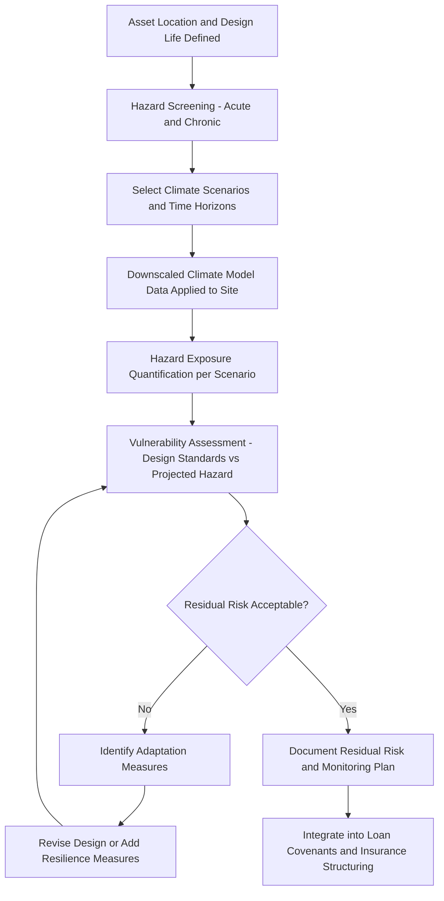

## Climate Risk and Physical Asset Resilience

### Overview

Climate Risk and Physical Asset Resilience addresses how project finance lenders, sponsors, and technical advisors identify, quantify, and mitigate the exposure of long-lived infrastructure assets to both acute climate hazards (extreme weather events) and chronic climate shifts (gradual changes in baseline conditions) over a project's construction and operating life — typically 20 to 30+ years for infrastructure assets. This module addresses **physical climate risk** specifically, distinguishing it from **transition risk** (policy, market, and technology shifts arising from the move to a low-carbon economy, addressed separately in climate scenario and transition planning contexts). Physical risk assessment has moved from a peripheral ESG consideration to a mainstream project finance due diligence requirement, driven by lender climate risk disclosure obligations, rating agency methodology integration, and the Equator Principles' EP4 climate alignment provisions referenced in an earlier module.

### Physical Risk Taxonomy

**Acute Physical Risks**

Event-driven hazards with a discrete onset, increasing in frequency and/or severity under most climate projections for many regions:

- Tropical cyclones/hurricanes/typhoons (wind damage, storm surge)
- Riverine and coastal flooding
- Extreme precipitation and flash flooding
- Wildfire
- Extreme heat events
- Landslides (often precipitation-triggered)

**Chronic Physical Risks**

Longer-term, gradual shifts in average conditions:

- Sea level rise
- Rising mean temperatures (affecting cooling loads, thermal efficiency, and equipment ratings)
- Changing precipitation patterns and long-term water availability/scarcity
- Permafrost thaw (relevant to specific high-latitude infrastructure)
- Ocean acidification (relevant to specific coastal/marine infrastructure)

**Key Points**

- Acute and chronic risks frequently compound: sea level rise (chronic) raises the baseline water level against which storm surge (acute) is superimposed, meaning a coastal asset's flood risk under a future climate scenario is not simply today's flood risk shifted by a fixed increment, but a function of the interaction between the two.
- Physical risk assessment is inherently probabilistic and scenario-dependent — deterministic single-point risk statements (e.g., "the asset will not flood") are generally inappropriate; results are properly expressed as exceedance probabilities under specified climate scenarios and time horizons.

### Assessment Frameworks and Scenario Basis

**Task Force on Climate-related Financial Disclosures (TCFD) Framework**

Though the TCFD itself disbanded its standard-setting function with its recommendations subsequently incorporated into the IFRS Foundation's International Sustainability Standards Board (ISSB) climate disclosure standard (IFRS S2), the TCFD's four-pillar structure (Governance, Strategy, Risk Management, Metrics and Targets) remains the dominant organizing framework project sponsors and lenders use to structure physical risk disclosure and assessment, including its emphasis on scenario analysis across multiple climate pathways.

**Climate Scenarios Used in Practice**

Physical risk assessments are typically run against multiple Representative Concentration Pathways (RCPs, from the IPCC's Fifth Assessment Report) or the more recent Shared Socioeconomic Pathways (SSPs, from the Sixth Assessment Report), commonly:

| Scenario Family | Illustrative Pathway | Approximate Warming Trajectory Framing |
| --- | --- | --- |
| RCP-based (AR5) | RCP2.6 | Strong mitigation, well below 2°C |
| RCP-based (AR5) | RCP4.5 | Moderate mitigation |
| RCP-based (AR5) | RCP8.5 | High-emissions, limited mitigation ("worst case" reference scenario) |
| SSP-based (AR6) | SSP1-2.6 | Sustainability-oriented, low emissions |
| SSP-based (AR6) | SSP5-8.5 | Fossil-fueled development, high emissions |

**Key Points**

- Best practice for infrastructure due diligence typically involves assessing physical risk under at least two scenarios spanning a plausible range (e.g., a moderate and a high-emissions pathway) rather than relying on a single "central" projection, given the asset's multi-decade operating life extends well beyond the point at which emissions pathways are expected to diverge materially.
- RCP8.5 has been characterized in more recent literature as a less probable, higher-end reference case, and some practitioners have shifted toward SSP2-4.5 or SSP3-7.0 as more representative "current policies" trajectories; [Unverified] the degree to which project finance market practice has fully updated methodology and terminology from RCP to SSP framing varies by advisor and jurisdiction, and older RCP-referenced reports remain in circulation.

### Structural Diagram — Physical Climate Risk Assessment Workflow

### Vulnerability and Design Standard Assessment

Physical risk assessment is only meaningful when hazard projections are compared against the asset's actual engineering design basis:

$$\text{Residual Risk} = \text{Projected Hazard Exposure} - \text{Design Resilience Margin}$$

For example, a coastal facility designed to a 1-in-100-year storm surge return period based on **historical** data may face a materially higher **effective** exceedance probability by mid-century if that same physical water level is projected to become, say, a 1-in-25-year event under a given warming scenario — a phenomenon sometimes termed "non-stationarity" of historical return period statistics, since the assumption that past hazard frequency predicts future frequency breaks down under a changing climate.

**Key Design Basis Considerations by Asset Type**

| Asset Type | Primary Physical Risk Exposure | Typical Design Basis Consideration |
| --- | --- | --- |
| Coastal/estuarine power plants (cooling water intake) | Sea level rise, storm surge, water temperature rise (affecting cooling efficiency) | Intake elevation, thermal discharge permit compliance under rising ambient water temperatures |
| Hydropower | Changing precipitation/runoff patterns, glacial melt trajectory changes affecting long-term flow | Long-term hydrology re-assessment beyond historical flow records, reservoir sedimentation rate changes |
| Solar PV | Extreme heat (panel efficiency derating), hailstorm intensity, wildfire (in specific regions) | Temperature coefficient de-rating assumptions, hail-resistance glass specification |
| Wind | Changing wind resource patterns, extreme wind/cyclone loading | Turbine class rating vs. projected extreme wind speed exceedance |
| Toll roads/rail | Flooding, extreme heat (pavement/rail buckling), landslide (precipitation-triggered) | Drainage capacity design storm return period, pavement/rail thermal tolerance specification |
| Ports and coastal logistics | Sea level rise, storm surge, increased dredging needs from sediment pattern shifts | Quay/wharf elevation design basis, breakwater design storm parameters |

### Integration into Project Finance Due Diligence and Documentation

**Technical Due Diligence**

Independent Engineers (IEs) engaged by lenders increasingly incorporate physical climate risk assessment into their broader technical due diligence scope, alongside traditional construction and O&M risk review — assessing whether the design basis (e.g., flood design storm return period, wind loading standard) remains adequate under projected future conditions over the debt tenor, not merely under historical climate statistics.

**Insurance Structuring**

Physical risk findings directly inform:

- Business interruption and property damage insurance sizing and deductible structuring
- Identification of potentially uninsurable or increasingly expensive-to-insure risk categories (a growing concern in high-wildfire, high-hurricane, and high-flood-exposure regions, where insurance market capacity has tightened in various jurisdictions)
- Parametric insurance consideration for specific acute hazards (e.g., parametric cyclone or flood cover, which pays out based on a triggering event parameter rather than assessed loss, providing faster liquidity post-event)

**Loan Documentation Integration**

- **Conditions precedent:** Delivery of a satisfactory physical climate risk assessment, particularly for Category A projects or those in recognized high-exposure geographies.
- **Covenants:** Requirements to maintain adequate insurance coverage reflecting evolving risk assessments, and (in more advanced structures) periodic re-assessment of physical risk at defined intervals over the loan tenor.
- **Reserve accounts:** Some structures incorporate a climate resilience reserve or enhanced maintenance reserve account sized with reference to identified physical risk exposure, distinct from standard maintenance reserve accounts.

### Example: Coastal Combined-Cycle Gas Power Plant, Physical Risk Assessment

**Scenario:** A 500 MW combined-cycle gas power plant sited on an estuarine coastline, seawater-cooled, with a 25-year debt tenor and an expected 35-year operating life.

**Assessment approach:**

1. **Hazard screening:** Sea level rise, storm surge, and cooling water intake temperature rise identified as primary chronic/acute risks; riverine flooding from the estuary's freshwater catchment identified as a secondary acute risk.
2. **Scenario selection:** Assessed under two SSP scenarios (a moderate and a high-emissions pathway) across three time horizons: financial close, end of debt tenor (year 25), and end of design life (year 35).
3. **Downscaled data application:** Regional sea level rise projections and storm surge modeling applied to the specific site elevation and bathymetry, rather than relying on global-average sea level rise figures alone.
4. **Vulnerability finding:** Plant's original design basis (1-in-100-year storm surge return period, using 1990s–2010s historical data) found to correspond to an effective 1-in-40-year exceedance probability by year 25 under the higher-emissions scenario — a materially increased residual risk relative to the original design assumption.
5. **Adaptation measures identified:** Raising critical electrical switchgear above a revised design flood elevation, upgrading cooling water intake screens to accommodate a wider range of water temperatures, and enhancing perimeter flood defenses.
6. **Documentation outcome:** Adaptation measures incorporated as a condition precedent to financial close (for measures feasible pre-completion) and as an ongoing covenant with a defined implementation schedule (for measures requiring operational-phase retrofit); enhanced property and business interruption insurance sized to reflect the revised residual risk profile.

**Output (Illustrative exceedance probability shift):**

| Time Horizon | Historical Design Basis Return Period | Projected Effective Return Period (Higher-Emissions Scenario) |
| --- | --- | --- |
| Financial close (Year 0) | 1-in-100-year | ~1-in-85-year |
| End of debt tenor (Year 25) | 1-in-100-year (unchanged design) | ~1-in-40-year |
| End of design life (Year 35) | 1-in-100-year (unchanged design) | ~1-in-25-year |

[Inference] The specific numerical shift in effective return period shown is illustrative of the type of finding typical assessments produce; actual figures are highly site-specific, dependent on local bathymetry, regional sea level rise projections, and the climate model ensemble used, and should never be assumed to generalize across sites.

### Relationship to Transition Risk and Broader Climate Disclosure

**Key Points**

- Physical risk assessment is distinct from, but reported alongside, transition risk assessment (carbon pricing exposure, stranded asset risk, demand-shift risk) under integrated climate risk disclosure frameworks such as IFRS S2 — a lender's overall climate risk view of a project typically synthesizes both dimensions rather than treating them as substitutes.
- EP4's climate change provisions require Category A (and, in some cases, Category B) projects with material emissions to complete an "alternatives analysis" considering lower-carbon options, and encourage — though as of EP4's initial adoption do not universally mandate for all project types — physical climate risk and resilience assessment as part of the broader climate change assessment expected under the framework.
- Rating agencies (S&P, Moody's, Fitch) have each published distinct methodologies for incorporating physical climate risk into project finance credit ratings, generally treating unmitigated material physical risk exposure as a negative rating factor, with credit given for demonstrated adaptation planning and resilience investment.

### Common Structuring and Assessment Pitfalls

**Key Points**

- **Relying solely on historical hazard statistics:** Using only backward-looking historical return period data without forward climate-adjusted projection is the most fundamental and common shortfall identified in physical risk due diligence, given the non-stationarity issue described above.
- **Single-scenario assessment:** Assessing physical risk under only one climate scenario (often an unstated "moderate" assumption) fails to characterize the genuine range of uncertainty relevant to a lender's risk appetite across a multi-decade tenor.
- **Ignoring compounding hazards:** Assessing sea level rise and storm surge, for example, as independent risks rather than as interacting/compounding hazards can materially understate genuine exposure, as noted above.
- **Static assessment with no re-evaluation mechanism:** A physical risk assessment conducted once at financial close, with no covenant requiring periodic re-assessment as climate science and projections evolve over a 20–30 year tenor, may become materially stale well before loan maturity.
- **Treating adaptation measures as purely a capex afterthought:** Identifying adaptation measures late in due diligence, after design freeze, often forces costlier retrofit-based solutions rather than lower-cost measures achievable through early design integration (e.g., elevation of critical equipment during initial design vs. post-construction retrofit).

### Related Topics

- Equator Principles and IFC Performance Standards (EP4 climate change assessment provisions)
- IFRS S2 (ISSB climate-related disclosure standard) and its physical/transition risk reporting requirements
- Green Bonds and Sustainability-Linked Loans (climate resilience as a potential KPI/eligible category)
- Transition risk assessment: carbon pricing exposure and stranded asset risk for project finance
- Parametric insurance structuring for acute climate hazard risk transfer
- Independent Engineer technical due diligence scope for climate-adjusted design basis review
- Rating agency methodologies for physical climate risk in project finance credit assessment
- Long-term hydrology re-assessment methodologies for hydropower asset relicensing and refinancing