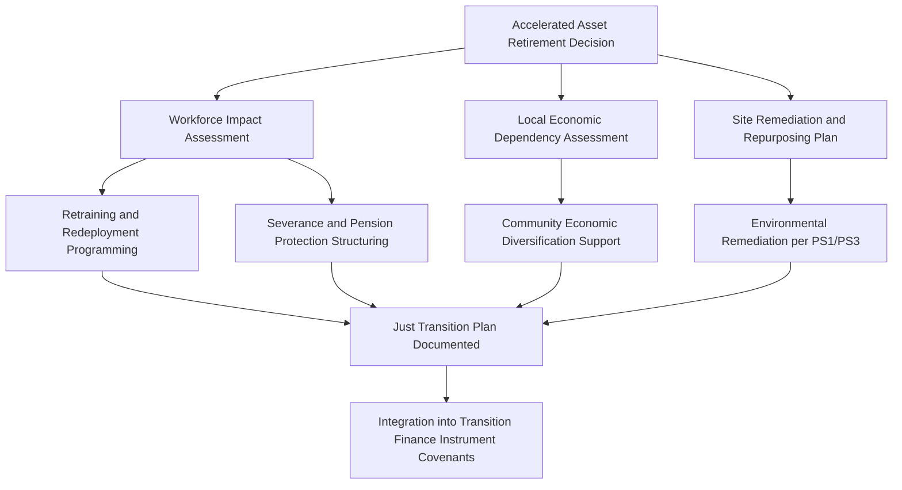

## Just Transition and Community Engagement Considerations

### Overview

Just Transition refers to the principle and associated set of practices ensuring that the shift away from carbon-intensive economic activity — and the deployment of new low-carbon infrastructure — distributes benefits and burdens fairly across workers, communities, and regions, rather than concentrating adverse impacts on those least able to absorb them while benefits accrue elsewhere. In project finance, Just Transition considerations arise in two related but distinct contexts: (1) the **decommissioning or transition of existing carbon-intensive assets** (coal plants, oil and gas infrastructure) and the economic dislocation this causes for workers and host communities, and (2) the **siting and development of new low-carbon infrastructure** (renewables, transmission, critical minerals extraction for the energy transition), which frequently generates its own distinct set of community impacts and equity concerns. This module builds on the ESIA and IFC Performance Standards frameworks (prior modules) by focusing specifically on the labor, socioeconomic equity, and community engagement dimensions that Just Transition analysis foregrounds.

### Origins and Policy Basis

The term originates from the labor movement (particularly the International Labour Organization, ILO) and was formally incorporated into international climate policy through the Paris Agreement's preambular reference to "the imperatives of a just transition of the workforce." The ILO's 2015 "Guidelines for a Just Transition towards Environmentally Sustainable Economies and Societies for All" remains a foundational reference document, articulating principles including social dialogue, social protection, and skills development as core pillars of a just transition process.

**Key Points**

- Just Transition is not a formal, singular certification standard analogous to the IFC Performance Standards or Equator Principles; it is a policy principle that project finance market participants have translated into a growing but non-uniform set of due diligence practices, disclosure expectations, and financing structures.
- Multilateral development banks (the World Bank, European Bank for Reconstruction and Development, Asian Development Bank) have each published their own Just Transition frameworks or operational guidance, with some variation in scope and emphasis, which project sponsors and lenders operating across multiple multilateral co-financing relationships need to reconcile.

### Just Transition in Asset Decommissioning and Retirement Financing

**Core Considerations**

When project finance is structured around the early retirement or repurposing of carbon-intensive assets (e.g., accelerated coal plant closure financed via a transition bond, or an early retirement mechanism under a broader energy transition facility), Just Transition analysis typically addresses:

- **Direct workforce impact:** Number of direct employees affected, retraining and redeployment programming, severance and pension protection, and timeline for workforce transition relative to plant closure.
- **Indirect and induced economic impact:** Impact on local supply chains (fuel suppliers, contractors, service providers) and the broader local economy dependent on the facility (tax base effects on host municipalities, knock-on effects on local businesses).
- **Community economic diversification:** Whether financing or complementary programming supports host community economic diversification beyond simple worker retraining (e.g., attracting alternative industries, infrastructure repurposing).
- **Environmental remediation and site legacy:** Decommissioning, land remediation, and repurposing planning for the retired asset site, which has its own distinct environmental and social due diligence requirements under PS1/PS3.

**Structural Diagram — Just Transition Considerations in Asset Retirement Financing**

### Just Transition in New Low-Carbon Infrastructure Development

Just Transition analysis applied to greenfield renewable energy, transmission, and critical minerals projects addresses a different but related set of concerns:

- **Land use and displacement equity:** Large-footprint renewable projects (utility-scale solar, wind, transmission corridors) can generate resettlement, land-use restriction, or land value impacts affecting local communities in ways structurally similar to conventional infrastructure (governed by PS5), but with the added equity dimension of the local community bearing siting impacts for a facility whose electricity output, and associated economic benefit, may primarily serve distant urban or industrial consumers.
- **Employment quality and locality:** Assessment of whether construction and operational employment genuinely benefits local/regional workers (through local hiring commitments, skills training) versus relying predominantly on non-local or transient labor with limited lasting local economic benefit.
- **Critical minerals supply chain impacts:** For projects further up the energy transition supply chain (lithium, cobalt, copper, rare earth extraction feeding battery and renewable technology manufacturing), Just Transition analysis extends to source-country community, labor, and — in several documented cases — human rights and artisanal mining sector impacts, an area of growing lender and investor scrutiny given batteries and renewable technology components' reliance on these supply chains.
- **Benefit-sharing mechanisms:** Structuring mechanisms by which host communities receive a tangible, ongoing share of project benefits (community benefit funds, local ownership stakes, preferential tariffs, revenue-sharing agreements) rather than solely bearing siting impacts while benefits flow to remote off-takers and investors.

**Key Points**

- Benefit-sharing structures for renewable energy projects vary widely by jurisdiction — some jurisdictions have statutory or regulatory requirements (community benefit funds mandated as a condition of permitting in certain markets), while in others such arrangements remain entirely voluntary and sponsor-driven, creating significant variation in what a "standard" benefit-sharing package looks like across geographies.
- Critical minerals supply chain due diligence increasingly draws on the OECD Due Diligence Guidance for Responsible Supply Chains of Minerals from Conflict-Affected and High-Risk Areas, extended in practice by many lenders and purchasers beyond its originally narrower conflict-minerals scope to broader labor and community risk screening.

### Community Engagement: Distinguishing Just Transition Engagement from Standard ESIA Consultation

While the ESIA process (prior module) mandates structured stakeholder engagement as a procedural requirement (Equator Principles Principle 5, IFC PS1), Just Transition-oriented community engagement typically goes further in specific respects:

| Dimension | Standard ESIA Consultation | Just Transition-Oriented Engagement |
| --- | --- | --- |
| Primary focus | Identifying and mitigating adverse E&S impacts | Identifying adverse impacts AND affirmatively structuring equitable benefit distribution |
| Temporal scope | Concentrated around pre-construction and construction phases | Extends through the full operating life and, for decommissioning contexts, the full transition period |
| Engagement depth | Consultation and disclosure-focused | Often incorporates social dialogue mechanisms (tripartite worker-government-employer models drawn from ILO guidance), co-design of retraining/diversification programming |
| Vulnerable group focus | Identification of vulnerable/disadvantaged groups per PS1, tailored engagement for Indigenous Peoples per PS7 | Explicit attention to distributional equity — who bears costs (workers, host communities) versus who captures benefits (distant consumers, investors) |
| Typical output | ESIA, ESMP, RAP, stakeholder engagement plan | Just Transition Plan, workforce transition plan, community benefit-sharing agreement |

### Example: Coal Plant Early Retirement with Transition Financing

**Scenario:** A 600 MW coal-fired power plant is retired 15 years ahead of its originally licensed operating life, financed through a blended transition finance facility combining concessional multilateral capital with commercial debt, replacing generation capacity with a co-located renewable and storage facility.

**Just Transition components integrated into the financing:**

1. **Workforce transition plan:** Detailed inventory of the plant's ~450 direct employees and estimated 1,200 indirect/supply-chain jobs; retraining programming co-designed with labor representatives, targeting redeployment into the replacement renewable facility's operations and into regional economic diversification initiatives.
2. **Severance and pension protection:** Financing facility includes a ring-fenced allocation specifically for enhanced severance packages and pension continuity, structured as a condition precedent to disbursement of the accelerated retirement tranche.
3. **Local economic diversification fund:** A portion of transition financing proceeds allocated to a community economic diversification fund, governed jointly by the plant operator, local government, and community representatives, supporting alternative local economic activity.
4. **Site remediation:** Separate environmental remediation plan for the retired coal plant site, including ash pond closure and potential repurposing (e.g., for the co-located renewable facility itself, reducing net new land take).
5. **Social dialogue mechanism:** A standing tripartite committee (employer, union/worker representatives, local government) established for the duration of the transition period, going beyond a one-time consultation event.

**Output (Illustrative Just Transition Plan structure):**

| Component | Target/Metric | Financing Linkage |
| --- | --- | --- |
| Worker retraining | 450 direct employees offered retraining within 6 months of closure announcement | Condition precedent to accelerated retirement tranche disbursement |
| Redeployment | Target percentage of retrained workers placed in new roles within 12 months | Covenant with periodic reporting requirement |
| Community diversification fund | Fixed allocation per MW of retired capacity | Ring-fenced fund, independently administered |
| Site remediation | Completion against defined environmental closure standard | Standard PS1/PS3-aligned environmental covenant |

[Inference] The specific structuring mechanics illustrated (ring-fenced allocations, tripartite committees) reflect common practice elements observed across various publicly documented transition financing initiatives; the absence of a single standardized Just Transition financing template means actual deal structures vary considerably, and this example should be read as illustrative rather than a fixed template.

### Example: Greenfield Utility-Scale Solar with Benefit-Sharing Structure

**Scenario:** A 300 MW greenfield solar project sited on land historically used for smallholder agriculture and grazing in a rural region, with power primarily supplying a distant urban grid.

**Just Transition/equity-oriented structuring elements:**

1. **Land use transition support:** For landholders converting from agricultural use to land lease arrangements, structured lease payments benchmarked to provide durable income comparable to or exceeding prior agricultural livelihoods, rather than one-time compensation alone.
2. **Local hiring commitments:** Contractual local hiring targets for construction (semi-skilled/unskilled labor) and operational phases (skilled technical roles supported by local training partnerships), with reporting against targets as a facility covenant.
3. **Community benefit fund:** A fund calculated as a fixed amount per MWh generated (or per MW installed), directed toward community-identified priorities (local infrastructure, education, healthcare) via a participatory governance structure.
4. **Grid connection community benefit:** Where feasible, a defined allocation of generated power or a preferential local tariff arrangement for the host community, addressing the equity concern that the community bears siting impact while output primarily serves distant consumers.

### Integration into Loan Documentation and Reporting

**Key Points**

- Just Transition-specific covenants remain less standardized than IFC Performance Standard-based covenants, and are more frequently found in dedicated transition finance facilities, concessional/blended finance structures, or Sustainability-Linked Loans with explicitly social (rather than purely environmental) KPIs, than in conventional project finance facility agreements for greenfield renewable projects.
- Where included, Just Transition Plans are typically referenced as a condition precedent deliverable (for retirement/transition financings) or incorporated into the broader ESAP (for new-build projects with significant land use or local economic equity considerations), rather than constituting an entirely separate documentary regime.
- Reporting on Just Transition/community benefit metrics increasingly appears in sponsor-level sustainability reporting (aligned with broader ESG/sustainability-linked reporting discussed in an earlier module) even where not formally mandated by loan covenants, reflecting growing investor and stakeholder expectation for this disclosure.

### Common Structuring and Engagement Pitfalls

**Key Points**

- **Treating Just Transition as a communications exercise rather than a structuring input:** Announcing "just transition" commitments without ring-fenced financing, enforceable milestones, or independent verification mechanisms invites credibility challenges analogous to greenwashing concerns discussed in the Green Bonds/SLL module.
- **Underestimating indirect and induced economic impacts:** Workforce transition planning that addresses only direct employees, while omitting the frequently larger population of indirect/supply-chain and induced local economic dependency, understates the true scale of community economic transition needed.
- **One-time consultation substituting for ongoing social dialogue:** As with standard ESIA engagement pitfalls, a single consultation event at project announcement, without sustained engagement mechanisms through the full transition or operating period, fails to meet the deeper engagement expectations Just Transition principles articulate.
- **Benefit-sharing structures disconnected from actual project economics:** Community benefit fund allocations set arbitrarily low relative to project revenue, or structured without transparent, independently verifiable calculation methodology, can undermine the perceived legitimacy of the benefit-sharing mechanism even where nominally present.
- **Overlooking upstream supply chain Just Transition dimensions:** Financing greenfield renewable or storage projects without any due diligence on critical minerals supply chain labor and community impacts shifts equity concerns geographically rather than resolving them, an increasingly scrutinized gap in transition finance due diligence.

### Related Topics

- Environmental and Social Impact Assessment (ESIA process this module's engagement practices build upon)
- Equator Principles and IFC Performance Standards, particularly PS2 (Labor) and PS5 (Land Acquisition and Resettlement)
- Green Bonds and Sustainability-Linked Loans (social KPI design for Just Transition-linked instruments)
- OECD Due Diligence Guidance for Responsible Mineral Supply Chains
- ILO Guidelines for a Just Transition towards Environmentally Sustainable Economies and Societies for All
- Blended and concessional finance structuring for accelerated coal retirement mechanisms
- Free, Prior, and Informed Consent (FPIC) and Indigenous community benefit-sharing under PS7
- Community benefit fund governance models for renewable energy siting