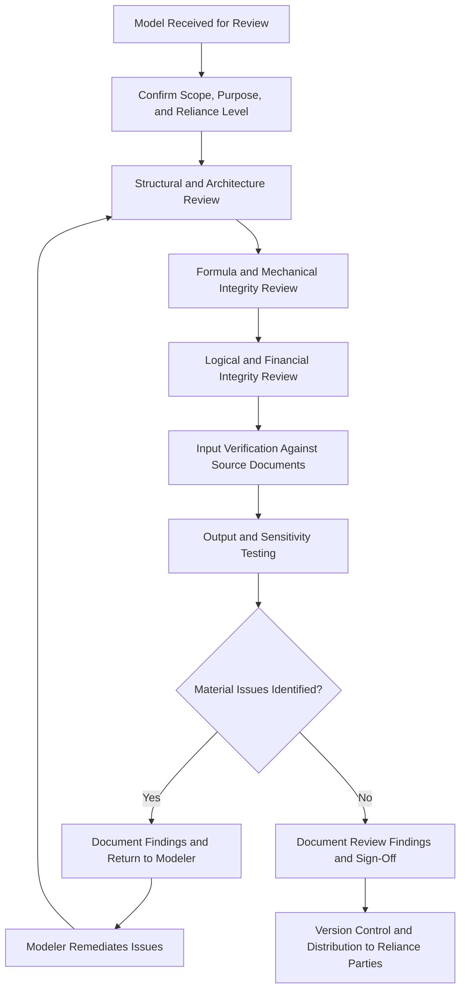

## Model Review and Quality Assurance Procedures

### Overview

Model Review and Quality Assurance (QA) Procedures encompass the systematic processes by which financial models — particularly the complex, high-stakes project finance models underpinning multi-hundred-million or multi-billion-dollar financing decisions — are checked for mechanical accuracy, logical integrity, and fitness for purpose before being relied upon by lenders, sponsors, rating agencies, and other transaction parties. Given that project finance models directly drive credit decisions, covenant thresholds, and distribution mechanics over 20-30 year tenors, model error is a recognized and material source of transaction risk; industry surveys and documented incidents have repeatedly shown that a substantial proportion of complex spreadsheet models contain material errors, making structured review procedures a core professional practice rather than an optional quality enhancement.

### Why Model Review Matters in Project Finance

Project finance models differ from many other financial modeling contexts in ways that elevate review importance:

- **Circularity:** Debt sizing frequently depends on cash flow available for debt service, which depends on interest expense, which depends on debt sizing — creating deliberate circular references that, if mishandled, can produce unstable or silently incorrect results.
- **Long tenors with compounding assumption sensitivity:** Small errors in early-period assumptions compound over 20-30 year projection periods, potentially producing materially misstated debt sizing, Debt Service Coverage Ratios (DSCRs), or equity returns.
- **Multi-party reliance:** Lenders, rating agencies, equity investors, and (in Islamic finance structures) Shariah boards may all rely on the same or derivative versions of a model, meaning an undetected error propagates across multiple decision-making processes.
- **Covenant and mechanical linkage to legal documentation:** Model outputs (DSCR calculations, cash sweep triggers, distribution tests) are frequently hard-wired into loan agreement mechanics, meaning a model error can have direct contractual and legal consequences, not merely an analytical one.

### Categories of Model Error

**Key Points**

- **Mechanical/formula errors:** Incorrect cell references, broken formula ranges after row/column insertion, inconsistent formulas across a row (one cell in a series manually overridden or differently constructed than its neighbors), and copy-paste errors are the most common category identified in industry error-rate studies.
- **Logical/structural errors:** Correct formulas applied to an incorrect conceptual basis — for example, calculating a DSCR using the wrong debt service definition, or applying an escalation rate to a base that should not be escalated (e.g., escalating an already-real, inflation-adjusted figure a second time).
- **Circularity-handling errors:** Incorrect iterative calculation settings, circular reference "switches" (macros or manual break mechanisms) that fail to reset correctly, or circularity that silently resolves to an unstable or non-convergent value without visible error indication.
- **Input/assumption errors:** Correct model mechanics applied to incorrect input data (wrong tax rate, incorrect escalation index, mistyped capacity figure) — distinct from formula errors, these require the reviewer to cross-check inputs against source documentation, not merely verify internal model logic.
- **Version control errors:** Distribution of an outdated model version, inconsistent assumptions between linked or related models (e.g., a base case and a sensitivity case that were not updated in parallel), or loss of previously implemented corrections when a model is rebuilt from an earlier template.

### The Model Review Process — Structured Approach

**1. Pre-Review Preparation**

- Confirmation of model scope, purpose, and intended audience (informs the appropriate depth of review — a preliminary screening model warrants lighter review than a financial close model that will be relied upon contractually)
- Identification of the model's key outputs and decision-relevant metrics (DSCR, Loan Life Coverage Ratio, equity IRR, minimum cash balance) that require the highest-confidence verification
- Confirmation of the modeling standard or protocol the model claims to follow (e.g., FAST Standard, Macabacus, SMART, or an in-house institutional standard), which frames the reviewer's structural expectations

**2. Structural/Architecture Review**

- Consistency of sheet structure and naming conventions
- Clear separation of inputs, calculations, and outputs (a core principle of most modeling standards, since blending these layers increases both error risk and review difficulty)
- Consistent formula construction across rows/columns (formulas should generally be identical across a time series, varying only in referenced period, with any deliberate exceptions clearly flagged)
- Appropriate use of named ranges, and absence of hard-coded values embedded within formulas (hard-coding a rate or figure directly into a formula, rather than referencing a clearly labeled input cell, is a frequently flagged review finding)

**3. Formula/Mechanical Integrity Review**

- Cell-by-cell or automated tool-assisted checking for broken references, inconsistent formulas, and circular reference behavior
- Verification of correct link direction and integrity between linked workbooks or sheets (a common source of error when models are split across multiple files for size or access-control reasons)
- Confirmation that iterative calculation settings (for intentional circularities, such as the debt-sizing circularity described above) are correctly configured and behave stably (i.e., the model converges to a consistent value rather than oscillating or failing to resolve)

**4. Logical/Financial Integrity Review**

- Verification that financial mechanics conform to the deal's actual legal and commercial terms (e.g., DSCR calculated per the precise definition in the facility agreement, not a generic textbook definition)
- Cross-checking of circularity logic against the intended debt sizing methodology (e.g., sculpted debt repayment targeting a minimum DSCR should be verified to actually produce the targeted minimum, not merely an average, DSCR across the tenor)
- Confirmation that escalation, indexation, and discounting are applied consistently and are not double-counted or omitted
- Balance sheet and cash flow integration checks (the balance sheet should balance in every period; cash flow statement components should reconcile to the balance sheet's period-over-period changes)

**5. Input Verification**

- Cross-referencing key inputs (capex, opex, revenue assumptions, tax rates, financing terms) against source documentation — EPC contracts, offtake agreements, term sheets, tax advice memoranda — rather than assuming inputs are correct because they appear in the model
- Sensitivity of outputs to key inputs, both to confirm the model responds as expected (a sanity check on model mechanics) and to identify which inputs carry the greatest influence over decision-relevant outputs

**6. Output and Sensitivity Testing**

- Stress-testing extreme or boundary input values (zero revenue, 100% cost overrun, immediate default scenarios) to confirm the model behaves sensibly (or fails gracefully with a clear error indicator) rather than producing a misleadingly plausible but incorrect result
- Cross-checking outputs against independent estimates or rules of thumb (e.g., does the calculated levered equity IRR fall within a plausible range for the asset class and risk profile, based on independent market knowledge)
- Reconciliation of the model's outputs against any prior version or a parallel/shadow model, where one exists, to identify unexplained discrepancies

**7. Documentation and Sign-Off**

- Formal review memorandum documenting scope, findings, and resolution status of identified issues
- Sign-off protocol appropriate to the model's reliance level (e.g., independent Model Auditor sign-off for financial close models in syndicated or rated transactions)
- Version control documentation establishing exactly which model version was reviewed and approved, and a change control process for any subsequent modifications

### Structural Diagram — Model Review Workflow

### Independent Model Audit (Third-Party Review)

For financial close models in syndicated lending, rated transactions, or public capital markets issuances (including the Sukuk structures discussed in earlier modules), an **Independent Model Audit** is frequently a condition precedent, performed by a specialist third-party firm distinct from the model's original builder (typically the financial advisor or sponsor's team).

**Typical Independent Model Audit Scope**

| Audit Level | Scope | Typical Use Case |
| --- | --- | --- |
| Logic check / high-level review | Review of key formulas, circularity handling, and overall structure without exhaustive cell-by-cell verification | Preliminary or non-underwritten financings, lower-value transactions |
| Full model audit | Comprehensive cell-by-cell formula verification, full input cross-checking, complete sensitivity and stress testing | Financial close for syndicated bank debt, project bonds, Sukuk issuances |
| Ongoing/periodic audit | Re-audit of model versions used for periodic covenant compliance calculations (e.g., annual DSCR certification) over the life of the financing | Long-tenor facilities with model-based ongoing compliance testing |

**Key Points**

- Independent Model Audit reports typically classify findings by severity (e.g., critical/high/medium/low, or "must fix" versus "recommended"), with critical findings generally required to be resolved prior to financial close, while lower-severity findings may be logged for future remediation without blocking closing.
- The Independent Model Auditor's opinion typically covers mechanical and logical integrity of the model as built, and explicitly does **not** constitute an opinion on the reasonableness of the underlying commercial or market assumptions (revenue forecasts, cost estimates) — that responsibility remains with the sponsor, technical advisors, and market consultants who provided those inputs. [Behavior may vary by audit firm and engagement letter scope; some engagements do include limited assumption benchmarking as an add-on scope item.]

### Modeling Standards Referenced in QA Practice

Several voluntary modeling standards inform both model construction and review criteria in project finance practice:

- **FAST Standard (Flexible, Appropriate, Structured, Transparent):** An open-source modeling standard widely referenced in project finance and infrastructure modeling, emphasizing strict separation of inputs/calculations/outputs, consistent formula construction, and avoidance of embedded constants.
- **SMART Standard and other proprietary/institutional standards:** Various banks, financial advisory firms, and multilateral institutions maintain their own internal modeling standards, often derived from or compatible with FAST principles, which a model reviewer working across multiple institutional counterparties needs to be conversant with.

**Key Points**

- No single modeling standard has achieved universal mandatory status across the project finance industry; a reviewer's practical task is often to assess a model against whichever standard the originating institution has adopted (or against generally accepted best practices where no formal standard is specified), rather than a single fixed checklist.

### Example: Financial Close Model Audit Findings Summary (Illustrative)

**Scenario:** A greenfield 400 MW combined-cycle gas power plant financing, financial close model submitted for Independent Model Audit ahead of syndicated bank debt closing.

**Output (Illustrative findings register):**

| Finding | Severity | Category | Resolution Status |
| --- | --- | --- | --- |
| Debt sizing circularity does not converge under the downside sensitivity case (oscillates rather than stabilizing) | Critical | Circularity-handling error | Resolved — iterative calculation settings corrected, circuit-breaker macro added |
| DSCR calculation excludes a scheduled major maintenance reserve contribution that the facility agreement's definition requires to be included | Critical | Logical/structural error | Resolved — formula corrected to match facility agreement definition |
| Escalation rate for O&M costs hard-coded directly into formulas in three separate cells rather than referencing the single input cell | Medium | Structural/input-error risk | Resolved — hard-coded values replaced with input cell references |
| Inconsistent formula in Year 14 tax calculation row (differs from Years 1-13 and 15-25 due to an apparent manual override) | High | Mechanical/formula error | Resolved — formula standardized across full projection period |
| Equity IRR calculation sheet references an outdated version of the capex schedule sheet, not the latest agreed EPC contract price | High | Version control/input error | Resolved — link updated to current capex schedule |

[Inference] This findings register is illustrative of the type and severity distribution of issues typically identified in Independent Model Audits; actual findings are entirely model- and deal-specific, and this example should not be read as a representative statistical sample of audit outcomes generally.

### Common Model Review and QA Pitfalls

**Key Points**

- **Reviewing only the "happy path" base case:** Confirming a model produces sensible results under the base case while neglecting to stress-test downside, upside, and boundary scenarios can leave circularity instability, formula breaks, or logical errors undetected until they surface unexpectedly during actual adverse conditions post-financial-close.
- **Confusing review depth with review speed:** Time-pressured financial close timelines can compress model audit scope in ways that increase the risk of undetected critical errors; a documented, risk-based scoping decision (rather than an implicit, schedule-driven scope reduction) is generally the more defensible practice.
- **Treating the Independent Model Audit as a substitute for internal QA:** An Independent Model Audit is designed as an additional control layer, not a replacement for the model-building team's own internal review discipline; relying solely on the external audit to catch all errors is a documented source of transaction risk.
- **Inadequate version control during the negotiation period:** Financial close models frequently undergo rapid iteration as commercial terms are finalized in the days before closing; without rigorous version control, it is possible for a stale or partially updated model version to be the one actually executed against in final documentation.
- **Overlooking post-closing model governance:** Failing to establish a clear protocol for how the model will be maintained, updated, and re-verified for ongoing covenant compliance testing over the life of a long-tenor facility can allow review rigor achieved at financial close to erode over subsequent years.

### Related Topics

- FAST Standard modeling principles and open-source reference documentation
- Debt sizing methodologies and circularity management in project finance models
- DSCR, LLCR, and other project finance credit metrics: definitional consistency between models and legal documentation
- Independent Engineer and Independent Model Auditor roles in financial close due diligence
- Sensitivity and scenario analysis design for project finance credit assessment
- Covenant compliance certification processes and periodic model re-verification
- Version control and change management protocols for long-tenor project finance models
- Circular reference handling techniques in spreadsheet-based financial models