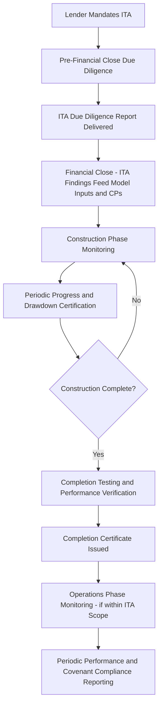
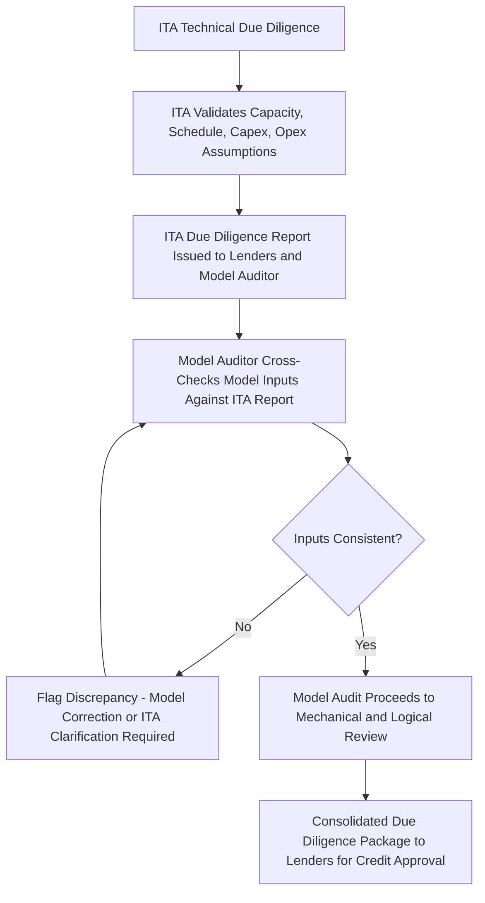

## Independent Technical Advisor and Model Audit Processes

### Overview

Independent Technical Advisors (ITAs) — also referred to as Independent Engineers (IEs) depending on jurisdiction and sector — and Independent Model Auditors are two distinct but closely coordinated third-party professional roles engaged by lenders (and sometimes jointly by lenders and sponsors) to provide objective, expert assurance over the technical feasibility and financial modeling integrity of a project finance transaction. While the prior module addressed model review and QA procedures generically, this module focuses specifically on the institutional role, scope, appointment mechanics, and reporting outputs of these two advisor functions, and on how their work products interact — since the ITA's technical findings are frequently the direct source of key inputs the Model Auditor must verify are correctly reflected in the financial model.

### The Independent Technical Advisor (ITA) / Independent Engineer (IE)

**Role and Rationale**

Lenders financing a project (particularly a greenfield project) are not themselves typically equipped with the specialized engineering, construction, and operational expertise needed to independently assess whether a project is technically sound, appropriately designed, realistically scheduled, and reasonably costed. The ITA/IE is engaged by (or on behalf of) the lender group to provide this independent technical assurance throughout the transaction lifecycle, from due diligence through construction monitoring and, frequently, into operations.

**Key Points**

- The ITA is engaged by and reports to the lenders (even where the sponsor pays the ITA's fees, which is common commercial practice), and owes its primary duty of care to the lender group — a structural point that distinguishes the ITA from the sponsor's own EPC contractor, owner's engineer, or in-house technical team, whose incentives are not identically aligned with lender interests.
- ITA scope and terminology vary somewhat by sector and jurisdiction: "Independent Engineer" is more commonly used in traditional infrastructure and power contexts, while "Independent Technical Advisor" is a broader term sometimes encompassing non-engineering technical specialists (e.g., resource consultants for mining or renewable energy projects, reserve auditors for oil and gas).

**Core ITA Due Diligence Scope (Pre-Financial Close)**

| Scope Area | Key Assessment Focus |
| --- | --- |
| Design and engineering review | Adequacy of the technical design against applicable codes, standards, and the project's stated performance requirements |
| EPC contract review | Assessment of contract price reasonableness, scope completeness, contractor track record and financial capacity, liquidated damages adequacy, and completion guarantee/warranty provisions |
| Construction schedule review | Realism of the construction timeline, identification of critical path risks, and adequacy of schedule contingency |
| Cost estimate review | Reasonableness of capital cost estimates, adequacy of cost contingency, and completeness of the cost breakdown against likely scope |
| Permitting and regulatory review | Status and adequacy of required permits, licenses, and regulatory approvals relative to the construction and operating schedule |
| O&M and performance review | Adequacy of the operations and maintenance plan/contract, reasonableness of projected operating costs and performance/availability assumptions |
| Resource/input assessment | For resource-dependent projects (hydropower hydrology, wind/solar resource assessment, fuel supply for thermal generation), independent review or validation of the resource/input assumptions underpinning revenue and output projections |
| Insurance review | Adequacy of the proposed insurance program (construction all-risk, delay in start-up, operational property and business interruption) relative to identified technical risks |

### Structural Diagram — ITA Engagement Across the Project Lifecycle

**Construction-Phase Monitoring Role**

Once financial close occurs and construction commences, the ITA typically transitions into an ongoing monitoring role:

- **Drawdown certification:** Verification of construction progress against the disbursement schedule before certifying that lenders should release the next drawdown tranche — a critical gatekeeping function directly tying the ITA's technical assessment to actual cash disbursement mechanics.
- **Progress and schedule monitoring:** Regular (often monthly or quarterly) site visits and progress reports assessing whether construction remains on schedule and within budget, and flagging emerging delay or cost overrun risk early.
- **Change order and variation review:** Assessment of proposed scope changes, their cost and schedule impact, and their implications for the original technical due diligence findings.
- **Completion testing oversight:** Independent verification that the completed asset meets the contractually specified performance criteria (capacity, efficiency, output) during commissioning and performance testing, directly informing whether "Completion" (a defined term with significant legal and financial consequences, such as conversion from a construction facility to a term facility, or release of sponsor completion guarantees) has been achieved per the facility agreement's definition.

**Key Points**

- The ITA's Completion Certificate (or equivalent sign-off) is frequently a condition precedent to a defined legal milestone in the financing documents (e.g., "Project Completion" under the facility agreement), meaning the ITA's technical judgment has direct, binding contractual consequences distinct from being merely advisory.
- Performance testing protocols (what constitutes a passing performance test, and the consequences of a shortfall — liquidated damages, extended testing periods, or default) are typically negotiated and defined in the EPC contract and facility agreement in advance, with the ITA's role being to independently verify the test results against those pre-agreed criteria rather than to define the criteria itself.

### The Independent Model Auditor — Interaction with the ITA

Building on the model review and QA procedures discussed in the prior module, the Independent Model Auditor's work is directly dependent on, and must be reconciled against, the ITA's technical findings:

- **Input consistency verification:** The Model Auditor checks that the financial model's key technical inputs (capacity, availability, heat rate/efficiency, capex, opex, construction schedule) match the figures the ITA has independently reviewed and validated — a mismatch here (e.g., the model using a more optimistic capacity factor than the ITA's independently assessed resource study) is a common and material finding.
- **Escalation and timing consistency:** Verification that the model's treatment of construction drawdown timing, cost escalation, and completion date assumptions is consistent with the ITA's assessed construction schedule and cost estimate, rather than an internally generated (and potentially more optimistic) sponsor assumption.
- **Sequential reliance:** In a typical due diligence timeline, ITA findings are substantially finalized before or concurrently with the Model Audit, since the Model Auditor needs stable, ITA-validated technical inputs to complete input verification (the "Input Verification" stage discussed in the prior module) rather than auditing a model against inputs that may still change.

**Structural Diagram — ITA and Model Auditor Coordination**

### Appointment and Independence Considerations

**Appointment Mechanics**

- The ITA and Model Auditor are typically selected by the lender group (often via a shortlist process managed by the lenders' legal counsel or financial advisor), though the sponsor commonly bears the engagement cost — a structure explicitly designed to preserve the advisor's independence from the party paying its fees.
- Engagement letters typically include an explicit reliance provision, confirming that the lender syndicate (including future assignees/transferees in a syndicated or secondary-market context) is entitled to rely on the ITA/Model Auditor's reports, since the advisor's contractual counterparty may formally be the sponsor or a facility agent rather than each individual lender.

**Independence Safeguards**

- Conflict-of-interest screening to confirm the ITA/Model Auditor has no material prior or concurrent relationship with the sponsor, EPC contractor, or other transaction parties that could compromise objectivity.
- Clear scope-of-work definition to prevent scope creep into advisory or advocacy functions inconsistent with an independent assurance role (e.g., an ITA should assess a proposed design's adequacy, not effectively co-design it on the sponsor's behalf).
- Liability caps and professional indemnity insurance requirements calibrated to the transaction's scale and risk profile, reflecting the ITA/Model Auditor's exposure for reliance-based claims if their assessment later proves materially incorrect.

**Key Points**

- [Behavior may vary by jurisdiction and market practice.] Some markets and lender groups favor a strict "lenders select and directly instruct" model to maximize perceived independence, while others operate a "sponsor proposes, lenders approve" shortlist process; both are common, but the degree of practical lender control over ITA/Model Auditor selection varies accordingly.
- Professional liability exposure for ITAs and Model Auditors in project finance is a recurring industry discussion point, given the potentially large scale of reliance-based losses relative to typical professional indemnity coverage limits — this has, in various markets, influenced engagement letter liability cap negotiations and the market's overall appetite for taking on the largest, most complex mandates.

### Example: Greenfield Wind Farm — Coordinated ITA and Model Audit Process

**Scenario:** A 200 MW greenfield wind farm, senior lender group engaging both an ITA and an Independent Model Auditor ahead of financial close.

1. **ITA due diligence:** Reviews turbine supply agreement and technology track record, independently assesses the wind resource study (typically involving review or re-analysis of the meteorological data and energy yield assessment methodology underpinning the P50/P90 energy production estimates), reviews the balance-of-plant EPC contract and construction schedule, and assesses the O&M agreement's adequacy.
2. **ITA findings on energy yield:** Independently validated P50 (median) and P90 (90% probability of exceedance) annual energy production estimates, which will directly drive the financial model's base case and downside revenue projections.
3. **Model Auditor cross-check:** Confirms the financial model's base case revenue projection uses the ITA-validated P50 (or an agreed more conservative percentile, per lender credit policy — some lender groups size debt off a P90 or P99 estimate rather than P50) energy production figure, rather than a more optimistic sponsor-side estimate.
4. **Discrepancy example:** Model Auditor identifies that the model's construction schedule (driving interest-during-construction calculations) is two months more aggressive than the ITA's independently assessed schedule — flagged as a finding requiring either model correction or ITA/sponsor reconciliation before financial close.
5. **Consolidated output:** ITA due diligence report and Model Audit report are both delivered to the lender credit committee as companion due diligence deliverables, with the Model Audit report explicitly cross-referencing which inputs were verified against the ITA report versus other source documents (e.g., tax inputs verified against tax advisor memoranda, financing terms verified against the term sheet).

**Output (Illustrative energy yield sizing convention):**

| Percentile Estimate | Probability of Exceedance | Typical Use in Financial Model |
| --- | --- | --- |
| P50 | 50% (median expected case) | Base case revenue projection, sponsor equity case |
| P90 | 90% | Common conservative case for senior debt sizing (1-year P90) |
| P99 | 99% | Sometimes used for extreme downside stress testing or, in certain markets, for 10-year P90/P99 debt sizing conventions |

[Inference] The specific percentile convention used for debt sizing (P50, one-year P90, ten-year P90, or other) varies by lender group, jurisdiction, and asset class, and is a matter of individual lender credit policy rather than a single universal industry standard — deal-specific term sheets and credit approval documents should be consulted rather than assuming a fixed convention.

### Ongoing Operations-Phase Role

For some financings, particularly those with model-based ongoing covenant compliance testing (as referenced in the prior module), the ITA and/or Model Auditor may retain a periodic role post-completion:

- **Annual/periodic technical performance review:** ITA assessment of actual operating performance (availability, output, major maintenance execution) against the original technical due diligence assumptions, informing lenders whether the asset continues to perform as originally assessed.
- **Model re-certification:** Periodic re-verification that the compliance model (used for ongoing DSCR/covenant certification) continues to be mechanically sound and consistent with actual operating data and any amended technical assumptions.
- **Major maintenance and life extension review:** For assets requiring significant mid-life capital expenditure (e.g., major overhauls of thermal generation equipment, blade replacement programs for wind turbines), ITA assessment of the adequacy and timing of major maintenance reserve account funding relative to actual anticipated maintenance needs.

### Common Pitfalls in ITA and Model Audit Coordination

**Key Points**

- **Sequencing failure — Model Audit proceeding ahead of finalized ITA findings:** Conducting the Model Audit's input verification stage before the ITA's technical due diligence is substantially complete risks the Model Auditor validating inputs that are subsequently revised, requiring rework.
- **Siloed advisor communication:** Where the ITA and Model Auditor do not directly communicate or share draft findings during the due diligence process, input inconsistencies may only surface late in the process (or, in a worst case, not until construction monitoring), rather than being caught and reconciled during initial due diligence.
- **Ambiguous percentile/methodology conventions in reliance documentation:** Failing to explicitly document which specific resource assessment percentile, methodology, and dataset the model's revenue assumptions rely upon (versus alternative percentiles the ITA may have also calculated) can create ambiguity in later covenant compliance disputes about which figure was actually relied upon at financial close.
- **Underestimating construction-phase monitoring resourcing:** Engaging an ITA with adequate due diligence-phase resourcing but insufficient ongoing construction-monitoring site-visit frequency or capacity can allow emerging schedule or cost issues to go undetected between infrequent monitoring reports.
- **Conflating advisory scope creep with independence:** An ITA or Model Auditor who becomes deeply embedded in resolving sponsor-side technical or modeling issues (beyond identifying and reporting them) risks blurring the line between independent assurance and de facto co-development, a dynamic that can undermine the credibility of subsequent sign-offs.

### Related Topics

- Model Review and Quality Assurance Procedures (prior module — QA methodology this module's Model Auditor role applies)
- Debt sizing methodologies: P50/P90/P99 resource assessment conventions in renewable energy financing
- EPC contract structuring: liquidated damages, completion guarantees, and performance testing protocols
- Completion tests and Project Completion definitions in project finance facility agreements
- Major maintenance reserve account sizing and life extension capital expenditure planning
- Construction drawdown mechanics and progress certification procedures
- Professional liability and reliance letter structuring for third-party due diligence advisors
- Ongoing covenant compliance certification and periodic technical performance review