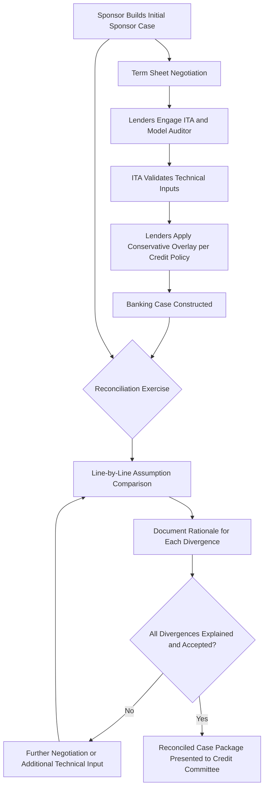

## Reconciling Banking Case, Base Case, and Sponsor Case

### Overview

Project finance transactions routinely generate multiple, distinct versions of the same underlying financial model — each built around the same asset and the same core mechanics, but reflecting different assumption sets calibrated to different parties' purposes and risk perspectives. The **Sponsor Case**, **Base Case**, and **Banking Case** (sometimes with additional variants such as a **Rating Agency Case** or **Lender Downside Case**) are not simply duplicate models; they represent a structured, deliberate divergence in assumptions that must be transparently reconciled so that all transaction parties understand precisely why outputs differ and can trust that the differences arise from disclosed, defensible assumption choices rather than model inconsistency or manipulation. Reconciliation failure — an inability to explain why the Banking Case DSCR differs from the Sponsor Case DSCR, for example — is a recurring source of due diligence delay and credit committee scrutiny.

### Defining the Case Types

**Sponsor Case (or Management Case)**

The model version built and maintained by the project sponsor, typically reflecting the sponsor's own best-estimate or "most likely" view of project performance. This case is used internally for equity return analysis, investment committee approval, and initial term sheet negotiation, and often reflects a degree of optimism inherent in a party incentivized to demonstrate an attractive equity return.

**Base Case**

A term used somewhat inconsistently across the market — in some contexts, "Base Case" is used interchangeably with Sponsor Case (the primary, most-likely scenario before any deliberate downside adjustment); in other contexts, particularly within lender and rating agency usage, "Base Case" refers to a jointly agreed, mutually vetted set of assumptions that both sponsor and lenders have converged on after due diligence, distinct from the sponsor's original, unvetted internal case. [Unverified — terminology usage varies significantly by institution and jurisdiction, and the specific meaning intended by "Base Case" in any given transaction should always be confirmed against that deal's own documentation rather than assumed from general usage.]

**Banking Case (or Lenders' Case)**

The model version used by the lender group (or the Mandated Lead Arrangers on the lenders' behalf) for credit approval, debt sizing, and covenant calibration, incorporating assumptions the lenders consider appropriately conservative for their risk-bearing position — typically informed by, but deliberately more conservative than, the Sponsor/Base Case, and directly shaped by the ITA and Model Auditor findings discussed in the prior module.

**Key Points**

- Because "Base Case" terminology is not standardized, the reconciliation exercise itself often needs to begin with an explicit definitional step: confirming, in writing, exactly which assumption set each labeled "case" in the transaction's documentation actually refers to, before any numerical reconciliation can proceed meaningfully.
- Rating agencies rating project bonds or Sukuk (as discussed in the Infrastructure Sukuk module) typically construct their own independent Rating Agency Case, which may diverge from both the Sponsor Case and the Banking Case, adding a third (or fourth) distinct assumption set to the reconciliation exercise for publicly rated transactions.

### Key Dimensions of Divergence

| Assumption Category | Typical Sponsor Case Treatment | Typical Banking Case Treatment |
| --- | --- | --- |
| Revenue/output assumptions | Best-estimate or P50 resource/demand assumptions | More conservative percentile (e.g., P90 energy yield for renewables) or haircut applied to demand forecasts |
| Operating cost escalation | Management's own opex forecast, potentially reflecting anticipated efficiency gains | ITA-validated or independently benchmarked opex, often with additional contingency margin |
| Major maintenance timing and cost | Optimized timing reflecting sponsor's O&M strategy | Conservative timing/cost, cross-checked against ITA technical assessment and equipment manufacturer guidance |
| Construction cost and schedule | EPC contract price and schedule, potentially with limited contingency | EPC price plus additional cost contingency; schedule reflecting ITA-assessed realistic completion date rather than contractually targeted date |
| Macroeconomic assumptions (inflation, FX, interest rates) | Sponsor's own house view or a single reference forecast | Lender-mandated conservative assumptions, often including specific stress scenarios (e.g., a defined basis point shift in interest rates, or a specified FX depreciation) |
| Tax and regulatory assumptions | Current law/rate assumed to persist | May incorporate a margin for regulatory/tax risk, particularly in jurisdictions with less stable regulatory track records |
| Debt sizing methodology | Often modeled off the sponsor's own target leverage/return | Sized to achieve a minimum DSCR threshold under the Banking Case's more conservative assumptions, which typically produces a lower permissible debt quantum than the Sponsor Case would support |

### Structural Diagram — Case Divergence and Reconciliation Flow

### The Reconciliation Process

**1. Structural Alignment**

Before comparing outputs, confirm both models share the same underlying mechanical structure — same DSCR definition, same period conventions (calendar year vs. financial year, semi-annual vs. quarterly), and same core financial mechanics — so that any observed output differences are attributable to assumption differences rather than structural/mechanical inconsistency between the two model versions.

**2. Line-by-Line Assumption Comparison**

A systematic, typically tabular comparison of every material input assumption across the Sponsor Case and Banking Case, with each divergence flagged and a rationale documented. This comparison is frequently presented as a formal "Bridge" or "Reconciliation Schedule" in due diligence reporting.

**3. Output Bridge Analysis**

Rather than simply presenting two different DSCR or IRR outputs side by side, a well-constructed reconciliation quantifies the output impact of each individual assumption divergence, building a "waterfall" or "bridge" from one case's output to the other's:

$$\text{DSCR}_{Banking} = \text{DSCR}_{Sponsor} + \sum_{i} \Delta_i$$

where each $\Delta_i$ represents the isolated impact of a single assumption change (e.g., the DSCR impact of moving from P50 to P90 energy yield, held constant with all other assumptions unchanged), allowing credit committees and sponsors alike to see precisely which assumption differences drive the overall output gap, rather than a single unexplained aggregate difference.

**4. Sensitivity Cross-Validation**

Running the Banking Case's conservative assumptions through the Sponsor Case model structure (and vice versa) as a cross-check, to confirm that the mechanical model itself produces consistent results regardless of which case's model file is used — a discrepancy here would indicate a structural/mechanical inconsistency between the two model builds rather than a legitimate assumption-driven difference.

**5. Documentation for Credit Approval**

The reconciled comparison, typically including the assumption comparison table and output bridge, is presented to the lender credit committee as part of the credit approval package, providing the committee visibility into both the conservative Banking Case output and the basis for the more optimistic Sponsor Case, supporting a fully informed credit decision.

### Example: Greenfield Solar Project — Case Reconciliation

**Scenario:** A 150 MW greenfield solar project; Sponsor Case DSCR of 1.55x average, Banking Case DSCR of 1.35x average (minimum covenant threshold set at 1.20x).

**Output (Illustrative assumption comparison and output bridge):**

| Assumption | Sponsor Case | Banking Case | DSCR Impact of Change |
| --- | --- | --- | --- |
| Energy yield percentile | P50 | P90 (one-year) | −0.12x |
| O&M cost escalation | 2.0% per annum | 2.5% per annum (ITA-benchmarked) | −0.04x |
| Panel degradation rate | 0.4% per annum | 0.55% per annum (manufacturer warranty-conservative) | −0.03x |
| Major maintenance reserve timing | Reserve funded in year of expenditure | Reserve pre-funded two years ahead per lender policy | −0.01x |
| **Combined Banking Case DSCR** | — | — | **1.55x − 0.20x = 1.35x** |

[Inference] The individual assumption-level DSCR impacts shown are illustrative of how a bridge analysis is typically presented; actual isolated impacts depend on the specific model's sensitivity to each assumption and cannot be assumed to be additive in all cases (interaction effects between assumptions can mean the combined impact of simultaneous changes differs slightly from the simple sum of each change's isolated impact) — well-constructed bridges disclose this methodology explicitly rather than presenting a purely additive breakdown without qualification.

**Debt sizing consequence:** Because debt is sized to achieve the lender's minimum DSCR covenant under the *Banking Case* (not the Sponsor Case), the more conservative Banking Case assumptions directly translate into a lower maximum permissible debt quantum than the Sponsor Case alone would suggest — a critical, often initially contentious, point in term sheet negotiations, since sponsors are naturally incentivized to maximize leverage (and therefore equity returns) while lenders require debt sizing that remains serviceable under the more conservative case.

### Governance and Ongoing Use Through the Transaction Lifecycle

**Key Points**

- The Banking Case, once agreed at financial close, typically becomes the reference model for ongoing covenant compliance testing (annual/periodic DSCR certification), meaning the reconciliation exercise's outcome has continuing contractual significance throughout the facility's life, not merely at the point of initial credit approval.
- Where a project's actual operating performance is subsequently reported, a further reconciliation dimension emerges: comparing actual results against both the original Sponsor Case and Banking Case projections, which can reveal whether the Banking Case's conservatism was well-calibrated (actual performance tracking between the two cases, as intended) or whether even the conservative case proved optimistic (actual performance falling below the Banking Case), the latter being a materially more significant covenant and risk management concern.
- Refinancing transactions frequently require a fresh reconciliation exercise, particularly where a project has an established operating track record — actual historical performance data becomes a new, highly relevant input that can shift both the sponsor's and the refinancing lenders' assumption sets relative to the original financial close cases.

### Comparison Summary

| Dimension | Sponsor Case | Banking Case |
| --- | --- | --- |
| Primary purpose | Equity return analysis, sponsor investment approval | Debt sizing, credit approval, covenant calibration |
| Typical conservatism level | Best-estimate/most-likely | Deliberately conservative overlay |
| Key technical inputs source | Sponsor's own estimates and consultants | ITA-validated figures, often at a more conservative percentile |
| Primary audience | Sponsor investment committee, equity investors | Lender credit committee, rating agencies (where a separate Rating Agency Case is not built) |
| Ongoing lifecycle role | Reference for equity distribution expectations | Reference for covenant compliance testing throughout facility tenor |
| Debt quantum implication | Would generally support higher leverage if used alone | Determines actual maximum permissible debt quantum |

### Common Reconciliation Pitfalls

**Key Points**

- **Undefined or inconsistently used "Base Case" terminology:** As flagged above, proceeding with a reconciliation exercise without first confirming what each party means by "Base Case" in that specific transaction's documentation risks talking past one another on outputs that are not actually comparable.
- **Presenting an aggregate output difference without a bridge:** Simply stating "the Banking Case DSCR is lower than the Sponsor Case DSCR" without isolating which specific assumptions drive the gap leaves credit committees and sponsors unable to assess whether the divergence is well-justified or arbitrary.
- **Structural/mechanical inconsistency mistaken for assumption-driven divergence:** Failing to first confirm both model versions share identical underlying mechanics (same DSCR definition, same period conventions) can lead to output differences being incorrectly attributed to legitimate conservatism when they in fact stem from an unintentional model-building inconsistency.
- **Treating the Banking Case as static post-financial-close:** Not revisiting the Banking Case's assumptions against actual operating experience over time can allow a covenant compliance framework calibrated at financial close to become progressively less reflective of the asset's actual risk profile as the facility matures.
- **Sponsor and lender models diverging in structure over time:** Where the Sponsor Case and Banking Case are maintained as separately evolving model files after financial close (e.g., for different internal purposes), structural drift between the two over subsequent years can make future reconciliation (for refinancing or amendment purposes) progressively more difficult.

### Related Topics

- Model Review and Quality Assurance Procedures (mechanical/structural alignment prerequisites for reconciliation)
- Independent Technical Advisor and Model Audit Processes (ITA-validated inputs underpinning Banking Case conservatism)
- DSCR, LLCR, and debt sizing methodologies in project finance credit structuring
- P50/P90/P99 resource assessment conventions and their direct Banking Case application
- Covenant compliance certification and periodic re-testing against the agreed Banking Case
- Rating agency independent case construction for rated project bonds and Sukuk
- Refinancing due diligence and case reconciliation using actual operating track record data
- Credit committee approval documentation standards for project finance transactions