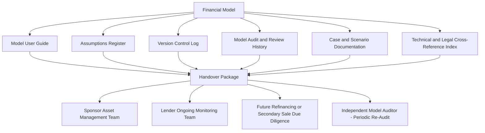

## Model Documentation and Handover Packages

### Overview

A Model Documentation and Handover Package is the complete set of supporting materials that accompanies a project finance financial model when responsibility for its ongoing use, maintenance, or interpretation transfers between parties — from a financial advisor to a sponsor, from a sponsor to a lender group, from a deal team to an asset management team post-financial-close, or between successive owners in a refinancing or secondary sale. Where the prior modules addressed model review/QA (verifying the model is *correct*) and case reconciliation (verifying differences between model versions are *understood*), this module addresses a distinct but related discipline: ensuring the model remains *usable and interpretable* by parties who did not build it, often years after the original modeling team has moved on to other engagements.

### Why Documentation and Handover Discipline Matters

Project finance models are frequently used for 20-30 years after financial close — well beyond the tenure of the individual analysts, advisors, or bankers who originally built them. Without a structured handover package:

- **Institutional knowledge loss:** Modeling logic, assumption sourcing, and structural design decisions that were self-evident to the original builder become opaque to subsequent users, particularly for complex circularity mechanisms, sculpted debt sizing logic, or bespoke waterfall structures.
- **Covenant compliance risk:** If the model is used for ongoing DSCR certification or covenant testing (as discussed in prior modules), a poorly documented model increases the risk that a new user misapplies it, miscalculates a compliance test, or cannot readily explain a result to auditors, rating agencies, or lenders during a periodic review.
- **Refinancing and secondary market friction:** A well-documented model materially eases due diligence for a refinancing lender group or a secondary equity purchaser, who must otherwise effectively reverse-engineer the model's logic from scratch — a friction cost that can affect transaction timelines and, in some cases, pricing.
- **Amendment and waiver processes:** When a facility requires amendment (e.g., a covenant waiver, a debt restructuring, or a scope change), the ability to quickly and confidently modify the model to test proposed changes depends heavily on the clarity of the original documentation.

### Core Components of a Handover Package

**1. Model User Guide / Manual**

A narrative document (distinct from in-model comments) explaining:

- The model's overall purpose, intended users, and appropriate use cases (and, importantly, explicit statement of any known limitations or scenarios the model is *not* designed to handle)
- Sheet-by-sheet or module-by-module structural walkthrough, explaining the logical flow from inputs through calculations to outputs
- Explanation of any non-obvious mechanical features — circularity handling and iterative calculation settings, sculpting logic for debt sizing, macro functionality (if any), and scenario/case-switching mechanisms
- Step-by-step instructions for common operational tasks the model is expected to perform post-handover (e.g., "how to run the annual DSCR compliance test," "how to update the model for an actual vs. budget variance analysis," "how to build a new sensitivity scenario")

**2. Assumptions Register / Data Book**

A structured, standalone log of every material input assumption, distinct from the model file itself, recording:

- The assumption value and its precise definition/units
- The source of the assumption (specific contract clause, market study, ITA report finding, tax advice memorandum, or management estimate) — ideally with a direct reference or citation to the underlying source document
- The date the assumption was set or last updated, and by whom
- Any known basis for the assumption to change over time (e.g., an index-linked escalation, a contractually scheduled step-change) and how that change mechanism is reflected in the model

**Key Points**

- The Assumptions Register serves a dual purpose: it supports handover usability, and it directly supports the Input Verification stage of model review/audit discussed in an earlier module — a well-maintained register substantially reduces the effort required for any subsequent Independent Model Audit or lender due diligence refresh.
- For assumptions tied to legal documentation (facility agreement definitions, EPC contract terms), the register should reference the precise clause or defined term, since legal drafting nuances (e.g., a specific definition of "Available Cash Flow" or "Permitted Distributions") frequently differ subtly from a generic or intuitive reading of the same term.

**3. Version Control Log**

A chronological record of every material model revision, including:

- Version number/identifier and date of each revision
- Summary of what changed and why (e.g., "v3.2: Updated construction schedule per ITA Q3 monitoring report; extended Unit 2 COD by 6 weeks")
- Author of each revision and, where applicable, the reviewer/approver who signed off on the change
- Clear identification of which version was used for any specific formal purpose (e.g., "v2.4 was the version submitted for financial close credit approval and Independent Model Audit sign-off")

**4. Model Audit and Review History**

Consolidated record of all prior Independent Model Audit reports, internal QA review memoranda, and their resolution status, allowing a new user to quickly understand what level of third-party assurance the model has received and whether any previously flagged issues remain open.

**5. Case and Scenario Documentation**

Where multiple cases exist (Sponsor Case, Banking Case, Rating Agency Case, as discussed in the prior module), the handover package should include the reconciliation schedule and output bridge analysis, so a new user understands not just that multiple cases exist, but precisely how and why they differ.

**6. Technical and Legal Cross-Reference Index**

A mapping between key model outputs/mechanics and their corresponding source in transaction documentation — for example, explicitly cross-referencing the model's DSCR calculation cell/module to the specific facility agreement clause defining DSCR, or the cash waterfall structure to the corresponding payment priority/waterfall clause in the common terms agreement or intercreditor agreement.

### Structural Diagram — Handover Package Composition and Use

### In-Model Documentation Practices

Beyond the standalone handover package documents, well-constructed models incorporate documentation directly within the file:

- **Dedicated documentation/index sheet:** A first-tab sheet summarizing model purpose, version, last update date, key contacts, and a navigable index of subsequent sheets.
- **Consistent, descriptive labeling:** Clear row/column labels stating precisely what each line represents, including units (e.g., "Revenue ($ million, nominal)" rather than an ambiguous "Revenue"), consistent with the separation-of-layers principles referenced in the modeling standards discussed in the prior QA module.
- **Cell comments/notes for non-obvious logic:** Targeted comments explaining specific formulas or assumptions that are not self-evident from the label alone — used judiciously, since excessive commenting on routine formulas can clutter a model without adding genuine interpretive value.
- **Color-coding conventions:** Consistent, documented color conventions (e.g., blue font for hard-coded inputs, black for formulas, green for links to other sheets/workbooks) that allow a new user to quickly distinguish assumption cells from calculated cells without inspecting every formula individually — a convention widely used across most institutional and open modeling standards.
- **Explicit flagging of circularity and manual intervention points:** Clear labeling of any circular reference switches, manual override cells, or macro-triggered functions, since these are the most common source of confusion (and error, per the prior QA module) for a new user unfamiliar with the model's specific mechanical design.

**Key Points**

- Escaped literal characters in labels (for example, a label showing a specific dollar figure like $50 million as contextual reference text rather than as a calculated cell) should be clearly distinguished from actual input or formula cells, to avoid a new user mistakenly treating descriptive text as a live model input.
- In-model documentation supplements, but does not replace, the standalone User Guide and Assumptions Register — a model that is well-labeled internally but lacks the narrative walkthrough and sourcing documentation of a proper handover package still leaves a new user without adequate context for non-obvious structural or assumption-sourcing questions.

### Handover Scenarios and Tailored Package Requirements

| Handover Scenario | Primary Package Emphasis |
| --- | --- |
| Financial advisor to sponsor (post financial close) | Full technical walkthrough, comprehensive assumptions register, clear separation of what remains sponsor-editable versus fixed per financing documentation |
| Sponsor deal team to sponsor asset management team | Emphasis on operational task instructions (running compliance tests, updating actuals), less emphasis on original deal negotiation history |
| Lender due diligence team to lender ongoing monitoring/portfolio team | Emphasis on Banking Case rationale, covenant calculation cross-references to facility agreement, and audit history |
| Outgoing sponsor to incoming sponsor (secondary sale) | Full package including original financial close documentation cross-references, historical actual-vs-budget performance, and all prior amendments/waivers reflected in the model |
| Refinancing lender due diligence | Full package plus explicit reconciliation of original financial close assumptions against actual historical performance data |

### Example: Post-Financial-Close Handover for a Greenfield Toll Road

**Scenario:** A financial advisory firm that built the financial close model for a $450 million toll road project hands the model over to the project company's newly established asset management team, six months after financial close.

**Handover package contents:**

1. **User Guide:** Explains the model's sheet structure (Inputs, Traffic and Revenue, Construction, Operating Costs, Debt Schedule, Waterfall, Outputs), the sculpted debt sizing circularity mechanism and its iterative calculation settings, and step-by-step instructions for the semi-annual DSCR compliance certification process required under the facility agreement.
2. **Assumptions Register:** Documents each traffic growth assumption's source (independent traffic study, with specific report page/section references), each operating cost line's basis (O&M contract pricing schedule, escalation index defined in the contract), and financing terms (margin, fees, and repayment profile per the executed facility agreement).
3. **Version Control Log:** Records the progression from the initial term sheet model through financial close model (v4.1, the version formally reviewed by the Independent Model Auditor) and any subsequent minor corrections.
4. **Audit History:** Includes the Independent Model Audit report from financial close, with all findings marked resolved, and a note confirming v4.1 is the audited and approved version.
5. **Cross-Reference Index:** Maps the model's DSCR calculation directly to the facility agreement's Clause defining "Debt Service Coverage Ratio," and the cash waterfall structure to the corresponding payment priority clause in the common terms agreement, so the asset management team can immediately locate the legal basis for any calculation they need to explain to lenders or auditors.
6. **Training session:** A structured walkthrough session (in addition to the written materials) covering the model's operation, with the asset management team performing a supervised trial run of the first semi-annual compliance certification before formal handover sign-off.

**Output (Illustrative handover checklist sign-off):**

| Deliverable | Status | Recipient Confirmation |
| --- | --- | --- |
| Model User Guide | Delivered | Reviewed and confirmed understood |
| Assumptions Register | Delivered | Cross-checked against 3 sample assumptions by recipient |
| Version Control Log | Delivered | Confirmed v4.1 identified as financial close version |
| Model Audit History | Delivered | Confirmed no open findings |
| Cross-Reference Index | Delivered | Confirmed DSCR clause mapping verified against facility agreement |
| Training session | Completed | Recipient team performed supervised trial compliance test |

[Inference] The specific checklist format and sign-off structure shown is illustrative of good handover practice rather than a mandated or standardized industry template; actual handover documentation requirements are typically set by the specific institutions and transaction documentation involved rather than a single universal protocol.

### Common Documentation and Handover Pitfalls

**Key Points**

- **Documentation produced retrospectively under time pressure:** Deferring documentation creation until the handover moment itself (rather than maintaining it contemporaneously as the model is built and revised) frequently results in incomplete or inaccurate documentation, since the original builder's memory of early design decisions fades over the course of a lengthy transaction.
- **Assumptions register drift from the live model:** Where the model is updated but the standalone assumptions register is not updated in parallel, the register becomes actively misleading rather than merely incomplete — arguably a worse outcome than no register at all, since a user may reasonably trust an out-of-date register's stated sourcing.
- **Reliance on the original builder's institutional memory instead of written documentation:** Handover processes that rely primarily on a verbal walkthrough or informal availability of the original builder for future questions create a single point of failure risk if that individual becomes unavailable (changes roles, leaves the firm) before the model reaches the end of its 20-30 year useful life.
- **Inconsistent version identification across documentation and legal records:** Where the version control log's naming convention does not clearly and unambiguously map to the version explicitly referenced in legal documentation or Independent Model Audit sign-off letters, disputes or confusion can arise about precisely which model version constitutes the contractually operative one.
- **Treating handover as a one-time event rather than an ongoing discipline:** For long-tenor facilities, the model will likely be updated, amended, and potentially handed over again multiple times over its life (further personnel changes, refinancings, ownership transfers) — a handover package that is not itself designed to be maintainable and re-handed-over in the future imposes the same documentation burden repeatedly rather than compounding institutional knowledge over time.

### Related Topics

- Model Review and Quality Assurance Procedures (documentation supporting ongoing QA and audit)
- Independent Technical Advisor and Model Audit Processes (audit history as a handover package component)
- Reconciling Banking Case, Base Case, and Sponsor Case (case documentation within the handover package)
- FAST Standard and other modeling standards (in-model labeling and structural conventions)
- Covenant compliance certification processes and periodic re-testing procedures
- Refinancing due diligence data room preparation and legacy model due diligence
- Facility agreement cross-referencing: DSCR, waterfall, and covenant definition alignment with model mechanics
- Institutional knowledge management practices for long-tenor infrastructure asset portfolios