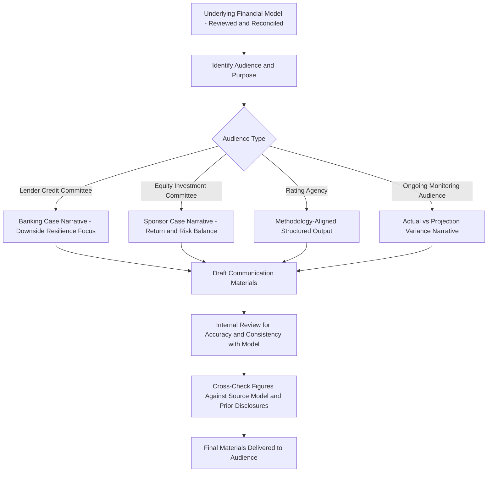

## Communicating Model Outputs to Lenders and Investors

### Overview

Communicating Model Outputs to Lenders and Investors is the professional practice of translating complex financial model mechanics and results into formats, narratives, and materials that non-modeling audiences — credit committees, investment committees, rating agency analysts, and institutional investors — can accurately interpret and rely upon for decision-making. This discipline sits downstream of model review/QA, case reconciliation, and documentation (prior modules): even a mechanically flawless, well-documented model can lead to poor decisions or credibility damage if its outputs are communicated in a way that obscures key assumptions, overstates precision, or fails to convey the appropriate degree of uncertainty around projected results.

### Core Communication Principles

**Audience Calibration**

Different audiences require different levels of technical detail and different framing:

- **Lender credit committees:** Typically require a Banking Case-focused narrative (per the prior reconciliation module), emphasizing downside resilience, covenant headroom, and the specific conservative assumptions applied — credit committees are generally more interested in "how bad can it get and still service debt" than in upside potential.
- **Equity investors and investment committees:** Typically require Sponsor Case-focused materials emphasizing return potential (IRR, equity multiple, distribution timing) alongside a clear-eyed presentation of the key risks that could erode those returns — an investment committee that is shown only upside framing without adequate downside context is being under-served, regardless of how the material is received.
- **Rating agencies:** Require highly structured, methodology-aligned outputs mapped directly to the specific rating agency's published criteria (e.g., specific stress scenarios the agency's methodology mandates), often requiring a distinct presentation format from either lender or equity materials.
- **Existing lenders/investors during ongoing monitoring:** Require variance-focused communication — how do actual results compare to the original projections relied upon at financial close or the last reporting period, and what explains any material deviation.

**Key Points**

- The same underlying model and even the same underlying case can require materially different presentation depending on audience — this is a communication and framing exercise, not a re-modeling exercise, and the underlying figures presented to different audiences for the same reporting period should remain consistent and reconcilable even where emphasis differs.
- Presenting materially different *figures* (as opposed to different *framing or emphasis* of the same figures) to different audiences for the same underlying model and period is a significant governance and, in some contexts, legal/regulatory concern, distinct from the legitimate practice of tailoring which figures are emphasized for which audience.

### Structural Diagram — Model-to-Communication Workflow

### Structuring the Core Narrative

**1. Executive Summary of Key Outputs**

Leading with the decision-relevant metrics most material to the audience — minimum and average DSCR, equity IRR, debt quantum and tenor, key covenant headroom — presented clearly before any detailed supporting analysis, so a time-constrained reader immediately grasps the central result.

**2. Assumption Transparency**

Explicit disclosure of the key assumptions driving the headline outputs (revenue basis, cost basis, financing terms, macroeconomic assumptions), ideally cross-referenced to the Assumptions Register discussed in the prior documentation module, so a sophisticated reader can assess assumption reasonableness rather than simply accepting a headline output on faith.

**3. Sensitivity and Scenario Presentation**

Presentation of how key outputs move under defined stress scenarios (rather than presenting only a single base/central case), typically including:

- Single-variable sensitivities (holding all other assumptions constant, varying one input — e.g., "DSCR under a 10% revenue reduction")
- Combined/compound stress scenarios (multiple adverse assumptions applied simultaneously, reflecting a more realistic "things go wrong together" narrative)
- Break-even analysis (identifying the point at which a key output crosses a critical threshold — e.g., "revenue would need to fall by X% before the minimum DSCR covenant is breached")

**4. Uncertainty and Precision Calibration**

Avoiding false precision in presented outputs — a projected Year 15 equity IRR to two decimal places implies a degree of forecasting precision that a 15-year-forward projection cannot genuinely support, and professional communication practice generally favors rounding and ranges appropriate to the actual reliability of a long-dated projection, particularly for outputs sensitive to assumptions with material inherent uncertainty (long-term commodity prices, multi-decade resource assessments, terminal value assumptions).

**5. Visual Communication**

Charts and graphics (DSCR profile over the debt tenor, cash flow waterfall diagrams, sensitivity tornado charts) that allow pattern recognition — a declining DSCR trend, a period of particularly tight covenant headroom, or the relative magnitude of different sensitivity drivers — that may be less immediately apparent from tabular data alone, provided visualizations are clearly labeled with underlying data available for verification rather than presented as a substitute for the underlying figures.

### Example Output Formats by Audience

**For Lender Credit Committees**

| Metric | Banking Case Value | Covenant Threshold | Headroom |
| --- | --- | --- | --- |
| Minimum DSCR (any period) | 1.28x | 1.20x | 0.08x |
| Average DSCR (full tenor) | 1.41x | N/A (informational) | — |
| Loan Life Coverage Ratio (LLCR) | 1.55x | 1.35x | 0.20x |
| Debt-to-equity ratio | 75:25 | 80:20 maximum | 5 percentage points |

Accompanied by narrative explaining the specific conservative assumptions (per the Banking Case reconciliation) that produce this headroom, and downside sensitivity results showing DSCR under defined stress scenarios (e.g., "under a combined 15% revenue reduction and 10% opex increase, minimum DSCR falls to 1.15x, breaching the 1.20x covenant" — a finding that itself would typically prompt further credit committee discussion of mitigants, such as reserve account sizing or sponsor support mechanisms).

**For Equity Investment Committees**

| Metric | Sponsor Case Value | Range Under Key Sensitivities |
| --- | --- | --- |
| Project-level equity IRR | 14.2% | 11.5% (P90 downside) to 16.8% (upside case) |
| Equity multiple (MOIC) | 2.3x | 1.9x to 2.7x |
| Payback period | 8.5 years | 7.0 to 10.5 years |
| Cash-on-cash yield (stabilized year) | 9.1% | 7.5% to 10.8% |

Accompanied by narrative addressing the key risk factors that drive the presented range, and explicit disclosure that the central Sponsor Case reflects specific assumptions (cross-referenced to the assumptions register) rather than a guaranteed or most-conservative outcome.

**For Ongoing Monitoring / Variance Reporting**

| Metric | Original Financial Close Projection (Year 3) | Actual (Year 3) | Variance | Explanation |
| --- | --- | --- | --- | --- |
| Revenue | $42.0 million | $39.5 million | −6.0% | Lower-than-forecast demand in Q2-Q3, partially offset by tariff escalation |
| Operating costs | $11.2 million | $12.1 million | +8.0% | Unplanned major maintenance event, within insured scope |
| DSCR (actual period) | 1.38x | 1.24x | −0.14x | Combined effect of revenue and cost variance above |
| Covenant threshold | — | 1.20x | — | Covenant satisfied, but headroom materially reduced versus projection |

[Inference] The specific format and metrics shown across these three illustrative tables reflect commonly observed market practice conventions rather than a single mandated reporting template; actual reporting formats vary by institution, facility agreement reporting covenants, and investor reporting agreements, and should be confirmed against the specific transaction's contractual reporting requirements.

### Rating Agency Communication Considerations

Communicating model outputs to rating agencies requires particular attention to methodology alignment:

- **Standardized stress scenarios:** Rating agencies typically publish (or make available to rated issuers) specific stress testing parameters their methodology applies (e.g., a defined revenue haircut, a specific interest rate stress, a defined operating cost increase) — outputs should be presented in the specific format and against the specific scenarios the relevant methodology specifies, rather than the issuer's own preferred sensitivity framework alone.
- **Consistency with prior rating surveillance submissions:** For an existing rated transaction, new model output submissions during ongoing surveillance should be explicitly reconciled against the assumptions and outputs presented at the initial rating assignment or the most recent prior surveillance review, with any material assumption changes clearly flagged and explained — an unexplained shift in a key input between surveillance periods is a common source of rating agency follow-up queries.
- **Independent verification cross-reference:** Where a Rating Agency Case (distinct from the Banking Case, per the prior reconciliation module) has been separately constructed, communication materials should make explicit which case's outputs are being presented, avoiding ambiguity between the issuer's own Banking/Sponsor Case outputs and the agency's independently derived figures.

### Common Communication Pitfalls

**Key Points**

- **Presenting a single output without accompanying sensitivity context:** A headline DSCR or IRR figure presented without any accompanying stress scenario or range understates the genuine uncertainty inherent in any multi-decade projection and can lead a decision-maker to over-anchor on a single point estimate.
- **False precision in long-dated projections:** Presenting Year 20 or Year 25 outputs to a spurious level of decimal precision misrepresents the actual reliability of forecasts that far into a project's life, and professional skepticism from a sophisticated audience is a reasonably foreseeable response to such over-precision.
- **Selective emphasis that omits materially unfavorable findings:** Constructing investment or credit materials that prominently feature favorable sensitivities while omitting or minimizing unfavorable ones (for example, not disclosing a combined-stress scenario that breaches a covenant) undermines the informational integrity of the communication, distinct from the legitimate practice of leading with headline decision-relevant metrics.
- **Inconsistent figures across concurrently circulated materials:** Where slightly different versions of the same output appear in materials prepared for different audiences or committees around the same reporting period (often due to using different underlying model versions without adequate version control, per the prior documentation module), the resulting inconsistency can raise governance concerns even where each individual figure was accurate at the time it was prepared.
- **Overloading visual materials without underlying data access:** Charts and graphics that look polished but cannot be readily traced back to underlying tabular data or the source model reduce a sophisticated reviewer's ability to independently verify presented conclusions, and can appear evasive even when the underlying analysis is sound.
- **Failure to update variance narratives as circumstances evolve:** Ongoing monitoring communications that repeat a prior period's variance explanation without confirming it remains the accurate and complete explanation for a persisting or worsening variance can understate an emerging trend that deserves fresh analysis rather than a recycled explanation.

### Related Topics

- Model Review and Quality Assurance Procedures (accuracy foundation underlying credible communication)
- Reconciling Banking Case, Base Case, and Sponsor Case (case-specific framing for different audiences)
- Model Documentation and Handover Packages (assumptions register as a communication cross-reference source)
- Covenant compliance certification processes and periodic lender reporting obligations
- Rating agency methodologies and published stress testing criteria for project finance
- Sensitivity and scenario analysis design for project finance credit assessment
- Investor relations and periodic reporting practices for infrastructure equity funds
- Data visualization best practices for financial and credit risk communication