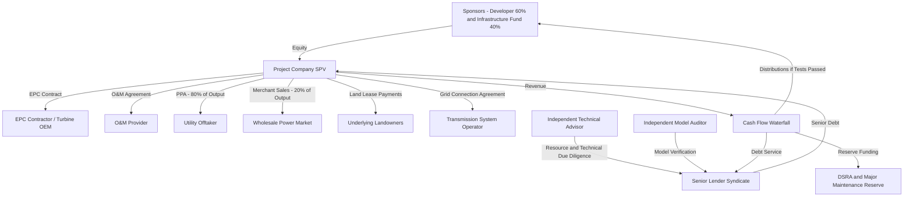

## Case Study: Renewable Energy Independent Power Producer

### Overview

This case study synthesizes the structuring, financing, and modeling concepts covered across prior chapters into an integrated capstone example: the greenfield development and financing of a renewable energy Independent Power Producer (IPP). The case follows a single illustrative transaction — a 250 MW greenfield wind farm — through project structuring, contractual architecture, financial modeling, risk allocation, and financial close, demonstrating how the individual technical topics (debt sizing, ESIA and Equator Principles compliance, ITA/Model Audit coordination, case reconciliation) interact within a single coherent transaction rather than as isolated concepts.

### Project Overview and Sponsor Objectives

**Illustrative Project Parameters**

- **Asset:** 250 MW onshore wind farm, 50 turbines at 5 MW nameplate capacity each
- **Location:** A jurisdiction with an established renewable energy support mechanism (illustrative — a fixed feed-in tariff for an initial period, transitioning to merchant/market pricing thereafter) and non-Designated Country status under the Equator Principles framework (triggering full IFC Performance Standards applicability per an earlier module)
- **Sponsor structure:** A renewable energy developer (60% equity) partnered with an infrastructure fund co-investor (40% equity)
- **Offtake structure:** A 15-year Power Purchase Agreement (PPA) with a creditworthy utility offtaker for 80% of expected output, with the remaining 20% sold on a merchant basis
- **Financing objective:** Non-recourse or limited-recourse project finance debt, targeting the highest sustainable leverage consistent with lender covenant requirements, structured to allow future refinancing once an operating track record is established

### Transaction Structuring Sequence

**1. Project Development and Technical Feasibility**

- Wind resource assessment commissioned (feeding directly into the P50/P90 energy yield estimates discussed in the ITA module) — met, mast-based measurement campaign supplemented by long-term reanalysis dataset correlation to establish a robust long-term energy production estimate
- Site control secured (land lease agreements with underlying landowners) and grid connection studies completed with the transmission system operator
- Environmental and Social Impact Assessment commissioned per the ESIA module's process, given Category B classification (moderate, site-specific, largely reversible impacts — primarily avian/bat collision risk assessment, noise impact on nearby residences, and land use impact on existing agricultural activity)

**2. Contractual Architecture**

| Contract | Counterparty | Key Terms |
| --- | --- | --- |
| EPC Contract | Turbine supplier/EPC contractor (often a single wrap or a multi-contract structure with a Balance of Plant contractor) | Fixed-price, date-certain completion, liquidated damages for delay and performance shortfall |
| Turbine Supply Agreement | Original Equipment Manufacturer (OEM) | Performance warranties, availability guarantee |
| O&M Agreement | OEM or independent O&M provider | Long-term service agreement, availability-linked incentive/penalty structure |
| Power Purchase Agreement | Utility offtaker | 15-year tenor, 80% of P50 output, fixed/escalating tariff structure |
| Land Lease Agreements | Underlying landowners | Fixed and/or revenue-linked lease payments |
| Grid Connection Agreement | Transmission system operator | Connection capacity, technical compliance requirements |

**3. Financing Structure**

Senior debt provided by a syndicate of commercial lenders (potentially alongside a multilateral or development finance institution co-lender, common in renewable energy IPP financings given the sector's frequent alignment with development finance institution mandates), structured as:

- Construction facility converting to a term facility upon Completion (per the ITA-certified Completion definition discussed in the ITA module)
- Sculpted (rather than straight-line) amortization profile, targeting a defined minimum DSCR across the tenor
- Debt Service Reserve Account funded at or shortly after financial close
- Major maintenance reserve account, sized with reference to the O&M agreement's scheduled major maintenance events (e.g., mid-life gearbox/component overhauls)

### Structural Diagram — Overall Transaction Architecture

### Financial Modeling Application

**Debt Sizing Methodology**

Applying the ITA/Model Audit and case reconciliation concepts from prior modules, senior debt is sized as the lesser of:

$$D_{max} = \min\left(D_{DSCR},\ D_{gearing}\right)$$

where $D_{DSCR}$ is the maximum debt quantum for which projected cash flow available for debt service achieves the lender's minimum DSCR covenant under the **Banking Case** (using a conservative energy yield percentile — illustratively, one-year P90 — per the ITA's independently validated resource assessment, rather than the Sponsor Case's P50 basis), and $D_{gearing}$ is the maximum debt quantum permitted under the lender's maximum debt-to-total-capitalization policy limit.

**Illustrative Case Comparison (applying the reconciliation framework from the prior module)**

| Metric | Sponsor Case | Banking Case |
| --- | --- | --- |
| Energy yield basis | P50 | One-year P90 |
| Merchant price assumption (post-PPA-covered portion) | Sponsor's internal power price forecast | Conservative haircut to independent market consultant forecast |
| Average DSCR | 1.62x | 1.38x |
| Minimum DSCR | 1.45x | 1.22x (against a 1.15x covenant) |
| Maximum supportable senior debt | $310 million | $275 million |

**Key Points**

- The gap between Sponsor Case and Banking Case debt capacity ($310 million vs. $275 million in this illustration) is a direct, quantified consequence of the assumption divergence methodology covered in the case reconciliation module — sponsors typically negotiate around this gap during term sheet discussions, sometimes by proposing additional credit enhancement (parent guarantees, higher initial equity contribution) to narrow it rather than simply accepting the more conservative debt quantum.
- The merchant tail (the 20% of output sold outside the PPA, plus the post-Year-15 period after PPA expiry if debt tenor extends that far) typically receives the most conservative treatment in the Banking Case, since it lacks the revenue certainty the contracted PPA portion provides — this is a common structuring tension in renewable IPP financings where the debt tenor is sized to extend to or beyond the PPA term.

### Risk Allocation Summary

| Risk | Primary Risk Bearer | Mitigation Mechanism |
| --- | --- | --- |
| Construction cost overrun | EPC contractor (fixed price) | Liquidated damages, contractor parent guarantee, contingency reserve |
| Construction delay | EPC contractor | Delay liquidated damages, extended DSRA/interest reserve during construction |
| Resource risk (wind variability) | Project company/lenders (via conservative Banking Case sizing) | P90-based debt sizing, DSRA funding |
| Merchant price risk (uncontracted output) | Project company/equity | Conservative Banking Case price assumptions, potential future hedging |
| Offtaker credit risk | Project company (mitigated via offtaker credit quality screening) | Offtaker creditworthiness assessment, potential letter of credit/guarantee support |
| Operating/performance risk | O&M provider (availability guarantee) and project company | Availability-linked O&M incentive/penalty structure |
| E&S/permitting risk | Project company | ESIA per Category B process, permitting conditions precedent |
| Physical climate risk | Project company/lenders | Wind resource long-term trend assessment (per the climate risk module), turbine class rating vs. extreme wind projection |

### Independent Advisor Coordination

Consistent with the ITA and Model Audit coordination framework from the prior module:

1. **ITA due diligence:** Validates the wind resource assessment methodology and resulting P50/P90 energy yield figures, reviews the EPC contract and turbine supply agreement, assesses the O&M agreement's adequacy, and reviews the grid connection studies.
2. **Model Audit:** Cross-checks the financial model's energy yield input against the ITA-validated P90 figure, verifies the sculpted debt sizing circularity resolves correctly, confirms DSCR calculation matches the facility agreement's precise definition, and verifies major maintenance reserve funding aligns with the O&M agreement's scheduled maintenance timeline.
3. **Legal counsel cross-reference:** Confirms the model's cash flow waterfall structure matches the intercreditor/common terms agreement's payment priority, and that PPA revenue recognition timing aligns with the PPA's actual payment terms.

### ESG and Equator Principles Integration

Applying the frameworks from the earlier ESG chapter:

- **Categorization:** Category B under the Equator Principles (moderate, site-specific, reversible impacts), requiring a focused ESIA and (generally) Independent Environmental and Social Consultant review, though at a less intensive level than the Category A hydropower example discussed in the ESIA module.
- **Key E&S findings:** Avian/bat collision risk mitigation (e.g., seasonal curtailment protocols during peak migration periods), noise impact management for nearby residences, and stakeholder engagement with local landowners and communities regarding construction traffic and long-term land use.
- **Green Bond/Loan potential:** Given the project's unambiguous eligibility as a renewable energy asset (per the Green Bonds module's discussion of natural Green Bond/Loan candidates), the sponsor elects to structure a portion of senior debt as a Green Loan aligned with the Green Loan Principles, subject to a Second Party Opinion, providing potential pricing and investor-base benefits.
- **Just Transition/community engagement considerations:** Given the project's rural siting and the equity considerations discussed in the Just Transition module, the sponsor incorporates a community benefit fund (calculated per MWh generated) and local hiring commitments for construction and operational roles.

### Reserve Accounts and Ongoing Covenant Structure

| Reserve/Test | Sizing Basis | Purpose |
| --- | --- | --- |
| Debt Service Reserve Account (DSRA) | 6 months forward debt service | Liquidity buffer against short-term cash flow shortfalls |
| Major Maintenance Reserve Account (MMRA) | Sized per O&M agreement's scheduled major maintenance cost/timing schedule | Funding for periodic turbine component overhauls |
| Minimum DSCR covenant | 1.15x (illustrative) | Ongoing covenant compliance threshold, tested semi-annually |
| Distribution lock-up test | Typically a higher DSCR threshold than the minimum default-triggering covenant (e.g., 1.25x) | Restricts equity distributions if coverage falls below the distribution test threshold, even absent an actual default |

### Post-Financial-Close Considerations

Applying the documentation and communication frameworks from prior modules:

- **Handover package:** Full model documentation package (per the documentation module) transferred from the financial advisory team to the project company's asset management function, including the assumptions register cross-referencing wind resource study findings, EPC contract terms, and PPA pricing mechanics.
- **Ongoing monitoring:** ITA transitions to a periodic (e.g., annual) technical performance review role, assessing actual availability and energy production against the original P50/P90 assumptions; Model Auditor may retain a periodic re-certification role for the semi-annual DSCR compliance model.
- **Variance reporting:** Semi-annual lender reporting packages (per the communication module's ongoing monitoring format) comparing actual energy production, revenue, and DSCR against both the original Banking Case projection and the prior reporting period, with narrative explanation of any material variance (e.g., a below-P50 wind year, or an unplanned major maintenance event).
- **Refinancing potential:** Following an established operating track record (typically 2-3 years of stable operating data), the sponsor may pursue a refinancing at more favorable terms, requiring a fresh case reconciliation exercise incorporating actual historical performance data against the original financial close assumptions, per the refinancing considerations discussed in the case reconciliation module.

### Key Lessons Illustrated by This Case Study

**Key Points**

- **Interdependence of technical and financial workstreams:** The wind resource assessment (a technical exercise) directly and mechanically determines the maximum debt quantum (a financial structuring outcome) via the Banking Case debt sizing methodology — illustrating why ITA and Model Audit coordination (rather than sequential, siloed workstreams) is essential to an efficient and defensible financial close process.
- **Sponsor Case/Banking Case divergence as a negotiation dynamic, not a modeling error:** The $35 million gap between Sponsor Case and Banking Case debt capacity in this illustration is not evidence of a flawed model, but the expected and appropriate output of deliberately different, disclosed conservatism levels applied for different purposes.
- **ESG integration as embedded structuring, not a separate workstream:** Category B ESIA findings, Green Loan structuring, and Just Transition/community benefit considerations are woven into the core contractual and financing architecture from early development, rather than being addressed as an afterthought following financial structuring.
- **Documentation and communication discipline as risk management, not administrative overhead:** The handover package and variance reporting practices established at financial close directly determine how effectively the asset management team and ongoing lenders can monitor, understand, and respond to the project's actual performance over its 15+ year operating life.

[Inference] This case study synthesizes generic, illustrative structuring patterns drawn from common renewable energy IPP financing practice across the concepts covered in prior modules; specific figures, thresholds, and structuring choices are constructed for pedagogical illustration and do not represent any single actual transaction, and real-world deal terms vary considerably by jurisdiction, lender group, and project-specific circumstances.

### Related Topics

- Hybrid Istisna-Ijarah structures for greenfield projects (alternative Islamic finance structuring approach for comparable assets)
- Debt sizing methodologies and P50/P90/P99 resource assessment conventions
- Reconciling Banking Case, Base Case, and Sponsor Case (methodology applied throughout this case study)
- Independent Technical Advisor and Model Audit Processes (coordination model demonstrated in this case)
- Equator Principles and IFC Performance Standards (Category B classification and ESIA scoping applied here)
- Green Bonds and Sustainability-Linked Loans (Green Loan structuring option illustrated in this case)
- Just Transition and Community Engagement Considerations (benefit-sharing structure illustrated in this case)
- Case Study: Toll Road or Transportation Infrastructure Project Finance (comparative capstone case for a different asset class)