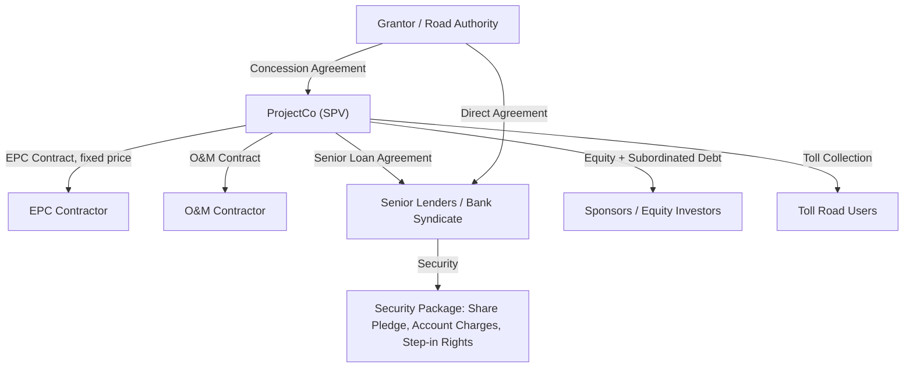
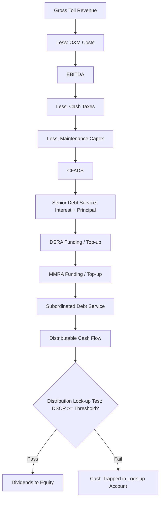

## Case Study: Toll Road Public-Private Partnership

### Overview and Learning Objectives

A toll road Public-Private Partnership (P3) is one of the canonical project finance case studies because it combines long-dated infrastructure cash flows, traffic/revenue risk, availability-based alternatives, construction risk, and complex multi-tranche capital structures. This case study synthesizes the modeling skills built across earlier chapters (circularity management, debt sizing, DSCR mechanics, reserve accounts, and scenario/sensitivity analysis) into a single integrated capstone build.

By the end of this case study, the modeler should be able to:

- Structure a fully integrated three-statement project finance model for a greenfield toll road concession
- Build a traffic and revenue engine using ramp-up curves and elasticity-adjusted toll escalation
- Size senior debt using both DSCR-based sizing and gearing (leverage) constraints, taking the minimum (the "sculpted" or "constrained" debt quantum)
- Model a debt service reserve account (DSRA), major maintenance reserve account (MMRA), and cash waterfall
- Run break-even, sensitivity, and Monte Carlo analysis on traffic risk
- Evaluate the deal from both the sponsor (equity IRR) and lender (DSCR/LLCR) perspectives

### Transaction Background and Structure

**Key Points**

- **Asset**: 45 km greenfield toll road, replacing/paralleling an existing free congested route
- **Concession length**: 30 years post-construction (or 32 years total including a 2-year construction period)
- **Procuring authority**: State/national road authority granting the concession via competitive tender
- **Revenue model**: Real toll (user-pays), as opposed to availability payment (government-pays)
- **SPV**: A single-purpose "ProjectCo" holds the concession agreement, construction contract, O&M contract, and financing documents

A typical toll road P3 risk-transfer matrix:

| Risk | Allocated To | Mitigant |
| --- | --- | --- |
| Construction cost overrun | Sponsor / EPC Contractor | Fixed-price, date-certain EPC (wrap) contract |
| Construction delay | EPC Contractor | Delay liquidated damages (LDs) |
| Traffic/demand | ProjectCo (equity + lenders) | Conservative base case, traffic risk reserve, sometimes a minimum revenue guarantee (MRG) |
| Toll rate-setting/regulatory | Government / ProjectCo (shared) | Toll escalation formula fixed in concession agreement (e.g., CPI or CPI+X) |
| O&M cost | ProjectCo, subcontracted to O&M contractor | Fixed-price/index-linked O&M and lifecycle contracts |
| Interest rate | Lenders → hedged to ProjectCo | Interest rate swaps on floating-rate tranches |
| Inflation | Shared | Toll escalation partially indexed to CPI |
| Force majeure / political | Government (relief events) | Concession agreement compensation clauses |
| Refinancing | ProjectCo / Equity | Mini-perm structure with refinancing upside |

### Contractual Architecture

### Modeling Architecture: Sheet Structure

A robust capstone build should separate concerns into discrete, linked sheets:

1. **Assumptions/Inputs** — all hardcoded drivers, color-coded (blue font convention)
2. **Construction Budget & S-Curve** — capex drawdown schedule, IDC (interest during construction)
3. **Traffic & Toll Revenue Engine**
4. **Operating Costs (O&M, Lifecycle/Major Maintenance)**
5. **Debt Sizing & Sculpting** (senior + subordinated)
6. **Three Statements** (P&L, Balance Sheet, Cash Flow)
7. **Cash Flow Waterfall**
8. **Reserve Accounts (DSRA, MMRA)**
9. **Returns** (Equity IRR, sponsor cash flows)
10. **Credit Metrics** (DSCR, LLCR, PLCR)
11. **Sensitivities / Scenarios / Monte Carlo**
12. **Outputs / Dashboard**

### Traffic and Revenue Engine

Traffic risk is the defining feature of a real-toll P3, distinguishing it from an availability-payment deal. The revenue engine typically has three layers:

**1. Base Traffic Volume**

Traffic is usually modeled by vehicle class (light vehicles, heavy goods vehicles) because toll rates and growth rates differ by class.

$$V_{t,c} = V_{0,c} \times (1 + g_c)^{t} \times R_t$$

Where $V_{t,c}$ is traffic volume for class $c$ in year $t$, $g_c$ is the long-run annual growth rate (often linked to GDP or regional traffic forecasts), and $R_t$ is a ramp-up factor.

**2. Ramp-Up Curve**

New toll roads rarely hit steady-state traffic in Year 1 — drivers need time to shift habits from free alternative routes. A common S-curve ramp-up assumption:

| Year of Operation | % of Steady-State Traffic |
| --- | --- |
| Year 1 | 60% |
| Year 2 | 75% |
| Year 3 | 88% |
| Year 4 | 95% |
| Year 5+ | 100% |

**3. Toll Escalation**

Toll rates typically escalate on a formula fixed in the concession agreement, commonly:

$$Toll_t = Toll_{t-1} \times \left(1 + \max(CPI_t,\ 0)\right)$$

or a CPI-plus-margin formula, $Toll_t = Toll_{t-1} \times (1 + CPI_t + X\%)$, subject to a regulatory cap and floor.

**Gross Toll Revenue**:

$$Revenue_t = \sum_{c} V_{t,c} \times Toll_{t,c}$$

**Elasticity consideration** [Inference]: Because toll increases above inflation can suppress volume, a demand elasticity coefficient is sometimes layered in:

$$\Delta V_t \% = \varepsilon \times \Delta Toll_t \%\ (\text{real terms})$$

where $\varepsilon$ is typically a small negative number (e.g., -0.1 to -0.3) for commuter routes. The precise elasticity used should be benchmarked against the traffic consultant's report in a real transaction; the figures above are illustrative modeling conventions, not universal constants.

### Construction Phase and IDC

During the 24-month construction period, capex is drawn per an S-curve, funded by a pre-agreed debt/equity drawdown sequence (often equity/subordinated debt first, or pro-rata, depending on the funding agreement).

**Interest During Construction (IDC)** compounds because interest on drawn debt during construction is itself capitalized (added to the loan balance) rather than paid in cash, since there is no revenue yet:

$$IDC_t = \left(\text{Opening Debt Balance}_t + \frac{\text{Drawdown}_t}{2}\right) \times r$$

This mid-period drawdown convention avoids overstating interest cost on funds not yet drawn. IDC is capitalized into the total project cost, increasing the funding requirement — which is a classic circular reference (more debt → more interest → more debt needed), resolved using an iterative calculation setting or a copy-paste-values macro switch, as covered in the circularity chapter.

### Debt Sizing: Sculpting to DSCR and Gearing Constraints

Senior debt in a toll road deal is sized as the **minimum** of two constraints:

**1. Gearing Constraint** (simple leverage cap):

$$Debt_{max,gearing} = Total\ Project\ Cost \times Gearing\%$$

Typical toll road gearing: 70–85% debt / 15–30% equity, though lower for pure greenfield traffic-risk deals (75% is a common industry benchmark) [Inference — actual gearing is transaction- and rating-specific].

**2. DSCR-Sculpted Constraint** (cash flow available for debt service, CFADS-based):

Debt is sized so that the DSCR in every period equals (or just exceeds) a minimum target, meaning the repayment profile is "sculpted" (uneven amortization) rather than a straight or mortgage-style schedule:

$$DSCR_t = \frac{CFADS_t}{DS_t} \geq DSCR_{min}$$

$$DS_t = \frac{CFADS_t}{DSCR_{min}}$$

The debt quantum is the present value of this sculpted debt service stream, discounted at the senior debt interest rate, summed over the tenor:

$$Debt_{max,DSCR} = \sum_{t=1}^{n} \frac{DS_t}{(1+r_d)^t}$$

**CFADS** (Cash Flow Available for Debt Service) is calculated as:

$$CFADS_t = EBITDA_t - Tax_t - \Delta NWC_t - Maintenance\ Capex_t$$

**Final Senior Debt Quantum**:

$$Debt_{senior} = \min(Debt_{max,gearing},\ Debt_{max,DSCR})$$

This min() function is one of the most important single formulas in the entire model — it should be built with an explicit, auditable comparison cell rather than buried inline.

Typical target metrics for a toll road P3 (illustrative, benchmarked against comparable transactions):

| Metric | Typical Senior Lender Target |
| --- | --- |
| Minimum DSCR | 1.30x–1.50x |
| Average DSCR | 1.40x–1.60x |
| LLCR (Loan Life Coverage Ratio) | 1.40x–1.70x |
| PLCR (Project Life Coverage Ratio) | 1.60x–1.90x |
| Gearing | 70–85% |
| Tenor vs. concession life | Debt tenor typically 2–5 years shorter than concession ("tail") |

**LLCR** formula:

$$LLCR_t = \frac{PV(CFADS_{t \to maturity}) + DSRA_t}{Debt_t}$$

The LLCR "tail" (concession years remaining after debt maturity with no debt service) is a key credit buffer lenders scrutinize — it represents the cushion available to refinance or absorb a traffic shortfall.

### Cash Flow Waterfall

**Distribution lock-up mechanics**: Most toll road credit agreements include a lock-up test (commonly DSCR ≥ 1.10x–1.20x, tested historically and/or prospectively) that must be satisfied before dividends can flow to equity. If the test fails, cash is trapped in a restricted account until the ratio recovers.

### Reserve Accounts

**Debt Service Reserve Account (DSRA)**: Sized at 6 months (sometimes 12 months) of forward debt service, funded at financial close (from debt/equity proceeds) or ramped up over the early years of operations from cash flow.

$$DSRA\ Required_t = \frac{DS_{t+1} + DS_{t+2}}{2} \times (\text{months of cover} / 6)$$

**Major Maintenance Reserve Account (MMRA)**: Toll roads require periodic resurfacing/resealing (e.g., every 7–10 years) — a large, lumpy cost that would otherwise distort single-year DSCR. Lenders typically require either (a) a sinking-fund reserve funded evenly over time, or (b) deduction of an accrued lifecycle reserve from CFADS. The straight-line accrual approach:

$$MMRA\ Accrual_t = \frac{\text{Total Lifecycle Cost (PV)}}{\text{Years Between Major Works}}$$

### Three-Statement Integration

The model must fully link:

- **P&L**: Revenue → O&M → EBITDA → Depreciation → EBIT → Interest → Tax → Net Income
- **Cash Flow Statement**: Operating CF → Investing CF (capex) → Financing CF (drawdowns, repayments, dividends) → Net change in cash
- **Balance Sheet**: PP&E (capitalized capex less accumulated depreciation), Cash & Reserve balances, Debt balances (senior/sub), Equity (paid-in + retained earnings), with a balance check row (Assets − Liabilities − Equity = 0) as a hard-coded error trap

**Depreciation** is typically straight-line over the concession term (or shorter useful life if assets have residual value at handback):

$$Depreciation_t = \frac{Total\ Capitalized\ Cost}{\text{Concession Term (years)}}$$

### Equity Returns Analysis

Sponsor equity cash flows are the residual after all debt service and reserve funding:

$$Equity\ CF_t = -Equity\ Injection_t\ (\text{construction phase}) + Dividends_t\ (\text{operations phase})$$

$$NPV = \sum_{t=0}^{n} \frac{Equity\ CF_t}{(1+r_e)^t} = 0 \implies \text{solve for } IRR$$

Typical target equity IRRs for greenfield toll road P3s with real traffic risk: **12–16%** (higher than availability-payment deals, reflecting the additional demand risk); brownfield/mature toll road refinancings or acquisitions may target **8–11%** [Inference — return expectations are highly sensitive to jurisdiction, risk allocation, and market conditions at financial close].

Key equity metrics to compute alongside IRR:

- **Equity multiple (MOIC)**: total distributions ÷ total equity invested
- **Payback period**: undiscounted and discounted
- **Base case vs. downside IRR** under P90 traffic scenario

### Sensitivity and Scenario Analysis

**Core sensitivities to run**:

| Variable | Downside Case | Impact Measured On |
| --- | --- | --- |
| Traffic volume | -10% to -20% vs. base | DSCR, Equity IRR |
| Construction cost overrun | +10% to +15% | Debt sizing headroom, Equity IRR |
| Construction delay | +6 to +12 months | IDC, Equity IRR (delayed cash flows) |
| Toll escalation (CPI) | -1% to -2% p.a. vs. base | Revenue growth, DSCR |
| Interest rate (floating tranche/refinancing) | +100–200 bps | DSCR, debt capacity |
| O&M cost overrun | +10% | CFADS, DSCR |

**Break-even analysis**: Solve for the minimum traffic volume (as % of base case) at which minimum DSCR still clears the lender's covenant threshold — this is a standard lender due-diligence output, often called the "traffic break-even" or "revenue break-even" point.

**Monte Carlo simulation** [Inference — implementation detail, not a universal industry requirement but increasingly common in sophisticated financial advisory models]: Traffic growth, elasticity, and construction cost can be modeled as correlated random variables (e.g., triangular or normal distributions) run through thousands of iterations to generate a probability distribution of minimum DSCR and equity IRR, rather than relying solely on discrete scenarios. In Excel, this is typically built using Data Tables combined with a random-number-generation add-in, or in dedicated tools (e.g., @RISK, or a Python-based satellite model feeding results back into the spreadsheet).

### Sculpted Debt Repayment Illustration (svg_diagram)

<svg xmlns="http://www.w3.org/2000/svg" viewBox="0 0 720 420" font-family="Arial, sans-serif">
<text x="360" y="24" text-anchor="middle" font-size="16" font-weight="bold" fill="#1a1a1a">Sculpted Debt Service vs. CFADS (svg_diagram)</text>
<line x1="60" y1="360" x2="680" y2="360" stroke="#333" stroke-width="1.5" />
<line x1="60" y1="360" x2="60" y2="50" stroke="#333" stroke-width="1.5" />

<text x="30" y="360" font-size="11" fill="#333">0</text>

<text x="30" y="270" font-size="11" fill="#333">25</text>

<text x="30" y="180" font-size="11" fill="#333">50</text>

<text x="30" y="90" font-size="11" fill="#333">75</text>

<text x="10" y="200" font-size="11" fill="#333" transform="rotate(-90 10 200)">CFADS / Debt Service ($m)</text>

<text x="60" y="380" font-size="11" fill="#333">Y1</text>

<text x="150" y="380" font-size="11" fill="#333">Y5</text>

<text x="250" y="380" font-size="11" fill="#333">Y10</text>

<text x="350" y="380" font-size="11" fill="#333">Y15</text>

<text x="450" y="380" font-size="11" fill="#333">Y20</text>

<text x="550" y="380" font-size="11" fill="#333">Y25</text>

<text x="650" y="380" font-size="11" fill="#333">Y30</text>

<polyline points="60,320 100,300 150,270 200,250 250,230 300,210 350,195 400,180 450,165 500,150 550,135 600,120 650,105" fill="none" stroke="`#1f77b4`" stroke-width="3" />

<polyline points="60,340 100,320 150,290 200,268 250,246 300,225 350,208 400,192 450,176 500,160 550,144 600,128 650,112" fill="none" stroke="`#d62728`" stroke-width="3" stroke-dasharray="6,4" />

<rect x="490" y="55" width="14" height="14" fill="#1f77b4" />
<text x="510" y="66" font-size="12" fill="#333">CFADS</text>
<rect x="490" y="75" width="14" height="14" fill="#d62728" />
<text x="510" y="86" font-size="12" fill="#333">Debt Service (sculpted)</text>

<text x="360" y="405" text-anchor="middle" font-size="11" fill="#555">Sculpted debt service tracks CFADS to hold DSCR near the covenant floor across the tenor</text>

</svg>

### Worked Numerical Example

Assume a simplified single-year steady-state snapshot:

- Gross toll revenue: $120m
- O&M costs: $25m
- EBITDA: $95m
- Cash taxes: $8m
- Maintenance capex accrual: $7m
- **CFADS** = $95m − $8m − $7m = **$80m**
- Minimum DSCR covenant: 1.35x
- **Maximum debt service this year** = $80m ÷ 1.35 = **$59.3m**

If the senior loan interest rate is 6.5% and this debt service level is sustained (with appropriate step-ups/downs) across a 25-year sculpted repayment profile, the PV of the debt service stream at 6.5% gives the maximum DSCR-constrained debt quantum. Comparing this to, say, an 80% gearing cap on a $700m total project cost ($560m) — the model takes the **lower** of the two figures as the actual senior debt sized at financial close.

### Common Modeling Pitfalls

- **Not sculpting debt service** — using a flat mortgage-style amortization instead of a DSCR-sculpted profile understates debt capacity in a project with a back-loaded traffic ramp-up
- **Ignoring the ramp-up period in DSCR testing** — Year 1–3 DSCRs are naturally lower; the debt sizing target should reference the *minimum* DSCR across the whole tenor, not just steady-state years
- **Mixing nominal and real cash flows** — toll escalation (nominal, CPI-linked) must be consistently paired with a nominal discount rate and nominal debt terms
- **Circularity mismanagement** — IDC-driven circular references (interest → debt balance → interest) crashing or producing #REF errors without an iterative calculation toggle
- **Omitting the MMRA/lifecycle reserve** — a single large resurfacing cost hitting CFADS in one year can breach covenants if not smoothed
- **Hardcoding the debt sizing MIN() output** rather than leaving it as a live formula, which breaks sensitivity analysis

**Next Steps**

- Build the full Traffic & Revenue Engine tab with vehicle-class segmentation and ramp-up curve
- Construct the DSCR-sculpted debt sizing macro/goal-seek (or iterative PV) routine
- Model the DSRA and MMRA mechanics with explicit funding/release logic
- Extend the case study to a comparative **availability-payment (shadow toll) structure** to contrast risk allocation and equity IRR profiles
- Explore **refinancing at construction completion** (mini-perm structure) and its effect on sponsor returns
- Study real-world precedents: Indiana Toll Road, Chicago Skyway, M6 Toll (UK), Autopista Central (Chile)
- Build a Monte Carlo traffic risk module using correlated random variables for growth rate and elasticity