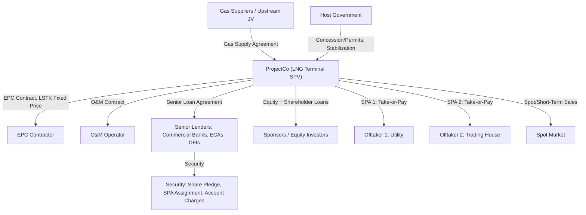
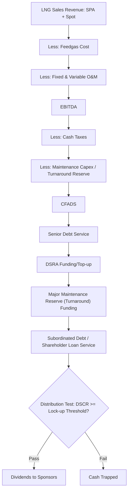

## Case Study: LNG Export Terminal Financing

### Overview and Learning Objectives

An LNG (Liquefied Natural Gas) export terminal is one of the largest and most complex asset classes in project finance, often involving multi-billion-dollar capital costs, multi-decade offtake contracts, and integrated upstream-midstream-downstream risk. This case study builds a capstone model for a greenfield LNG liquefaction and export facility financed on a limited-recourse project finance basis.

By the end of this case study, the modeler should be able to:

- Structure an integrated model spanning feedgas supply, liquefaction, and LNG offtake/sales
- Model long-term Sale and Purchase Agreements (SPAs) with take-or-pay and oil-indexed/Henry Hub-indexed pricing mechanics
- Size debt using a contracted cash flow (tolling-like) approach versus a merchant/spot exposure approach
- Build a full construction-to-operations model including a Debt Service Reserve, minimum liquidity requirements, and cash sweep mechanics
- Analyze commodity price risk (oil-linked vs. Henry Hub-linked vs. spot/JKM-linked revenue)
- Evaluate the project from sponsor, lender, and offtaker perspectives

### Transaction Background and Structure

**Key Points**

- **Asset**: Greenfield LNG liquefaction and export terminal, nameplate capacity ~10 Mtpa (million tonnes per annum), multi-train configuration (e.g., 2 trains x 5 Mtpa)
- **Construction period**: 4–5 years (EPC-heavy, long-lead equipment such as gas turbines and cryogenic heat exchangers)
- **Contract structure**: Tolling/liquefaction model — SPV owns feedgas supply, tolling, and LNG offtake arrangements; or an integrated model where SPV owns feedgas reserves, the liquefaction plant, and sells LNG directly
- **Offtake**: Long-term SPAs (15–20 years) with creditworthy offtakers (utilities, trading houses, national oil companies) on a take-or-pay basis, supplemented by a smaller portion of spot/short-term sales

**Risk allocation matrix**:

| Risk | Allocated To | Mitigant |
| --- | --- | --- |
| Construction cost overrun | Sponsor / EPC Contractor | Fixed-price, lump-sum turnkey (LSTK) EPC contract |
| Construction delay | EPC Contractor | Delay LDs, minimum guaranteed completion date |
| Feedgas supply | ProjectCo | Long-term Gas Supply Agreement (GSA), often with reserve-backed dedication |
| Offtake/demand | ProjectCo (mitigated by contracts) | Long-term take-or-pay SPAs covering 80–100% of capacity |
| Commodity price (oil/HH/JKM index) | Shared between SPA parties | Pricing formula fixed in SPA; hedging on uncontracted volumes |
| Operating cost | ProjectCo | Fixed/index-linked O&M contract |
| Interest rate | Lenders → hedged to ProjectCo | Interest rate swaps |
| Political/regulatory | Host government / ProjectCo | Stabilization clauses, political risk insurance (PRI), ECA cover |
| Force majeure | Shared | SPA relief provisions |

### Contractual Architecture

### Modeling Architecture: Sheet Structure

1. **Assumptions/Inputs** — capex, opex, financing terms, price decks
2. **Construction Budget & Drawdown S-Curve, IDC**
3. **Feedgas Supply & Cost Engine**
4. **LNG Production Volume Engine** (nameplate capacity, utilization/availability factor, boil-off/shrinkage)
5. **LNG Pricing & Revenue Engine** (SPA volumes/pricing + spot/merchant tail)
6. **Operating Costs** (fixed O&M, variable O&M, feedgas cost passthrough)
7. **Debt Sizing & Sculpting**
8. **Three Statements**
9. **Cash Flow Waterfall**
10. **Reserve Accounts** (DSRA, major maintenance)
11. **Returns**
12. **Credit Metrics**
13. **Sensitivities / Scenarios**
14. **Outputs / Dashboard**

### Production Volume Engine

LNG output is a function of nameplate capacity, plant availability, and feedgas availability:

$$Production_t = Nameplate\ Capacity \times Availability_t \times Utilization_t$$

Key modeling parameters:

| Parameter | Typical Range | Notes |
| --- | --- | --- |
| Plant availability | 92–96% | Reflects scheduled maintenance turnarounds and unplanned outages |
| Ramp-up period | 6–18 months post-mechanical completion | Commissioning and performance testing phase |
| Boil-off/shrinkage | 0.1–0.15% per day in storage/transit | Reduces net saleable LNG |
| Train configuration | 2+ trains | Provides redundancy; a single-train outage does not halt 100% of output |

**Ramp-up curve** (illustrative convention similar to other greenfield assets):

| Period | % of Nameplate Capacity |
| --- | --- |
| Commissioning Year | 40–50% |
| Year 1 of Commercial Operation | 75–85% |
| Year 2 | 90–95% |
| Year 3+ | 95–100% (steady state) |

### LNG Pricing and Revenue Engine

LNG pricing in long-term SPAs is typically indexed to one of several benchmarks, and the model must accommodate each:

**1. Oil-Indexed (Japan Crude Cocktail / Brent-linked)** — traditional Asian LNG contract structure:

$$Price_{LNG,t} = (S \times Slope) + C$$

Where $S$ is the oil price reference (e.g., JCC or Brent, $/bbl), $Slope$ is the contractual percentage (commonly 12–15% historically, i.e., "13% slope"), and $C$ is a constant ($/MMBtu).

**2. Henry Hub-Indexed** — common in US Gulf Coast projects (e.g., the Cheniere/Sabine Pass-style tolling model):

$$Price_{LNG,t} = (HH_t \times 1.15) + Liquefaction\ Fee$$

The 1.15 multiplier approximates fuel/shrinkage; the liquefaction fee is a fixed $/MMBtu tolling charge that covers debt service and fixed O&M — this fee is the primary contracted cash flow lenders underwrite.

**3. Spot/Hub-Indexed (JKM — Japan Korea Marker)** — for the merchant/uncontracted tail:

$$Price_{LNG,t} = JKM_t \pm Basis\ Differential$$

**Blended revenue** combines contracted (take-or-pay) and uncontracted (spot) volumes:

$$Revenue_t = \sum_{i} \left[ \min(Nominated\ Volume_{i,t},\ Contract\ Volume_i) \times Price_i \right] + Spot\ Volume_t \times JKM_t$$

**Take-or-pay mechanics**: Under take-or-pay, the offtaker must pay for a minimum contracted volume (commonly 90–100% of the annual contract quantity, or ACQ) regardless of whether it is actually lifted, providing a revenue floor:

$$Minimum\ Revenue_t = ACQ_t \times TOP\% \times Contract\ Price_t$$

This take-or-pay floor is the single most important credit feature lenders rely on to size debt, because it decouples a large portion of ProjectCo's cash flow from spot price volatility.

### Feedgas Cost Engine

Feedgas is typically the largest single operating cost and is often structured as a cost pass-through or fixed-fee arrangement to reduce margin risk:

$$Feedgas\ Cost_t = Volume_t \times Feedgas\ Price_t \times Conversion\ Factor$$

Conversion factor accounts for the fact that a fixed heating-value ratio of feedgas (MMBtu) is required per tonne of LNG produced (typically ~52–55 MMBtu of feedgas per tonne of LNG output, reflecting the liquefaction process's own fuel consumption) [Inference — exact conversion factors are project- and technology-specific and should be sourced from the front-end engineering design (FEED) study].

### Debt Sizing: Tolling vs. Integrated Merchant Exposure

**Tolling-Model Debt Sizing** (contracted cash flow approach, similar to a toll road/availability hybrid): If the majority of revenue is a fixed liquefaction fee under long-term SPAs, CFADS is highly predictable and debt can be sized aggressively using DSCR sculpting:

$$DS_t = \frac{CFADS_t}{DSCR_{min}}, \quad Debt_{max} = \sum_{t=1}^{n} \frac{DS_t}{(1+r_d)^t}$$

**Merchant/Integrated-Model Debt Sizing**: If ProjectCo bears commodity price risk (buying feedgas at one index and selling LNG at another, exposed to basis risk), lenders apply more conservative (haircut) price decks and typically require:

- Higher minimum DSCR (1.40x–1.60x vs. 1.25x–1.35x for a pure tolling structure)
- Lower gearing (60–70% vs. 75–85% for tolling)
- Hedging or minimum contracted coverage ratios (e.g., 70%+ of capacity under long-term SPA before financial close)

**Contract coverage ratio** — a key lender screening metric:

$$Contract\ Coverage\ Ratio = \frac{\text{Total Volume under Long-Term SPA}}{\text{Total Nameplate Capacity}}$$

Lenders commonly require 70–90% coverage under long-term SPAs before achieving full non-recourse leverage; the remaining uncontracted "merchant tail" is financed more conservatively or by equity.

**Typical target credit metrics** (illustrative, benchmarked to precedent large-scale LNG financings):

| Metric | Tolling/Contracted Structure | Merchant-Exposed Structure |
| --- | --- | --- |
| Minimum DSCR | 1.25x–1.40x | 1.40x–1.60x |
| Gearing | 70–80% | 55–70% |
| Debt tenor | 15–18 years | 12–15 years |
| Contract coverage required | 80–100% | 60–80% |

### Cash Flow Waterfall

### Reserve Accounts

**Debt Service Reserve Account (DSRA)**: Typically sized at 6 months forward debt service, consistent with other project finance structures.

**Major Maintenance Reserve Account (MMRA) / Turnaround Reserve**: LNG plants require periodic planned turnarounds (major shutdown maintenance, typically every 4–5 years) that are large, lumpy costs:

$$Turnaround\ Reserve\ Accrual_t = \frac{\text{Estimated Turnaround Cost (PV)}}{\text{Years Between Turnarounds}}$$

**Minimum Liquidity / Working Capital Facility**: Given feedgas purchase and LNG sale timing mismatches (cargo loading cycles, shipping lead times), LNG projects often carry a separate working capital facility sized to cover 1–2 cargo cycles of feedgas cost.

### Three-Statement Integration

Standard integration applies (P&L → Cash Flow → Balance Sheet with a balance check), with LNG-specific nuances:

- **Depreciation**: Straight-line over the shorter of asset useful life or reserve life (if integrated with upstream gas reserves) — typically 20–25 years for liquefaction trains
- **Inventory**: LNG in storage tanks between production and cargo loading is carried as inventory on the balance sheet, valued at production cost
- **Foreign currency**: Revenue is typically USD-denominated (global LNG market convention) while some opex/capex may be in local currency, requiring an FX translation layer if the SPV's functional currency differs

### Equity Returns Analysis

$$Equity\ CF_t = -Equity\ Injection_t\ (\text{construction}) + Dividends_t\ (\text{operations})$$

Typical target equity IRRs: **12–18%** for tolling/highly-contracted structures at the lower end, **15–22%** for projects with meaningful merchant/spot exposure, reflecting the additional commodity risk premium [Inference — highly dependent on jurisdiction, offtaker credit quality, and prevailing LNG market conditions at financial close].

### Sensitivity and Scenario Analysis

**Core sensitivities**:

| Variable | Downside Case | Impact Measured On |
| --- | --- | --- |
| Oil price (JCC/Brent, for oil-indexed SPAs) | -30% to -40% | Revenue (spot/uncontracted portion), Equity IRR |
| Henry Hub price | +/- 50% | Feedgas cost, tolling fee margin (if not pass-through) |
| JKM spot price | -40% to -50% | Uncontracted/merchant revenue |
| Construction cost overrun | +10% to +20% | Debt capacity headroom, Equity IRR |
| Construction delay | +6 to +18 months | IDC, SPA delay penalties, Equity IRR |
| Plant availability/downtime | -5 to -10 percentage points | Production volume, revenue |
| Offtaker default/credit event | Loss of one SPA | Contract coverage ratio, DSCR |

**Break-even analysis**: A key LNG-specific break-even metric is the minimum LNG price (or minimum uncontracted volume utilization) at which DSCR still clears covenant, especially relevant for the merchant tail portion of revenue.

### Sculpted Debt Service vs. Contracted CFADS Illustration (svg_diagram)

<svg xmlns="http://www.w3.org/2000/svg" viewBox="0 0 720 420" font-family="Arial, sans-serif">
<text x="360" y="24" text-anchor="middle" font-size="16" font-weight="bold" fill="#1a1a1a">Contracted vs. Merchant CFADS Composition (svg_diagram)</text>
<line x1="60" y1="360" x2="680" y2="360" stroke="#333" stroke-width="1.5" />
<line x1="60" y1="360" x2="60" y2="50" stroke="#333" stroke-width="1.5" />

<text x="30" y="360" font-size="11" fill="#333">0</text>

<text x="30" y="270" font-size="11" fill="#333">200</text>

<text x="30" y="180" font-size="11" fill="#333">400</text>

<text x="30" y="90" font-size="11" fill="#333">600</text>

<text x="10" y="220" font-size="11" fill="#333" transform="rotate(-90 10 220)">Revenue ($m)</text>

<text x="110" y="380" font-size="11" fill="#333">Y1</text>

<text x="220" y="380" font-size="11" fill="#333">Y5</text>

<text x="330" y="380" font-size="11" fill="#333">Y10</text>

<text x="440" y="380" font-size="11" fill="#333">Y15</text>

<text x="550" y="380" font-size="11" fill="#333">Y20</text>

<rect x="90" y="200" width="40" height="160" fill="#1f77b4" />
<rect x="90" y="160" width="40" height="40" fill="#ff7f0e" />
<rect x="200" y="150" width="40" height="210" fill="#1f77b4" />
<rect x="200" y="100" width="40" height="50" fill="#ff7f0e" />
<rect x="310" y="130" width="40" height="230" fill="#1f77b4" />
<rect x="310" y="80" width="40" height="50" fill="#ff7f0e" />
<rect x="420" y="130" width="40" height="230" fill="#1f77b4" />
<rect x="420" y="70" width="40" height="60" fill="#ff7f0e" />
<rect x="530" y="130" width="40" height="230" fill="#1f77b4" />
<rect x="530" y="60" width="40" height="70" fill="#ff7f0e" />
<rect x="490" y="55" width="14" height="14" fill="#1f77b4" />
<text x="510" y="66" font-size="12" fill="#333">Contracted (SPA/Take-or-Pay)</text>
<rect x="490" y="75" width="14" height="14" fill="#ff7f0e" />
<text x="510" y="86" font-size="12" fill="#333">Merchant/Spot Tail</text>

<text x="360" y="405" text-anchor="middle" font-size="11" fill="#555">Debt sizing relies primarily on the contracted (blue) base; merchant tail (orange) is haircut or excluded from CFADS used for sizing</text>

</svg>

### Worked Numerical Example

Assume a tolling-style structure with a fixed liquefaction fee:

- Nameplate capacity: 10 Mtpa, steady-state utilization 95% → 9.5 Mt produced/sold annually
- Liquefaction fee: $2.50/MMBtu; 1 tonne LNG ≈ 52 MMBtu → fee revenue per tonne ≈ $130/tonne
- **Annual tolling revenue** ≈ 9.5m tonnes × $130 = **$1,235m**
- Fixed O&M: $180m/year
- **EBITDA** ≈ $1,235m − $180m = **$1,055m**
- Cash taxes: $120m; maintenance/turnaround reserve accrual: $60m
- **CFADS** = $1,055m − $120m − $60m = **$875m**
- Minimum DSCR covenant: 1.30x
- **Maximum annual debt service** = $875m ÷ 1.30 = **$673m**

This debt service capacity, sculpted across a 16-year tenor and discounted at the senior loan rate, determines the DSCR-constrained debt quantum, which is then compared against a gearing cap (e.g., 75% of total project cost) — with the lower of the two setting the final senior debt sizing at financial close, exactly analogous to the toll road case study's MIN() logic.

### Common Modeling Pitfalls

- **Blending contracted and merchant revenue without segregation** — lenders need to see contracted (take-or-pay) and uncontracted (spot) cash flows on separate lines, since only the former typically supports aggressive debt sizing
- **Ignoring feedgas-to-LNG conversion factor precision** — small errors in MMBtu/tonne assumptions compound materially at multi-million-tonne scale
- **Mismatched indices** — pricing feedgas cost off one index (e.g., Henry Hub) while modeling LNG revenue off a different index (e.g., JKM) without capturing basis risk explicitly
- **Underestimating turnaround costs/frequency** — a missed or underfunded major maintenance reserve can cause a covenant breach in the turnaround year
- **Not stress-testing offtaker credit risk** — a single offtaker default can materially reduce the contract coverage ratio underpinning debt capacity
- **FX mismatch** — USD-denominated debt against a project with material local-currency cost exposure, without a hedging or indexation mechanism

**Next Steps**

- Build the full LNG Production Volume Engine tab with train-level availability modeling
- Construct the multi-index LNG Pricing Engine (oil-indexed, Henry Hub-indexed, JKM spot) with blended weighted-average revenue
- Model the Turnaround Reserve Account funding/drawdown mechanics
- Compare tolling-model vs. integrated-model debt sizing outcomes side-by-side
- Study real-world precedents: Sabine Pass LNG (Cheniere), Freeport LNG, Corpus Christi LNG, Ichthys LNG, Coral South FLNG
- Extend the case study to incorporate a Floating LNG (FLNG) variant and compare capex/risk profile differences
- Explore carbon pricing/decarbonization overlay (e.g., electrification of liquefaction trains) and its effect on opex and returns