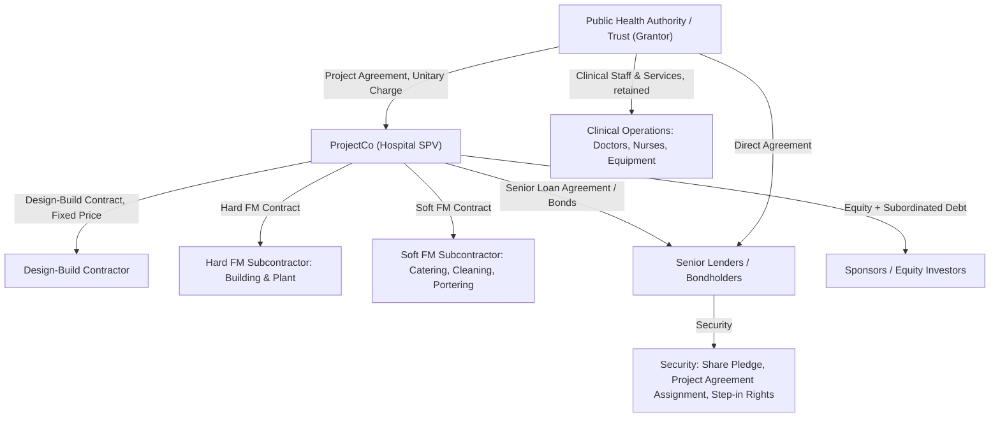
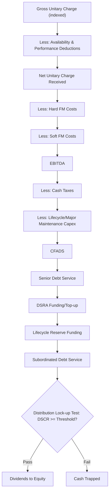

## Case Study: Social Infrastructure PPP Hospital

### Overview and Learning Objectives

A social infrastructure PPP hospital is a defining example of an **availability-based** project finance structure, contrasting sharply with the demand-risk (toll road) and commodity-risk (LNG) case studies. Revenue is not linked to patient volumes or usage, but to the SPV making the facility available and meeting performance standards — demand risk stays entirely with the public authority. This case study builds a capstone model for a greenfield PPP hospital financed on a limited-recourse basis.

By the end of this case study, the modeler should be able to:

- Structure an availability payment (unitary charge) revenue model with performance-based deductions
- Distinguish "hard FM" (facilities management: building fabric, plant, lifecycle) from "soft FM" (non-clinical services: catering, cleaning, portering) scope and risk allocation
- Model deduction/penalty mechanisms tied to availability and performance failures
- Size debt against a highly predictable, non-demand-linked cash flow, achieving higher gearing and lower DSCR buffers than demand-risk deals
- Analyze the lifecycle/major maintenance obligation over a 25–30 year concession
- Evaluate the deal from sponsor, lender, and public-sector (value-for-money) perspectives

### Transaction Background and Structure

**Key Points**

- **Asset**: Greenfield acute-care hospital, ~500 beds, delivered under a Design-Build-Finance-Maintain (DBFM) or Design-Build-Finance-Operate (DBFO) PPP model
- **Construction period**: 3 years
- **Concession/contract length**: 25–30 years from service commencement
- **Revenue mechanism**: Unitary charge (availability payment) paid monthly/quarterly by the public health authority, subject to deductions for unavailability and performance failures
- **Scope boundary**: SPV is responsible for the building, plant, and non-clinical (soft) FM services; the health authority/hospital trust retains all **clinical services** (doctors, nurses, medical equipment operation) — this scope boundary is fundamental and must be reflected precisely in the model's cost and revenue lines

**Risk allocation matrix**:

| Risk | Allocated To | Mitigant |
| --- | --- | --- |
| Construction cost overrun | Sponsor / EPC Contractor | Fixed-price, date-certain design-build contract |
| Construction delay | EPC Contractor | Delay LDs; unitary charge does not commence until service commencement |
| Demand/patient volume | Public Authority (Grantor) | Availability payment structure — SPV is NOT paid based on patient numbers |
| Availability | ProjectCo | Deduction regime for unavailable rooms/areas; FM subcontractor back-to-back liability |
| Performance (soft FM quality) | ProjectCo | Performance points/deduction matrix tied to KPIs |
| Lifecycle/major maintenance | ProjectCo | Lifecycle reserve fund, sinking fund contributions |
| Inflation | Shared | Unitary charge partially indexed (commonly the soft FM/lifecycle component to CPI; the debt/finance component often fixed) |
| Interest rate | Lenders → hedged to ProjectCo | Interest rate swaps; often fully fixed-rate given long tenor |
| Change in law / policy | Public Authority (mostly) | Change-in-law compensation provisions in the Project Agreement |

### Contractual Architecture

### Modeling Architecture: Sheet Structure

1. **Assumptions/Inputs** — capex, opex, financing terms, indexation assumptions
2. **Construction Budget & Drawdown S-Curve, IDC**
3. **Unitary Charge / Availability Payment Engine**
4. **Deduction & Performance Regime**
5. **Operating Costs** (Hard FM, Soft FM, Lifecycle)
6. **Debt Sizing & Sculpting**
7. **Three Statements**
8. **Cash Flow Waterfall**
9. **Reserve Accounts** (DSRA, Lifecycle Reserve)
10. **Returns**
11. **Credit Metrics**
12. **Sensitivities / Scenarios**
13. **Outputs / Dashboard**

### The Unitary Charge (Availability Payment) Engine

Unlike the toll road's traffic-driven revenue or the LNG project's commodity-indexed pricing, the unitary charge is a **contracted, largely fixed** payment stream — the defining feature that makes availability PPPs the lowest-risk, highest-gearing structure in the asset class.

**Base Unitary Charge Formula**:

$$UC_t = UC_{base} \times (1 + CPI_t)^{w}$$

Where $UC_{base}$ is the unitary charge fixed at financial close (in real or base-year terms), and $w$ is the indexed proportion of the charge (commonly only the soft FM and lifecycle components are indexed, while the debt/finance component is fixed or only partially indexed) [Inference — the precise indexation split is negotiated per project and set out in the Payment Mechanism schedule of the Project Agreement].

**Unitary charge components** (a standard decomposition used in most PPP financial models):

| Component | Basis | Indexation |
| --- | --- | --- |
| Senior debt service (interest + principal) | Fixed at financial close | None (fixed-rate debt assumed) |
| Equity/subordinated debt return | Fixed at financial close | None or partial |
| Hard FM (lifecycle/major maintenance) | Cost-based | Fully or partially CPI-indexed |
| Soft FM (cleaning, catering, etc.) | Cost-based | Fully or partially CPI-indexed |
| Corporation tax pass-through | Cost-based | N/A |

$$UC_t = DS_t + Equity\ Return_t + HardFM_t \times (1+CPI)^t + SoftFM_t \times (1+CPI)^t + Tax_t$$

This "cost-plus" derivation of the unitary charge at financial close is precisely what a lender's due diligence advisor cross-checks against the model's debt sizing output — the unitary charge must be sufficient to cover full debt service plus target equity returns plus all operating costs, by construction.

### Deduction and Performance Regime

This is the single most important risk-modeling feature distinguishing availability PPPs from simpler availability-only structures (like a pure toll-free bridge). Two deduction categories typically apply:

**1. Availability Deductions**: Applied when a functional area (e.g., a ward, operating theatre, or department) is unavailable for its intended clinical use.

$$Availability\ Deduction_t = \sum_{a} (Unavailable\ Days_a \times Daily\ Rate_a \times Weighting_a)$$

Weighting factors reflect criticality (e.g., an operating theatre unavailability may carry a much higher deduction weighting than a storage room).

**2. Performance Deductions**: Applied for failures against soft FM KPIs (e.g., cleaning standards, food service temperature/quality, response times for maintenance call-outs), often via a **points-based system**:

$$Performance\ Deduction_t = \sum_{k} (Failure\ Points_k \times Points\ Value)$$

**Persistent/Cumulative Failure Escalation**: Most Project Agreements include an escalating consequence mechanism — repeated failures of the same type within a rolling period trigger increasing deductions, and severe/persistent failures can ultimately trigger termination rights for the authority. Modelers typically build a "deduction cap" as a percentage of the unitary charge (commonly capped around 3–10% of monthly unitary charge from availability/performance combined, subject to the specific Project Agreement) [Inference — deduction caps and mechanics vary significantly by jurisdiction and specific contract; UK NHS-style Standardisation of PF2 Contracts and similar national PPP guidance documents should be the primary reference for a live transaction].

**Net Unitary Charge Received**:

$$Net\ UC_t = UC_t - Availability\ Deduction_t - Performance\ Deduction_t$$

A well-built model should include a **deduction sensitivity toggle** (e.g., 0%, 2%, 5% of gross UC) to stress-test the DSCR impact of realistic FM subcontractor underperformance, since this is a primary lender due-diligence question.

### Debt Sizing: Low-Volatility Cash Flow Advantage

Because the unitary charge is contracted and not subject to demand risk, and deductions are typically small and bounded, CFADS volatility is far lower than in a toll road or LNG deal. This allows:

- **Higher gearing**: 85–95% debt (some fully-availability, government-counterparty PPPs have historically gone even higher) [Inference — gearing levels are jurisdiction- and rating-agency-dependent, and have generally trended more conservative since the post-2008 and post-2020 PPP market recalibrations]
- **Lower minimum DSCR covenants**: 1.05x–1.20x (versus 1.30x–1.50x+ for demand-risk toll roads)
- **Fixed-rate debt or fully-hedged floating debt** is standard, since the government counterparty payment is itself largely fixed, and lenders want matching certainty on the debt side

**DSCR-Sculpted Debt Sizing** (same core mechanic as other project finance deals, applied to a much flatter CFADS profile):

$$DS_t = \frac{CFADS_t}{DSCR_{min}}, \quad Debt_{max,DSCR} = \sum_{t=1}^{n} \frac{DS_t}{(1+r_d)^t}$$

$$Debt_{senior} = \min(Debt_{max,gearing},\ Debt_{max,DSCR})$$

Because CFADS is so stable, the DSCR-sculpted constraint typically converges close to a flat annuity-style debt service profile — sculpting still matters at the margins (e.g., ramp-up in the first operational year, or lifecycle expenditure timing), but the dramatic multi-decade sculpting curve seen in a toll road model is far less pronounced here.

**Typical target credit metrics** (illustrative, benchmarked against comparable availability-based social infrastructure financings):

| Metric | Typical Target |
| --- | --- |
| Minimum DSCR | 1.05x–1.20x |
| Average DSCR | 1.10x–1.25x |
| Gearing | 85–92% |
| Debt tenor | Often matches or nearly matches concession term (minimal "tail") |
| Interest rate basis | Predominantly fixed-rate or fully swapped |

### Cash Flow Waterfall

### Reserve Accounts

**Debt Service Reserve Account (DSRA)**: Given the lower cash flow volatility, DSRA sizing requirements from lenders are sometimes more modest than demand-risk deals, though 6 months forward debt service remains a common convention.

**Lifecycle/Major Maintenance Reserve**: PPP hospitals require substantial periodic capital renewal (roof replacement, mechanical/electrical plant renewal, medical gas systems, etc.) across the 25–30 year term. Because this is a "hard FM" obligation contractually owed by ProjectCo, an accurate lifecycle model is essential:

$$Lifecycle\ Reserve\ Accrual_t = \frac{\text{PV of Total Lifecycle Cost Schedule}}{\text{Concession Term}}$$

A detailed lifecycle model typically itemizes 15–30+ individual asset components (roof, lifts, HVAC, medical gas, car park resurfacing, etc.) each with its own replacement cycle (e.g., 15 years for HVAC major components, 25 years for roof membrane), rather than a single blended accrual — lenders' technical advisors scrutinize this schedule closely as part of due diligence.

### Three-Statement Integration

Standard integration applies, with PPP-specific nuances:

- **Revenue recognition**: Under IFRIC 12 (or equivalent service concession accounting), the SPV may recognize either a **financial asset** (if payments are guaranteed independent of usage) or an **intangible asset** (if payments depend on usage) — for a pure availability-based hospital PPP, the financial asset model is common, meaning the balance sheet carries a receivable rather than depreciating fixed assets in the traditional sense [Inference — the correct accounting treatment depends on the specific contract terms and applicable accounting standard, and should be confirmed with the transaction's auditors].
- **Depreciation**: If accounted for as a fixed asset (rather than financial asset model), straight-line over the concession term
- **Deferred tax**: Long-life infrastructure assets commonly generate timing differences between accounting and tax depreciation, requiring a deferred tax balance

### Equity Returns Analysis

$$Equity\ CF_t = -Equity\ Injection_t\ (\text{construction}) + Dividends_t\ (\text{operations})$$

Typical target equity IRRs: **7–11%** for availability-based social infrastructure PPPs — meaningfully lower than demand-risk toll roads or commodity-exposed LNG projects, reflecting the substantially lower risk profile (no demand risk, high-credit-quality government counterparty, low cash flow volatility) [Inference — return expectations vary by jurisdiction, sovereign/sub-sovereign credit quality of the grantor, and prevailing market conditions at financial close].

### Sensitivity and Scenario Analysis

**Core sensitivities**:

| Variable | Downside Case | Impact Measured On |
| --- | --- | --- |
| Availability/performance deductions | 2% to 5% of gross UC (vs. near-zero base case) | CFADS, DSCR |
| Lifecycle cost overrun | +15% to +25% vs. base estimate | Lifecycle reserve adequacy, DSCR in renewal years |
| Construction cost overrun | +10% to +15% | Debt capacity headroom, Equity IRR |
| Construction delay | +6 to +12 months | Delayed unitary charge commencement, LDs, Equity IRR |
| Soft FM subcontractor cost overrun/insolvency | Step-in cost premium | EBITDA margin, CFADS |
| Inflation (CPI) | +/- 1-2% p.a. vs. base | Indexed portion of UC vs. indexed portion of costs (basis mismatch risk) |
| Grantor payment delay/dispute | Temporary cash flow interruption | Liquidity/DSRA drawdown |

**Inflation basis-risk note** [Inference]: Because typically only part of the unitary charge is indexed while nearly all FM operating costs are inflation-exposed, an inflation sensitivity should test scenarios where cost inflation outpaces the indexed revenue proportion — this basis mismatch is a recognized structural risk in availability PPP models, distinct from the demand risk seen in toll roads.

### DSCR Profile Comparison Illustration (svg_diagram)

<svg xmlns="http://www.w3.org/2000/svg" viewBox="0 0 720 420" font-family="Arial, sans-serif">
<text x="360" y="24" text-anchor="middle" font-size="16" font-weight="bold" fill="#1a1a1a">DSCR Volatility: Availability PPP vs. Demand-Risk Asset (svg_diagram)</text>
<line x1="60" y1="360" x2="680" y2="360" stroke="#333" stroke-width="1.5" />
<line x1="60" y1="360" x2="60" y2="50" stroke="#333" stroke-width="1.5" />

<text x="30" y="360" font-size="11" fill="#333">1.00x</text>

<text x="30" y="270" font-size="11" fill="#333">1.20x</text>

<text x="30" y="180" font-size="11" fill="#333">1.40x</text>

<text x="30" y="90" font-size="11" fill="#333">1.60x</text>

<text x="10" y="220" font-size="11" fill="#333" transform="rotate(-90 10 220)">DSCR</text>

<text x="110" y="380" font-size="11" fill="#333">Y1</text>

<text x="220" y="380" font-size="11" fill="#333">Y8</text>

<text x="330" y="380" font-size="11" fill="#333">Y15</text>

<text x="440" y="380" font-size="11" fill="#333">Y22</text>

<text x="550" y="380" font-size="11" fill="#333">Y28</text>

<polyline points="90,275 150,270 210,272 270,268 330,271 390,269 450,273 510,270 570,272" fill="none" stroke="`#2ca02c`" stroke-width="3" />

<polyline points="90,320 150,270 210,220 270,190 330,180 390,175 450,160 510,150 570,140" fill="none" stroke="`#1f77b4`" stroke-width="3" stroke-dasharray="6,4" />

<line x1="60" y1="315" x2="680" y2="315" stroke="#999" stroke-width="1" stroke-dasharray="3,3" />
<text x="600" y="310" font-size="10" fill="#666">Covenant floor ~1.10x</text>
<rect x="490" y="55" width="14" height="14" fill="#2ca02c" />
<text x="510" y="66" font-size="12" fill="#333">Availability PPP Hospital DSCR</text>
<rect x="490" y="75" width="14" height="14" fill="#1f77b4" />
<text x="510" y="86" font-size="12" fill="#333">Demand-Risk Toll Road DSCR</text>

<text x="360" y="405" text-anchor="middle" font-size="11" fill="#555">Availability PPP DSCR is flat and tightly clustered near covenant; toll road DSCR is low early (ramp-up) then rises</text>

</svg>

### Worked Numerical Example

- Gross unitary charge (steady state, indexed): $42m/year
- Availability/performance deductions (base case assumption): 1.5% of gross UC = $0.63m
- **Net unitary charge** = $42m − $0.63m = **$41.37m**
- Hard FM costs: $6m; Soft FM costs: $9m
- **EBITDA** = $41.37m − $6m − $9m = **$26.37m**
- Cash taxes: $2.5m; lifecycle reserve accrual: $3.5m
- **CFADS** = $26.37m − $2.5m − $3.5m = **$20.37m**
- Minimum DSCR covenant: 1.10x
- **Maximum annual debt service** = $20.37m ÷ 1.10 = **$18.5m**

Sculpted (near-flat) across a 27-year tenor closely matching the concession term, discounted at the senior debt rate, this produces the DSCR-constrained debt quantum — compared against a gearing cap of, say, 90% of total project cost, with the lower of the two figures determining final senior debt sizing, following the same MIN() logic used in the toll road and LNG case studies, but converging on a much higher leverage outcome given the lower cash flow risk.

### Common Modeling Pitfalls

- **Conflating clinical and non-clinical cost/revenue lines** — including clinical staff costs or clinical revenue in the SPV model when these sit entirely with the health authority breaks the fundamental PPP scope boundary
- **Under-modeling the deduction regime** — treating deductions as a single flat percentage rather than building the availability/performance mechanics explicitly understates a key lender due-diligence risk area
- **Flat-lining the lifecycle schedule** — using a single blended annual accrual instead of an itemized, cycle-specific lifecycle model can materially misstate cash flow in actual renewal years
- **Ignoring indexation basis mismatch** — assuming the entire unitary charge and entire cost base index at the same CPI rate, missing the structural risk when only part of the UC is indexed
- **Overstating debt capacity by ignoring the deduction cap interaction with DSCR** — even small deductions, correctly modeled, can be the marginal determinant of the minimum DSCR year
- **Misapplying demand-risk-style ramp-up curves** — availability PPP revenue does not ramp up with "demand"; any ramp relates only to service commencement/handover timing, not usage

**Next Steps**

- Build the full Unitary Charge Engine tab with explicit component-level indexation (debt/equity fixed component vs. Hard/Soft FM indexed component)
- Construct the Deduction & Performance Regime module with weighted availability deductions and points-based performance deductions
- Build a detailed, itemized Lifecycle Reserve model (15–30+ asset components with individual replacement cycles)
- Compare this case study's debt sizing/leverage outcome directly against the toll road case study to reinforce the demand-risk vs. availability-risk credit spectrum
- Study real-world precedents: UK PFI/PF2 hospital schemes (e.g., Royal London Hospital, Queen Elizabeth Hospital Birmingham), Canadian P3 hospitals (e.g., Ontario/Infrastructure Ontario projects), Australian social infrastructure PPPs
- Explore refinancing gain-share mechanisms common in mature PPP hospital deals
- Extend the case study to model a step-in rights scenario following FM subcontractor default