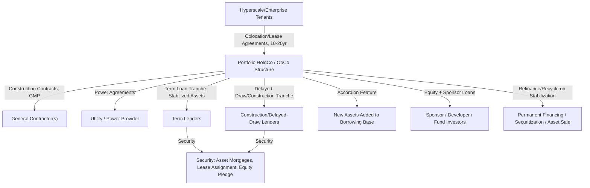
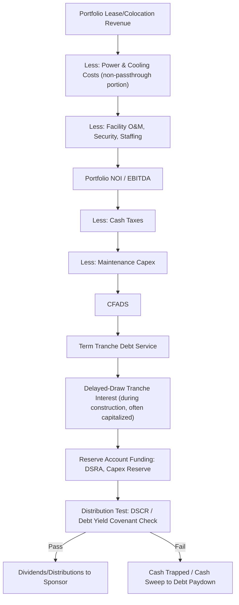

## Case Study: Data Center Portfolio Financing

### Overview and Learning Objectives

Data center portfolio financing has emerged as one of the fastest-growing project/asset finance sectors, driven by hyperscale cloud and AI compute demand. Unlike a single-asset toll road or LNG terminal, this case study introduces **portfolio-level modeling**: multiple assets at different stages (operating, under-construction, land-banked/pipeline), financed under a single facility, with recycling/accordion mechanics. It also introduces the credit-tenant-lease-like structure of hyperscale colocation contracts.

By the end of this case study, the modeler should be able to:

- Structure a portfolio financing model spanning multiple data center facilities at different lifecycle stages
- Model long-term colocation/lease agreements with hyperscale/enterprise tenants, including power-based pricing
- Distinguish "powered shell" and "colocation" revenue models and their differing risk/margin profiles
- Size a revolving/delayed-draw credit facility with an accordion feature for portfolio growth, alongside term debt on stabilized assets
- Model a "warehousing" facility that recycles into permanent financing or securitization upon stabilization
- Analyze power availability/PUE, tenant concentration, and technology obsolescence risk
- Evaluate the deal from sponsor (developer), lender, and tenant perspectives

### Transaction Background and Structure

**Key Points**

- **Asset**: Portfolio of 5 hyperscale data center facilities (a mix of 2 operating/stabilized, 2 under construction, 1 in permitting/pre-construction), totaling ~250 MW of critical IT load at full build-out
- **Tenant base**: Hyperscale cloud providers (e.g., large technology companies) and/or enterprise colocation customers under long-term (10–20 year) lease/service agreements
- **Financing structure**: Portfolio-level credit facility combining (a) a term loan tranche against stabilized, cash-flowing assets, and (b) a delayed-draw/construction tranche for development assets, often with an accordion feature to add newly-acquired or newly-developed assets over time
- **Sponsor**: Data center developer/operator (or a real estate/infrastructure fund sponsor), sometimes structured as a REIT-eligible or infrastructure fund vehicle

**Risk allocation matrix**:

| Risk | Allocated To | Mitigant |
| --- | --- | --- |
| Construction cost overrun | Sponsor / EPC/GC Contractor | Fixed-price or GMP (guaranteed maximum price) construction contracts |
| Construction delay | GC Contractor | Delay LDs; phased/modular construction reduces single-point delay risk |
| Lease-up/tenant demand | Sponsor (mitigated by pre-leasing) | Requirement for substantial pre-leasing (often 50-100%) before draw on construction tranche |
| Tenant credit/concentration | Lenders (mitigated by tenant mix) | Concentration limits, tenant credit rating covenants, diversification requirements |
| Power availability | Sponsor | Long-term power purchase/interconnection agreements with utility, secured early in development |
| Power price/cost | Sponsor or pass-through to tenant | Power cost pass-through clauses common in colocation agreements |
| Technology obsolescence | Sponsor | Design flexibility (modular, upgradable cooling/power density), shorter equipment depreciation life |
| Interest rate | Lenders → hedged to Sponsor | Interest rate caps/swaps on floating-rate portions |
| Portfolio/asset addition risk | Lenders (via accordion mechanics) | Eligibility criteria, borrowing base tests for each new asset added |

### Contractual and Structural Architecture

### Modeling Architecture: Sheet Structure

1. **Assumptions/Inputs** — per-asset capex, power costs, lease terms, financing terms
2. **Asset Register** — one row/block per facility: stage (operating/construction/pipeline), MW capacity, COD, lease status
3. **Construction Budget & Drawdown by Asset** (phased, staggered)
4. **Lease/Revenue Engine** (per-asset, aggregated to portfolio)
5. **Operating Costs** (power, cooling, staffing, maintenance)
6. **Borrowing Base & Accordion Mechanics**
7. **Debt Sizing & Sculpting** (term tranche + delayed-draw tranche)
8. **Three Statements** (consolidated portfolio)
9. **Cash Flow Waterfall**
10. **Reserve Accounts** (DSRA, capex reserve)
11. **Returns** (portfolio-level and per-asset)
12. **Credit Metrics** (portfolio LTV, DSCR, borrowing base coverage)
13. **Sensitivities / Scenarios**
14. **Outputs / Dashboard**

### Revenue Models: Powered Shell vs. Colocation

Two dominant hyperscale data center revenue/contract structures, each with a distinct risk-return and modeling profile:

**1. Powered Shell (Triple-Net Lease)**: The tenant leases the building and power capacity but installs and operates its own IT/cooling equipment within the space. This is the closest analog to a credit-tenant-lease (CTL) structure in commercial real estate finance.

$$Revenue_t = Contracted\ Rent_t \times Leased\ Area\ (\text{or MW}) \times Escalation_t$$

Escalation is typically a fixed annual step (e.g., 2–3% per year) rather than CPI-indexed, consistent with standard commercial lease conventions.

**2. Colocation (Managed Services)**: The operator provides power, cooling, physical security, and connectivity as a service, typically priced per kW of committed critical IT load plus a cross-connect/bandwidth component:

$$Revenue_t = \sum_{tenant} \left( Committed\ kW_{tenant} \times \$/kW/month_{tenant} \times 12 \right) + Cross\text{-}Connect\ Fees_t$$

| Feature | Powered Shell | Colocation |
| --- | --- | --- |
| Operating cost borne by | Tenant (passthrough) | Operator |
| Margin | Lower (real-estate-like) | Higher (services-like) |
| Revenue predictability | Very high (long-term NNN lease) | High but with modest churn/renewal risk |
| Typical lease/contract term | 15–20 years | 3–10 years (colocation), sometimes with hyperscale 10-15yr wholesale deals |
| Debt sizing approach | CTL-style, high leverage | Cash-flow/DSCR-based, moderate leverage |

### Power and PUE Considerations

Power Usage Effectiveness (PUE) is the standard efficiency metric and directly drives the operating cost model:

$$PUE = \frac{Total\ Facility\ Power}{IT\ Equipment\ Power}$$

$$Total\ Power\ Cost_t = IT\ Load_t \times PUE_t \times Power\ Rate_t \times Hours_t$$

Modern hyperscale facilities target PUE of approximately 1.2–1.4 [Inference — actual achievable PUE depends on climate, cooling technology (air vs. liquid cooling), and facility design; figures should be validated against the specific facility's engineering specifications]. Where power costs are passed through to tenants (common in colocation agreements via a power usage charge or pass-through clause), this cost line has limited P&L margin impact on the operator but still requires accurate modeling for working capital and billing timing purposes.

**Critical modeling input**: Power availability and grid interconnection timing is frequently the binding constraint on a data center's construction timeline in today's market environment, more so than the physical construction itself [Unverified — this reflects a general industry dynamic reported widely in trade press as of the model's knowledge cutoff; interconnection queue times are highly jurisdiction- and utility-specific and should be verified against current local utility data for any live transaction].

### Portfolio Structure: Borrowing Base and Accordion Mechanics

Unlike a single-asset project financing, a data center portfolio facility typically operates on a **borrowing base** concept, similar in mechanic to real estate or infrastructure credit facilities:

$$Borrowing\ Base\ Availability = \sum_{i} \min\left(Asset_i\ Value \times Advance\ Rate,\ Asset_i\ NOI \times Debt\ Yield^{-1}\right)$$

Each asset must satisfy **eligibility criteria** to be included in (or added to) the borrowing base, commonly including:

- Minimum pre-leasing/occupancy threshold (e.g., 65–80% leased) before an under-construction asset can convert into the "stabilized" borrowing base pool
- Tenant credit quality thresholds (investment-grade or equivalent)
- Geographic/tenant concentration limits (no single tenant or region exceeding a set % of portfolio NOI)
- Completion of construction milestones (e.g., substantial completion, commissioning, first revenue)

**Accordion feature**: Allows the sponsor to add newly acquired or newly developed assets to the facility (increasing total commitment) without a full refinancing, subject to lender consent and the same eligibility/borrowing base tests — this is a structural feature increasingly common in data center and digital infrastructure credit facilities, reflecting the sector's rapid growth trajectory. [Inference — specific mechanics, advance rates, and accordion sizing limits vary significantly by lender group and should be confirmed against current market precedent transactions, as this is a fast-evolving segment of the leveraged/project finance market.]

**Debt Yield** (a common data center/CRE-hybrid credit metric, supplementing DSCR):

$$Debt\ Yield = \frac{NOI}{Total\ Debt\ Outstanding}$$

Typical target debt yields for stabilized data center term loans: 8–11% [Inference — benchmark ranges shift with the broader credit market and should be checked against recent comparable transactions].

### Debt Sizing: Dual-Tranche Structure

**Term Tranche** (against stabilized, leased, operating assets) — sized using standard DSCR-sculpted or LTV/debt-yield methodology:

$$Debt_{term} = \min\left(NOI_{stabilized} / DSCR_{min} \text{ (annuitized)},\ Asset\ Value \times Max\ LTV\right)$$

Typical stabilized data center term debt: 60–70% LTV, minimum DSCR 1.30x–1.50x [Inference — leverage and coverage benchmarks for this relatively young asset class continue to evolve as more precedent transactions are priced; figures should be cross-checked against current market data].

**Delayed-Draw/Construction Tranche** (against pre-leased, under-construction assets) — sized based on:

- Total project cost × maximum construction LTC (loan-to-cost), commonly 60–75%
- Subject to minimum pre-leasing threshold before initial draw (e.g., 50%+ pre-leased by a creditworthy tenant)
- Converts/rolls into the term tranche borrowing base upon achieving stabilization criteria (completion + minimum occupancy sustained for a specified period)

### Cash Flow Waterfall (Portfolio Level)

### Reserve Accounts

**Debt Service Reserve Account (DSRA)**: Commonly 3–6 months forward debt service on the term tranche.

**Capex/FF&E Reserve**: Given rapid technology cycles, data centers require ongoing capex for cooling system upgrades, power infrastructure enhancement (e.g., transition to higher-density liquid cooling for AI workloads), and equipment refresh — often reserved as an annual accrual per critical IT load MW:

$$Capex\ Reserve\ Accrual_t = MW_t \times \$/MW\ Annual\ Reserve\ Rate$$

### Three-Statement Integration

Standard integration applies at the consolidated portfolio level, with data-center-specific nuances:

- **Segment reporting by asset stage**: The model should be able to isolate stabilized-asset NOI (supporting term debt) from construction-asset costs (supporting delayed-draw tranche) for borrowing base compliance reporting
- **Depreciation**: Building shell typically depreciated over 25-39 years (real-estate-like); mechanical/electrical/cooling infrastructure often on a shorter schedule (10–15 years) reflecting faster technology and wear cycles; IT infrastructure (if owned by operator, as in colocation) even shorter (3-5 years)
- **Capitalized interest**: During each asset's individual construction period, interest on the delayed-draw tranche is capitalized following the same IDC mechanics as other project finance construction phases

### Equity/Sponsor Returns Analysis

Portfolio returns should be computed both **per-asset** (to evaluate individual development decisions) and **at the portfolio/fund level** (reflecting the blended return the sponsor equity actually receives):

$$Equity\ CF_t = -Equity\ Injection_t\ (\text{per asset, as drawn}) + Distributions_t\ (\text{as assets stabilize and distribute})$$

Typical target equity/development IRRs: **13–20%+** for ground-up hyperscale data center development (reflecting construction, lease-up, and technology risk), compressing toward **8–12%** for stabilized, long-leased asset acquisitions financed with permanent debt [Inference — this is a fast-growing, actively-repricing asset class; return benchmarks should be validated against current market transaction data rather than treated as fixed].

### Sensitivity and Scenario Analysis

**Core sensitivities**:

| Variable | Downside Case | Impact Measured On |
| --- | --- | --- |
| Lease-up delay | +6 to +12 months slower pre-leasing | Delayed-draw tranche conversion timing, Equity IRR |
| Tenant concentration/default | Loss of single hyperscale tenant | Portfolio NOI, borrowing base eligibility |
| Power cost increase (non-passthrough portion) | +20-30% | Operating margin, CFADS |
| Construction cost overrun | +15-25% (reflecting supply chain/equipment lead times) | Construction tranche headroom, Equity IRR |
| Interconnection/power delivery delay | +12-24 months | Revenue commencement delay across affected assets |
| Interest rate (floating delayed-draw tranche) | +150-250 bps | Interest cost during construction, DSCR at conversion |
| Technology-driven demand shift (e.g., AI-driven density increases) | Requires unplanned retrofit capex | Capex reserve adequacy, NOI margin |

### Portfolio Stabilization Timeline Illustration (svg_diagram)

<svg xmlns="http://www.w3.org/2000/svg" viewBox="0 0 720 380" font-family="Arial, sans-serif">
<text x="360" y="24" text-anchor="middle" font-size="16" font-weight="bold" fill="#1a1a1a">Portfolio Asset Stage Progression (svg_diagram)</text>

<text x="20" y="70" font-size="12" fill="#333">Asset A</text>

<rect x="90" y="55" width="560" height="24" fill="`#2ca02c`" />

<text x="370" y="71" text-anchor="middle" font-size="11" fill="#fff">Stabilized / Term Tranche</text>

<text x="20" y="120" font-size="12" fill="#333">Asset B</text>

<rect x="90" y="105" width="560" height="24" fill="`#2ca02c`" />

<text x="370" y="121" text-anchor="middle" font-size="11" fill="#fff">Stabilized / Term Tranche</text>

<text x="20" y="170" font-size="12" fill="#333">Asset C</text>

<rect x="90" y="155" width="280" height="24" fill="`#ff7f0e`" />

<rect x="370" y="155" width="280" height="24" fill="`#2ca02c`" opacity="0.5" />

<text x="230" y="171" text-anchor="middle" font-size="11" fill="#fff">Construction/Delayed-Draw</text>

<text x="510" y="171" text-anchor="middle" font-size="10" fill="#333">Projected Stabilization</text>

<text x="20" y="220" font-size="12" fill="#333">Asset D</text>

<rect x="90" y="205" width="200" height="24" fill="`#d62728`" />

<rect x="290" y="205" width="360" height="24" fill="`#ff7f0e`" opacity="0.5" />

<text x="190" y="221" text-anchor="middle" font-size="11" fill="#fff">Permitting</text>

<text x="470" y="221" text-anchor="middle" font-size="10" fill="#333">Projected Construction</text>

<text x="20" y="270" font-size="12" fill="#333">Asset E</text>

<rect x="90" y="255" width="120" height="24" fill="`#d62728`" />

<rect x="210" y="255" width="440" height="24" fill="#999" opacity="0.4" />

<text x="150" y="271" text-anchor="middle" font-size="11" fill="#fff">Pipeline</text>

<text x="430" y="271" text-anchor="middle" font-size="10" fill="#333">Future / Accordion-Eligible</text>

<rect x="20" y="310" width="14" height="14" fill="#2ca02c" />
<text x="40" y="321" font-size="11" fill="#333">Stabilized (Term Tranche)</text>
<rect x="200" y="310" width="14" height="14" fill="#ff7f0e" />
<text x="220" y="321" font-size="11" fill="#333">Construction (Delayed-Draw)</text>
<rect x="420" y="310" width="14" height="14" fill="#d62728" />
<text x="440" y="321" font-size="11" fill="#333">Permitting/Pipeline</text>

<text x="360" y="355" text-anchor="middle" font-size="11" fill="#555">Each asset moves through stages; borrowing base composition shifts as assets stabilize</text>

</svg>

### Worked Numerical Example

Stabilized asset (colocation model), single facility snapshot:

- Committed critical IT load: 30 MW; average contracted rate: $150/kW/month
- **Annual colocation revenue** = 30,000 kW × $150 × 12 = **$54m**
- Non-passthrough operating costs (staffing, security, maintenance, non-passthrough power margin): $14m
- **NOI/EBITDA** = $54m − $14m = **$40m**
- Cash taxes: $3m; maintenance capex reserve: $3m
- **CFADS** = $40m − $3m − $3m = **$34m**
- Minimum DSCR covenant: 1.35x
- **Maximum annual debt service** = $34m ÷ 1.35 = **$25.2m**

Cross-checked against a debt yield test: if term debt outstanding on this asset is $300m, **Debt Yield** = $40m ÷ $300m = **13.3%**, comfortably above a typical 8-11% minimum threshold, confirming the debt sizing is not the binding constraint in this instance — illustrating how data center financings often reference both DSCR *and* debt yield/LTV as parallel sizing tests, taking the most conservative (binding) outcome.

### Common Modeling Pitfalls

- **Treating the portfolio as a single monolithic asset** — failing to segment stabilized vs. construction-stage assets by tranche and eligibility status breaks the borrowing base and covenant compliance logic
- **Ignoring pre-leasing thresholds as a hard gate** — modeling construction tranche draws as available regardless of leasing status misrepresents the actual facility mechanics
- **Underestimating power/interconnection timeline risk** — treating power delivery as a fixed, low-risk input rather than a potential critical-path constraint
- **Confusing powered-shell (NNN lease) and colocation (services) revenue mechanics** — these have fundamentally different margin structures, cost pass-through treatment, and appropriate leverage levels
- **Static capex reserve assumptions** — not flexing the capex/technology-refresh reserve for known step-changes in demand (e.g., rising power density requirements driven by AI/GPU workloads)
- **Omitting tenant concentration risk** — a portfolio model that doesn't track NOI-by-tenant concentration will miss a covenant trigger tied to a single large hyperscale tenant's credit profile

**Next Steps**

- Build the Asset Register tab tracking stage, MW capacity, lease status, and COD for each portfolio asset
- Construct the Borrowing Base module with eligibility criteria, advance rates, and accordion capacity tracking
- Model the term tranche and delayed-draw tranche as separate debt schedules with distinct sizing tests (DSCR, LTV, debt yield) and a conversion/roll-up mechanic upon stabilization
- Build a per-asset vs. portfolio-level returns reconciliation to distinguish development-stage IRR from stabilized-asset IRR
- Study real-world precedents and structures: hyperscale build-to-suit financings, digital infrastructure REIT credit facilities, and data center ABS/securitization transactions
- Extend the case study to model a securitization take-out (data center ABS) as the permanent financing exit for stabilized assets
- Explore the impact of AI-driven power density increases (liquid cooling retrofits) on lifecycle capex assumptions across the portfolio