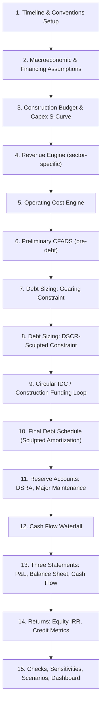
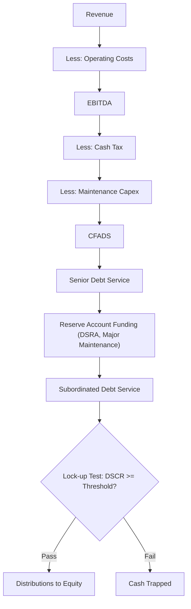

## Capstone: Building a Full Project Finance Model From Scratch

### Overview and Learning Objectives

This capstone synthesizes every technique from the preceding case studies (toll road, LNG terminal, PPP hospital, data center portfolio) into a single, generalized **build methodology** applicable to any project finance asset. Rather than focusing on one sector's revenue mechanics, this capstone is a step-by-step construction sequence — the disciplined process a modeler follows from a blank workbook to a fully integrated, auditable, circularity-safe, banker-ready model.

By the end of this capstone, the modeler should be able to:

- Sequence a full project finance model build in the correct dependency order to minimize rework and circularity errors
- Apply consistent modeling conventions (color-coding, sign conventions, units, timeline architecture) across any sector
- Build the core mechanical engine — construction funding, debt sizing/sculpting, cash waterfall, three statements — as a reusable skeleton
- Implement robust circularity management, error-checking, and audit trails
- Produce lender-ready outputs: base case, sensitivities, and a scenario/stress-testing dashboard
- Self-critique a finished model against a professional model-review checklist

### Build Sequence: The Correct Order of Operations

A common capstone failure is building sheets in the wrong order (e.g., building the P&L before the debt schedule exists), which forces rework and hidden circularity. The professionally correct build sequence is:

**Key Points**

- Never build the revenue/cost engine before the timeline — every subsequent formula references the timeline row
- Never attempt debt sculpting before CFADS is fully built and stable
- Never build the three statements before the debt schedule and waterfall exist — the statements are consumers, not sources, of financing logic
- Save circularity-breaking (IDC, cash sweep circularity) for a dedicated step with an explicit toggle, not an afterthought

### Step 1: Timeline and Modeling Conventions

**Timeline architecture** — the single most important structural decision, made once and never revisited:

- Choose a period granularity: monthly during construction (for precise drawdown/IDC), switching to semi-annual or annual during operations
- Build a master timeline row with: period number, calendar date, days in period, construction/operations flag, and year-of-operation counter
- All other sheets reference this master timeline via formula, never by re-typing dates

**Sign conventions** (must be fixed globally before any formula is built):

| Convention | Recommended Standard |
| --- | --- |
| Cash inflows | Positive |
| Cash outflows | Negative |
| Debt drawdowns | Positive (increase balance) |
| Debt repayments | Negative (decrease balance) |
| Revenue | Always positive |

**Color-coding convention** (standard financial modeling practice):

| Font/Fill Color | Meaning |
| --- | --- |
| Blue font | Hardcoded input/assumption |
| Black font | Formula (calculated) |
| Green font | Link to another sheet within the same workbook |
| Red font | External link or link to another workbook (avoid in final delivery) |
| Yellow fill | Key output / switch / toggle cell |

### Step 2: Macroeconomic and Financing Assumptions

Centralize every driver on a single Assumptions sheet so that no hardcoded value ever appears buried in a calculation sheet:

- Inflation/CPI curve, discount rate(s), tax rate, depreciation policy
- Debt terms: margin, base rate curve, tenor, DSCR covenant, gearing cap, fees (arrangement, commitment, agency)
- Reserve account policy: DSRA months of cover, major maintenance reserve schedule
- Distribution policy: lock-up DSCR threshold, dividend timing

### Step 3: Construction Budget and Capex S-Curve

Build the capital expenditure drawdown profile (S-curve is standard because construction spend is slow at the start, accelerates mid-project, and tails off at completion):

$$Capex_t = Total\ Budget \times \left[ F(t) - F(t-1) \right]$$

Where $F(t)$ is a cumulative S-curve function (commonly modeled via a beta distribution, a simple weighted schedule by construction phase, or a three-point ramp-plateau-taper approximation).

**Funding sequencing** during construction (a key policy choice, sector-agnostic):

- Equity/subordinated debt drawn first (equity-first), or
- Pro-rata debt/equity drawdown throughout, or
- Debt drawn first up to a committed limit, equity as a backstop

This choice affects IDC (see Step 9) and is a common lender negotiating point, since equity-first drawdown reduces lender risk by ensuring sponsor capital is at risk before debt.

### Step 4 & 5: Revenue and Operating Cost Engines (Sector-Specific Plug-In)

This is the only step that materially differs across sectors — everything else in this capstone is reusable scaffolding. The revenue engine plugs in whichever mechanic matches the asset:

| Sector (from prior case studies) | Revenue Driver |
| --- | --- |
| Toll road | Traffic volume × toll rate, with ramp-up and elasticity |
| LNG terminal | Contracted take-or-pay + indexed pricing (oil/HH/JKM) |
| PPP hospital | Unitary charge with availability/performance deductions |
| Data center portfolio | Leased/committed capacity × contracted rate, powered shell vs. colocation |

Regardless of sector, the output of Steps 4–5 must converge to the same generalized structure:

$$EBITDA_t = Revenue_t - Operating\ Costs_t$$

### Step 6: Preliminary CFADS (Pre-Debt)

Before debt can be sized, a "pre-debt" CFADS must exist — calculated independent of the debt schedule, which does not yet exist:

$$CFADS_t^{pre-debt} = EBITDA_t - Cash\ Tax_t - \Delta NWC_t - Maintenance\ Capex_t$$

Note that cash tax at this stage is a **circular placeholder** if interest is tax-deductible (tax depends on interest, which depends on debt, which depends on CFADS) — this is flagged and resolved in Step 9, not ignored.

### Step 7 & 8: Debt Sizing — Gearing and DSCR Constraints

**Gearing constraint**:

$$Debt_{max,gearing} = Total\ Project\ Cost \times Gearing\%$$

**DSCR-sculpted constraint**:

$$DS_t = \frac{CFADS_t}{DSCR_{min}}, \qquad Debt_{max,DSCR} = \sum_{t=1}^{n} \frac{DS_t}{(1+r_d)^t}$$

**Final debt quantum**:

$$Debt_{senior} = \min(Debt_{max,gearing},\ Debt_{max,DSCR})$$

This MIN() function — used identically across all four prior case studies — is the universal core of project finance debt sizing regardless of sector. It should be built once as a clean, auditable comparison, ideally with a labeled cell showing which constraint is binding.

### Step 9: Managing Circularity (IDC and Cash Sweep Loops)

Two circular loops are endemic to every project finance model:

**Loop 1 — Construction-phase IDC**: Interest during construction is capitalized into total project cost, which increases the funding requirement, which increases debt drawn, which increases interest.

$$IDC_t = \left(\text{Opening Debt}_t + \frac{Drawdown_t}{2}\right) \times r$$

**Loop 2 — Operating-phase tax/interest circularity**: Interest expense reduces taxable income, which reduces cash tax, which increases CFADS, which (under a cash sweep or DSCR-linked mechanic) can affect the debt balance, which affects interest.

**Resolution methods** (in order of robustness):

1. **Iterative calculation setting** (Excel: File → Options → Formulas → Enable iterative calculation) — simplest, but risks unstable or non-converging results if not carefully bounded, and can silently corrupt a model if accidentally left on/off inconsistently across team members
2. **Circularity switch (copy-paste-values macro)** — a manually triggered macro button that "breaks" the circular reference by pasting values into a designated interest/debt cell, allowing the modeler to force convergence and control exactly when recalculation occurs — this is the preferred professional convention for bank-grade deliverables
3. **Algebraic pre-solving** — for simple single-loop circularities, solving the circular formula algebraically (e.g., deriving a closed-form average-balance interest formula) to eliminate the circularity entirely — elegant but not always tractable for complex multi-reserve, multi-tranche structures

**Recommended implementation**: A dedicated "Circularity Switch" cell (typically a 1/0 toggle) that, when set to 0, forces interest and IDC formulas to reference a hardcoded prior value rather than the live circular calculation — allowing safe distribution of the model file without iterative calculation dependency.

### Step 10: Final Debt Schedule (Sculpted Amortization)

Once CFADS and the debt quantum are both stable (post-circularity resolution), build the full amortization schedule:

$$Balance_t = Balance_{t-1} + Drawdown_t - Repayment_t$$

$$Interest_t = Balance_{t-1} \times r$$

$$Repayment_t = DS_t - Interest_t$$

Where $DS_t$ is the sculpted debt service target from Step 8, held constant unless a cash sweep mechanism (mandatory prepayment of excess cash flow above a target DSCR) accelerates repayment.

### Step 11: Reserve Accounts

**Debt Service Reserve Account (DSRA)**:

$$DSRA\ Required_t = \text{Average}(DS_{t+1}, DS_{t+2}) \times \frac{\text{Months of Cover}}{6}$$

**Major Maintenance / Lifecycle Reserve** (sector-specific naming, universal mechanic — MMRA for toll roads, turnaround reserve for LNG, lifecycle reserve for PPPs, capex reserve for data centers):

$$Reserve\ Accrual_t = \frac{PV(\text{Total Future Major Cost Schedule})}{\text{Years Remaining}}$$

### Step 12: Cash Flow Waterfall

The universal waterfall structure, applicable across every sector studied:

### Step 13: Three-Statement Integration

Build P&L, Cash Flow Statement, and Balance Sheet in that order, each feeding the next, with a **hard-coded balance check** as the top output row of the Balance Sheet:

$$Balance\ Check_t = Total\ Assets_t - (Total\ Liabilities_t + Total\ Equity_t) = 0$$

This check should be conditionally formatted to flag any non-zero value in red — a non-zero balance check is the single most common signal of a broken model and must be resolved before proceeding to any output or sensitivity work.

### Step 14: Returns and Credit Metrics

**Equity IRR**:

$$NPV = \sum_{t=0}^{n} \frac{Equity\ CF_t}{(1+IRR)^t} = 0$$

**Credit metrics** (calculated for every period, not just at sizing):

$$DSCR_t = \frac{CFADS_t}{DS_t}, \qquad LLCR_t = \frac{PV(CFADS_{t \to maturity}) + DSRA_t}{Debt_t}, \qquad PLCR_t = \frac{PV(CFADS_{t \to concession\ end}) + DSRA_t}{Debt_t}$$

### Step 15: Checks, Sensitivities, and the Model Review Checklist

**Essential error checks to build into every model** (each as a visible flag row/cell):

| Check | Formula Logic | Failure Signal |
| --- | --- | --- |
| Balance sheet balances | Assets − (Liabilities + Equity) = 0 | Non-zero |
| Cash flow ties to balance sheet cash | Closing cash (CFS) = Cash (BS) | Mismatch |
| Debt schedule ties | Opening + Draw − Repay = Closing, rolled correctly period to period | Break in roll-forward |
| Minimum DSCR ≥ covenant | Across full debt tenor | Any period below covenant |
| Circularity switch documented | Toggle cell clearly labeled | Silent iterative calc left on |
| No hardcodes in formula cells | Spot-check via formula audit | Blue font found in a calculation cell |

**Sensitivity/scenario framework**: Build a scenario manager (via a switch cell driving CHOOSE/INDEX-based assumption selection, or Excel's Data Table feature) covering, at minimum:

- Base case
- Downside case (combining the sector's key downside drivers, e.g., -10% revenue, +10% capex, +6 months delay)
- Upside case
- Lender case (typically the base case with more conservative assumptions applied, used for actual debt sizing)

**Professional model-review self-checklist** before calling the capstone complete:

- [ ] Does the model open without a circular reference warning (switch set to safe default)?
- [ ] Does the balance sheet balance in every single period, including Year 0 and the final year?
- [ ] Is every hardcoded assumption isolated to the Assumptions sheet (no orphaned inputs in calculation sheets)?
- [ ] Does changing one assumption (e.g., inflation) flow through to every dependent output without breaking a formula?
- [ ] Is the debt sizing MIN() logic transparent and auditable (not hardcoded as a static number)?
- [ ] Do minimum DSCR, LLCR, and PLCR outputs match what a lender's credit committee would expect to see?
- [ ] Are units and sign conventions consistent across every sheet?
- [ ] Can a new user navigate the model without external explanation, using only sheet names and header labels?

### Integrated Model Architecture Illustration (svg_diagram)

<svg xmlns="http://www.w3.org/2000/svg" viewBox="0 0 720 460" font-family="Arial, sans-serif">
<text x="360" y="24" text-anchor="middle" font-size="16" font-weight="bold" fill="#1a1a1a">Full Project Finance Model Architecture (svg_diagram)</text>
<rect x="40" y="45" width="150" height="40" rx="4" fill="#4c78a8" />
<text x="115" y="70" text-anchor="middle" font-size="11" fill="#fff">Timeline &amp; Conventions</text>
<rect x="290" y="45" width="150" height="40" rx="4" fill="#4c78a8" />
<text x="365" y="70" text-anchor="middle" font-size="11" fill="#fff">Assumptions</text>
<rect x="540" y="45" width="150" height="40" rx="4" fill="#4c78a8" />
<text x="615" y="70" text-anchor="middle" font-size="11" fill="#fff">Construction/Capex</text>
<rect x="40" y="120" width="150" height="40" rx="4" fill="#f58518" />
<text x="115" y="145" text-anchor="middle" font-size="11" fill="#fff">Revenue Engine</text>
<rect x="290" y="120" width="150" height="40" rx="4" fill="#f58518" />
<text x="365" y="145" text-anchor="middle" font-size="11" fill="#fff">Operating Costs</text>
<rect x="540" y="120" width="150" height="40" rx="4" fill="#54a24b" />
<text x="615" y="145" text-anchor="middle" font-size="11" fill="#fff">CFADS (pre-debt)</text>
<rect x="290" y="195" width="150" height="40" rx="4" fill="#54a24b" />
<text x="365" y="220" text-anchor="middle" font-size="11" fill="#fff">Debt Sizing (MIN)</text>
<rect x="540" y="195" width="150" height="40" rx="4" fill="#e45756" />
<text x="615" y="220" text-anchor="middle" font-size="11" fill="#fff">Circularity Switch</text>
<rect x="290" y="270" width="150" height="40" rx="4" fill="#54a24b" />
<text x="365" y="295" text-anchor="middle" font-size="11" fill="#fff">Debt Schedule</text>
<rect x="540" y="270" width="150" height="40" rx="4" fill="#54a24b" />
<text x="615" y="295" text-anchor="middle" font-size="11" fill="#fff">Reserves (DSRA/Lifecycle)</text>
<rect x="290" y="345" width="150" height="40" rx="4" fill="#b279a2" />
<text x="365" y="370" text-anchor="middle" font-size="11" fill="#fff">Cash Waterfall</text>
<rect x="540" y="345" width="150" height="40" rx="4" fill="#b279a2" />
<text x="615" y="370" text-anchor="middle" font-size="11" fill="#fff">3 Statements</text>
<rect x="290" y="410" width="400" height="35" rx="4" fill="#9c755f" />
<text x="490" y="432" text-anchor="middle" font-size="11" fill="#fff">Returns, Credit Metrics, Sensitivities, Dashboard</text>
<line x1="115" y1="85" x2="115" y2="120" stroke="#333" stroke-width="1.5" />
<line x1="365" y1="85" x2="365" y2="120" stroke="#333" stroke-width="1.5" />
<line x1="615" y1="85" x2="615" y2="120" stroke="#333" stroke-width="1.5" />
<line x1="190" y1="140" x2="290" y2="140" stroke="#333" stroke-width="1.5" />
<line x1="440" y1="140" x2="540" y2="140" stroke="#333" stroke-width="1.5" />
<line x1="615" y1="160" x2="615" y2="195" stroke="#333" stroke-width="1.5" />
<line x1="615" y1="215" x2="440" y2="215" stroke="#333" stroke-width="1.5" />
<line x1="365" y1="235" x2="365" y2="270" stroke="#333" stroke-width="1.5" />
<line x1="365" y1="310" x2="365" y2="345" stroke="#333" stroke-width="1.5" />
<line x1="615" y1="310" x2="615" y2="345" stroke="#333" stroke-width="1.5" />
<line x1="440" y1="365" x2="540" y2="365" stroke="#333" stroke-width="1.5" />
<line x1="490" y1="385" x2="490" y2="410" stroke="#333" stroke-width="1.5" />

<text x="360" y="453" text-anchor="middle" font-size="11" fill="#555">Sector-specific engine (orange) plugs into a universal sizing/waterfall/statement skeleton</text>

</svg>

### Worked Numerical Example (Generalized)

Applying the universal MIN() debt sizing logic to a hypothetical generic project:

- Total project cost: $500m
- Gearing cap: 75% → $Debt_{max,gearing}$ = $375m
- Steady-state CFADS: $55m/year; minimum DSCR: 1.30x → maximum annual debt service = $55m ÷ 1.30 = $42.3m
- PV of $42.3m/year sculpted debt service over an 18-year tenor at a 6% cost of debt:

$$Debt_{max,DSCR} = 42.3 \times \frac{1 - (1.06)^{-18}}{0.06} \approx \$449m$$

- **Final senior debt** = MIN($375m, $449m) = **$375m** (gearing is the binding constraint in this case)
- **Resulting equity requirement** = $500m − $375m = **$125m** (25% of total project cost)

This worked pattern — compute both constraints, take the minimum, derive the residual equity check — is the reusable universal core the entire capstone series has been building toward.

### Common Modeling Pitfalls (Cross-Cutting, All Sectors)

- **Building sector-specific revenue logic before the timeline/conventions are locked** — causes painful rework when granularity or sign convention changes mid-build
- **Leaving iterative calculation permanently enabled without a circularity switch** — a bank-grade deliverable should never depend on the recipient's Excel settings to open correctly
- **Skipping the balance check row** — the single cheapest and most valuable error-detection tool in any three-statement model
- **Hardcoding the debt sizing MIN() output as a static number** once "the deal is done" — this breaks the ability to re-run sensitivities, which lenders and advisors will always want to do
- **Treating sensitivities as an afterthought** — a lender case, downside case, and break-even analysis should be structural features of the model from the outset, not bolted on after the base case is finished

**Next Steps**

- Assemble and complete the full end-to-end model using the sector-specific engine of your choice (toll road, LNG, PPP hospital, or data center) fitted into this universal skeleton
- Run the professional model-review self-checklist against your completed capstone build
- Present the model outputs (base case, sensitivities, lender case) as a summary credit paper or investment memo
- Explore advanced extensions: refinancing modules, cash sweep mechanics, multi-currency structures, and Monte Carlo risk simulation
- Study how professional model auditors (e.g., third-party model audit firms in real transactions) formally review and certify project finance models before financial close