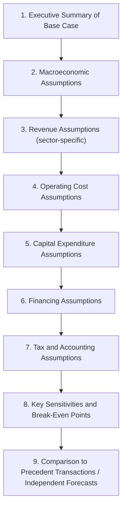
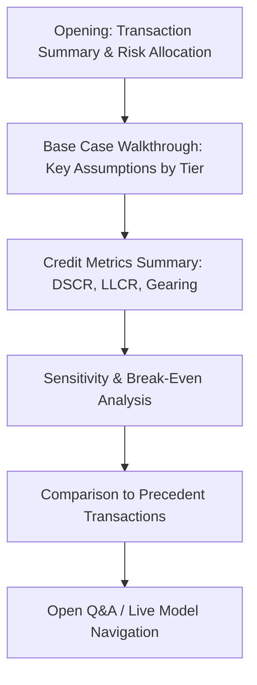

## Capstone: Presenting and Defending Model Assumptions

### Overview and Learning Objectives

A technically flawless project finance model has limited value if the modeler cannot articulate, justify, and defend the assumptions embedded in it. This capstone shifts focus from *building* the model (covered in the prior capstone) to the professional skill of *presenting* it — to an investment committee, a lender's credit committee, a rating agency, or in a due-diligence Q&A — and *defending* it under adversarial scrutiny.

By the end of this capstone, the modeler should be able to:

- Structure a model assumptions presentation (an "assumptions book" or "basis of preparation") that a third party can independently evaluate
- Distinguish between assumptions that are contractually fixed, market-derived, and judgment-based, and present each appropriately
- Anticipate and prepare responses to the standard adversarial questions lenders' and rating agencies' advisors ask
- Use sensitivity and break-even analysis as a defense tool, not just an output
- Recognize and avoid common credibility failures (unsupported precision, cherry-picked comparables, hidden aggressiveness)
- Run a mock defense session against a structured challenge framework

### Why This Skill Matters

**Key Points**

- In real transactions, the model itself is rarely the final deliverable — a **model audit** by an independent technical/financial advisor, and a **credit committee presentation**, sit between the model build and financial close
- Lenders' financial advisors and rating agencies do not simply accept assumptions at face value; they benchmark every material input against comparable transactions, market data, and their own house view
- A modeler who cannot explain *why* an assumption was chosen (as opposed to merely *what* the assumption is) signals either insufficient diligence or an attempt to mask aggressiveness — both erode credibility and can delay or derail financial close
- The strongest defense of a model is not a perfect answer to every question, but a demonstrable, disciplined **process** for how each assumption was derived and stress-tested

### Categorizing Assumptions by Defensibility Type

Not all assumptions are defended the same way. A disciplined presentation separates them into three tiers:

| Tier | Definition | Example (toll road) | How to Defend |
| --- | --- | --- | --- |
| **1. Contractually Fixed** | Set out explicitly in a binding contract | Toll escalation formula (CPI-linked, per concession agreement) | Cite the specific contract clause; no judgment involved |
| **2. Market-Derived** | Sourced from external, verifiable market data | Interest rate curve, inflation forecast, comparable transaction multiples | Cite the source (Bloomberg, IMF WEO, precedent transaction) and vintage/date of the data |
| **3. Judgment-Based** | Requires the modeler's or sponsor's professional estimate | Traffic growth rate beyond the traffic consultant's forecast horizon, opex escalation beyond contract term | Show the range of reasonable views, name the methodology, and stress-test the sensitivity |

**Presentation discipline**: Every assumption in the model's assumptions book should be tagged with its tier. Tier 1 assumptions require no defense beyond a citation. Tier 3 assumptions require the most preparation, because this is where adversarial questioning concentrates.

### Structuring the Assumptions Book

A professional assumptions book (sometimes called a "Basis of Preparation" document) typically follows this structure:

Each section should answer three questions for every material input: **What is the assumption? Where did it come from? What happens if it's wrong?** A section that only answers the first question invites the sharpest adversarial follow-up.

### Anticipating the Standard Adversarial Question Set

Experienced credit committee members and lenders' advisors tend to probe the same categories of weakness across every sector. A well-prepared modeler rehearses responses to each category in advance.

**1. "Why this number and not a more conservative one?"**

Applies to any judgment-based input (traffic growth, occupancy ramp-up, escalation rate). The strongest answer references an independent third-party study (e.g., a traffic consultant's report, a market study) rather than the sponsor's own optimism, and shows where the chosen figure sits relative to that study's range (e.g., P50 vs. P90 case).

**2. "What is your downside case, and does the deal still work?"**

This is effectively a request to demonstrate the break-even/sensitivity analysis live. The modeler should have the minimum DSCR under a defined downside scenario (e.g., -15% revenue, +10% capex) memorized or immediately retrievable, not calculated live under pressure.

**3. "How does this compare to comparable transactions?"**

Requires the modeler to have benchmarked key metrics (gearing, DSCR, equity IRR, escalation assumptions) against 2–4 genuinely comparable precedent deals *before* the meeting — not to search for comparables reactively during the session.

**4. "What happens if [external factor] changes?"**

Tests whether the model's sensitivity architecture (built in the prior capstone) can actually answer the question live — e.g., "What if the base rate rises 200bps before financial close?" A model without a live-linked interest rate sensitivity toggle forces an embarrassing "we'll get back to you."

**5. "Why is this assumption more/less aggressive than the base case in your last transaction?"**

Tests consistency across a sponsor's or advisor's transaction history. Genuine, well-justified differences (e.g., a different jurisdiction, different asset vintage) are fine; unexplained inconsistency damages credibility.

**6. "Show me where this number lives in the model and how it flows through."**

A live "trace the formula" request. The modeler must be able to navigate directly to the assumption cell and demonstrate the downstream linkage (e.g., from the traffic growth assumption cell, through to revenue, to CFADS, to DSCR) without hesitation — this is why the color-coding and single-source-of-truth conventions from the model-build capstone matter operationally, not just aesthetically.

### Using Sensitivities as a Defense Tool

The break-even and sensitivity outputs built during model construction should be repurposed as the primary defense mechanism in a presentation, not treated as a secondary appendix.

**Break-even framing**: Rather than saying "our traffic assumption is reasonable," a stronger defense states: *"the deal clears minimum DSCR covenant even if traffic comes in 18% below our base case — a decline larger than any observed in comparable operating toll roads over a 5-year period."* This reframes the defense from "trust our number" to "the structure is robust across a wide range of outcomes including the number being wrong."

**Standard sensitivity defense table** (illustrative structure to present):

| Scenario | Key Variable Change | Minimum DSCR | Equity IRR | Covenant Breach? |
| --- | --- | --- | --- | --- |
| Base Case | — | 1.42x | 14.1% | No |
| Lender Case | Conservative haircut across revenue/cost drivers | 1.31x | 11.8% | No |
| Downside Case | -15% revenue, +10% opex | 1.18x | 7.2% | No (marginal headroom) |
| Break-Even | Revenue reduced until DSCR = covenant floor | 1.10x (covenant) | 2.4% | At threshold |
| Severe Stress | -25% revenue, +20% capex, +150bps rates | 0.94x | Negative | **Yes** |

Presenting the full spectrum — including the point at which the deal *does* break — is more credible than presenting only favorable scenarios, because it demonstrates the modeler understands and has quantified the deal's actual risk boundary rather than concealing it.

### Common Credibility Failures to Avoid

**Key Points**

- **Unsupported precision**: Presenting a traffic growth assumption as "3.24% per annum" without a source implies false rigor; round to a defensible level of precision matching the underlying data quality (e.g., "approximately 3%, per the independent traffic study's P50 case")
- **Cherry-picked comparables**: Selecting only precedent transactions that support the chosen assumption while omitting less favorable comparables — sophisticated reviewers typically already know the full comparable set and will notice the omission
- **Hidden aggressiveness via compounding**: Each individual assumption looking "reasonable" in isolation, but the base case as a whole sitting at an aggressive percentile once all assumptions are combined (e.g., high-end traffic growth + low-end opex + long ramp-up + high-end residual value simultaneously) — reviewers often build a composite "reasonableness" view precisely to catch this
- **Static sensitivities that don't actually recalculate live**: If a sensitivity table is hardcoded or pasted as values rather than formula-driven, an adversarial reviewer's live "what if we change X" question cannot be answered on the spot — undermining confidence in the whole exercise
- **Confusing "the model shows X" with "X is true"**: A defensible presentation is explicit that the model output is a function of the input assumptions, not an independent proof that those assumptions will occur — overclaiming certainty invites the sharpest pushback

### Structuring the Live Presentation

**Recommended flow for a credit committee or lender presentation**:

**Preparation checklist before presenting**:

- [ ] Every Tier 3 (judgment-based) assumption has a named source or methodology, not just a number
- [ ] The downside case and break-even point are pre-calculated and can be recited without opening the model
- [ ] At least 2–3 genuine precedent transaction comparables are prepared for the key metrics (gearing, DSCR, IRR, escalation)
- [ ] The model's sensitivity toggles are tested and confirmed to actually recalculate live before the meeting, not just in theory
- [ ] A one-page summary of "what breaks the deal" is prepared, showing the precise combination of adverse factors required to breach covenants
- [ ] Every team member presenting can navigate directly to any assumption cell and trace it through to DSCR without searching

### Mock Defense Exercise Framework

A useful capstone exercise structure for practicing this skill: assign one team member to present the base case, and 2–3 others to role-play as an adversarial lender's advisor, rating agency analyst, or skeptical investment committee member, using this structured challenge sequence:

1. **Opening softball**: "Walk me through your top three assumptions." (Tests whether the presenter has correctly identified which assumptions are actually material to DSCR, versus getting lost in less important detail.)
2. **Source challenge**: "Where did [specific judgment-based number] come from?" (Tests Tier 3 defense readiness.)
3. **Comparable challenge**: "How does that compare to [named precedent transaction]?" (Tests benchmarking preparation.)
4. **Live stress test**: "Increase [variable] by X% — what happens to DSCR?" (Tests whether the model's sensitivity architecture is genuinely live.)
5. **Compounding challenge**: "If I combine your most optimistic revenue assumption with your most optimistic cost assumption, where does that put us relative to precedent?" (Tests awareness of hidden aggressiveness.)
6. **Closing challenge**: "What would have to be true for this deal to fail?" (Tests whether the presenter has genuinely internalized the break-even point, not just calculated it once and forgotten it.)

### Assumption Defensibility Framework Illustration (svg_diagram)

<svg xmlns="http://www.w3.org/2000/svg" viewBox="0 0 720 400" font-family="Arial, sans-serif">
<text x="360" y="24" text-anchor="middle" font-size="16" font-weight="bold" fill="#1a1a1a">Assumption Defensibility Pyramid (svg_diagram)</text>
<polygon points="360,50 480,150 240,150" fill="#2ca02c" />
<text x="360" y="110" text-anchor="middle" font-size="12" fill="#fff">Tier 1</text>
<text x="360" y="128" text-anchor="middle" font-size="11" fill="#fff">Contractually Fixed</text>
<polygon points="240,150 480,150 540,250 180,250" fill="#f58518" />
<text x="360" y="205" text-anchor="middle" font-size="12" fill="#fff">Tier 2</text>
<text x="360" y="223" text-anchor="middle" font-size="11" fill="#fff">Market-Derived</text>
<polygon points="180,250 540,250 620,360 100,360" fill="#e45756" />
<text x="360" y="310" text-anchor="middle" font-size="12" fill="#fff">Tier 3</text>
<text x="360" y="328" text-anchor="middle" font-size="11" fill="#fff">Judgment-Based</text>

<text x="580" y="115" font-size="10" fill="#333">Cite contract clause</text>

<line x1="490" y1="115" x2="575" y2="115" stroke="#333" stroke-width="1" />

<text x="580" y="205" font-size="10" fill="#333">Cite source + date</text>

<line x1="545" y1="205" x2="575" y2="205" stroke="#333" stroke-width="1" />

<text x="580" y="310" font-size="10" fill="#333">Show range + stress-test</text>

<line x1="625" y1="310" x2="575" y2="310" stroke="#333" stroke-width="1" />

<text x="360" y="385" text-anchor="middle" font-size="11" fill="#555">Adversarial scrutiny concentrates disproportionately on the widening Tier 3 base</text>

</svg>

### Worked Example: Defending a Traffic Growth Assumption

**Weak defense** (fails under scrutiny): *"We assumed 3% annual traffic growth because that felt appropriate for a growing region."*

**Strong defense** (structured per the framework above): *"Our base case assumes 2.8% annual traffic growth. This is sourced from [Traffic Consultant]'s independent P50 forecast, which itself is derived from regional GDP growth projections and a demand-elasticity model calibrated against three comparable toll roads opened in the past decade in similar-density corridors. Our lender case applies the same consultant's P75 (more conservative) forecast of 2.1%, which is the figure actually used for debt sizing. At our covenant floor of 1.10x minimum DSCR, traffic would need to underperform the P50 base case by approximately 18% cumulatively over the first five years — a decline not observed in any of the three comparable openings we benchmarked, the worst of which underperformed its own consultant forecast by 11%."*

This strong defense demonstrates: a named source (Tier 2/3 hybrid), the specific case actually used for sizing (lender case, not base case), a quantified break-even point, and a benchmark against real precedent — addressing five of the six adversarial challenge categories in a single answer.

### Common Pitfalls in Presenting Assumptions

- **Presenting only the base case** without showing the lender case or downside case invites immediate suspicion that the base case is the only case that "works"
- **Failing to distinguish which case was actually used for debt sizing** — sophisticated reviewers will specifically ask this, and an ambiguous answer damages credibility
- **Treating sensitivity analysis as a compliance checkbox** rather than as the core narrative of the defense — the sensitivity output should be presented as evidence of structural robustness, not filed as an appendix
- **Not rehearsing the live model navigation** — being unable to quickly locate and trace an assumption cell during a live session undermines confidence in the model's integrity, regardless of how sound the underlying number actually is
- **Overconfidence in judgment-based figures** — presenting a Tier 3 assumption with the same certainty as a Tier 1 contractual figure

**Next Steps**

- Prepare a full assumptions book for the capstone model built in the prior exercise, tagging every material input by tier
- Run the mock defense exercise with peers using the structured challenge sequence
- Benchmark your model's key credit metrics (DSCR, gearing, IRR) against at least three real precedent transactions in the relevant sector
- Practice live sensitivity navigation until any covenant-relevant "what if" question can be answered within the model in under 60 seconds
- Study how rating agencies (e.g., published project finance rating methodologies) structure their own assumption-scrutiny frameworks, as a model for anticipating institutional scrutiny
- Extend this skill to a written form: draft a one-page "Basis of Preparation" summary suitable for inclusion in an information memorandum