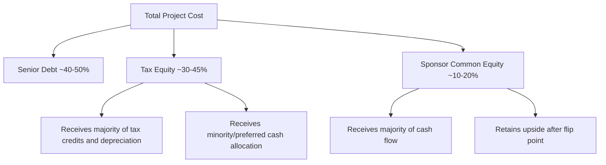

## What Tax Equity Is and Why It Exists

### Definition

Tax equity is a financing structure in which a taxable investor (the "tax equity investor") contributes capital to a project in exchange for the project's tax attributes — primarily tax credits and depreciation deductions — plus a share of cash flow, rather than for the project's operating cash flow alone. The developer or sponsor typically lacks sufficient tax liability to use these attributes efficiently and instead monetizes them by admitting an investor who can.

Tax equity is not debt and not common equity in the conventional sense. It is a hybrid ownership interest, usually structured as membership interests in an LLC taxed as a partnership, calibrated to allocate specific tax benefits to the party that can use them.

### Core Problem It Solves

Renewable energy and certain other qualifying projects (affordable housing, historic rehabilitation, carbon capture, etc.) generate valuable tax attributes that exceed what the project's income alone would let a typical developer absorb:

- **Investment Tax Credit (ITC)** or **Production Tax Credit (PTC)** under IRC §48 and §45 (and their technology-neutral successors §48E/§45Y post-Inflation Reduction Act)
- **Accelerated depreciation**, chiefly the Modified Accelerated Cost Recovery System (MACRS), often on a 5-year schedule for solar/wind assets
- **Bonus depreciation**, where applicable by placed-in-service year

A developer with limited taxable income cannot use large, front-loaded tax credits and depreciation losses — the value would go unused ("stranded") if held solely by the developer. A tax equity investor, typically a large financial institution, insurance company, or corporation with substantial tax liability, can absorb those benefits dollar-for-dollar against its own tax bill.

**Key Points**

- Tax attributes have real economic value but only to a party with sufficient tax appetite.
- Developers are frequently "tax-poor" relative to the scale of credits/depreciation their projects generate.
- Tax equity bridges this mismatch by separating economic ownership from tax-attribute allocation.
- Without tax equity markets, many capital-intensive, policy-incentivized projects would be materially more expensive to finance or would not get built.

### Why Tax Equity Exists — Historical and Policy Rationale

1. **Congressional intent to subsidize via the tax code rather than direct grants.** Since the Energy Tax Act of 1978 and subsequent extensions/expansions of the ITC and PTC, Congress has chosen indirect subsidy delivery through nonrefundable credits and accelerated depreciation instead of appropriated cash grants (with narrow exceptions, e.g., the temporary Section 1603 cash grant program, 2009–2011).
2. **Nonrefundability of credits.** Because the ITC/PTC are nonrefundable, they only have value against actual tax liability. A project owner with no tax liability gets zero value from a credit unless it can transfer that value to someone who has liability.
3. **Fragmented ownership of tax capacity.** Utility-scale developers are often project-finance vehicles, private equity-backed platforms, or independent power producers with thin consolidated tax positions, especially before achieving profitability at scale.
4. **Absence (historically) of transferability.** Prior to the Inflation Reduction Act of 2022, tax credits generally could not be sold directly; they had to be earned by a taxpaying owner of the underlying asset. This forced complex partnership structures (partnership flips, sale-leasebacks, inverted leases) as the primary mechanism to route benefits to taxpaying investors.
5. **IRA transferability (§6418) changes but does not eliminate tax equity.** Since 2023, eligible credits can be sold for cash to unrelated taxpayers. This created a parallel, often simpler, "transferability" market, but tax equity partnerships remain dominant for large wind/solar deals because they can also monetize depreciation (which is not transferable) and because partnership flips often produce better aggregate value than a credit sale alone.

### Why a Developer Prefers Tax Equity Over Just Borrowing More

- Tax equity is loss-absorbing, quasi-permanent capital that does not require repayment like debt; the investor's return comes from tax benefits plus a minority cash flow share.
- It reduces the amount of higher-cost common equity or additional leverage a sponsor needs.
- It allows the sponsor to retain long-term control and eventual full ownership (via a **buyout/flip** mechanism, discussed in later chapters).
- Depreciation cannot be transferred by sale the way tax credits now can; a partnership structure is typically the only way to monetize accelerated depreciation with an outside investor.

### Illustrative Capital Stack

### Simplified Value Illustration

Assume a $100 million solar project qualifying for a 30% ITC.

- Eligible basis for credit: $100,000,000
- ITC value: $100,000,000 × 0.30 = $30,000,000
- 5-year MACRS depreciation on roughly 85% of basis (after the standard ITC basis reduction of half the credit amount) generates further deductions sheltering taxable income for the investor.

$$\text{ITC} = \text{Eligible Basis} \times \text{Credit Rate}$$

If the developer has, say, only $5 million of annual taxable income against which to use credits and depreciation, it cannot efficiently absorb a $30 million credit plus several years of accelerated depreciation. A tax equity investor with $500 million+ of annual taxable income can use the full benefit immediately, which is why the credit's *present value* is highest when paired with an investor with ample, stable tax liability.

**Example**

A regional bank with $2 billion in annual pre-tax income partners with a solar developer. The bank contributes $35 million of the $100 million project cost. In exchange, it receives 99% of tax credits and depreciation losses in early years, plus roughly 2–5% of project cash distributions, until it reaches its contractually targeted after-tax yield (commonly 6–9% in competitive markets), at which point allocations "flip" so the sponsor receives the majority interest going forward.

### Who Participates as Tax Equity Investors

- Money-center and regional banks (historically dominant, e.g., large U.S. banks with significant tax appetite)
- Insurance companies
- Corporations with strong, stable taxable income seeking both financial return and ESG/decarbonization credit
- Government-sponsored entities and certain specialty finance funds

[Inference] The investor base has broadened somewhat since IRA transferability reduced the necessity of a full tax equity partnership for smaller deals, but large-scale wind and solar financings still rely heavily on traditional tax equity due to the value of pairing depreciation with credits.

### Distinguishing Tax Equity from Related Concepts

| Concept | What It Is | Relation to Tax Equity |
| --- | --- | --- |
| Tax credit transferability (§6418) | Direct cash sale of eligible credits to a third party | Alternative/complementary monetization path; doesn't transfer depreciation |
| Tax credit transfer via partnership flip | Investor earns credits by being a partner/owner | The core tax equity mechanism |
| Debt financing | Repayable capital, no tax attribute allocation | Sits senior to tax equity in capital stack |
| Sponsor/common equity | Residual ownership, retains most long-term upside | Junior, non-tax-attribute-focused capital |

### Common Legal Structures (Introduced Here, Detailed Later)

- **Partnership flip** (most common for wind/solar): investor and sponsor are partners in an LLC; allocations of income, loss, and credits "flip" from investor-favored to sponsor-favored once a target return is met.
- **Sale-leaseback**: developer sells the asset to an investor/lessor, who claims the ITC and depreciation, then leases the asset back to the developer/operator.
- **Inverted lease (lease pass-through)**: developer retains ownership but elects to pass the ITC through to a lessee-investor under IRC §50(d), while the developer keeps depreciation.

### Why This Matters for Project Economics

Tax equity typically reduces a project's blended cost of capital and can materially improve the levered, after-tax internal rate of return (IRR) for the sponsor, because it substitutes for more expensive common equity while monetizing benefits that would otherwise be worth little to the developer directly. Because tax equity pricing depends on investor competition, deal size, technology risk, and counterparty credit quality, the economic benefit is deal-specific.

[Unverified] Precise "typical" tax equity yields quoted in the market fluctuate with interest rates, IRA-driven supply/demand shifts, and competitive dynamics; specific numeric benchmarks should be checked against current market data at time of use rather than treated as fixed constants.

### Related Topics

- Investment Tax Credit (ITC) vs. Production Tax Credit (PTC) mechanics
- Partnership flip structures (fixed flip vs. yield-based flip)
- Sale-leaseback and inverted lease structures
- MACRS depreciation schedules for energy assets
- Section 6418 transferability market
- Depreciation recapture risk in tax equity deals
- Basis reduction rules under §50(c)
- Tax equity investor return metrics (target yield, flip point, IRR)
- Prevailing wage and apprenticeship requirements affecting credit rates post-IRA