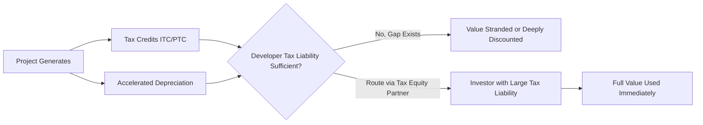

## The Tax Capacity Gap Between Developers and Investors

### Definition

The tax capacity gap refers to the structural mismatch between the entities that develop and own qualifying energy or incentive-eligible projects (typically project developers, sponsors, and independent power producers) and the amount of taxable income those entities have available to absorb the tax credits and depreciation deductions their projects generate. This gap is the fundamental economic driver behind the existence of the tax equity market.

### Why the Gap Exists

**Key Points**

- Developers are frequently structured as project-level special purpose vehicles (SPVs) or thinly capitalized platforms with little standalone taxable income.
- Many developers operate at a portfolio loss or breakeven for years while scaling, due to interest expense, depreciation on other assets, and reinvestment of cash into new development.
- Tax credits and depreciation are only valuable dollar-for-dollar against actual tax liability; a nonrefundable credit or a deduction in excess of income produces no current cash benefit — it must be carried forward.
- Investors (banks, insurers, large corporates) often have large, stable, recurring taxable income streams from unrelated business lines and can use the same attributes immediately at full value.

### The Mechanics of Mismatch

**1. Nonrefundability of tax credits**

The ITC and PTC (IRC §48/§45, and their post-2025 technology-neutral successors §48E/§45Y) are nonrefundable. If a taxpayer's liability is smaller than the credit generated, the excess does not come back as a refund — it carries forward (generally up to 20 years under IRC §39 for general business credits, subject to periodic legislative modification) or, if held past usable years, expires unused.

$$\text{Usable Credit Value} = \min(\text{Credit Generated}, \text{Current Tax Liability}) + \text{PV of Carryforward}$$

Because carried-forward value is discounted for time and carries risk of never being used, a credit is worth meaningfully less to a low-tax-liability developer than to a high-tax-liability investor who can use it immediately at full nominal value.

**2. Depreciation losses compound the mismatch**

Accelerated MACRS depreciation (5-year for most solar and wind property) front-loads large paper losses in the early years of a project. A developer with modest income cannot use these losses currently; they either go to a Net Operating Loss (NOL) carryforward (subject to the 80%-of-taxable-income limitation under IRC §172 for post-2017 NOLs) or sit unused.

**3. Portfolio-level tax position vs. project-level tax attributes**

Even a large developer with many operating projects may show consolidated losses because every new project it places in service generates fresh accelerated depreciation. Growth itself perpetuates the gap: the more a developer builds, the larger its aggregate tax losses become, even as the underlying assets are economically profitable on a cash basis.

**Example**

A developer places $200 million of wind assets in service in a single year. Under 5-year MACRS with bonus depreciation phase-down considerations, a large share of that basis may be deductible in year one. If the developer's total taxable income before this deduction is $10 million, the bulk of the depreciation benefit is stranded at the developer level — it cannot be used currently and its present value shrinks the longer it must be carried forward.

### Illustration of the Gap

### Quantifying the Gap Conceptually

A simplified way to express the effective value lost to a low-tax-capacity holder:

$$V_{\text{developer}} = \sum_{t=0}^{n} \frac{\min(A_t, L_t)}{(1+r)^t}$$

Where $A_t$ is the tax attribute available in year $t$, $L_t$ is the developer's tax liability capacity in year $t$, $r$ is the discount rate, and $n$ is the carryforward horizon. When $L_t \ll A_t$ in early years, $V_{\text{developer}}$ falls well short of the attribute's face value — this shortfall is the capacity gap, expressed in present-value terms.

By contrast, for an investor with $L_t \geq A_t$ in the year the attribute arises:

$$V_{\text{investor}} \approx A_t \quad (\text{full nominal value, undiscounted by carryforward risk})$$

The difference between $V_{\text{investor}}$ and $V_{\text{developer}}$ for the same attribute is the economic surplus that tax equity structures are designed to capture and share between the two parties.

### Why This Gap Persists Structurally

1. **Capital-intensity front-loads tax losses relative to cash income.** Renewable projects have high upfront capital cost and low ongoing taxable income (interest and depreciation shelter most operating income for years), which is precisely the profile that produces large-but-unusable-by-the-owner tax attributes.
2. **Developers are frequently pre-profit or growth-stage relative to their tax attributes.** Many are backed by private equity or infrastructure funds prioritizing growth and reinvestment over near-term consolidated taxable income.
3. **Corporate structure fragmentation.** Developers often hold each project in a separate SPV for financing and risk-isolation purposes, preventing attributes from one profitable project offsetting losses in another without complex consolidated return elections.
4. **Cyclicality and timing of income recognition.** Even profitable developers may have volatile or deferred income recognition that doesn't line up with the year credits/depreciation are generated.

### How the Gap Is Closed

- **Traditional tax equity partnerships** (partnership flip, sale-leaseback, inverted lease): route ownership economics so a high-tax-capacity investor is treated as earning the credits and deductions directly.
- **Direct pay election (IRC §6417)**: available to tax-exempt and governmental entities (not standard corporate developers), allowing them to receive a cash payment in lieu of a credit — solving the capacity gap for a specific class of owners.
- **Transferability (IRC §6418)**: allows an eligible taxpayer to sell certain credits for cash to an unrelated party, providing a more direct, less structurally complex closing of the gap for credits (though not depreciation).

[Inference] Transferability under §6418 narrows but does not eliminate the tax capacity gap's role in market structure, because depreciation — often the larger aggregate value driver in wind/solar deals — remains non-transferable and still requires either sufficient owner tax capacity or a partnership-based tax equity structure to be monetized.

### Comparative Snapshot

| Party | Typical Tax Liability Profile | Ability to Use Credits/Depreciation Directly |
| --- | --- | --- |
| Early/growth-stage developer | Low or negative consolidated taxable income | Poor — high risk of stranded or deeply discounted value |
| Diversified/mature developer | Moderate, project-dependent | Partial — some capacity but often insufficient for large pipelines |
| Bank/insurer/large corporate investor | High, stable, recurring | Strong — can use attributes at full value immediately |

### Practical Consequence for Deal Structuring

The size of the tax capacity gap directly affects how much of a project's ownership economics a sponsor must cede to attract tax equity. A wider gap (i.e., more valuable, less-usable-by-the-sponsor attributes relative to project cash flow) generally means the investor commands a larger share of allocations until its target yield is met, because the sponsor's alternative — using the attributes itself — is worth comparatively little.

[Unverified] The precise percentage allocations investors require to close a given capacity gap vary by market conditions, competition among tax equity providers, and project risk profile, and should be evaluated against current deal terms rather than assumed to be fixed.

### Related Topics

- Net Operating Loss (NOL) carryforward rules and the §172 80% limitation
- General business credit carryforward under IRC §39
- Direct pay election under §6417 for tax-exempt entities
- Transferability market under §6418
- Passive activity loss limitations affecting individual and closely-held investors
- Partnership flip allocation mechanics
- At-risk rules (IRC §465) and their interaction with tax equity investors
- Depreciation recapture exposure upon disposition