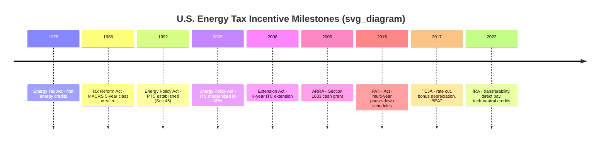

## History of United States Energy Tax Incentives Since 1978

### Overview

U.S. energy tax incentives have evolved through repeated cycles of creation, expiration, short-term extension ("extender" legislation), and structural overhaul since the late 1970s oil crises. This history explains both why current incentive mechanics look the way they do and why the tax equity market emerged as the dominant financing vehicle for monetizing them.

### 1978 – Energy Tax Act: The Starting Point

The Energy Tax Act of 1978, passed amid the oil crisis and stagflation, introduced the first modern federal tax incentives for energy conservation and renewable energy, including a residential energy credit and a business energy investment credit for solar, wind, and geothermal property. This established the precedent of using the tax code, rather than direct appropriations, as the primary policy lever for energy technology deployment.

**Key Points**

- Set the pattern of nonrefundable business energy credits tied to specific technologies.
- Created the conceptual ancestor of today's ITC.
- Motivated by energy security concerns (OPEC embargo aftermath), not primarily by climate policy.

### 1980s: Crude Oil Windfall Profit Tax Act and Early Volatility

The Crude Oil Windfall Profit Tax Act of 1980 extended and adjusted energy credits. Through the 1980s, incentives were subject to phase-downs and near-lapses as oil prices fell and energy security urgency diminished, foreshadowing the boom-bust legislative pattern that would define renewable tax policy for decades.

### 1986 – Tax Reform Act: Depreciation Overhaul

The Tax Reform Act of 1986 introduced the Modified Accelerated Cost Recovery System (MACRS), replacing the prior Accelerated Cost Recovery System (ACRS). MACRS assigned renewable energy property (solar, wind, geothermal, and later other qualifying technologies) to a 5-year recovery class — far shorter than the useful life of the underlying assets. This created the accelerated depreciation benefit that remains a core value driver in tax equity deals today.

[Inference] The interaction between 5-year MACRS and multi-decade-lived renewable assets is widely understood as an intentional subsidy mechanism, front-loading tax deductions well ahead of the economic depreciation of the asset.

### 1992 – Energy Policy Act: Birth of the Modern PTC

The Energy Policy Act of 1992 created the **Production Tax Credit (PTC)** under IRC §45, a per-kilowatt-hour credit for electricity generated from qualified wind and certain other renewable sources over the first 10 years of a facility's operation. Unlike the investment-based credit, the PTC rewards actual generation, aligning investor returns with operational performance.

$$\text{PTC Value} = \text{kWh Generated} \times \text{Credit Rate (inflation-adjusted)}$$

The PTC initially applied narrowly (largely wind and closed-loop biomass) and was set to expire — beginning a pattern of short-term lapses and retroactive renewals that persisted for roughly two decades.

### 1990s–2000s: The "Extender" Era

Following its 1992 creation, the PTC expired and was retroactively renewed multiple times — including lapses in 1999, 2001, and 2003–2004 — each followed by a scramble of legislative reinstatement. This volatility:

- Suppressed long-term investment planning, since developers could not reliably underwrite projects on credits that might not exist at completion.
- Contributed to boom-bust cycles in wind installation activity, with sharp declines in installation volume in years immediately following expiration.
- Reinforced reliance on financing structures (early tax equity deals) that could be assembled quickly once a credit was reinstated.

### 2005 – Energy Policy Act: ITC Modernization

The Energy Policy Act of 2005 significantly expanded and modernized the **Investment Tax Credit (ITC)** under IRC §48, raising the credit rate for solar to 30% for both business and residential property and establishing much of the statutory framework still recognizable today. This is widely regarded as the inflection point that made utility-scale solar tax equity financing commercially viable at scale.

### 2008–2009 – Financial Crisis Response

**Energy Improvement and Extension Act of 2008**

Extended the ITC for solar for eight years (through 2016), providing the first genuinely long-term policy horizon for solar investment, and expanded eligible technologies (fuel cells, small wind, combined heat and power).

**American Recovery and Reinvestment Act of 2009 (ARRA)**

Introduced the **Section 1603 Cash Grant Program**, allowing developers to elect a cash grant from Treasury in lieu of the ITC, for projects that began construction in 2009–2011 (later extended). This was a direct policy response to the 2008 financial crisis: with major tax equity investors (banks) suffering losses and lacking tax appetite, the traditional tax equity market nearly froze. The cash grant bypassed the tax capacity gap entirely for a temporary window.

[Fact] The 1603 program is widely cited as having kept renewable project financing viable during a period when the tax equity investor pool contracted sharply.

### 2015 – PATH Act: Multi-Year Certainty and Phase-Down Schedules

The Protecting Americans from Tax Hikes (PATH) Act of 2015 extended and began phasing down both the ITC and PTC on multi-year statutory schedules, replacing the pattern of last-minute annual extensions with predictable step-downs. This gave the tax equity market its first sustained period of policy visibility, supporting larger and more complex deal structures (e.g., multi-project portfolio flips).

### 2017 – Tax Cuts and Jobs Act (TCJA): Indirect but Significant Effects

The TCJA did not primarily target energy credits but had major indirect effects on tax equity:

- **Corporate tax rate reduction (35% → 21%)** reduced the value of a dollar of taxable income shelter, changing investor return math and credit/depreciation value calculations across the market.
- **100% bonus depreciation** (temporarily, with a scheduled phase-down) increased the size of the depreciation benefit available in placed-in-service years, though also raising the amount of value a low-tax-capacity developer could not use directly.
- **Base Erosion and Anti-Abuse Tax (BEAT)** created new considerations for how certain multinational tax equity investors could use credits, and led to specific structuring adjustments for some investor classes.

### 2022 – Inflation Reduction Act (IRA): Structural Transformation

The Inflation Reduction Act represents the most significant overhaul of energy tax incentives since 1992 and directly reshaped the tax equity market's structure:

**1. Extended and expanded ITC/PTC** with a 10-year runway and new adders:

- Base credit plus bonus amounts for domestic content, energy communities, and low-income community allocations.
- Prevailing wage and apprenticeship requirements to access the full (5x multiplier) credit rate for larger projects.

**2. Technology-neutral successor credits** — **§45Y (Clean Electricity PTC)** and **§48E (Clean Electricity ITC)** — replacing technology-specific §45/§48 for projects placed in service after 2024, applying to any generation facility with zero or negative greenhouse gas emissions rather than an enumerated technology list.

**3. Transferability (§6418)** — for the first time, most eligible credits can be sold for cash directly to unrelated taxpayers without requiring a partnership ownership structure, creating a parallel monetization path alongside traditional tax equity.

**4. Direct pay (§6417)** — allows tax-exempt entities, state/local governments, tribal governments, and certain other applicable entities to receive a cash payment equal to the credit amount, addressing the capacity gap for non-taxpaying owners for the first time.

**5. Expanded technology eligibility** — standalone energy storage, hydrogen production (§45V), sustainable aviation fuel, and clean fuel production credits (§45Z), among others, broadening the range of assets tax equity and transferability structures now finance.

### Why This History Matters for Tax Equity Structuring Today

- The **partnership flip structure** exists largely because, prior to 2023, there was no mechanism to sell credits directly — ownership had to be shared to share tax attributes.
- The **short-termism of pre-2015 policy** trained the market to build flexible, fast-to-execute deal structures capable of responding to sudden reinstatement.
- The **2008 crisis and Section 1603 program** demonstrated the tax equity market's vulnerability to investor-side tax capacity shocks, a risk still relevant when evaluating market depth today.
- The **IRA's transferability and direct pay mechanisms** now provide alternatives to full tax equity partnerships, but depreciation's continued non-transferability preserves demand for traditional structures in large wind/solar deals.

[Inference] The coexistence of transferability, direct pay, and traditional tax equity since 2023 is generally expected to segment the market by deal size and complexity — smaller or simpler projects may increasingly use straightforward credit sales, while large utility-scale wind/solar projects are likely to continue combining tax equity partnerships with transferability for optimal value, though the long-run equilibrium is still developing and should be assessed against current market practice.

### Related Topics

- Section 1603 cash grant mechanics and eligibility
- Technology-neutral credits: §45Y and §48E transition rules
- Prevailing wage and apprenticeship requirement compliance
- Domestic content, energy community, and low-income adders
- Section 6418 transferability transaction mechanics
- Section 6417 direct pay for tax-exempt and governmental entities
- Base Erosion and Anti-Abuse Tax (BEAT) interaction with tax equity investors
- Bonus depreciation phase-down schedule (2023–2027)