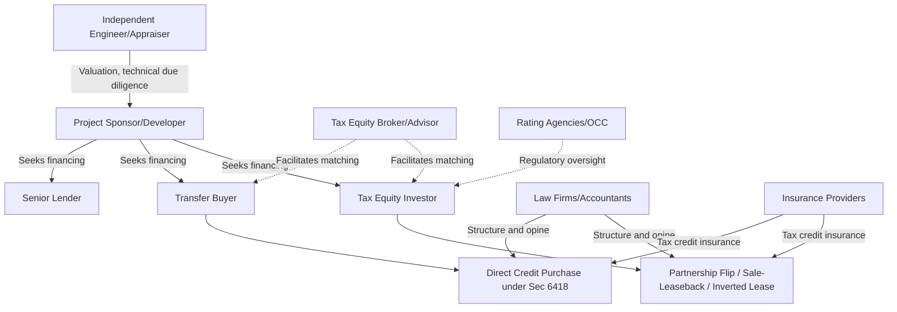

## Key Market Participants and Their Roles

### Overview

The tax equity market functions as an ecosystem of specialized participants, each performing a distinct function across origination, capital provision, structuring, risk allocation, and compliance. Since the 2022 Inflation Reduction Act (IRA) and the 2025 One Big Beautiful Bill Act (OBBBA), this ecosystem has both expanded (new investor types, transfer buyers) and tightened (stricter compliance and accelerated phaseout timelines), making participant roles more consequential than in earlier market cycles.

### Market Map

### 1. Project Sponsors / Developers

**Role**: Originate, construct, and operate the underlying energy asset; require outside capital because they typically lack sufficient tax capacity to use the credits and depreciation the project generates (see the tax capacity gap).

**Key Points**

- Range from large independent power producers (IPPs) to private equity-backed platforms to smaller regional developers.
- Responsible for construction completion, interconnection, permitting, and operational performance — the risks tax equity investors underwrite against.
- Typically retain the majority of long-term cash flow and ownership after the "flip" point in a partnership structure.

### 2. Traditional Tax Equity Investors

**Role**: Provide capital in exchange for tax credits, depreciation, and a minority/preferred share of cash flow, via partnership flip, sale-leaseback, or inverted lease structures.

**Composition**

Banks remain the dominant investor class. According to a 2026 ACORE survey, since 2020 domestic banking institutions have collectively invested approximately $93 billion in tax equity for energy projects, representing over 75% of the overall market. Regulatory clarity has supported bank participation: the Office of the Comptroller of the Currency codified rules in 2021 recognizing tax equity finance as the "functional equivalent of a loan" under 12 CFR §7.1025, enabling national banks to hold these investments directly within the bank rather than only at the holding-company level. [ACORE](https://acore.org/resources/the-risk-profile-of-tax-equity-investments-2026-edition/)[ACORE](https://acore.org/resources/the-risk-profile-of-renewable-energy-tax-equity-investments/)

Beyond banks, the investor base includes:

- **Insurance companies** — participants such as major carriers hold tax equity as a long-duration, tax-advantaged asset class matching their liability profiles. Major insurance company participants include large national and regional carriers alongside banks. [SolarTech](https://solartechonline.com/blog/solar-tax-equity-financing-guide/)
- **Large corporations with substantial tax liability** — increasingly participating directly, including technology companies seeking both tax benefit and decarbonization objectives. [SolarTech](https://solartechonline.com/blog/solar-tax-equity-financing-guide/)

**Example**

A large regional bank commits capital 18 months in advance of a project's commercial operation date, reflecting the long lead times typical of utility-scale wind and solar financings in the current market.

[Fact] Banks generally regard tax equity as a comparatively low-risk, loan-like asset class; a 2026 ACORE survey found that nearly all surveyed investors reported positive after-tax returns for both ITC and PTC investments that exited between 2020 and 2026, with negative-return outcomes concentrated in less than 2% of the banks' total portfolios. [ACORE](https://acore.org/resources/the-risk-profile-of-tax-equity-investments-2026-edition/)[ACORE](https://acore.org/resources/the-risk-profile-of-tax-equity-investments-2026-edition/)

### 3. Transfer Buyers (Post-IRA Market)

**Role**: Purchase eligible tax credits directly for cash under IRC §6418 transferability, without taking a partnership ownership interest or the associated depreciation benefit.

**Key Points**

- Broadened the pool of parties able to monetize credits beyond traditional tax equity investors, since transfer buyers do not need the structuring sophistication a partnership flip requires.
- Typically corporates with tax appetite but limited interest in the complexity, indemnities, or long-term partnership obligations of traditional tax equity.
- Pricing and risk allocation in transfer deals differ materially from partnership flips — buyers generally seek greater certainty and simpler recapture/indemnity protections.

[Inference] Because transferability cannot monetize depreciation, transfer buyers are generally understood to be a complement to, rather than full substitute for, traditional tax equity investors in large wind/solar deals, though smaller or simpler projects may increasingly rely on transfer sales alone.

### 4. Tax Equity Brokers and Financial Advisors

**Role**: Match sponsors with investors/buyers, run competitive processes, and structure term sheets. Advisory firms increasingly serve both traditional tax equity and transferability transactions given the market's bifurcation since 2023.

### 5. Insurance Providers (Tax Credit Insurance)

**Role**: Underwrite specific risks in tax equity and transfer transactions — recapture risk, credit qualification risk (e.g., prevailing wage/apprenticeship compliance, domestic content adder eligibility), and structuring risk — to give investors and buyers greater confidence in outcomes.

**Key Points**

- Tax credit insurance has become increasingly important as compliance scrutiny has intensified.
- Coverage typically responds if the IRS disallows or recaptures a credit due to a qualification failure, shifting that risk from the investor/buyer to the insurer (for a premium).

### 6. Law Firms and Tax Accountants

**Role**: Structure partnership agreements, render tax opinions (a near-universal requirement for large tax equity deals), and advise on compliance with prevailing wage, apprenticeship, domestic content, and energy community bonus credit requirements.

**Key Points**

- A "should" or "will" level tax opinion on the validity of the partnership allocations and credit eligibility is typically a closing condition for institutional tax equity investors.
- Increasingly central given intensified IRS scrutiny in 2025–2026: documentation, governance, and audit-readiness have become material transaction cost drivers.

### 7. Senior Lenders

**Role**: Provide construction and/or term debt senior to tax equity in the capital stack. Frequently the same institution provides both debt and tax equity on a single deal, reflecting an integrated relationship banking model. Developers rely on long-term commitments from banks to raise construction debt, in some cases from the same bank providing the tax equity. [ACORE](https://acore.org/resources/the-risk-profile-of-tax-equity-investments-2026-edition/)

### 8. Independent Engineers and Appraisers

**Role**: Provide third-party technical due diligence (performance projections, equipment risk) and independent valuations (particularly of fair market value for ITC basis purposes), both of which tax equity investors and transfer buyers rely on to underwrite and to support tax positions.

### 9. Regulators and Standard-Setters

**Role**: Shape the rules under which all other participants operate.

- **IRS/Treasury** — issue guidance on credit eligibility, prevailing wage/apprenticeship rules, transferability mechanics, and increasingly assertive audit posture.
- **OCC** — governs bank participation parameters (12 CFR §7.1025).
- **Bank capital regulators** — proposed Basel III Endgame capital rules have been a live concern for the market; under one 2025 proposal, banks with $100 billion or more in total assets would begin transitioning to a new capital framework on July 1, 2025, with full compliance by July 1, 2028, a change market participants have flagged as a potential constraint on bank tax equity capacity going forward. [Pivotal180](https://pivotal180.com/proposed-banking-rules-imperil-the-tax-equity-market/)

### Table: Participant Roles at a Glance

| Participant | Primary Function | Captures |
| --- | --- | --- |
| Sponsor/developer | Builds and operates asset | Majority long-term cash flow, residual ownership |
| Traditional tax equity investor | Provides capital for credits + depreciation + minority cash share | Tax credits, depreciation, target after-tax yield |
| Transfer buyer | Purchases credits for cash | Tax credits only (no depreciation, no ownership) |
| Broker/advisor | Matches sponsors and capital, runs process | Advisory fee |
| Insurer | Underwrites recapture/qualification risk | Premium |
| Law firm/accountant | Structures deal, issues tax opinion | Legal/advisory fee |
| Senior lender | Provides debt | Interest, fees, priority claim |
| Independent engineer/appraiser | Technical/valuation due diligence | Fee |
| Regulators | Set eligibility, capital, and compliance rules | N/A (oversight function) |

### Current Market Dynamics (2025–2026)

The market has been notably active but increasingly compliance-driven. Industry commentary describes 2026 as an inflection point: capital remains available, but only for transactions capable of withstanding heightened scrutiny, with developers, investors, lenders, and corporates adapting to stricter rules governing tax credit eligibility, ownership attribution, supply chains, and audit risk. Deal activity has also been shaped by statutory construction-start deadlines: market participants have described a rush to start construction and close financings around statutory deadlines, with one advisor noting 7,000 megawatts of wind projects and 63,000 megawatts of solar and storage projects financed in the preceding year, and continued strong activity with more than $7 billion in transactions closed by at least one major investor group. [Tax Credits & Transferability | Infocast +4](https://infocastinc.com/event/energy-tax-equity-credit-markets)

[Unverified] Specific dollar and megawatt figures cited in current market commentary reflect point-in-time reporting from individual firms and industry surveys; they should be treated as illustrative of market scale and direction rather than precise, universally applicable benchmarks.

### Related Topics

- Section 6418 transferability mechanics and buyer due diligence
- Tax credit insurance underwriting and claims process
- OCC 12 CFR §7.1025 and bank tax equity treatment
- Basel III Endgame capital rules and potential effects on bank tax equity supply
- Role of tax opinions in partnership flip closings
- Prevailing wage, apprenticeship, and domestic content compliance documentation
- OBBBA-driven phaseout timelines and construction-start deadlines
- Independent engineer reports and fair market value appraisals in ITC transactions