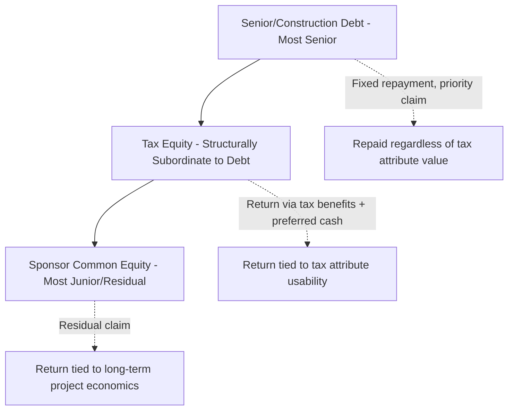
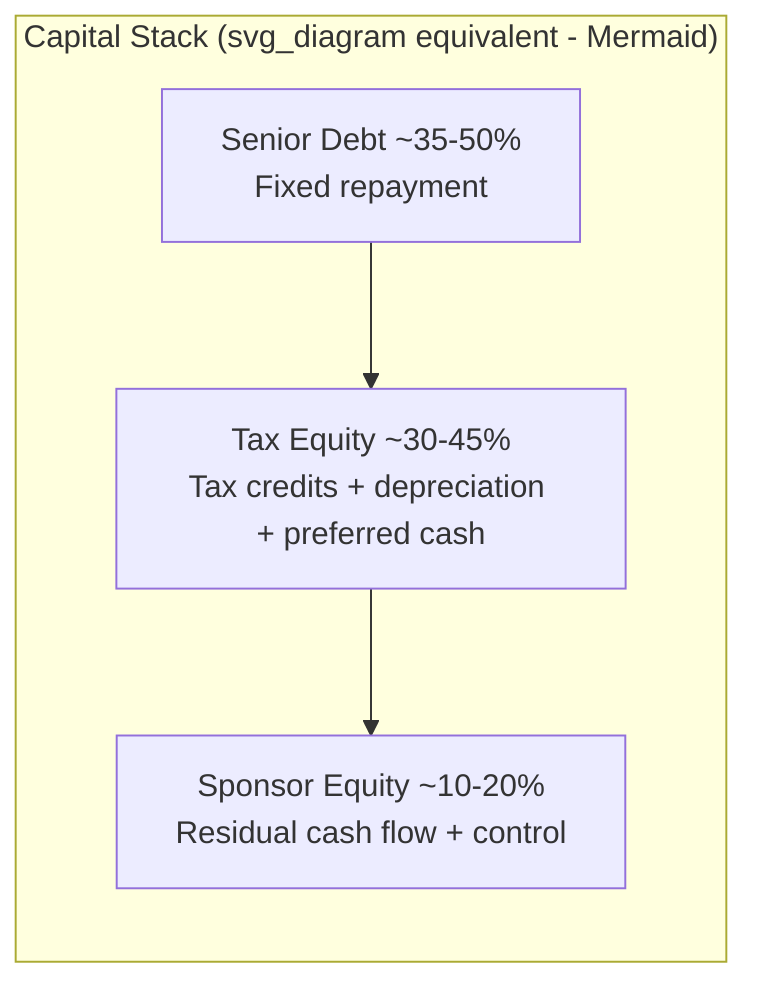

## Tax Equity Compared with Debt and Common Equity

### Overview

Tax equity occupies a distinct position in the project finance capital stack, sharing characteristics with both debt and common equity while remaining structurally and economically different from each. Understanding these distinctions clarifies why tax equity commands its own market, pricing conventions, and legal documentation separate from conventional financing instruments.

### Capital Stack Position

### Core Comparison Table

| Dimension | Debt | Tax Equity | Common Equity |
| --- | --- | --- | --- |
| Legal form | Loan/credit agreement | LLC membership interest (partner) | LLC membership interest (partner) |
| Repayment obligation | Contractual, must be repaid | No repayment; return via allocations | No repayment; return via allocations |
| Priority in cash flow | Senior — paid first | Subordinate to debt, senior to sponsor common in early years | Most junior/residual |
| Return source | Interest income | Tax credits, depreciation, minority cash share | Majority cash flow, appreciation, post-flip upside |
| Collateral/security | Typically secured by project assets | Generally unsecured; relies on partnership allocations | Unsecured; residual claim only |
| Tax treatment to provider | Interest income, no ownership/tax attributes | Direct owner of tax credits/depreciation via partnership | Direct owner of tax credits/depreciation via partnership |
| Typical provider | Commercial banks, institutional lenders | Banks, insurers, large corporates with tax appetite | Sponsors, infrastructure funds, private equity |
| Target return profile | Lowest (interest rate-based) | Mid-range, often expressed as after-tax IRR | Highest, reflecting residual/risk position |
| Duration | Fixed term, often 15-20 years | Until flip point reached (often 5-10 years) then declining role | Indefinite/ownership horizon |
| Risk if project underperforms | Protected by seniority and collateral | Risk to achieving target yield timeline; some structures include true-up mechanisms | Bears most downside risk |

### Why Tax Equity Is Not Debt

**Key Points**

- Tax equity investors are legal partners/members in the project entity, not creditors; they hold an ownership interest, not a claim to repayment.
- There is no principal amount that must be repaid; the "return" is a target after-tax yield achieved through allocated tax benefits and cash distributions.
- Tax equity is generally unsecured and does not have the same foreclosure rights a secured lender has upon default.
- However, tax equity investors typically negotiate protective provisions functionally similar to loan covenants (minimum performance thresholds, change-of-control consent rights, indemnities) because their return depends on the underlying asset performing as underwritten.

[Fact] Some tax equity commentary and regulatory treatment describe these investments as having "loan-equivalent" characteristics for certain purposes — for example, the Office of the Comptroller of the Currency has recognized bank tax equity investments as the functional equivalent of a loan under 12 CFR §7.1025 for national bank regulatory purposes — but this is a regulatory/economic characterization, not a change to the underlying legal form of a partnership ownership interest.

### Why Tax Equity Is Not Common Equity

**Key Points**

- Tax equity investors typically do not seek long-term ownership; their economic interest is structured to decline sharply after the "flip point" when they've achieved a contractually targeted return.
- Their return is heavily front-loaded around tax attributes (credits and depreciation), which are concentrated in the early years of a project's life, unlike common equity, which typically expects returns to build over the project's operating life.
- Tax equity investors generally negotiate a fixed or formulaic allocation percentage (e.g., 99% of tax benefits pre-flip) rather than open-ended participation in project upside.
- Common equity (the sponsor) retains control rights, decision-making authority over refinancing/sale, and the majority of long-term residual value — tax equity investors typically have consent rights over specific protective matters but not day-to-day control.

### Return Mechanics Comparison

**Debt** — return is straightforward interest income:

$$\text{Debt Return} = \text{Principal} \times \text{Interest Rate}$$

**Tax Equity** — return combines multiple components and is typically measured as an after-tax IRR to the investor:

$$\text{Tax Equity Target Yield} = f(\text{ITC/PTC value}, \text{Depreciation tax shield}, \text{Cash distributions until flip})$$

**Common Equity** — return is the residual after debt service and tax equity allocations:

$$\text{Sponsor Return} = \text{Total Project Cash Flow} - \text{Debt Service} - \text{Tax Equity Distributions}$$

**Example**

On a $150 million wind project with $60 million senior debt, $50 million tax equity, and $40 million sponsor common equity:

- The lender receives scheduled principal and interest regardless of the project's tax position.
- The tax equity investor receives approximately 99% of PTC value and depreciation losses in early years, plus a modest cash distribution, targeting a contractually negotiated after-tax IRR (commonly cited in market commentary as being in the high-single-digit to low-double-digit range, though this varies with market conditions).
- The sponsor receives the balance of cash flow and, after the investor's target yield is achieved (the flip point), the large majority of ongoing allocations going forward.

### Risk Allocation Differences

| Risk Type | Debt Holder Exposure | Tax Equity Investor Exposure | Common Equity Exposure |
| --- | --- | --- | --- |
| Construction/completion risk | Low (often funds post-completion, or has completion guarantees) | Moderate (delayed placed-in-service can delay credit timing) | High |
| Operating performance risk | Low (fixed debt service regardless, subject to default) | Moderate-High (affects timing of flip and cash allocations) | High |
| Tax law/recapture risk | None directly | High (central risk — ITC recapture, disqualification) | Low-Moderate (indirect, via investor relationship) |
| Credit/counterparty risk | Assessed on borrower | Assessed on partnership and sponsor | N/A — sponsor is the party |
| Interest rate risk | Direct (if floating) | Indirect (affects discount rate/yield calc) | Indirect |

[Inference] Tax equity's risk profile is often described by market participants as more similar to structured, loan-like credit risk than to conventional common equity risk, given its priority in tax benefit allocation and negotiated protective provisions — but it remains legally and economically distinct from debt because there is no unconditional repayment obligation.

### Why Sponsors Use All Three Simultaneously

**Key Points**

- **Debt** minimizes blended cost of capital by using the cheapest, most senior tranche available, secured by hard assets and cash flow.
- **Tax equity** monetizes tax attributes that the sponsor cannot efficiently use itself, effectively converting otherwise stranded value into upfront or ongoing capital.
- **Common equity** retains sponsor control and long-term upside while requiring the least amount of capital relative to the size of the project, since debt and tax equity together typically fund 60-85% of total project cost.

### Illustrative Layered Capital Stack

### Comparative Cost of Capital Intuition

Because tax equity monetizes attributes that would otherwise be worth little or nothing to the sponsor, its effective cost — from the sponsor's perspective — is often lower than raising an equivalent amount of additional common equity, even though the nominal target yield tax equity investors seek may appear comparable to or higher than a pure common equity return. This is because tax equity capital is funding value the sponsor could not otherwise capture at all.

$$\text{Effective Sponsor Cost of Tax Equity} < \text{Nominal Investor Target Yield}$$

when the counterfactual value of unused tax attributes to the sponsor approaches zero.

[Unverified] The magnitude of this effective cost advantage is deal-specific and depends on the sponsor's actual counterfactual tax position, current tax equity market pricing, and prevailing interest rates; it should not be treated as a fixed spread applicable across all transactions.

### Related Topics

- Partnership flip mechanics and flip-point calculation
- Sale-leaseback vs. inverted lease as alternatives to partnership flip
- Debt sizing and coverage ratios in project finance (DSCR)
- Depreciation recapture risk and its allocation between partners
- Tax equity investor protective provisions and consent rights
- After-tax IRR modeling for tax equity investments
- Section 6418 transferability as an alternative to traditional tax equity capital
- Construction and completion guarantees in project finance debt