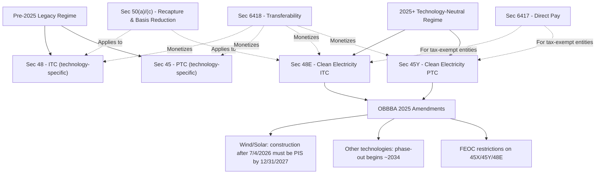

## Internal Revenue Code Provisions Governing Energy Credits

### Overview

Energy tax credits are governed by a dense set of Internal Revenue Code sections that have been repeatedly amended, most significantly by the Inflation Reduction Act of 2022 (IRA) and the One Big Beautiful Bill Act of 2025 (OBBBA). Current practice requires distinguishing "legacy" technology-specific provisions from the newer technology-neutral regime, and understanding how OBBBA accelerated phase-outs for wind and solar specifically while leaving other technologies on different timelines.

### Primary Credit-Generating Provisions

**§48 — Energy Investment Tax Credit (Legacy ITC)**

The original technology-specific investment credit, applicable to solar, geothermal, fuel cells, small wind, and other enumerated property types. Projects that began construction prior to 2025 may continue to fall under Section 48 rules even if placed in service later, subject to transition guidance.

**§45 — Renewable Electricity Production Tax Credit (Legacy PTC)**

The original technology-specific production credit for wind, biomass, geothermal, landfill gas, trash, qualified hydropower, marine and hydrokinetic, and (following IRA reinstatement) solar, extended through 2024 for facilities beginning construction by that year.

**§48E — Clean Electricity Investment Credit (Technology-Neutral ITC)**

Effective for facilities placed in service after 2024, §48E replaced §48 with a technology-neutral standard: any facility generating electricity with zero or negative greenhouse gas emissions qualifies, rather than an enumerated technology list. The base credit can range up to 30%, with additional bonus adders potentially raising realized value further (in some cited cases into significantly higher combined ranges) depending on prevailing wage/apprenticeship compliance and bonus adder stacking.

**§45Y — Clean Electricity Production Credit (Technology-Neutral PTC)**

The production-based counterpart to §48E, providing a base rate of 0.3 cents per kWh, rising to 1.5 cents per kWh (adjusted for inflation) if prevailing wage and apprenticeship requirements are met, over the first 10 years of a qualifying facility's operation.

$$\text{45Y Credit} = \text{kWh Generated} \times \text{Rate (0.3¢ base or 1.5¢ with PWA compliance, inflation-adjusted)}$$

**Key Points**

- Both §48E and §45Y took effect January 1, 2025, following IRA design and Treasury/IRS final rules published effective December 12, 2024.
- The technology-neutral credits were originally designed to extend through 2032, or until certain national emissions targets were met, whichever came first — before OBBBA materially compressed this timeline for wind and solar specifically.

### OBBBA's Impact on §45Y and §48E (2025 Amendments)

The One Big Beautiful Bill Act, enacted July 4, 2025, significantly accelerated the phase-out of §45Y and §48E specifically for wind and solar facilities:

- Wind and solar facilities that begin construction after July 4, 2026 must be placed in service by December 31, 2027 to remain eligible.
- Facilities using other qualifying technologies (e.g., certain storage, geothermal, hydropower, advanced nuclear) generally follow a different, later phase-out beginning construction restrictions around 2034, with a two-year phase-down.
- A July 7, 2025 executive order directed Treasury to strictly enforce the termination of §45Y/§48E credits for wind and solar, instructing issuance of new and revised guidance, which market participants expect to result in stricter interpretation of "beginning of construction" and other qualification standards than under prior practice.
- The IRS issued Notice 2025-42 to implement the OBBBA-mandated phase-out, addressing beginning-of-construction rules in detail, including treatment of physical work tests and equipment relocation scenarios.

[Fact] Guidance following OBBBA emphasizes that taxpayers should expect the IRS to strictly interpret the OBBBA phase-outs, and that physical work and continuity documentation will be essential to preserving eligibility for projects seeking to qualify under pre-cutoff construction-start dates.

### Foreign Entity of Concern (FEOC) Restrictions

OBBBA introduced new restrictions denying credits under §45X, §45Y, and §48E (among others) to taxpayers that receive "material assistance" from, or have specified ties to, certain foreign entities — including entities connected to China, Russia, North Korea, or Iran. These restrictions generally apply to taxable years beginning after July 4, 2025, and require developers and investors to carefully review ownership and supply-chain structures.

[Inference] Because FEOC compliance depends on detailed supply-chain and ownership analysis that varies project-by-project, tax equity investors and transfer buyers are likely to require enhanced diligence and representations on this point going forward, though specific documentation standards continue to be clarified through Treasury guidance.

### Structural and Mechanical Provisions

**§50 — Other Rules Relating to Investment Credit**

- §50(a): Recapture rules, clawing back ITC value on early disposition or disqualification within the recapture period.
- §50(c): Basis reduction, requiring depreciable basis to be reduced by 50% of the ITC claimed.
- §50(d): Basis for lessors and rules enabling lease pass-through (inverted lease) structures.

**§168 — MACRS Depreciation**

Establishes the Modified Accelerated Cost Recovery System, assigning most solar and wind property to a 5-year recovery class, producing the accelerated depreciation benefit central to tax equity economics.

**§704(b) — Partner's Distributive Share**

Governs whether special partnership allocations (e.g., a disproportionate share of tax credits to the investor) will be respected for tax purposes, requiring "substantial economic effect" as defined in the accompanying Treasury Regulations.

### Monetization Mechanism Provisions (Post-IRA)

**§6418 — Transfer of Certain Credits**

Allows an eligible taxpayer to sell certain tax credits, including §45 and §48E/§45Y credits, for cash to an unrelated taxpayer, without transferring ownership of the underlying project.

**§6417 — Elective Payment (Direct Pay)**

Allows tax-exempt organizations, state and local governments, tribal governments, and certain other applicable entities to elect a direct cash payment from the IRS equal to the value of the credit, addressing the tax capacity gap for non-taxpaying owners.

### Related and Complementary Credit Provisions

| Section | Credit | Notable Status Post-OBBBA |
| --- | --- | --- |
| §45Q | Carbon oxide sequestration | OBBBA created credit parity between secure storage and repurposed carbon use |
| §45U | Zero-emissions nuclear production | Unaffected by OBBBA cuts; remains transferable |
| §45V | Clean hydrogen production | Subject to accelerated phase-out under OBBBA |
| §45X | Advanced manufacturing production | Subject to accelerated phase-out and FEOC restrictions under OBBBA |
| §45Z | Clean fuel production | Distinct timeline; subject to its own OBBBA modifications |
| §179D | Energy efficient commercial buildings deduction | Terminates for property beginning construction after June 30, 2026 |
| §25C / §25D | Residential energy credits | Terminated for property placed in service/expenditures after Dec. 31, 2025 |

### Credit Architecture Diagram

**Example**

A solar developer begins physical work of a significant nature on a project in early 2026, intending to qualify under §48E before the OBBBA-accelerated cutoff. To preserve eligibility, the developer must satisfy the beginning-of-construction standards clarified in IRS Notice 2025-42, document continuous construction efforts, and place the facility in service by December 31, 2027 if construction begins after July 4, 2026 — otherwise risk losing eligibility entirely under the compressed post-OBBBA timeline.

[Unverified] The precise scope and documentation standards for beginning-of-construction and FEOC compliance continue to be shaped by evolving Treasury and IRS guidance; specific project qualification determinations should be verified against the most current regulatory guidance at the time of the transaction rather than treated as settled based on any single notice.

### Related Topics

- IRS beginning-of-construction safe harbors and physical work test standards
- Foreign Entity of Concern (FEOC) compliance and material assistance rules
- Prevailing wage and apprenticeship requirements under §45Y/§48E
- Domestic content, energy community, and low-income community bonus adders
- Section 50(a) recapture triggering events and cure periods
- Comparing legacy §45/§48 transition rules to technology-neutral §45Y/§48E
- Section 45Q carbon capture credit mechanics
- Treasury guidance timeline following OBBBA enactment