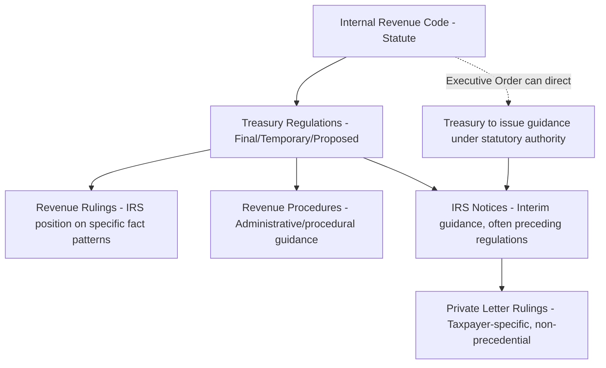

## Treasury Regulations, Notices, and Revenue Rulings

### Overview

Beyond the Internal Revenue Code itself, the operative rules that determine how tax equity deals are actually structured and how credits are actually claimed come from a hierarchy of sub-statutory guidance: final and proposed Treasury Regulations, IRS Notices, Revenue Procedures, and Revenue Rulings. In the current environment, this layer of guidance has become unusually consequential and fast-moving, particularly following the 2025 One Big Beautiful Bill Act (OBBBA).

### Hierarchy of Authority

**Key Points**

- Final and temporary Treasury Regulations carry the strongest legal weight, generally treated as authoritative interpretations of the statute unless successfully challenged in court.
- IRS Notices often serve as interim guidance, sometimes preceding formal regulations by months or years, and are heavily relied upon in practice even though they carry somewhat less formal weight than final regulations.
- Revenue Rulings address the IRS's position on how the law applies to a specific, often illustrative, fact pattern and provide precedent taxpayers can generally rely upon in similar situations.
- Revenue Procedures set out administrative and procedural requirements (e.g., how to make an election, required documentation).
- Private Letter Rulings are taxpayer-specific and technically non-precedential, but are frequently studied by practitioners for insight into IRS thinking.

### Foundational "Beginning of Construction" Guidance (Pre-IRA Era)

Long before the IRA or OBBBA, the IRS established the two-pronged test still central to energy credit qualification, via Notice 2013-29 and Notice 2018-59:

- **Physical Work Test** — construction begins when physical work of a significant nature starts, either on-site or off-site (e.g., manufacturing of custom components).
- **5% Safe Harbor** — construction is deemed to begin when a taxpayer pays or incurs 5% or more of the total cost of the facility.

Notice 2022-61 subsequently addressed prevailing wage and apprenticeship requirement implementation following the IRA.

### Section 45Y/48E Final Regulations (January 2025)

Treasury and the IRS published final regulations for the Clean Electricity Production Credit (§45Y) and Clean Electricity Investment Credit (§48E), effective December 12, 2024, and appearing in the Federal Register on January 15, 2025 (90 FR 4006). Sections 1.45Y-2 and 1.48E-2 of these regulations clarify the definition of a "qualified facility" for purposes of each credit. Separately, §45Y(b)(2)(C)(i) requires Treasury to annually publish a table of greenhouse gas emissions rates for facility types, which the IRS did in Revenue Procedure 2025-14, listing both wind and solar facilities as qualifying zero-emissions technologies.

### IRS Notice 2025-42 — The Central Post-OBBBA Guidance Document

Following OBBBA's enactment on July 4, 2025, and a July 7, 2025 executive order directing Treasury to strictly enforce accelerated termination provisions for wind and solar, the IRS released Notice 2025-42 on August 15, 2025, addressing beginning-of-construction (BOC) requirements specifically for wind and solar facilities under §45Y and §48E.

**Key Changes Made by Notice 2025-42**

- **Elimination of the 5% Safe Harbor** for most wind and solar facilities — this had been a longstanding, objective, and heavily relied-upon method for establishing a construction-start date.
- **Retention of a narrow 5% Safe Harbor carve-out** for "low-output solar facilities," defined as solar facilities with maximum net output not exceeding 1.5 MW (AC), measured on an interconnection-point basis, with integrated-operations aggregation rules to prevent artificial project-splitting.
- **Retention of the Physical Work Test** as the primary remaining path for larger wind and solar projects to establish beginning of construction, including allowance for off-site physical work (e.g., manufacturing of a facility's power conditioning equipment or transformers) to count toward the test.
- **Effective date**: the Notice applies prospectively to projects that had not already begun construction under the pre-existing (pre-IRA) notices before September 2, 2025.
- The Notice largely adopts the pre-IRA beginning-of-construction framework from Notices 2013-29 and 2018-59, rather than creating an entirely new standard, but narrows its practical application for wind and solar by removing the more administratively convenient safe harbor.

**Example**

A 50 MW solar project that previously could have established beginning of construction by simply incurring 5% of total project costs before a deadline must now instead demonstrate physical work of a significant nature — such as beginning construction of a project substation or manufacturing custom racking components — a standard that is inherently more fact-intensive and harder to document with certainty than a cost threshold.

### Statutory Deadlines Set by OBBBA and Clarified by Notice 2025-42

| Scenario | Placed-in-Service / Construction Requirement |
| --- | --- |
| Wind/solar construction begins before July 5, 2026 | May qualify for full §45Y/§48E credits with no hard placed-in-service deadline tied to this provision, so long as continuity is maintained |
| Wind/solar construction begins after July 4, 2026 | Must be placed in service by December 31, 2027 to remain eligible |
| Other technologies (storage, nuclear, hydropower, fuel cells, hydrogen, carbon capture) | Not directly affected by Notice 2025-42; follow separate, generally later phase-out timelines under OBBBA (into the 2034 range) |

[Fact] Notice 2025-42's changes apply only to wind and solar; other clean electricity technologies eligible under §45Y/§48E are explicitly not affected by this particular guidance document, and continue to be governed by the broader existing beginning-of-construction framework.

### Subsequent Litigation Development: Oregon Environmental Council v. IRS

A court decision in *Oregon Environmental Council v. Internal Revenue Service* subsequently affected the practical application of Notice 2025-42's BOC framework, reportedly restoring a key method (the 5% Safe Harbor) that many developers had relied on prior to the Notice, for purposes of establishing beginning of construction. Following this ruling, taxpayers have reportedly been able to rely on either the Physical Work Test or the Five Percent Safe Harbor to establish beginning of construction for §45Y/§48E purposes.

[Unverified] The scope, finality, and durability of the *Oregon Environmental Council* decision's effect on Notice 2025-42 — including whether it applies nationally, whether it will be appealed, and whether Treasury will issue further guidance in response — were still developing as of mid-2026 reporting and should be verified against the most current guidance and case status before being relied upon for a specific transaction.

### Why This Guidance Layer Matters for Tax Equity Deals

**Key Points**

- Beginning-of-construction determinations are frequently the single most consequential fact question in a tax equity closing, since they determine which statutory credit regime, phase-out schedule, and rate apply to a project.
- The loss of the 5% Safe Harbor as an objective, easily-documented test increases diligence burden and legal opinion complexity for tax equity investors, since the Physical Work Test requires a facts-and-circumstances judgment about whether work performed was "of a significant nature."
- Treasury retains authority to issue further guidance; the framework governing wind and solar BOC in particular has already changed multiple times within a short window (statute → executive order → Notice 2025-42 → litigation development), and market participants generally treat this area as unusually fluid.
- Tax opinions supporting tax equity closings must be updated to reflect the most current operative guidance, since an opinion premised on an outdated BOC standard could expose the investor to disallowance risk.

### Related Topics

- Physical Work Test documentation practices and evidentiary standards
- The now-narrowed 5% Safe Harbor and its low-output solar carve-out
- Continuity requirements following beginning of construction
- Foreign Entity of Concern (FEOC) guidance development post-OBBBA
- Revenue Procedure 2025-14 greenhouse gas emissions rate tables
- Litigation risk and *Oregon Environmental Council v. IRS* developments
- Prevailing wage and apprenticeship guidance under Notice 2022-61
- Private letter ruling practice in energy tax credit qualification