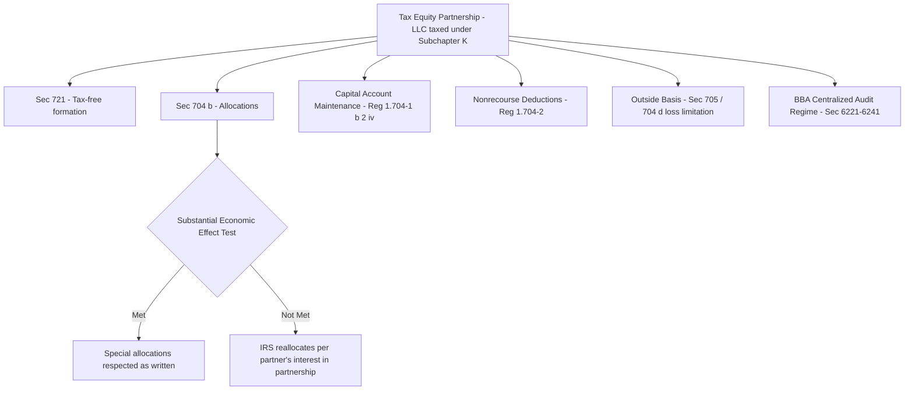

## Partnership Taxation Fundamentals Under Subchapter K

### Overview

Subchapter K of the Internal Revenue Code (IRC §§701–777) governs the taxation of partnerships and is the statutory foundation underlying virtually every tax equity structure. Because nearly all tax equity deals are structured as LLCs taxed as partnerships (rather than as corporations or disregarded entities), Subchapter K's allocation, basis, and distribution rules directly determine whether a deal's intended tax outcomes will actually be respected by the IRS.

### Core Conceptual Framework

**Key Points**

- A partnership is generally not itself a taxpayer; it is a "pass-through" entity. Income, loss, deductions, and credits are computed at the partnership level but taxed to the partners individually, in proportion to their allocated shares.
- Because tax equity structures depend on allocating a disproportionate share of tax credits and depreciation to the investor (relative to its cash investment), Subchapter K's rules on whether such special allocations will be respected are central to deal viability.
- The partnership itself files an informational return (Form 1065) and issues each partner a Schedule K-1 reporting that partner's allocated share of income, loss, deductions, and credits.

### Partnership Formation — §721

Under IRC §721, generally no gain or loss is recognized when a partner contributes property (including cash) to a partnership in exchange for a partnership interest. This nonrecognition rule allows a developer to contribute a project (or its equity interest in a project-owning entity) and an investor to contribute cash, without triggering an immediate taxable event on formation.

### Partner's Distributive Share — §704(a) and §704(b)

**§704(a)** establishes the general rule: a partner's distributive share of income, gain, loss, deduction, or credit is determined by the partnership agreement.

**§704(b)** provides the critical limitation: if the allocation under the partnership agreement does not have **substantial economic effect**, the partner's distributive share is instead determined in accordance with the partner's interest in the partnership (a facts-and-circumstances IRS-imposed reallocation) — which could unravel the very allocation the deal was structured to achieve.

$$\text{Allocation Respected} = \begin{cases} \text{As stated in agreement} & \text{if Substantial Economic Effect test met} \\ \text{Reallocated per "partner's interest in the partnership"} & \text{if not met} \end{cases}$$

### The Substantial Economic Effect Test (Treas. Reg. §1.704-1(b))

This is the single most consequential regulatory standard for tax equity structuring, since it determines whether the investor's outsized share of tax credits and depreciation will be respected.

**Two-Part Test**

1. **Economic Effect** — generally requires that:
   - Capital accounts are maintained in accordance with the regulations.
   - Liquidating distributions are made in accordance with positive capital account balances.
   - Any partner with a deficit capital account balance upon liquidation is unconditionally obligated to restore that deficit (a Deficit Restoration Obligation, or DRO) — or the "alternate test for economic effect" applies via a qualified income offset provision instead.
2. **Substantiality** — the allocation must have a reasonable possibility of substantially affecting the dollar amounts the partners receive, independent of tax consequences; an allocation whose sole practical effect is tax reduction with no meaningful non-tax economic difference to the partners will fail this prong even if it technically satisfies the economic effect prong.

**Key Points**

- Because tax equity investors typically want a large share of tax benefits without a correspondingly large share of cash flow or economic risk, deals are carefully structured (often using a limited DRO or the alternate economic effect test with a qualified income offset) to satisfy substantial economic effect without requiring investors to bear open-ended economic risk.
- Failure to meet this standard risks IRS reallocation of tax credits and losses according to the partners' actual economic interests — potentially unwinding the investor's expected tax benefit entirely.

### Capital Accounts (Treas. Reg. §1.704-1(b)(2)(iv))

Each partner's capital account is a bookkeeping record tracking:

$$\text{Capital Account} = \text{Contributions} + \text{Allocated Income/Gain} - \text{Allocated Loss/Deduction} - \text{Distributions}$$

Proper capital account maintenance under the regulations is a prerequisite to satisfying the economic effect prong of the substantial economic effect test.

### Nonrecourse Deductions and Minimum Gain Chargeback (Treas. Reg. §1.704-2)

Many tax equity deals involve nonrecourse debt at the partnership level (e.g., construction or term debt for which no partner bears personal liability). Because economic effect principles are difficult to apply directly to deductions funded by nonrecourse debt, the regulations provide special rules:

- **Partnership Minimum Gain** — tracks the excess of nonrecourse debt over the partnership's basis in the property securing it.
- **Minimum Gain Chargeback** — requires that if minimum gain decreases (e.g., due to debt repayment or property disposition), partners must be allocated income/gain in a manner that offsets previously allocated nonrecourse deductions, preserving consistency in the allocation scheme.
- Allocations of nonrecourse deductions are respected if they satisfy this and related requirements, even though nonrecourse deductions cannot technically have "economic effect" in the traditional sense (no partner bears the economic burden of a truly nonrecourse loss).

### Basis Rules — Outside Basis vs. Inside Basis

**Outside basis** (§705) is a partner's basis in its partnership interest, which increases with contributions and allocated income, and decreases with distributions and allocated losses. It caps the amount of partnership losses a partner can currently deduct (§704(d)).

**Inside basis** is the partnership's basis in its own assets, relevant for computing depreciation and gain/loss on disposition.

$$\text{Partner's Deductible Loss} \leq \text{Outside Basis (before the loss)}$$

**Key Points**

- A tax equity investor's ability to actually use allocated losses depends on having sufficient outside basis; nonrecourse debt at the partnership level generally increases each partner's outside basis (as allocated), which is part of why partnership-level leverage matters to the mechanics of loss utilization.
- Losses in excess of outside basis are suspended and carried forward until basis is restored.

### Distributions and Disguised Sales

**§731** governs the general nonrecognition treatment of partnership distributions, while **§707(a)(2)(B)** contains disguised sale rules that can recharacterize what looks like a distribution (or a contribution followed closely by a distribution) as a taxable sale if the transactions are, in substance, a sale of property between the partner and the partnership. This is relevant in tax equity structuring around timing of investor capital contributions and distributions to avoid inadvertent disguised sale characterization.

### Partnership Audit Regime (BBA Rules, §§6221–6241)

Under the Bipartisan Budget Act (BBA) centralized partnership audit regime, adjustments determined on IRS audit of a partnership are generally assessed and collected at the partnership level (rather than by adjusting each partner's individual return), unless the partnership makes a valid election out (available only to partnerships meeting certain eligibility requirements, generally based on partner count and type) or elects the "push-out" alternative to pass adjustments through to the reviewed-year partners.

**Key Points**

- Tax equity partnerships typically do not qualify for the small-partnership election-out (due to having a corporate or otherwise ineligible partner, such as certain investor entities), meaning BBA centralized audit procedures generally apply.
- Partnership agreements in tax equity deals typically designate a "Partnership Representative" with sole authority to act on behalf of the partnership in an IRS audit, a role whose scope and indemnification provisions are heavily negotiated given the potential exposure.

### Illustrative Structure Diagram

### Why This Framework Is Non-Negotiable in Tax Equity Deals

[Inference] Tax opinions issued in support of tax equity closings are widely understood to devote substantial analysis specifically to the substantial economic effect test, because a successful IRS challenge on this ground would not merely create an incremental tax cost — it could reallocate the very credits and depreciation the investor purchased its interest to obtain, making this the single highest-stakes technical question in most deal structuring.

### Related Topics

- Deficit Restoration Obligations (DROs) and their negotiated limits
- Qualified income offset provisions as an alternative to unlimited DROs
- Minimum gain chargeback mechanics in leveraged tax equity deals
- Disguised sale rules and structuring investor capital contribution timing
- Partnership Representative designation and indemnification in tax equity LLC agreements
- BBA push-out election mechanics
- Interaction between §704(d) basis limitations and investor loss utilization
- Target capital account allocation methods vs. traditional layered allocations