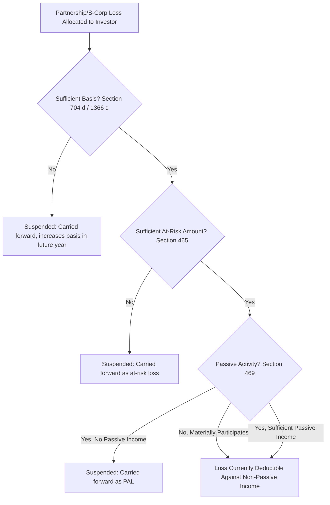

## Passive Activity Loss and At-Risk Rules

### Overview

The passive activity loss (PAL) rules under Internal Revenue Code (IRC) §469 and the at-risk rules under IRC §465 form two sequential loss-limitation gates that any tax equity investor must clear before a tax loss, tax credit, or deduction generated by a project can offset other income. In the context of Tax Equity & Incentives, these two regimes are the primary statutory chokepoints that determine whether the tax benefits generated by renewable energy, low-income housing, historic rehabilitation, or other credit-driven investments can actually be used by the investor who nominally holds them.

Both regimes operate independently and must be applied in sequence: first the at-risk rules under §465, then the passive activity rules under §469. A loss must survive both limitations before it becomes usable against non-passive income.

### Statutory Ordering of Loss Limitations

Before either §465 or §469 applies, a taxpayer's ability to deduct a partnership or S-corporation loss is tested against three prior limitations, applied in this order:

1. **Basis limitation (§704(d) for partnerships / §1366(d) for S-corps)** — losses cannot exceed adjusted basis in the partnership interest or stock/debt basis
2. **At-risk limitation (§465)** — losses cannot exceed the amount the taxpayer has "at risk" in the activity
3. **Passive activity loss limitation (§469)** — losses from passive activities can only offset passive income

**Key Points**

- A loss disallowed at an earlier stage never reaches the next test; it is simply suspended and carried forward at that stage.
- Tax equity structuring exercises typically model all three limitations simultaneously because they interact: increasing basis (stage 1) is meaningless if the investor lacks at-risk amount (stage 2), and having at-risk amount is meaningless if the investor is passive (stage 3) with no passive income to absorb the loss.

### The At-Risk Rules (IRC Section 465)

#### Purpose and Scope

Section 465 was enacted in 1976, originally targeting tax shelters that allowed investors to deduct losses financed entirely by nonrecourse debt for which they had no personal economic exposure. It applies to individuals and closely held C corporations (defined in §465(a)(1)(B) by reference to §542(a)(2) stock ownership tests) engaged in an activity described in §465(c), which now covers virtually all activities other than real estate held under limited exceptions, following the 1986 expansion of §465(c)(3) to a catch-all category.

#### Computing the At-Risk Amount

A taxpayer's amount at risk in an activity, per §465(b), generally includes:

- Cash contributed to the activity
- The adjusted basis of property contributed
- Amounts borrowed for use in the activity **for which the taxpayer is personally liable** (recourse debt) or has pledged property (other than property used in the activity) as security
- **Qualified nonrecourse financing** under §465(b)(6) — a narrow carve-out, discussed below

Amounts at risk are explicitly reduced by:

- Nonrecourse borrowing (other than qualified nonrecourse financing)
- Amounts protected against loss through guarantees, stop-loss agreements, or similar arrangements (§465(b)(4))
- Amounts borrowed from a person with an interest in the activity (other than as a creditor) or from a person related to such a person (§465(b)(3))

$$\text{At-Risk Amount} = \text{Cash} + \text{Adjusted Basis of Contributed Property} + \text{Recourse Debt} + \text{Qualified Nonrecourse Financing} - \text{Loss Protections}$$

**Example**

An investor contributes $1,000,000 cash to a solar partnership and is allocated a $3,000,000 tax loss (driven by accelerated depreciation and the loss attributable to a project financed with $5,000,000 of debt). If the $5,000,000 is nonrecourse debt for which the investor has no personal liability, has not pledged outside collateral, and the debt does not qualify as qualified nonrecourse financing under §465(b)(6), the investor's at-risk amount remains $1,000,000. Only $1,000,000 of the $3,000,000 loss is currently usable; the remaining $2,000,000 is suspended under §465(a)(2) and carried forward indefinitely, usable only when the at-risk amount increases (e.g., through additional contributions, debt conversion to recourse, or allocated income).

#### Qualified Nonrecourse Financing

Section 465(b)(6) allows nonrecourse debt secured by real property to be included in the at-risk amount if it is borrowed from a "qualified person" (generally a person actively and regularly engaged in the business of lending money, and not a related party, the seller of the property, or a person receiving a fee from the investment) or from certain government sources, and if no person is personally liable for repayment. This carve-out is central to real-estate-adjacent tax equity structures (e.g., low-income housing tax credit (LIHTC) and historic rehabilitation deals structured as real property leveraged partnerships) because it allows nonrecourse project-level debt to generate usable losses despite the general nonrecourse exclusion. It is generally **not** available for personal property activities such as most wind and solar equipment held outside of real property classifications, which is one reason renewable energy tax equity deals are structured to maximize investor at-risk amount through cash equity and recourse-style guarantees rather than relying on project debt.

#### At-Risk Recapture

Under §465(e), if the amount at risk is reduced below zero (e.g., through cash distributions in excess of income, or conversion of recourse debt to nonrecourse), the taxpayer must recapture previously deducted losses as income, up to the amount previously deducted in excess of net income from the activity. This is a common trap in tax equity flip structures where cash distributions to the tax equity investor increase over time as the developer's residual share (post-flip) grows.

### The Passive Activity Loss Rules (IRC Section 469)

#### Purpose and Scope

Enacted in the Tax Reform Act of 1986, §469 responds to a different mischief than §465: even when a taxpayer has genuine economic exposure (sufficient basis and at-risk amount), Congress determined that losses from activities in which the taxpayer does not materially participate should not shelter unrelated active income (wages, business income from a business in which the taxpayer materially participates) or, with narrow exceptions, portfolio income (interest, dividends, royalties, capital gains from investment property).

Section 469 applies to individuals, estates, trusts, personal service corporations, and closely held C corporations.

#### The Three Income Baskets

$$\text{Passive Losses} \leq \text{Passive Income}$$

- **Active income**: wages, and business income from activities in which the taxpayer materially participates
- **Portfolio income**: interest, dividends, annuities, royalties, and gains from the disposition of property held for investment — explicitly carved out of the passive basket by §469(e)(1)
- **Passive income**: income from a trade or business activity in which the taxpayer does not materially participate, and (per §469(c)(2)) essentially all rental activity income regardless of participation, subject to narrow exceptions

Passive losses (and passive credits, discussed below) can only offset passive income. Excess passive losses are suspended and carried forward indefinitely under §469(b), to be used in future years against passive income, or fully released when the taxpayer disposes of the entire interest in the activity in a fully taxable transaction to an unrelated party under §469(g).

#### Material Participation

A taxpayer materially participates in an activity if involvement is "regular, continuous, and substantial" under §469(h)(1). Treasury Regulation §1.469-5T establishes seven objective tests, the most commonly applied being:

1. Participation for more than 500 hours during the year
2. Participation constitutes substantially all the participation in the activity by anyone
3. Participation for more than 100 hours, and no other individual participates more
4. The activity is a "significant participation activity" (100+ hours) and aggregate significant participation activities exceed 500 hours
5. Material participation for any 5 of the preceding 10 taxable years
6. A personal service activity in which the taxpayer materially participated for any 3 preceding years
7. A facts-and-circumstances test requiring regular, continuous, and substantial participation based on all facts (subject to a 100-hour floor and exclusion of management-type participation compensated to others, per the regulations)

**Key Points**

- Limited partners are presumptively passive under §469(h)(2), with only three of the seven tests (1, 5, and 6 above) generally available to them per Treas. Reg. §1.469-5T(e), a rule of particular importance because most tax equity investors hold their interest as, or economically as, a limited partner or non-managing member.
- This is precisely why tax equity investors are treated as passive for §469 purposes almost by structural default — they are intentionally passive, non-managing capital providers, and material participation is neither expected nor typically sought.

#### Why Tax Equity Investors Are (Almost Always) Passive

Institutional tax equity investors — banks, insurance companies, and other financial institutions investing in wind, solar, and affordable housing partnerships — are structured as limited partners or non-managing LLC members specifically so that the developer/sponsor retains operational control. This structure has a direct §469 consequence: because the investor does not materially participate, all income, loss, and credit from the activity is passive to that investor.

For a bank or insurance company investor, this passivity is frequently *not* a problem for one of two independent reasons:

1. **Corporate taxpayer exception**: Regular (non-personal-service, non-closely-held) C corporations are not subject to §469 at all — the passive activity rules under §469(a)(2) apply only to individuals, estates, trusts, personal service corporations, and *closely held* C corporations. Most bank and insurance company tax equity investors are widely held C corporations and are therefore entirely outside §469's scope, which is a principal reason such institutions dominate the tax equity market.
2. **Sufficient passive income**: A closely held C corporation subject to a modified passive loss rule under §469(e)(2) may offset passive losses against *net active income* (a relaxation not available to individuals), while individual investors with diversified passive income (e.g., from other partnership interests, rental real estate) may have enough passive income from other sources to absorb the passive losses generated by the tax equity investment.

For individual investors without offsetting passive income, PAL suspension is a serious economic constraint and a key reason why direct individual investment in tax equity deals (outside narrow exceptions like the $25,000 real estate allowance under §469(i), which phases out at higher AGI and generally requires active participation in a rental real estate activity) is uncommon relative to institutional participation.

#### Passive Activity Credits

Section 469(d)(2) separately limits **passive activity credits** — including the Investment Tax Credit (ITC) under §48 and, per §469(d)(2) cross-references and IRS guidance, effectively also the Production Tax Credit (PTC) claimed through a passive activity — to the amount of tax attributable to passive income. This is a materially stricter test than the loss limitation: a passive credit cannot offset tax on active or portfolio income at all, only tax that is itself generated by passive activity income, computed under the complex ordering rules of Treas. Reg. §1.469-3T.

$$\text{Allowed Passive Credit} = \text{Regular Tax Liability Attributable to Net Passive Income}$$

**Key Points**

- Because most tax equity deals are structured to generate minimal or no positive passive taxable income in early years (heavy depreciation typically produces losses, not income), the passive credit limitation can strand ITC/PTC value for individual or closely-held-corporation investors who lack other passive income generating tax liability.
- This is a major structuring driver toward using widely held C corporation investors (fully exempt from §469) or structuring deals so credits flow to parties who can use them (e.g., via partnership flip allocations weighted toward investors with adequate passive income or corporate status).

#### Rental Real Estate Exceptions

Two narrow exceptions matter for LIHTC and historic tax credit deals involving real property:

- **§469(i) — $25,000 Offset**: Individuals who "actively participate" (a lower bar than material participation) in rental real estate may deduct up to $25,000 of passive losses against non-passive income, phased out ratably between $100,000 and $150,000 of modified adjusted gross income (MAGI). LIHTC investors, however, are generally *ineligible* for this exception per §469(i)(6)(B), because the low-income housing credit rules require the credit-generating activity's losses to be treated without regard to active participation restrictions for widely marketed syndicated deals — practically, the exception's income phase-out makes it irrelevant for most institutional-scale investment regardless.
- **§469(c)(7) — Real Estate Professional Exception**: A taxpayer who (a) spends more than 750 hours per year in real property trades or businesses and (b) more than half of all personal service hours in such trades or businesses, is not automatically treated as passive with respect to rental real estate activities in which they materially participate. This is primarily relevant to individual developers or general partners in real estate–based credit deals, not to passive institutional tax equity investors.

### Interaction with Tax Equity Structuring

#### Partnership Flip Structures

In a typical wind or solar partnership flip, the tax equity investor is allocated up to 99% of tax attributes (losses, depreciation, and credits) prior to the "flip point," after which allocations shift predominantly to the developer/sponsor. Structuring diligence must confirm:

- The investor's **basis** is sufficient to absorb allocated losses (tracked via §704(b) capital accounts and outside basis under §705, per the general partnership loss ordering)
- The investor's **at-risk amount** is sufficient — this is where guarantees, cash equity sizing, and the treatment of any back-leverage debt at the tax equity holding-company level (as opposed to project-level debt) are scrutinized, since debt used to finance the tax equity investor's own capital contribution is typically **not** qualified nonrecourse financing for personal-property activities like most wind/solar equipment
- The investor's **passive activity status** and whether it has (or is exempt from needing) sufficient passive income/tax to absorb losses and credits

#### Inverted Leases and Sale-Leasebacks

In inverted lease (pass-through lease) structures common to solar under §50(d)(5), the tax equity investor as lessor claims the ITC but leases the property to an operating lessee (often the developer) who uses the energy. The lessor's passive activity classification analysis is generally more favorable because a rental activity is passive under §469(c)(2) regardless of participation levels — meaning material participation questions are less central, but the lessor still needs passive income or corporate-taxpayer status to use resulting losses/credits, and the at-risk analysis still applies to the lessor's capital contribution.

#### Grouping Elections

Treas. Reg. §1.469-4 permits taxpayers to elect to group multiple activities that constitute an "appropriate economic unit" for purposes of applying the material participation tests. Institutional investors with multiple tax equity investments occasionally consider grouping, though for entities entirely exempt from §469 (widely held C corporations) this is moot, and for others, disclosure and consistency requirements under the regulations constrain flexibility once a grouping is chosen.

### Illustrative At-Risk vs. Passive Interaction Diagram

The following diagram (svg_diagram) illustrates how a single allocated loss is tested at each stage, and where it can become stranded.

<svg xmlns="http://www.w3.org/2000/svg" viewBox="0 0 900 500" font-family="Arial, sans-serif">
<text x="450" y="30" text-anchor="middle" font-size="18" font-weight="bold">At-Risk and Passive Loss Interaction (svg_diagram)</text>

<rect x="30" y="70" width="200" height="90" rx="8" fill="#eef3fb" stroke="#3b5b92" stroke-width="2" />
<text x="130" y="100" text-anchor="middle" font-size="13" font-weight="bold">Allocated Loss</text>
<text x="130" y="120" text-anchor="middle" font-size="12">$3,000,000</text>
<text x="130" y="140" text-anchor="middle" font-size="11">(Solar partnership,</text>
<text x="130" y="155" text-anchor="middle" font-size="11">accelerated depreciation)</text>
<path d="M230 115 L280 115" stroke="#333" stroke-width="2" marker-end="url(#arrow)" />
<rect x="280" y="70" width="200" height="90" rx="8" fill="#fdf2e3" stroke="#a86b1a" stroke-width="2" />
<text x="380" y="95" text-anchor="middle" font-size="13" font-weight="bold">Basis Test</text>
<text x="380" y="115" text-anchor="middle" font-size="11">Section 704(d)</text>
<text x="380" y="135" text-anchor="middle" font-size="11">Basis: $1,200,000</text>
<text x="380" y="150" text-anchor="middle" font-size="11">Allowed to next stage: $1,200,000</text>
<path d="M480 115 L530 115" stroke="#333" stroke-width="2" marker-end="url(#arrow)" />
<rect x="530" y="70" width="180" height="90" rx="8" fill="#fdf2e3" stroke="#a86b1a" stroke-width="2" />
<text x="620" y="95" text-anchor="middle" font-size="13" font-weight="bold">At-Risk Test</text>
<text x="620" y="115" text-anchor="middle" font-size="11">Section 465</text>
<text x="620" y="135" text-anchor="middle" font-size="11">At-risk: $1,000,000</text>
<text x="620" y="150" text-anchor="middle" font-size="11">Allowed forward: $1,000,000</text>
<path d="M620 160 L620 220" stroke="#333" stroke-width="2" marker-end="url(#arrow)" />
<rect x="530" y="220" width="180" height="80" rx="8" fill="#fbe4e4" stroke="#a13a3a" stroke-width="2" />
<text x="620" y="245" text-anchor="middle" font-size="12" font-weight="bold">At-Risk Suspended</text>
<text x="620" y="265" text-anchor="middle" font-size="11">$200,000</text>
<text x="620" y="283" text-anchor="middle" font-size="10">Carried forward,</text>
<text x="620" y="296" text-anchor="middle" font-size="10">Section 465(a)(2)</text>
<path d="M710 115 L760 115" stroke="#333" stroke-width="2" marker-end="url(#arrow)" />
<rect x="30" y="220" width="200" height="80" rx="8" fill="#fbe4e4" stroke="#a13a3a" stroke-width="2" />
<text x="130" y="245" text-anchor="middle" font-size="12" font-weight="bold">Basis Suspended</text>
<text x="130" y="265" text-anchor="middle" font-size="11">$1,800,000</text>
<text x="130" y="283" text-anchor="middle" font-size="10">Carried forward,</text>
<text x="130" y="296" text-anchor="middle" font-size="10">increases basis in future year</text>
<path d="M230 160 L130 220" stroke="#333" stroke-width="2" marker-end="url(#arrow)" />
<rect x="760" y="70" width="110" height="90" rx="8" fill="#fdf2e3" stroke="#a86b1a" stroke-width="2" />
<text x="815" y="95" text-anchor="middle" font-size="13" font-weight="bold">Passive Test</text>
<text x="815" y="115" text-anchor="middle" font-size="11">Section 469</text>
<text x="815" y="135" text-anchor="middle" font-size="10">Investor: LP,</text>
<text x="815" y="148" text-anchor="middle" font-size="10">no material</text>
<text x="815" y="161" text-anchor="middle" font-size="10">participation</text>
<path d="M815 160 L815 380" stroke="#333" stroke-width="2" marker-end="url(#arrow)" />
<rect x="720" y="380" width="180" height="90" rx="8" fill="#e6f4ea" stroke="#2f7d43" stroke-width="2" />
<text x="810" y="405" text-anchor="middle" font-size="12" font-weight="bold">Result</text>
<text x="810" y="425" text-anchor="middle" font-size="10">If sufficient passive income</text>
<text x="810" y="440" text-anchor="middle" font-size="10">(or investor is a widely-held</text>
<text x="810" y="455" text-anchor="middle" font-size="10">C corp exempt from Section 469):</text>
<text x="810" y="470" text-anchor="middle" font-size="10" font-weight="bold">$1,000,000 currently usable</text>
<rect x="480" y="380" width="200" height="90" rx="8" fill="#fbe4e4" stroke="#a13a3a" stroke-width="2" />
<text x="580" y="405" text-anchor="middle" font-size="12" font-weight="bold">Alternative Result</text>
<text x="580" y="425" text-anchor="middle" font-size="10">If passive with no passive income:</text>
<text x="580" y="445" text-anchor="middle" font-size="10" font-weight="bold">PAL suspended, Section 469(b)</text>
<text x="580" y="463" text-anchor="middle" font-size="10">Carried forward indefinitely</text>
<path d="M760 380 L680 380" stroke="#333" stroke-width="1.5" stroke-dasharray="4,3" />
</svg>

### Common Pitfalls in Practice

- **Treating basis and at-risk as identical** — they frequently diverge; nonrecourse debt (other than qualified nonrecourse financing) increases §704(b)/§705 basis but does not increase §465 at-risk amount, a frequent source of stranded losses in leveraged deals.
- **Assuming all limited partners are passive for every purpose** — the presumption in Treas. Reg. §1.469-5T(e) is rebuttable only through the narrow set of participation tests available to limited partners; sponsors who also hold LP interests may still separately qualify as material participants through a general partner or management role, requiring careful entity-level analysis.
- **Overlooking at-risk recapture on distributions** — cash distributions in a flip structure that outpace allocated income can drive the at-risk amount negative, triggering §465(e) recapture income independent of the PAL analysis.
- **Confusing loss and credit limitations** — passive losses need only be matched against passive income; passive *credits* under §469(d)(2) must be matched against tax attributable to passive income, a narrower and often harder test to satisfy, especially in early years when passive income is low or negative.
- **Ignoring the C-corporation exemption during entity selection** — using a closely held C corporation (subject to §469 in modified form) rather than a widely held one can inadvertently subject an investor to passive activity limits that a differently structured investor would avoid entirely.

**Related Topics**

- Section 704(b) and 704(d) partnership basis and capital account maintenance
- Partnership flip structure mechanics and typical flip point negotiation
- Section 50(d)(5) inverted lease structures and lessee income inclusion
- Section 48 Investment Tax Credit eligibility and basis rules
- Qualified nonrecourse financing distinctions between real and personal property activities
- Section 469(c)(7) real estate professional status in historic tax credit and LIHTC structures
- Recapture rules under Section 465(e) and Section 50(a) for tax equity dispositions
- Treasury Regulation 1.469-4 activity grouping elections for multi-project sponsors