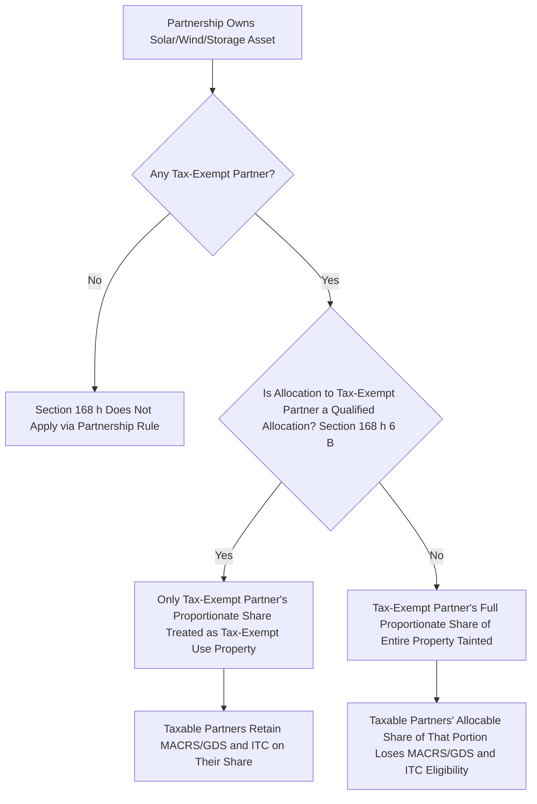
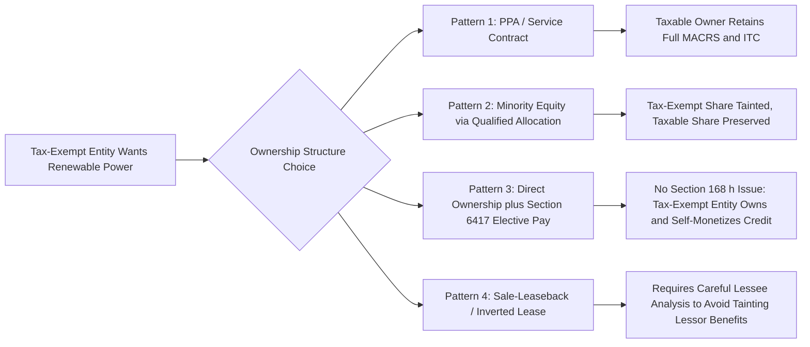

## Tax-Exempt Use Property Restrictions

### Overview

The tax-exempt use property rules under IRC §168(h) constrain depreciation and credit benefits whenever property is used, directly or indirectly, by a tax-exempt entity. These rules are foundational to Tax Equity & Incentives because most credit-generating assets (solar, wind, storage, LIHTC housing, and similar infrastructure) are frequently financed, hosted, or off-taken by governmental bodies, tax-exempt organizations, or foreign persons — parties who cannot themselves use accelerated depreciation or tax credits. Section 168(h) determines when such involvement taints an asset as "tax-exempt use property," strips it of accelerated MACRS depreciation in favor of a slower straight-line method under the Alternative Depreciation System (ADS), and, through cross-references in §50(b)(3)-(4), can disqualify the property from the Investment Tax Credit (ITC) altogether.

### Statutory Framework

#### Core Definition — Section 168(h)(1)

Property is "tax-exempt use property" if it is tangible property leased to a "tax-exempt entity," subject to important exceptions and expansions discussed below. The classification triggers two consequences:

1. **Depreciation**: the property must be depreciated under ADS (generally straight-line, over the ADS class life) per §168(g)(1)(B), rather than under the more favorable General Depreciation System (GDS, including MACRS accelerated methods and, historically, bonus depreciation).
2. **Credit eligibility**: under §50(b)(3), no ITC is allowed for tax-exempt use property (subject to the partial-allocation and exceptions rules discussed below), and under §50(b)(4), property used by a tax-exempt entity in an unrelated trade or business is similarly restricted only to the extent of that unrelated use.

$$\text{Depreciation Method} = \begin{cases} \text{MACRS/GDS (accelerated)} & \text{if not tax-exempt use property} \\ \text{ADS (straight-line, longer life)} & \text{if tax-exempt use property} \end{cases}$$

#### Who Is a "Tax-Exempt Entity" — Section 168(h)(2)

The definition is broader than intuition suggests and includes:

- The United States, any state or political subdivision, and any agency or instrumentality thereof
- Any organization (other than a cooperative under §521) exempt from federal income tax under §501(a) (i.e., most §501(c)(3) charities and similar organizations)
- Any foreign person or entity (with limited exceptions for entities subject to a comprehensive U.S. income tax treaty), addressed principally through §168(h)(2)(A)(iii) and the related foreign-use rules of §168(h)(2) and §168(g)(1)(A)
- Indian tribal governments (per §168(h)(2)(A) as modified by later legislative and IRS guidance treating tribal governments similarly to state/local governments for many purposes)

**Key Points**

- A tax-exempt entity does not need to be the direct lessee to taint the property; the "pass-through entity" rules (discussed below) can attribute tax-exempt status through partnership and similar ownership structures.
- Municipal utilities, public power authorities, rural electric cooperatives exempt under §501(c)(12), and public universities are common tax-exempt counterparties encountered in project finance and power purchase agreement (PPA) structuring.

### The "Disqualified Lease" Concept and Related Attribution Rules

#### Direct Leasing

The most straightforward trigger is a direct lease of tangible property to a tax-exempt entity meeting the requirements of former §168(h)(1)(B) referencing the "disqualified lease" concept carried over from prior law. A long-term lease (generally leases longer than the greater of 20 years or applicable safe-harbor thresholds tied to the property's class life) to a governmental or tax-exempt lessee is a canonical fact pattern.

#### Section 168(h)(6) — Partnership/Pass-Through Allocation Rule

Because many tax equity investments and infrastructure projects are held through partnerships that include both taxable and tax-exempt partners (e.g., a municipal utility co-investing alongside a tax equity bank), §168(h)(6) contains a critical attribution mechanism: if a partnership (or other pass-through entity) has both tax-exempt and non-tax-exempt partners, and any allocation to the tax-exempt partner of partnership income or loss is not a "qualified allocation," then the tax-exempt entity's *proportionate share* of the partnership's property is treated as tax-exempt use property in the hands of the *entire* partnership, effectively tainting the taxable partners' allocable share as well, absent structuring relief.

A "qualified allocation" under §168(h)(6)(B)(ii) requires that the allocation to the tax-exempt partner:

- Is consistent throughout the entire period the partner is a partner, and
- Does not have the effect of allocating a disproportionately larger share of income to the tax-exempt partner in early years and a disproportionately larger share of loss in later years (i.e., no shifting allocations designed to favor the tax-exempt partner with income and burden the taxable partners with losses)

**Example**

A municipal off-taker takes a small, fixed 5% equity stake in a solar partnership alongside a bank tax equity investor holding 95%, structured through a partnership flip. If the municipal partner's allocation percentage is fixed and consistent (a "qualified allocation"), only the municipal partner's proportionate 5% share of the property is treated as tax-exempt use property; the bank's 95% share retains MACRS/GDS eligibility. If instead the municipal partner is given a disproportionately large loss allocation in early years to help the taxable partners, the qualified allocation test fails and the tax-exempt-use taint can spread to the property based on the tax-exempt entity's ownership share, with associated complexity in a worst case reaching further into the deal depending on the specific facts.

#### Section 168(h)(1)(D) — Tax-Exempt Bond Financing

Property financed, directly or indirectly, with the proceeds of an obligation the interest on which is exempt from federal income tax under §103 (i.e., tax-exempt municipal bonds) can independently be treated as tax-exempt use property under §168(h)(1)(D), even absent any lease to a tax-exempt entity. This is a significant intersection point with public-private renewable energy projects that seek to blend tax-exempt bond proceeds with tax equity, since even partial tax-exempt bond financing can taint the associated property.

### Exceptions to Tax-Exempt Use Property Classification

Several statutory exceptions materially narrow the rule's practical reach, and tax equity structuring routinely relies on them:

#### Short-Term Lease Exception — Section 168(h)(1)(C) / (E)

Leases with a term of the lesser of 3 years or 20% of the property's class life generally fall outside the disqualified lease rules, though this exception is of limited use for long-lived renewable energy assets typically financed with 15-25 year PPAs or ground leases.

#### Section 50(d) and the Election Out (Historical "Service Contract" and Related Approaches)

Structuring around §168(h) frequently uses **service contracts** rather than leases: if a tax-exempt entity purchases electricity or output under a power purchase agreement (a service/output contract) rather than leasing the underlying generating equipment itself, the arrangement is generally not treated as a "lease" for §168(h) purposes, provided the contract does not grant the tax-exempt off-taker use, possession, or control of specific property in a manner that Treasury/IRS guidance (and case law under prior investment tax credit rules addressing similar service-contract-versus-lease distinctions) treats as a de facto lease. This is the single most important structuring technique enabling utility-scale renewable projects to sell power to municipal utilities and other tax-exempt off-takers without tainting ITC/depreciation eligibility.

**Key Points**

- Indicia of a true service contract (rather than a disguised lease) generally include: the provider controls the amount and timing of output, the provider bears operational and performance risk, the off-taker does not have the right to operate or control the specific physical asset, and pricing is not based on fixed use of a specific unit in a manner resembling rent.
- This distinction closely parallels, but is analytically separate from, the tax ownership analysis under general "true lease" doctrine and *Frank Lyon Co. v. United States*, 435 U.S. 561 (1978); a PPA structured to avoid disqualified-lease treatment under §168(h) must also independently support the developer's tax ownership of the asset.

#### De Minimis Use / Short-Term Use Exceptions

Certain limited or incidental tax-exempt use, and use under agreements not rising to the level of a lease (e.g., licenses, easements for non-exclusive access), generally fall outside the rule, though these exceptions are narrowly construed and heavily fact-dependent.

#### Interaction with the Inflation Reduction Act — Elective Pay (Direct Pay)

The Inflation Reduction Act of 2022 (IRA) added §6417, allowing certain tax-exempt and governmental entities to make an "elective payment" (direct pay) election to receive specified credits, including the §48 ITC and §45/45Y Production Tax Credit (PTC), as a direct cash payment in lieu of using them against tax liability they do not owe. This is a fundamentally different mechanism from tax-exempt use property relief: §6417 allows a *tax-exempt entity that owns the property itself* to claim the credit via direct payment, whereas §168(h) governs whether a *taxable owner* leasing to (or partnering with) a tax-exempt entity retains its own depreciation and credit eligibility. In practice, the IRA's elective pay regime has reduced (though not eliminated) the structuring need to route projects through taxable intermediaries purely to preserve tax benefits when the ultimate user is tax-exempt, because the tax-exempt entity can now often own the project directly and monetize credits itself. [Inference: the degree to which elective pay has displaced traditional §168(h)-driven structuring varies significantly by project type, financing cost considerations, and entity risk tolerance, and market practice continues to evolve.]

### Impact on Investment Tax Credit Eligibility — Section 50(b)

Section 50(b)(3) denies the ITC for tax-exempt use property as defined under §168(h) (determined without regard to §168(h)(1)(E), the short-term lease rule producing a slightly different, narrower carve-out for credit purposes than for depreciation purposes in certain respects). Section 50(b)(4) separately restricts credits for property used by a tax-exempt entity (other than a §521 cooperative) in an unrelated trade or business, but only to the extent such use, by percentage, exceeds the threshold that would otherwise taint the entire property — this proportional approach mirrors the partnership allocation logic in §168(h)(6).

**Key Points**

- The ITC denial under §50(b)(3) is binary at the level of the tainted portion: to the extent property is tax-exempt use property, no credit is allowed for that portion at all — it is not merely reduced or deferred.
- This makes the exceptions discussed above (service contracts, qualified allocations, short-term leases) commercially essential rather than merely tax-technical, because a failed analysis can eliminate 30%+ of a project's tax equity value.

### Interaction with the Inflation Reduction Act's Section 48(a)(9) and Related IRA Amendments

The IRA modified certain aspects of the credit-eligible property rules and introduced adders (domestic content, energy community, low-income community) that interact with, but do not override, the underlying §168(h) tax-exempt use property gate. A project that fails the tax-exempt use property exceptions loses ITC eligibility on the tainted portion regardless of adder eligibility, since adders are calculated as percentage increases to an otherwise-allowable credit base. [Inference: specific IRA-era Treasury guidance addressing the interaction of §6417 elective pay ownership structures with §168(h) for co-owned projects (tax-exempt and taxable co-owners in the same asset) continues to develop, and practitioners should confirm current regulatory guidance for co-ownership fact patterns.]

### Practical Structuring Patterns in Tax Equity Transactions

#### Pattern 1 — PPA Instead of Lease

The developer/tax equity partnership owns and operates the generating asset and sells electricity to a municipal utility or other tax-exempt off-taker under a PPA structured as a service/output contract, preserving full MACRS/GDS depreciation and ITC eligibility for the taxable owners.

#### Pattern 2 — Fixed, Qualified Partnership Allocations

Where a tax-exempt entity (e.g., a public university, hospital system, or municipality) takes a genuine minority equity stake, allocations are fixed and proportionate throughout the partnership's life to satisfy the §168(h)(6)(B)(ii) qualified allocation test, isolating the tax-exempt taint to that partner's own proportionate share.

#### Pattern 3 — Direct Ownership with Elective Pay (Post-IRA)

Where feasible, the tax-exempt entity owns the project outright and elects direct pay under §6417 for the applicable credit, sidestepping the tax-exempt use property analysis entirely because there is no lease or partnership allocation to a private taxable party — the entity monetizes its own credit rather than relying on a taxable intermediary's depreciation and credit capacity.

#### Pattern 4 — Sale-Leaseback and Inverted Lease Caution

Sale-leaseback and inverted lease (pass-through lease) structures under §50(d)(5) require particular care when the ultimate user/lessee is tax-exempt, since these structures inherently involve a lease; developers must confirm the lessee is not a tax-exempt entity, or must independently structure to qualify for an exception, or the lessor's depreciation and credit position can be compromised.

### Common Pitfalls in Practice

- **Treating a long-term PPA as automatically safe** — a PPA that grants the off-taker excessive control rights over the specific asset (e.g., dispatch control resembling operational control, or contractual terms resembling a capacity lease) risks recharacterization as a disqualified lease despite being labeled a "power purchase agreement."
- **Overlooking indirect tax-exempt bond taint** — a project receiving even partial tax-exempt bond-financed infrastructure support (e.g., shared substation or interconnection financing) can trigger §168(h)(1)(D) exposure independent of any lease analysis.
- **Assuming small tax-exempt allocations are automatically immaterial** — the qualified allocation test is about the *consistency and proportionality* of the allocation, not merely its size; a small but improperly structured (e.g., front-loaded income) allocation to a tax-exempt partner can still trigger tainting.
- **Failing to revisit structuring post-IRA** — deals originally structured purely to avoid §168(h) taint through complex leasing/service-contract workarounds may now have simpler, more efficient direct-ownership-with-elective-pay alternatives under §6417, though the comparative economics depend heavily on financing costs and the tax-exempt entity's capacity to bear construction and performance risk without tax equity partners.
- **Ignoring foreign-person tainting** — the "tax-exempt entity" definition's inclusion of certain foreign persons/entities is easy to overlook in projects with foreign sponsors, lenders with foreign participation, or cross-border ownership structures, and should be checked independently of any domestic tax-exempt counterparty analysis.

**Related Topics**

- Section 6417 elective pay (direct pay) mechanics and eligible entity categories
- Section 6418 transferability of energy tax credits
- True lease versus service contract analysis (*Frank Lyon Co.* doctrine) in project finance
- Section 168(h)(6) qualified allocation drafting in partnership agreements
- Section 103 tax-exempt bond financing interaction with private business use restrictions
- Inverted lease and sale-leaseback structuring under Section 50(d)(5)
- Alternative Depreciation System (ADS) class lives and computation mechanics
- Unrelated business taxable income (UBTI) considerations for tax-exempt equity participants