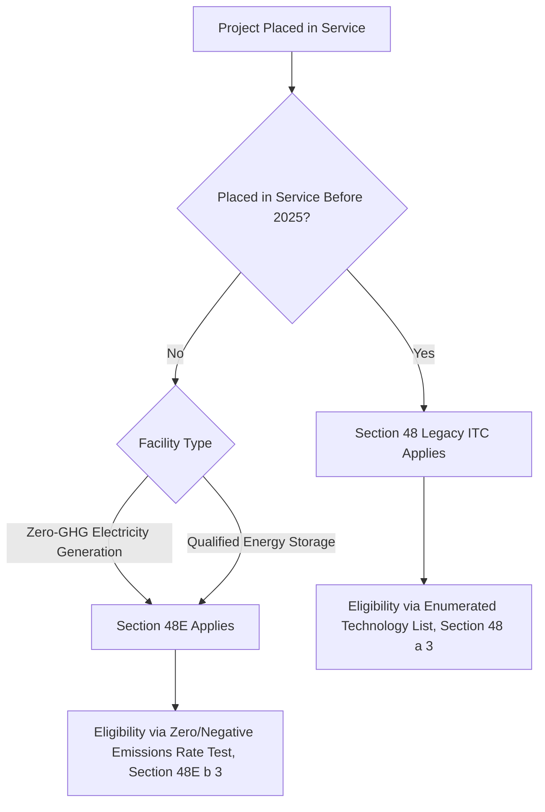
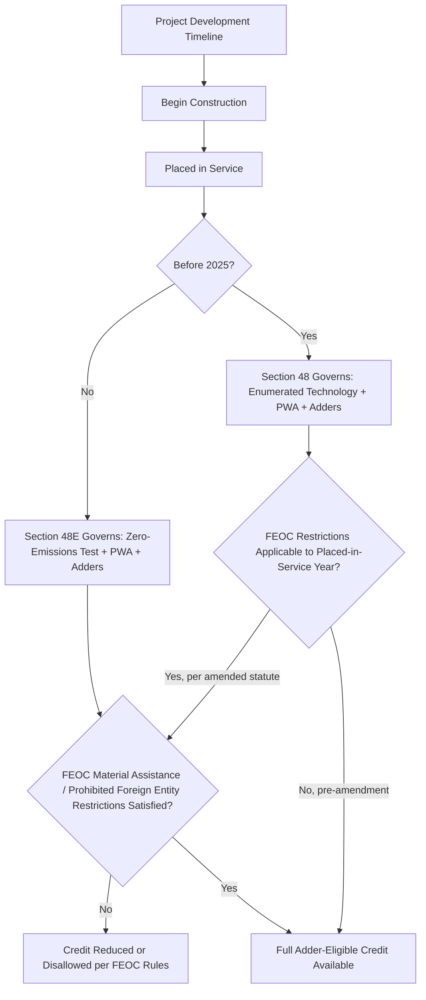

## Section 48 Legacy Credit Versus Section 48E Technology-Neutral Credit

### Overview

The Inflation Reduction Act of 2022 (IRA) created a fundamental architectural transition in energy investment tax credit design: the long-standing, technology-specific Section 48 Investment Tax Credit (ITC) is being phased out and replaced by the technology-neutral Section 48E Clean Electricity Investment Credit for projects placed in service after 2024. Understanding the differences between these two regimes — eligibility triggers, qualifying technologies, phase-out mechanics, and their interaction with adders — is essential to structuring any tax equity transaction closing during the multi-year transition window, and remains relevant even after the transition given the 2025 reconciliation legislation's further amendments.

### Statutory Framework and Timeline

#### Section 48 — The Legacy, Technology-Specific Credit

Section 48 has existed in various forms since 1962 and, prior to the IRA's structural changes, provided the ITC for an enumerated list of specific technologies: solar energy property, fiber-optic solar, qualified fuel cell property, qualified microturbine property, combined heat and power (CHP) property, qualified small wind energy property, geothermal heat pump property, and (following IRA amendments) standalone energy storage technology, biogas property, microgrid controllers, and dynamic glass — among others enumerated in §48(a)(3).

#### Section 48E — The Technology-Neutral Successor

The IRA added Section 48E, effective for property placed in service after December 31, 2024, and structured around a fundamentally different eligibility test: rather than listing qualifying technologies, §48E(b)(3) makes any facility that generates electricity with an anticipated greenhouse gas emissions rate of zero or less eligible, alongside qualified energy storage technology. This "technology-neutral" design was intended to future-proof the credit against emerging generation technologies without requiring repeated legislative amendment.

$$\text{Eligibility Test (Section 48)} = \text{Is the property on the enumerated technology list?}$$

$$\text{Eligibility Test (Section 48E)} = \text{Does the facility have an anticipated GHG emissions rate} \leq 0?$$

**Key Points**

- The transition date is defined by **placed-in-service date**, not by when construction began, contract execution, or credit election — a project starting construction under §48 rules but placed in service in 2025 or later is subject to §48E, subject to certain phase-out and effective date nuances addressed by Treasury guidance.
- Energy storage technology is treated similarly under both regimes (already added to §48 by the IRA, and separately eligible under §48E), so the storage analysis is comparatively more continuous across the transition than the analysis for combustion- or emissions-based generation technologies.

### Eligible Technology Comparison

| Technology | Section 48 (Legacy) | Section 48E (Technology-Neutral) |
| --- | --- | --- |
| Solar (PV, solar thermal) | Explicitly enumerated | Qualifies via zero-emissions test |
| Wind (onshore/offshore) | Enumerated (small wind explicitly; utility-scale historically used PTC more often) | Qualifies via zero-emissions test |
| Geothermal (electricity) | Enumerated | Qualifies via zero-emissions test |
| Standalone energy storage | Added by IRA, enumerated | Separately eligible as qualified energy storage technology |
| Fuel cells | Enumerated, with specific efficiency/capacity requirements | Qualifies only if emissions rate is zero or less (excludes most fossil-fuel-derived hydrogen fuel cells absent qualifying feedstock) |
| Combined heat and power | Enumerated | Generally does not qualify unless the electricity-generating component independently meets the zero-emissions test |
| Nuclear (advanced/existing uprates) | Not covered by §48 (addressed via other credits, e.g., §45U production credit for existing nuclear) | Qualifies via zero-emissions test — a significant expansion of ITC-eligible technology relative to legacy §48 |
| Hydropower | Limited legacy coverage in some contexts | Qualifies via zero-emissions test where applicable |
| Combustion-based biomass/waste-to-energy | Certain biogas-related property enumerated | Requires lifecycle/anticipated emissions analysis; not automatically qualified merely by fuel source |

**Key Points**

- Section 48E's zero-emissions test is evaluated at the facility level based on anticipated greenhouse gas emissions rate, with Treasury required under §48E(h) to publish and periodically update tables of emissions rates for various types of facilities, and to provide a petition process for facilities using a technology not yet listed.
- Combustion and gasification facilities face a materially more complex qualification path under §48E than under the old enumerated-list approach of §48, since they must demonstrate a qualifying (effectively zero or negative) emissions rate rather than simply matching a listed category. [Inference: the precise administrative treatment of specific combustion technologies under §48E continues to depend on Treasury's published emissions rate tables and any subsequent regulatory or legislative refinement.]

### Base Credit Rate and Bonus Structure — Structural Parallels

Both §48 and §48E share the IRA's two-tier base rate and adder architecture, a structural continuity that simplifies transition modeling even though eligibility gateways differ:

#### Base Rate: Prevailing Wage and Apprenticeship (PWA)

- **Base rate**: 6% of qualified investment (both §48(a)(9) as amended and §48E(a)(2))
- **Bonus rate**: 30% of qualified investment if PWA requirements under §48(a)(9)/§48E(a)(2) are satisfied (prevailing wages during construction and, for larger projects, alteration/repair periods, plus qualified apprenticeship labor hour requirements), or if the project is under 1 MW (AC) — the small-project PWA exception applies in both regimes.

$$\text{Base ITC} = \begin{cases} 30\% \times \text{Qualified Investment} & \text{PWA satisfied or project} < 1\text{MW} \\ 6\% \times \text{Qualified Investment} & \text{PWA not satisfied} \end{cases}$$

#### Bonus Adders (Both Regimes)

- **Domestic content adder**: an additional 10 percentage points if domestic content requirements under §48(a)(12)/§48E(a)(3)(A) (steel, iron, and manufactured product thresholds) are satisfied — subject to phase-down risk of a reduced adder or elimination for projects failing to meet the requirement, and to the "no downward adjustment" penalty structure for projects that claimed but fail to satisfy domestic content in connection with direct pay elections under §6417(b)(3)(B).
- **Energy community adder**: an additional 10 percentage points for projects located in energy communities as defined in §48(a)(14)/§48E(a)(3)(B) (brownfield sites, statistical areas with historical fossil fuel employment/tax revenue meeting unemployment thresholds, or areas with retired coal mines/coal-fired generating units).
- **Low-income community adders**: allocated capacity-limited adders under §48(e) (for §48 legacy projects) and the parallel allocation regime under §48E(h) [Note: cross-reference numbering for the §48E low-income adder program should be confirmed against current Treasury regulations, as allocation program mechanics have been implemented through IRS Notice and regulation guidance rather than solely through statutory text] providing an additional 10 or 20 percentage points for solar/wind facilities under 5 MW located in low-income communities, on Indian land, as part of qualified low-income residential building projects, or as part of qualified low-income economic benefit projects, subject to annual capacity allocation caps and a competitive application process.

**Key Points**

- The maximum stackable ITC rate under both regimes can reach 70% (30% base + 10% domestic content + 10% energy community + 20% low-income adder) for qualifying small-scale, allocation-winning projects, though achieving the full stack requires satisfying multiple independent, technically demanding conditions simultaneously.
- Structuring teams evaluating projects spanning the transition date must model PWA and adder eligibility under whichever section applies based on placed-in-service date, since the underlying definitions, while structurally parallel, are not always textually identical between the two code sections, and Treasury guidance for each may diverge in interpretive detail over time.

### Foreign Entity of Concern (FEOC) Restrictions — A Key Divergence Introduced by 2025 Legislation

Following the 2025 budget reconciliation legislation (commonly referenced in practice as continuing IRA-era credit availability with new restrictions), both §48 and §48E were amended to incorporate material and adjacent restrictions tied to "prohibited foreign entities" and foreign entity of concern (FEOC) material assistance thresholds, restricting credit eligibility where a facility receives material assistance from, or has specified ownership/control connections to, prohibited foreign entities (generally entities linked to countries such as China, Russia, North Korea, and Iran under the statutory FEOC framework). [Unverified: given the pace and complexity of 2025 legislative and Treasury guidance developments on FEOC material assistance percentages, safe harbors, and effective dates, practitioners should confirm current statutory text and the most recent Treasury/IRS guidance before relying on specific FEOC compliance thresholds for a given placed-in-service year.]

### Phase-Out and Sunset Mechanics

Section 48E, unlike the historically indefinite (subject to periodic Congressional extension) legacy §48 credit for many technologies, was designed with a statutory emissions-based phase-out trigger: the credit begins phasing out for facilities beginning construction after the later of 2032 or the year in which annual greenhouse gas emissions from the electricity sector fall to 25% or less of 2022 levels, as determined by the Treasury/EPA under §48E(e). Subsequent 2025 legislative amendments have further accelerated or modified phase-out and eligibility timelines for certain technologies (particularly wind and solar) relative to the original IRA-enacted schedule. [Unverified: exact current phase-out percentages, applicable placed-in-service or beginning-of-construction cutoff dates, and technology-specific carve-outs following the 2025 reconciliation legislation should be verified against the current statutory text and most recent IRS/Treasury guidance, given the pace of legislative change in this area.]

### Structuring and Diligence Implications

#### Begin-Construction vs. Placed-in-Service Analysis

Because §48E's applicability turns on placed-in-service date rather than begin-construction date, projects that started development under §48-era assumptions (technology list, guidance interpretations, safe harbors developed under Notice 2013-29 and successor guidance for "beginning of construction") must be re-evaluated against §48E's placed-in-service trigger and, where applicable, the technology-neutral zero-emissions determination and any FEOC restrictions that attach based on placed-in-service year rather than construction commencement.

#### Continuity of Established Beginning-of-Construction Doctrine

The "physical work test" and "5% safe harbor" methods developed under decades of ITC/PTC guidance for establishing beginning of construction generally continue to apply conceptually under §48E, since Treasury guidance implementing the technology-neutral credit largely incorporates the pre-existing beginning-of-construction framework by cross-reference or analogous new guidance, rather than replacing it wholesale. [Inference: specific procedural mechanics for establishing beginning of construction under §48E should be confirmed against the applicable Treasury Notice(s) specific to §48E, as opposed to assuming full identity with pre-IRA §48 guidance.]

#### Tax Equity Term Sheet and Diligence Checklist Impact

- Confirm which code section governs based on anticipated placed-in-service date, not merely the technology type or contract execution date.
- For §48E projects involving any combustion, gasification, or non-obviously-zero-emissions technology, obtain and review the facility's position under Treasury's published emissions rate tables or confirm the petition process status for a non-listed technology.
- Model adder stacking (PWA, domestic content, energy community, low-income allocation) under the specific statutory subsection applicable to the governing code section, since allocation program mechanics (particularly for the low-income adder) involve separate application and award processes independent of the base credit determination.
- Diligence FEOC/prohibited foreign entity exposure across the supply chain (equipment manufacturers, EPC contractors, and in some structures upstream ownership) given the material assistance thresholds introduced by 2025 amendments, since FEOC noncompliance can eliminate credit eligibility notwithstanding otherwise-satisfied technology and PWA requirements.

### Illustrative Structural Comparison

<svg xmlns="http://www.w3.org/2000/svg" viewBox="0 0 900 460" font-family="Arial, sans-serif">
<text x="450" y="28" text-anchor="middle" font-size="18" font-weight="bold">Section 48 vs Section 48E Structural Comparison (svg_diagram)</text>

<rect x="60" y="55" width="330" height="40" fill="#3b5b92" rx="6" />
<text x="225" y="80" text-anchor="middle" font-size="14" fill="white" font-weight="bold">Section 48 (Legacy)</text>
<rect x="510" y="55" width="330" height="40" fill="#2f7d43" rx="6" />
<text x="675" y="80" text-anchor="middle" font-size="14" fill="white" font-weight="bold">Section 48E (Technology-Neutral)</text>

<rect x="60" y="105" width="330" height="70" fill="#eef3fb" stroke="#3b5b92" />
<text x="225" y="128" text-anchor="middle" font-size="12" font-weight="bold">Eligibility Test</text>
<text x="225" y="148" text-anchor="middle" font-size="11">Enumerated technology list</text>
<text x="225" y="163" text-anchor="middle" font-size="11">Section 48(a)(3)</text>
<rect x="510" y="105" width="330" height="70" fill="#e6f4ea" stroke="#2f7d43" />
<text x="675" y="128" text-anchor="middle" font-size="12" font-weight="bold">Eligibility Test</text>
<text x="675" y="148" text-anchor="middle" font-size="11">Anticipated GHG emissions rate</text>
<text x="675" y="163" text-anchor="middle" font-size="11">less than or equal to zero, Section 48E(b)(3)</text>

<rect x="60" y="185" width="330" height="60" fill="#eef3fb" stroke="#3b5b92" />
<text x="225" y="208" text-anchor="middle" font-size="12" font-weight="bold">Applicable Period</text>
<text x="225" y="228" text-anchor="middle" font-size="11">Property placed in service before 2025</text>
<rect x="510" y="185" width="330" height="60" fill="#e6f4ea" stroke="#2f7d43" />
<text x="675" y="208" text-anchor="middle" font-size="12" font-weight="bold">Applicable Period</text>
<text x="675" y="228" text-anchor="middle" font-size="11">Property placed in service after 2024</text>

<rect x="60" y="255" width="330" height="60" fill="#eef3fb" stroke="#3b5b92" />
<text x="225" y="278" text-anchor="middle" font-size="12" font-weight="bold">Base / Bonus Rate</text>
<text x="225" y="298" text-anchor="middle" font-size="11">6% base / 30% with PWA (same structure)</text>
<rect x="510" y="255" width="330" height="60" fill="#e6f4ea" stroke="#2f7d43" />
<text x="675" y="278" text-anchor="middle" font-size="12" font-weight="bold">Base / Bonus Rate</text>
<text x="675" y="298" text-anchor="middle" font-size="11">6% base / 30% with PWA (same structure)</text>

<rect x="60" y="325" width="330" height="60" fill="#eef3fb" stroke="#3b5b92" />
<text x="225" y="348" text-anchor="middle" font-size="12" font-weight="bold">Adders</text>
<text x="225" y="368" text-anchor="middle" font-size="11">Domestic content, energy community,</text>
<text x="225" y="382" text-anchor="middle" font-size="10">low-income allocation (all applicable)</text>
<rect x="510" y="325" width="330" height="60" fill="#e6f4ea" stroke="#2f7d43" />
<text x="675" y="348" text-anchor="middle" font-size="12" font-weight="bold">Adders</text>
<text x="675" y="368" text-anchor="middle" font-size="11">Same adder categories, parallel</text>
<text x="675" y="382" text-anchor="middle" font-size="10">subsections under Section 48E</text>

<rect x="60" y="395" width="330" height="55" fill="#eef3fb" stroke="#3b5b92" />
<text x="225" y="418" text-anchor="middle" font-size="12" font-weight="bold">Sunset Mechanism</text>
<text x="225" y="436" text-anchor="middle" font-size="10">Historically technology-specific,</text>
<rect x="510" y="395" width="330" height="55" fill="#e6f4ea" stroke="#2f7d43" />
<text x="675" y="418" text-anchor="middle" font-size="12" font-weight="bold">Sunset Mechanism</text>
<text x="675" y="436" text-anchor="middle" font-size="10">Emissions-based phase-out, Section 48E(e)</text>
</svg>

### Common Pitfalls in Practice

- **Assuming construction commencement locks in the applicable code section** — placed-in-service date, not begin-construction date, generally determines whether §48 or §48E governs, which can surprise developers whose projects experience delays crossing the 2025 threshold.
- **Treating "technology-neutral" as "automatically qualifying"** — non-solar, non-wind, non-storage technologies (particularly combustion, biomass, and waste-derived generation) require an affirmative, evidence-based emissions rate determination under §48E and are not automatically eligible merely because they generate electricity.
- **Overlooking that adder mechanics, while structurally parallel, are separately codified** — practitioners should confirm the specific §48E cross-reference for a given adder rather than assuming identical statutory language to the §48 counterpart, since technical definitions and effective dates can diverge.
- **Underestimating FEOC/prohibited foreign entity diligence burden** — supply chain and ownership diligence for FEOC compliance is a materially new and evolving diligence category introduced by 2025 legislative amendments, requiring engagement with current guidance rather than reliance on pre-2025 ITC diligence checklists.
- **Failing to monitor post-2025 legislative and Treasury developments** — given the pace of change in this area, deal teams should treat FEOC thresholds, phase-out schedules, and technology-specific eligibility determinations as requiring verification against the most current statutory text and IRS/Treasury guidance at the time of closing, rather than relying solely on IRA-enactment-era assumptions.

**Related Topics**

- Section 45/45Y Production Tax Credit and its technology-neutral analog relationship to Section 48E
- Beginning-of-construction doctrine: physical work test and 5% safe harbor under Treasury guidance
- Domestic content adder compliance and steel/iron/manufactured product cost thresholds
- Low-income community bonus credit allocation program mechanics (application, scoring, capacity caps)
- Foreign entity of concern (FEOC) material assistance rules and prohibited foreign entity restrictions
- Section 6417 elective pay and Section 6418 transferability as monetization alternatives across both regimes
- Treasury's Section 48E emissions rate table publication and technology petition process
- Energy community designation methodology (brownfield, statistical area, and coal closure categories)