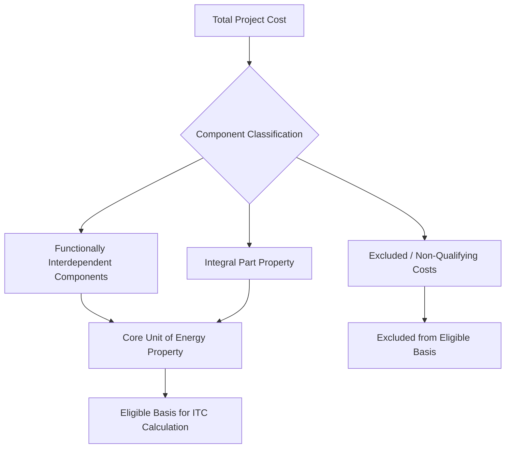
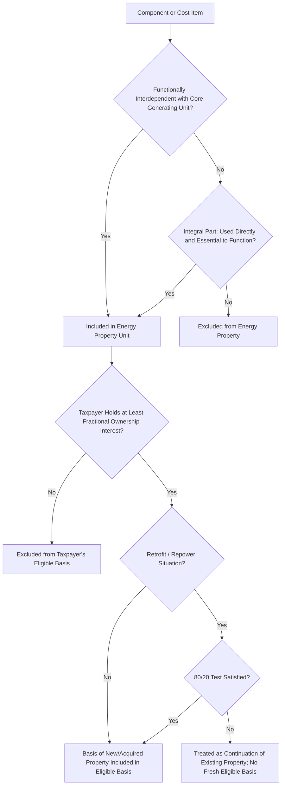

## Eligible Basis and Qualifying Property

### Overview

Eligible basis and the definition of "qualifying property" (referred to in the Investment Tax Credit context as "energy property") together determine the dollar amount to which the Section 48 or Section 48E credit percentage is applied. Getting this base amount right — what counts, what's excluded, and how it's allocated across a multi-asset project — is often more consequential to the final credit amount than the percentage-rate questions (PWA, adders) that typically draw more attention. This topic is grounded in the Treasury/IRS final regulations under §1.48-9 (TD 10015), issued December 4, 2024, which comprehensively replaced regulations dating to 1981 (amended 1987) and apply to property placed in service during a taxable year beginning after December 12, 2024, with related transition rules for property placed in service earlier. Those prior regulations at former §1.48-9 had not been updated since 1987, predating many of the technologies now eligible under Section 48. [Federal Register](https://www.federalregister.gov/documents/2024/12/12/2024-28190/definition-of-energy-property-and-rules-applicable-to-the-energy-credit)

### Statutory Basis Computation

$$\text{Investment Tax Credit} = \text{Credit Rate} \times \text{Eligible Basis of Energy Property}$$

Section 48 provides for an ITC calculated as a percentage of the basis of each energy property placed in service by a taxpayer in a taxable year. "Eligible basis" is not a separately defined statutory term distinct from "basis" in the ordinary tax sense (as under §1012 cost basis or §1011 adjusted basis rules) — the analytical work is in correctly identifying which costs and components constitute "energy property" in the first place, since only the basis of qualifying energy property counts toward the credit base. [A&O Shearman](https://www.aoshearman.com/en/insights/significant-updates-in-treasurys-final-energy-credit-regulations)

### Defining "Energy Property" — The Functional Interdependence and Integral Part Framework

#### The Conceptual Shift in the Final Regulations

The final regulations issued December 4, 2024 reflect a conceptual shift from prior Treasury regulations, which enumerated qualifying and nonqualifying property, toward a function-oriented framework. Treasury emphasized a function-oriented, rather than technology-oriented, approach to determining which equipment or components constitute ITC-eligible energy property. [Troutman Pepper Locke](https://www.troutman.com/insights/irs-issues-final-regulations-on-energy-property-and-rules-applicable-to-energy-credit-under-section-48/)[Orrick](https://www.orrick.com/en/Insights/2024/12/Section-48-Energy-Investment-Tax-Credit-Final-Regulations-Released)

#### Functionally Interdependent Components

The core unit of "energy property" is built from components that are **functionally interdependent** — meaning the placing in service of each component is dependent upon the placing in service of each of the other components to produce electricity (or other intended output, such as thermal energy). Components that are functionally interdependent are aggregated into a single unit of energy property for basis and placed-in-service purposes.

**Example**

For a solar PV facility, functionally interdependent components typically include the solar panels/modules, mounting racking, inverters, and the wiring connecting them into a single electricity-generating unit — none of these individually produces usable electricity output without the others operating together.

#### Integral Part Property

Separately, property that is not itself part of the functionally interdependent unit but is an **integral part** of the energy property is also treated as energy property (and its cost included in eligible basis) if it is used directly in the intended function of the energy property and is essential to the completeness of that function. Property owned by a taxpayer is an integral part of an energy property owned by the same taxpayer if it is used directly in the intended function of the energy property as provided by Section 48(c) and is essential to the completeness of the intended function. [Troutman Pepper Locke](https://www.troutman.com/insights/irs-issues-final-regulations-on-energy-property-and-rules-applicable-to-energy-credit-under-section-48/)

**Key Points**

- The final regulations specify certain components that do or do not qualify as energy property by virtue of being or not being integral parts, including specific treatment for biogas property. [Troutman Pepper Locke](https://www.troutman.com/insights/irs-issues-final-regulations-on-energy-property-and-rules-applicable-to-energy-credit-under-section-48/)
- This two-part framework (functional interdependence for the core unit, integral part analysis for supporting property) replaced the pre-2024 approach of listing specific qualifying and nonqualifying equipment by name, shifting the analytical burden toward a facts-and-function test applied to each project's specific configuration.

### Qualified Interconnection Property

A significant basis-expanding rule addresses interconnection costs. The IRA allowed certain lower-output energy properties to include the cost of qualified interconnection property in their basis for the ITC. The final regulations clarify the treatment of costs with respect to qualified interconnection property. [Mayer Brown](https://www.mayerbrown.com/en/pdf/insights/publications/2025/01/irs-releases-final-energy-property-regulations-under-section-48-investment-tax-credit)[A&O Shearman](https://www.aoshearman.com/en/insights/significant-updates-in-treasurys-final-energy-credit-regulations)

**Key Points**

- Interconnection costs (transmission upgrades, substation work, and related network improvements required to connect a generating facility to the grid) can be substantial, and including them in eligible basis materially increases the credit amount for smaller facilities that qualify.
- The rule is generally targeted at lower-output facilities rather than all energy property universally, making facility size/output an important threshold question in the interconnection cost analysis.

### The "Energy Project" Aggregation Rules

#### Multiple Factor Test

Distinct energy properties can be aggregated into a single "energy project" for certain purposes (notably PWA compliance thresholds, the 1 MW small-project exception, and placed-in-service timing) if they meet specified aggregation factors. Aggregation can occur where the energy properties are described in a common power purchase agreement, thermal energy, or other off-take agreement or agreements, or where construction is financed pursuant to the same loan agreement, among other listed factors. [Troutman Pepper Locke](https://www.troutman.com/insights/irs-issues-final-regulations-on-energy-property-and-rules-applicable-to-energy-credit-under-section-48/)

The Treasury Department explained that the aggregation/integral-part test provided in the proposed regulations was too rigid and could have had unintended impacts, such as preventing small rooftop solar installations from qualifying for the 1 megawatt exception and treating multiple energy properties located in different states as a single energy project. The final regulations responded to this concern with adjustments. The final regulations clarify which assets are treated as functionally interdependent and which are integral parts of qualified biogas property specifically, in response to comments on the proposed rule. [Holland & Knight](https://www.hklaw.com/en/insights/publications/2025/01/key-highlights-of-the-section-48-itc-final-regulations)[Holland & Knight](https://www.hklaw.com/en/insights/publications/2025/01/key-highlights-of-the-section-48-itc-final-regulations)

#### Placed-in-Service Timing for Aggregated Projects

The final regulations provide a more taxpayer-favorable result for determining an energy project, but add complexity by providing that an energy project is not placed in service until the last energy property within the project is placed in service. [A&O Shearman](https://www.aoshearman.com/en/insights/significant-updates-in-treasurys-final-energy-credit-regulations)

**Key Points**

- This "last property placed in service" rule for aggregated projects can defer the placed-in-service date (and therefore defer credit eligibility, and potentially shift the applicable code section between §48 and §48E, or the applicable adder eligibility year) for the entire project based on the completion of its slowest component.
- Structuring and construction-scheduling decisions increasingly need to account for this aggregation-driven placed-in-service timing risk, particularly for projects intentionally phased across multiple in-service dates.

### Ownership Requirements — The Fractional Interest Rule

The Treasury Department clarified in the preamble that taxpayers cannot claim the ITC on components that make up a unit of energy property if the taxpayer does not own at least a fractional interest in the entire unit of energy property. The final regulations generally retain the separate ownership rules from the proposed regulations. [Holland & Knight](https://www.hklaw.com/en/insights/publications/2025/01/key-highlights-of-the-section-48-itc-final-regulations)[Holland & Knight](https://www.hklaw.com/en/insights/publications/2025/01/key-highlights-of-the-section-48-itc-final-regulations)

**Example**

If a partnership owns the solar modules and racking but a separate, unrelated party owns the inverters that are functionally interdependent with them, the partnership generally cannot claim the ITC on the inverter cost unless it holds at least a fractional ownership interest in the complete functionally interdependent unit — mere use, lease, or operational control over someone else's component is insufficient to bring that component's basis into the partnership's eligible basis.

### Prevailing Wage and Apprenticeship Interaction with Property Definition

The final regulations address the application of prevailing wage and apprenticeship requirements alongside the definition of energy property, recapture rules, the 80/20 rule for retrofitted energy property, and the inclusion of qualified interconnection costs. Because the 1 MW small-project PWA exception is measured at the energy project level (post-aggregation), correctly identifying which components aggregate into a single energy project directly determines whether the higher 30% bonus rate is available without needing to separately satisfy PWA compliance. [Mayer Brown](https://www.mayerbrown.com/en/pdf/insights/publications/2025/01/irs-releases-final-energy-property-regulations-under-section-48-investment-tax-credit)

### The 80/20 Rule for Retrofitted (Repowered) Energy Property

The final regulations address the 80/20 rule for retrofitted energy property. Under this longstanding ITC/PTC principle (originally developed in the renewable energy repowering context), a retrofitted or repowered facility can be treated as new energy property — eligible for a fresh eligible-basis and credit calculation — if the fair market value of the retained old components is 20% or less of the total value of the facility after retrofit (i.e., at least 80% of the post-retrofit value must be attributable to new property). [Mayer Brown](https://www.mayerbrown.com/en/pdf/insights/publications/2025/01/irs-releases-final-energy-property-regulations-under-section-48-investment-tax-credit)

$$\text{80/20 Test Satisfied if: } \frac{\text{FMV of Retained Old Components}}{\text{Total FMV of Retrofitted Facility}} \leq 20\%$$

**Key Points**

- This rule is central to repowering transactions (e.g., replacing turbines or panels on an existing site) that seek to generate a new, full eligible basis on substantially retained infrastructure such as foundations, roads, or interconnection facilities.
- Eligible basis in an 80/20 retrofit generally includes only the cost of the new property, not the fair market value or carryover basis of the retained old components, consistent with the general principle that only newly constructed/acquired property (meeting original-use or first-use-by-taxpayer requirements) generates fresh ITC eligibility.

### Qualified Biogas Property — A Focus Area of the Final Regulations

Key updates in the final regulations include modifications to the definition of qualified biogas property. The final regulations specify treatment of cleaning and conditioning equipment, and address which components do or do not qualify as biogas property by virtue of being or not being integral parts. The regulations expand on the cleaning and conditioning equipment eligible for the ITC with respect to qualified biogas property. [Mayerbrown +2](https://www.mayerbrown.com/en/pdf/insights/publications/2025/01/irs-releases-final-energy-property-regulations-under-section-48-investment-tax-credit)

**Key Points**

- Biogas property basis questions are particularly fact-intensive because a biogas system typically includes a chain of components (collection, cleaning/conditioning, and conversion equipment) where the functional-interdependence and integral-part boundaries are less visually obvious than for a solar or wind facility.
- Practitioners should review the specific final regulatory text addressing biogas cleaning and conditioning equipment when structuring or diligencing a biogas-fueled project, given that this was an area of substantial revision between the proposed and final regulations.

### Effective Dates and Transition

The rules defining the types of energy property eligible for the Section 48 credit, and the rules for determining the basis and placed-in-service date of such property, apply to property placed in service during a taxable year beginning after December 12, 2024. The final regulations generally apply prospectively — either in the taxable year following December 12, 2024, or to projects the construction of which begins, and which are placed in service, after December 12, 2024. [Mayer Brown](https://www.mayerbrown.com/en/pdf/insights/publications/2025/01/irs-releases-final-energy-property-regulations-under-section-48-investment-tax-credit)[A&O Shearman](https://www.aoshearman.com/en/insights/significant-updates-in-treasurys-final-energy-credit-regulations)

The ITC under Section 48 is available for properties whose construction started on or before December 31, 2024; for properties that start construction after that date, the ITC is replaced with the technology-neutral credit under Section 48E. The regulations in effect at the time the IRA passed had not been revised since 1987, so Treasury focused significant attention on drafting final regulations addressing issues arising from the IRA's new provisions as well as technological advancements. [Mayer Brown](https://www.mayerbrown.com/en/pdf/insights/publications/2025/01/irs-releases-final-energy-property-regulations-under-section-48-investment-tax-credit)[Orrick](https://www.orrick.com/en/Insights/2024/12/Section-48-Energy-Investment-Tax-Credit-Final-Regulations-Released)

[Unverified: because Section 48E-specific final regulations addressing the parallel energy-property/eligible-basis definitions for the technology-neutral credit were still pending as of the final Section 48 regulations' publication, and because 2025 legislative changes have continued to affect this area, practitioners should confirm the current status of Section 48E implementing regulations and any further legislative amendments before relying on specific eligible-basis mechanics for post-2024 construction-start projects.]

### Structuring and Diligence Implications

- **Component-level cost segregation**: Because eligible basis is built from a functional analysis rather than a simple technology checklist, project cost breakdowns (EPC contracts, equipment invoices) should be structured or subsequently analyzed to clearly map each cost category to functionally interdependent or integral-part status, supporting the eligible basis determination in a credit-transfer or tax equity diligence review.
- **Interconnection cost capture**: Confirm whether a facility's output level places it within the qualified interconnection property basis-inclusion rule, and ensure interconnection costs are properly documented and allocated if includible.
- **Aggregation election awareness**: Review common off-take agreements, shared financing arrangements, and other aggregation factors across nominally separate facilities early in development, since aggregation affects PWA thresholds, the 1 MW exception, and — critically — the placed-in-service date for the entire aggregated project.
- **Fractional ownership confirmation**: In multi-party or sale-leaseback/partnership structures, confirm which party holds the requisite fractional ownership interest in each functionally interdependent component before assuming eligible basis flows to a particular investor.
- **Repowering basis documentation**: For any retrofit/repowering transaction, obtain a defensible fair market value allocation between retained and new components to substantiate 80/20 test compliance and support the resulting fresh eligible basis calculation.

### Common Pitfalls in Practice

- **Assuming basis equals total project cost** — soft costs, land costs (generally non-depreciable and non-qualifying), and non-integral ancillary property (e.g., unrelated site improvements not essential to the energy property's function) can be improperly swept into eligible basis without a rigorous functional analysis.
- **Overlooking the fractional ownership requirement in split-ownership structures** — inverted leases, sale-leasebacks, and co-ownership arrangements require careful confirmation that the ITC-claiming party actually holds the requisite ownership interest in each functionally interdependent component, not merely operational or contractual rights over it.
- **Misjudging aggregation consequences** — treating what regulators would deem a single "energy project" as several independent facilities (or vice versa) can produce incorrect PWA threshold analysis and an incorrect placed-in-service date, jeopardizing credit timing and rate.
- **Underdocumenting the 80/20 retrofit test** — fair market value determinations for retained versus new components in a repowering project are inherently judgment-intensive and should be supported by contemporaneous appraisal or engineering documentation given their direct impact on eligible basis.
- **Applying pre-2024 regulatory assumptions to new projects** — the shift from the 1981/1987-era enumerated-property approach to the 2024 final regulations' functional framework means older diligence templates or assumptions about "qualifying equipment lists" may no longer accurately reflect current law.

**Related Topics**

- Section 48 versus Section 48E technology-neutral credit eligibility comparison
- Prevailing wage and apprenticeship (PWA) compliance and the 1 MW small-project exception
- Recapture rules under Section 50(a) and basis reduction under Section 50(c)
- Qualified biogas property cleaning and conditioning equipment definitions
- Domestic content adder cost certification and its interaction with eligible basis
- Sale-leaseback and inverted lease structuring under Section 50(d)(5)
- Cost segregation studies and their role in ITC eligible basis substantiation
- Section 6418 credit transferability mechanics for basis-derived credit amounts