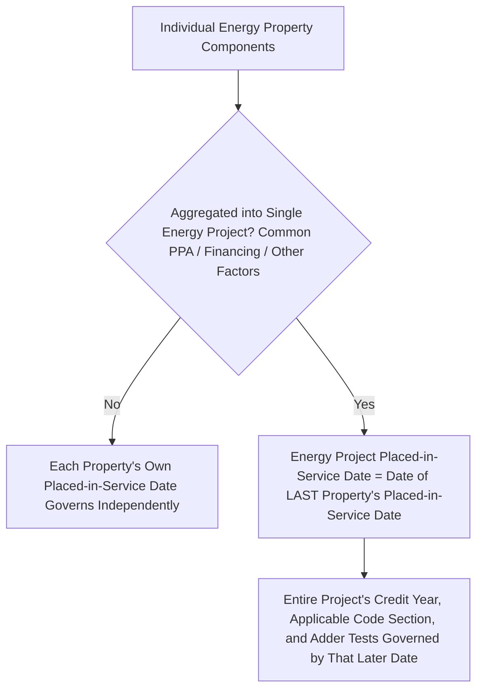
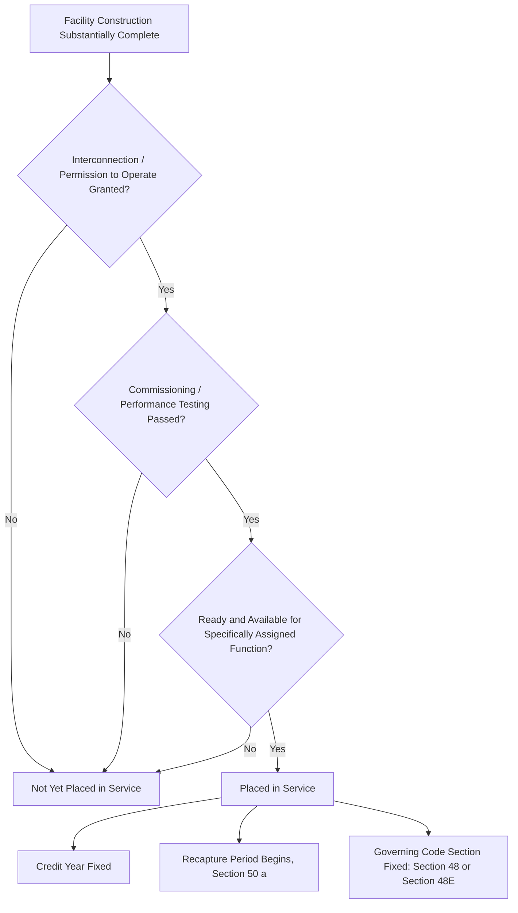

## Placed-in-Service Requirements

### Overview

The placed-in-service date is the single most consequential timing determination in Investment Tax Credit mechanics: it fixes the taxable year in which the credit is claimed, determines which statutory regime governs (Section 48 versus Section 48E), locks in the applicable credit rate and adder eligibility tests where those tests are measured as of placed-in-service, and starts the recapture period clock. Unlike "beginning of construction," which is a forward-looking safe-harbor concept used to grandfather projects into favorable rules, "placed in service" is a factual, operational threshold — the property must actually be ready and available for its specifically assigned function.

### Statutory and Regulatory Basis

Section 48 does not itself define "placed in service" in detail; the operative standard derives from long-standing general depreciation regulations at Treas. Reg. §1.46-3(d) (carried forward conceptually from pre-IRA investment credit regulations) and is now addressed and refined for energy property specifically in the final regulations under §1.48-9 (TD 10015, issued December 4, 2024), which apply to property placed in service during a taxable year beginning after December 12, 2024.

#### The General "Ready and Available" Standard

Property is placed in service in the earlier of the taxable year in which, under the taxpayer's depreciation practice, the period for depreciation with respect to the property begins, or the taxable year in which the property is placed in a condition or state of readiness and availability for a specifically assigned function, whether in a trade or business, in the production of income, in a tax-exempt activity, or in a personal activity.

$$\text{Placed in Service} = \text{Property is in a condition of readiness and availability for its specifically assigned function}$$

**Key Points**

- The standard is functional and operational, not merely about legal ownership transfer, physical completion in the abstract, or commercial operation date (COD) under a power purchase agreement — though COD is often strong evidence of, and frequently coincides closely with, the placed-in-service date for generation assets.
- "Specifically assigned function" for energy property generally means the capability to generate electricity (or produce the relevant output, such as thermal energy) reliably, not merely the physical existence of installed equipment.

### The Energy Project Aggregation Rule and Its Placed-in-Service Consequence

As addressed in the final Section 48 regulations, distinct energy properties may be aggregated into a single "energy project" based on common factors (shared off-take agreements, common financing, and other listed indicia). Critically, the final regulations provide that an energy project is not placed in service until the last energy property within the project is placed in service.

**Example**

A 200 MW solar-plus-storage project is developed in three phases sharing a single interconnection agreement and a common financing facility, causing it to be treated as a single aggregated energy project. If Phase 3 experiences equipment delivery delays and does not reach operational readiness until eighteen months after Phases 1 and 2 are generating power, the entire aggregated project's placed-in-service date is deferred until Phase 3's completion — potentially shifting the applicable credit year, the governing code section if the delay crosses the 2025 §48/§48E transition, and the measurement date for any adder eligibility tied to placed-in-service status.

**Key Points**

- This aggregation-driven deferral is a significant construction-scheduling risk: a single delayed component or phase within an aggregated project can push the entire project's credit timing later than intended, with cascading effects on the governing statute and rate calculations.
- Developers structuring multi-phase projects should evaluate whether phase-level segregation (avoiding the aggregation factors) or intentional aggregation better serves the project's credit timing objectives, since the choice is often within the parties' control through contract and financing structuring.

### Distinguishing Placed-in-Service from Beginning of Construction

These are two entirely separate temporal concepts serving different statutory purposes, and confusing them is a recurring structuring error:

| Concept | Purpose | Test |
| --- | --- | --- |
| Beginning of Construction | Determines which vintage of statutory rules/rates a project is grandfathered into (e.g., pre- vs. post-IRA rates, §48 vs. §48E in some contexts, certain phase-out schedules) | Physical work test (of a significant nature) or 5% safe harbor (incurring 5%+ of total project cost), plus continuity requirement |
| Placed in Service | Determines the taxable year the credit is actually claimed, and (per current transition rules) governs whether §48 or §48E applies based on the property's actual completion | Ready and available for specifically assigned function |

**Key Points**

- A project can satisfy beginning-of-construction requirements years before it is placed in service (continuity safe harbors generally allow up to four years, subject to facts-and-circumstances extension for excusable delay), meaning the two dates frequently diverge by a substantial margin.
- Critically, for the Section 48/48E transition specifically, the operative distinction governing which section applies is placed-in-service date, not begin-construction date — a project that began construction confidently under §48-era assumptions in 2023 or 2024 but is not placed in service until 2025 or later falls under §48E's technology-neutral eligibility test, not the legacy enumerated technology list.

### Placed-in-Service Timing and Credit Vintage/Rate Locking

Several rate- and eligibility-determinative tests are measured with reference to the placed-in-service date (as distinct from tests measured at beginning of construction):

- **Applicable credit percentage and base/bonus rate structure**: generally the rate regime in effect for the placed-in-service year governs, subject to specific grandfathering or transition rules enacted by Congress or clarified by Treasury.
- **Governing code section (§48 vs. §48E)**: property placed in service in a taxable year beginning after December 12, 2024 is subject to the final §1.48-9 regulations' definitional framework; construction beginning after December 31, 2024 shifts to §48E entirely.
- **Recapture period commencement**: the five-year recapture period under §50(a) begins running from the placed-in-service date, not from beginning of construction or from the date the credit is claimed on a return.

$$\text{Recapture Period End Date} = \text{Placed-in-Service Date} + 5 \text{ years}$$

### Recapture Consequences Tied to Placed-in-Service Date

Under §50(a), if energy property is disposed of, or otherwise ceases to be investment credit property (e.g., the underlying facility ceases to be a qualifying energy property, or ownership changes in a manner triggering recapture), within five years of the placed-in-service date, a portion of the credit is recaptured, decreasing ratably by 20 percentage points per year of the five-year period already elapsed.

| Years Since Placed in Service | Recapture Percentage of Original Credit |
| --- | --- |
| Less than 1 year | 100% |
| 1 to less than 2 years | 80% |
| 2 to less than 3 years | 60% |
| 3 to less than 4 years | 40% |
| 4 to less than 5 years | 20% |
| 5 years or more | 0% (fully vested) |

**Key Points**

- Because the recapture clock is anchored to placed-in-service date, an incorrectly early or late placed-in-service determination directly misstates the recapture vesting schedule communicated to tax equity investors and credit transferees, an issue of particular importance in transferability transactions under §6418 where the transferee bears recapture risk contractually.
- Tax equity partnership flip structures typically time the flip point to occur after the five-year recapture period has substantially or fully run, precisely because recapture exposure (and associated investor indemnification demands) diminishes to zero only once five full years have elapsed from the placed-in-service date.

### Documentation and Substantiation Practice

Because "ready and available for specifically assigned function" is a facts-and-circumstances standard, robust documentation is essential to defend the claimed placed-in-service date on audit or in tax equity/transferability diligence:

- **Interconnection and utility approval documentation**: evidence that the facility has permission to operate (PTO) or equivalent grid interconnection authorization, since a facility that cannot legally deliver power to the grid is difficult to characterize as ready and available for its assigned function.
- **Commissioning and performance testing records**: documentation that equipment has passed substantial completion testing and is operationally capable of generating at expected performance levels.
- **Commercial operation date (COD) certificates**: under the governing PPA or interconnection agreement, though COD under a commercial contract is evidentiary of, but not necessarily legally identical to, the tax placed-in-service date.
- **Depreciation commencement**: consistency between the taxpayer's book/tax depreciation start date and the claimed ITC placed-in-service date, since the regulatory standard explicitly incorporates the taxpayer's own depreciation practice as one alternative trigger.

### Structuring and Diligence Implications

- **Multi-phase project scheduling**: given the aggregation rule's "last property placed in service" trigger, evaluate early whether phases should be structured to avoid aggregation (separate financing, separate off-take arrangements, geographic/legal separation) if independent placed-in-service timing per phase is commercially preferable.
- **Transition-window risk management**: for projects with placed-in-service dates uncertain around the 2025 §48/§48E boundary, model both regimes' eligibility and rate consequences, and build appropriate contractual protections (pricing adjustments, walk rights) into tax equity and EPC agreements for placed-in-service date slippage across the boundary.
- **Recapture schedule disclosure**: tax equity term sheets and credit transfer agreements should clearly state the placed-in-service date and resulting recapture vesting schedule, since this date is frequently a heavily negotiated representation and warranty item.
- **Interconnection delay contingency planning**: because utility interconnection approval is often the binding constraint on satisfying the "ready and available" standard, project schedules should build in interconnection risk buffers distinct from pure construction completion risk.

### Common Pitfalls in Practice

- **Equating substantial completion with placed in service** — a facility that is physically built but lacks utility interconnection approval or has not passed commissioning tests is not yet placed in service under the regulatory standard, regardless of construction completion percentage.
- **Confusing commercial operation date with tax placed-in-service date** — while frequently aligned, COD under a PPA is a contractual milestone defined by the parties' agreement and is not automatically dispositive of the tax placed-in-service determination, which depends on the regulatory "ready and available" standard.
- **Overlooking aggregation-driven deferral in phased projects** — assuming each phase of a multi-phase development has its own independent placed-in-service date without checking whether common financing, off-take, or other aggregation factors combine the phases into a single energy project for this purpose.
- **Misapplying beginning-of-construction analysis to the §48/§48E transition** — assuming that satisfying beginning-of-construction safe harbors under legacy §48 guidance locks in §48 treatment regardless of when the project is actually placed in service, when in fact placed-in-service date is the operative transition trigger.
- **Inadequate contemporaneous documentation** — failing to compile and retain interconnection approval, commissioning test results, and depreciation commencement records at the time of the claimed placed-in-service date, creating substantiation risk in a later audit or transferability diligence review.

**Related Topics**

- Beginning-of-construction doctrine: physical work test, 5% safe harbor, and continuity requirements
- Section 50(a) recapture rules and the five-year vesting schedule
- Energy project aggregation factors under the Section 48 final regulations
- Section 48 versus Section 48E eligibility and transition timing
- Section 6418 credit transferability and recapture risk allocation between transferor and transferee
- Interconnection agreements and permission-to-operate (PTO) documentation practices
- Partnership flip structure timing relative to recapture period expiration
- Cost segregation and depreciation commencement documentation